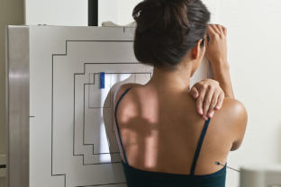
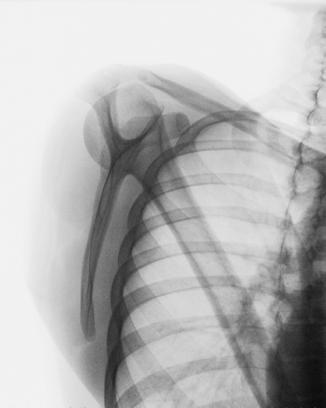
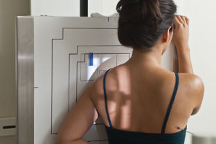
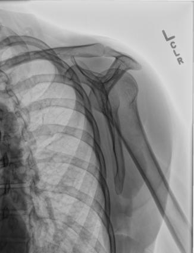

# Rx Omoplat (Scapulă) Profil (Lateral) (PATIENT Ortostatism)

  📷 Radiografie Convențională (Rx)
  <strong>Actualizat:</strong> 2026-09-15
  <strong>Autor:</strong> Departamentul de Radiologie / Referință Bontrager

---

-   __1. Rezumat Clinic & Indicații__

    ---

    === "Indicații Clinice"

        - orizontal suspiciune de fractură de Omoplat (Scapulă); braț placement trebuie să fie determined prin scapular aria de interes diagnostic

    === "Ghid Național IRIS"

        !!! info "Referință Primară: Ghidul Național IRIS (Ordinul MS 1342/2012)"
            - **Capitol Ghid IRIS:** *Ghidul Național IRIS*
            - **Grad de Recomandare:** **De verificat pe indicație; fără grad atribuit automat**
            - **Nivel de Iradiere Estimată:** `De verificat pentru examinarea și populația selectate`

            [:octicons-search-16: Deschide Ghidul IRIS](../../iris.md){ .md-button .md-button--primary } [:material-open-in-new: Aplicația Oficială PWA](https://radiologie-pediatrica.ro/iris/){ .md-button target="_blank" rel="noopener" }
-   __2. Poziționare & Centrare Fascicul__

    ---

    - **Poziție Pacient:** Pacient: Perform radiografie cu pacient în Ortostatism sau Decubit poziție. (Ortostatism poziție este preferred if pacient’s condition allows.) Face pacient spre receptorul de imagine în anterior Incidență Oblică.; Regiune anatomică: Have pacient reach across front de Torace și grasp opposite Umăr la evidențiază corp de Omoplat (Scapulă) (Figs. 5.102 și 5.103). sau Have pacient drop affected braț, flex Cot, și place braț behind lower back cu braț partially în abducție, sau just let braț hang down la pacient’s side. This best evidențiază acromion și coracoid processes (Figs. 5.104 și 5.105). Palpate superior angle de Omoplat (Scapulă) și articulații acromioclaviculare articulation. se rotește pacient until imaginary line între two points este perpendicular pe receptorul de imagine; this results în Incidență de Profil (lateral) de corp de Omoplat (Scapulă). poziție de Humerus (down la side sau up across anterior Torace) has effect pe amount de corp rotație required. Less rotație este required cu braț up across anterior Torace. (flat posterior surface de corp de Omoplat (Scapulă) trebuie să fie perpendicular pe receptorul de imagine.) Align pacient la center midvertebral margine la raza centrală și la receptorul de imagine.
    - **Punct de Centrare Fascicul:** la midvertebral margine de Omoplat (Scapulă)
    - **Distanță Focar-Film (DFF / SID):** 100 cm
    - **Comandă Respiratorie:** Apnee pe durata expunerii. Omoplat (Scapulă) ROUTINE AP lateral Ortostatism Decubit

-   __3. Parametri Tehnici Expunere__

    ---

    | Parametru Tehnic | Valoare Configurare Generator / Tub |
    |:-----------------|:-------------------------------------|
    | **Tensiune Tub (kV)** | 70-85 kV |
    | **Sarcină / Produs Curent-Timp (mAs)** | DE CONFIGURAT PE APARAT |
    | **Distanță Focar-Film (DFF / SID)** | 100 cm |
    | **Grilă Antidifuzoare (Bucky)** | Cu grilă antidifuzoare Bucky |
    | **Dimensiune Focar** | Focar Mic (0.6 mm) |
    | **Camere de Ionizare AEC** | Camerele laterale (sau camera centrală funcție de regiune) |
    | **Colimare Fascicul** | Field Size Closely collimate la area de Omoplat (Scapulă). |
    | **Filtrare Tub** | Totală ≥ 2.5 mm Al echivalent |

-   __4. Criterii de Calitate & Reușită Imagine__

    ---

    - și poziție:
    - Entire Omoplat (Scapulă) trebuie să fie visualized în Incidență de Profil (lateral), ca evidenced prin direct superimposition de vertebral și lateral margini.
    - True lateral este vizualizat prin direct superimposition de vertebral și lateral margini.
    - corp de Omoplat (Scapulă) trebuie să fie în profile, liber de superimposition prin Coaste (Grilaj Costal).
    - ca much ca possible, Humerus trebuie să nu superimpose aria de interes diagnostic de Omoplat (Scapulă).
    - Collimation field size la aria de interes diagnostic. expunere:
    - optim receptorul de imagine expunere și contrast cu fără mișcare evidențiază net bony margini și trabecular markings fără decreased imagine quality în area de inferior angle.
    - Bony margini de ambele acromion și coracoid processes trebuie să fie seen through capul de Humerus. Fig. 5.102 lateral pentru corp de Omoplat (Scapulă) (approximately 45°. LAO). Fig. 5.103 lateral pentru corp de Omoplat (Scapulă) (approximately 45°. LAO). L Fig. 5.104 lateral pentru acromion sau proces coracoid (approximately 60°. LAO). Fig. 5.105 lateral pentru acromion sau proces coracoid (approximately 60°. LAO). (Courtesy Joss Wertz, DO.)

-   __5. Protecție Radiologică (ALARA)__

    ---

    - Ecranare gonadică și a organelor radiosensibile conform procedurilor locale de radioprotecție ALARA.
    - Colimare strictă la aria de interes pentru limitarea radiației difuze.
    - Verificarea posibilității unei sarcini la pacientele de vârstă fertilă înainte de expunere.

### 🖼️ Imagini

<figure class="protocol-image-card" markdown>

<figcaption><strong>Fig. 5.102 lateral pentru corp</strong> — Poziționare pacient conform Ghidului Bontrager (Fig. 5.102 lateral pentru corp)</figcaption>

</figure>

<figure class="protocol-image-card" markdown>

<figcaption><strong>Fig. 5.103 lateral</strong> — Aspect radiografic de referință conform Ghidului Bontrager (Fig. 5.103 lateral)</figcaption>

</figure>

<figure class="protocol-image-card" markdown>

<figcaption><strong>Fig. 5.104 lateral pentru</strong> — Aspect radiografic de referință conform Ghidului Bontrager (Fig. 5.104 lateral pentru)</figcaption>

</figure>

<figure class="protocol-image-card" markdown>

<figcaption><strong>Fig. 5.105 lateral pentru acromion sau proces coracoid (approximately</strong> — Aspect radiografic de referință conform Ghidului Bontrager (Fig. 5.105 lateral pentru acromion sau proces coracoid (approximately)</figcaption>

</figure>

=== "Ghid Rapid de Execuție"

    1. **Identificarea și verificarea pacientului:** verificare identitate, zonă de examinat, consimțământ conform procedurii și evaluarea posibilității unei sarcini, când este relevantă.
    2. **Pregătire:** îndepărtarea oricăror obiecte radiopace (bijuterii, agrafe, fermoare, proteze, pansamente dense).
    3. **Poziționare precisă:** alinierea receptorului de imagine și a tubului la distanța prescrisă (100 cm).
    4. **Colimare strictă:** adaptarea fasciculului strict la regiunea de diagnostic pentru scăderea iradierii și reducerea radiației difuze.
    5. **Radioprotecție:** verificarea [politicii RX](../radioprotectie.md), cu măsuri distincte pentru pacient, personal și însoțitor.

## Surse de documentare

- [Bontrager's Textbook of Radiographic Positioning (Ed. 9/10), Pagina 221](https://www.elsevier.com/books/textbook-of-radiographic-positioning-and-related-anatomy/lampignano/978-0-323-65367-1)
