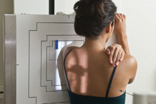
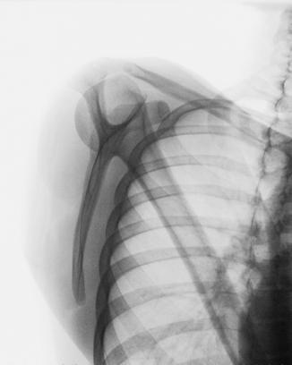
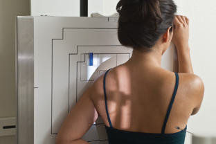
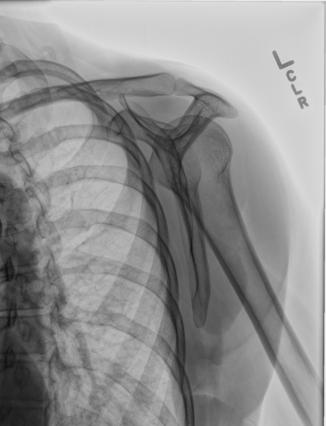

# Rx omoplat (scapulă) — profil (lateral) — pacient în ortostatism

  📷 Radiografie Convențională (Rx)
  <strong>Actualizat:</strong> 2026-09-15
  <strong>Autor:</strong> Departamentul de Radiologie / Referință Bontrager

---

-   __1. Rezumat Clinic & Indicații__

    ---

    === "Indicații Clinice"

        - Orizontal. Suspiciune de fractură a omoplatului (scapulei); poziționarea brațului trebuie determinată de aria de interes diagnostic scapulară

    === "Ghid Național IRIS"

        !!! info "Referință Primară: Ghidul Național IRIS (Ordinul MS 1342/2012)"
            - **Capitol Ghid IRIS:** *Aparat locomotor & Membru superior*
            - **Grad de Recomandare:** **Grad A**
            - **Nivel de Iradiere Estimată:** `Clasa 1 (Minimă < 0.05 mSv)`

            [:octicons-search-16: Deschide Ghidul IRIS](../../iris.md){ .md-button .md-button--primary } [:material-open-in-new: Aplicația Oficială PWA](https://radiologie-pediatrica.ro/iris/){ .md-button target="_blank" rel="noopener" }

-   __2. Poziționare & Centrare Fascicul__

    ---

    - **Poziție Pacient:** Pacient: Se efectuează radiografia cu pacientul în ortostatism sau în decubit. (Poziția în ortostatism este preferată dacă starea pacientului permite.) Pacientul stă cu fața către receptorul de imagine, în incidență oblică anterioară.; Regiune anatomică: Pacientul duce brațul peste partea anterioară a toracelui și apucă umărul opus pentru a evidenția corpul omoplatului (scapulei) (Fig. 5.102 și 5.103). Sau pacientul lasă brațul afectat în jos, flectează cotul și plasează brațul în spatele regiunii lombare, cu brațul parțial în abducție, sau pur și simplu lasă brațul să atârne pe lângă corp. Aceasta evidențiază cel mai bine acromionul și procesele coracoide (Fig. 5.104 și 5.105). Se palpează unghiul superior al omoplatului (scapulei) și articulația acromioclaviculară. Se rotește pacientul până când linia imaginară dintre cele două puncte este perpendiculară pe receptorul de imagine; aceasta determină incidența de profil (lateral) a corpului omoplatului (scapulei). Poziția humerusului (în jos, pe lângă corp, sau ridicat peste toracele anterior) influențează gradul de rotație necesar al corpului. Este necesară o rotație mai mică atunci când brațul este ridicat peste toracele anterior. (Suprafața posterioară plană a corpului omoplatului (scapulei) trebuie să fie perpendiculară pe receptorul de imagine.) Se aliniază pacientul astfel încât centrul marginii midvertebrale să corespundă razei centrale și receptorului de imagine.
    - **Punct de Centrare Fascicul:** La marginea midvertebrală a omoplatului (scapulei)
    - **Distanță Focar-Film (DFF / SID):** 100 cm
    - **Comandă Respiratorie:** Apnee pe durata expunerii. Omoplat (scapulă), de rutină, AP lateral, în ortostatism, în decubit

-   __3. Parametri Tehnici Expunere__

    ---

    | Parametru Tehnic | Valoare Configurare Generator / Tub |
    |:-----------------|:-------------------------------------|
    | **Tensiune Tub (kV)** | 70-85 kV |
    | **Sarcină / Produs Curent-Timp (mAs)** | DE CONFIGURAT PE APARAT |
    | **Distanță Focar-Film (DFF / SID)** | 100 cm |
    | **Grilă Antidifuzoare (Bucky)** | Cu grilă antidifuzoare Bucky |
    | **Dimensiune Focar** | Focar Mic (0.6 mm) |
    | **Camere de Ionizare AEC** | Camerele laterale (sau camera centrală, în funcție de regiune) |
    | **Colimare Fascicul** | Dimensiunea câmpului: se efectuează colimarea strânsă la aria omoplatului (scapulei). |
    | **Filtrare Tub** | Totală ≥ 2.5 mm Al echivalent |

-   __4. Criterii de Calitate & Reușită Imagine__

    ---

    - și poziție:
    - Întregul omoplat (scapulă) trebuie vizualizat în incidență de profil (lateral), fapt demonstrat prin suprapunerea directă a marginilor vertebrală și laterală.
    - Profilul adevărat este vizualizat prin suprapunerea directă a marginilor vertebrală și laterală.
    - Corpul omoplatului (scapulei) trebuie să fie de profil, liber de suprapunerea coastelor (grilajului costal).
    - Pe cât posibil, humerusul nu trebuie să se suprapună peste aria de interes diagnostic a omoplatului (scapulei).
    - Dimensiunea câmpului de colimare până la aria de interes diagnostic. Expunere:
    - Expunerea optimă a receptorului de imagine și contrastul, fără mișcare, evidențiază clar marginile osoase și desenul trabecular, fără scăderea calității imaginii în regiunea unghiului inferior.
    - Marginile osoase ale acromionului și proceselor coracoide trebuie să fie vizibile prin capul humerusului. Fig. 5.102 Incidență laterală pentru corpul omoplatului (aproximativ 45°. LAO). Fig. 5.103 Incidență laterală pentru corpul omoplatului (aproximativ 45°. LAO). L Fig. 5.104 Incidență laterală pentru acromion sau procesul coracoid (aproximativ 60°. LAO). Fig. 5.105 Incidență laterală pentru acromion sau procesul coracoid (aproximativ 60°. LAO). (Cu amabilitatea lui Joss Wertz, DO.)

-   __5. Protecție Radiologică (ALARA)__

    ---

    - Ecranare gonadică și a organelor radiosensibile conform procedurilor locale de radioprotecție ALARA.
    - Colimare strictă la aria de interes pentru limitarea radiației difuze.
    - Verificarea posibilității unei sarcini la pacientele de vârstă fertilă înainte de expunere.

### 🖼️ Imagini

<figure class="protocol-image-card" markdown>

<figcaption><strong>Fig. 5.102 Incidență laterală pentru corp</strong> — Poziționarea pacientului conform Ghidului Bontrager (Fig. 5.102 incidență laterală pentru corp)</figcaption>

</figure>

<figure class="protocol-image-card" markdown>

<figcaption><strong>Fig. 5.103 Incidență laterală</strong> — Aspect radiografic de referință conform Ghidului Bontrager (Fig. 5.103 incidență laterală)</figcaption>

</figure>

<figure class="protocol-image-card" markdown>

<figcaption><strong>Fig. 5.104 Incidență laterală pentru</strong> — Aspect radiografic de referință conform Ghidului Bontrager (Fig. 5.104 incidență laterală pentru)</figcaption>

</figure>

<figure class="protocol-image-card" markdown>

<figcaption><strong>Fig. 5.105 Incidență laterală pentru acromion sau procesul coracoid (aproximativ</strong> — Aspect radiografic de referință conform Ghidului Bontrager (Fig. 5.105 incidență laterală pentru acromion sau procesul coracoid (aproximativ)</figcaption>

</figure>

=== "Ghid Rapid de Execuție"

    1. **Identificarea și verificarea pacientului:** verificare identitate, zonă de examinat, consimțământ conform procedurii și evaluarea posibilității unei sarcini, când este relevantă.
    2. **Pregătire:** îndepărtarea oricăror obiecte radiopace (bijuterii, agrafe, fermoare, proteze, pansamente dense).
    3. **Poziționare precisă:** alinierea receptorului de imagine și a tubului la distanța prescrisă (100 cm).
    4. **Colimare strictă:** adaptarea fasciculului strict la regiunea de diagnostic pentru scăderea iradierii și reducerea radiației difuze.
    5. **Radioprotecție:** verificarea [politicii RX](../radioprotectie.md), cu măsuri distincte pentru pacient, personal și însoțitor.

## Surse de documentare

- [Bontrager's Textbook of Radiographic Positioning (Ed. 9/10), Pagina 221](https://www.elsevier.com/books/textbook-of-radiographic-positioning-and-related-anatomy/lampignano/978-0-323-65367-1)
