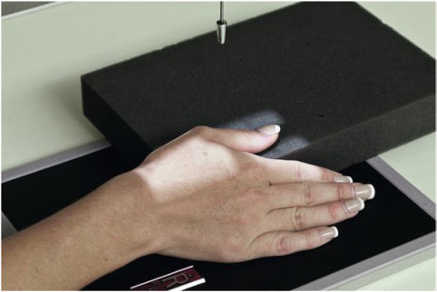
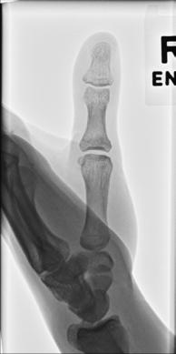
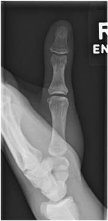
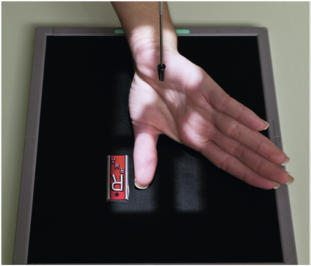

# Rx Police AP (Antero-Posterior)

  📷 Radiografie Convențională (Rx)
  <strong>Actualizat:</strong> 2026-09-15
  <strong>Autor:</strong> Departamentul de Radiologie / Referință Bontrager

---

-   __1. Rezumat Clinic & Indicații__

    ---

    === "Indicații Clinice"

        - suspiciune de fractură și luxație / subluxație articulară de distal și proximal falange, distal metacarpal, și associated articulații
        - Pathologic processes, such ca osteoporosis și artroză / modificări degenerative articulare See special AP axial modified Robert incidență pentru Bennett suspiciune de fractură la base de first metacarpal.

    === "Ghid Național IRIS"

        !!! info "Referință Primară: Ghidul Național IRIS (Ordinul MS 1342/2012)"
            - **Capitol Ghid IRIS:** *Ghidul Național IRIS*
            - **Grad de Recomandare:** **De verificat pe indicație; fără grad atribuit automat**
            - **Nivel de Iradiere Estimată:** `De verificat pentru examinarea și populația selectate`

            [:octicons-search-16: Deschide Ghidul IRIS](../../iris.md){ .md-button .md-button--primary } [:material-open-in-new: Aplicația Oficială PWA](https://radiologie-pediatrica.ro/iris/){ .md-button target="_blank" rel="noopener" }
-   __2. Poziționare & Centrare Fascicul__

    ---

    - **Poziție Pacient:** Pacient: AP Seat pacient facing table, brațe extins în front, cu Mână rotit internally la supinate Police pentru Incidență Antero-Posterioară (AP) (Fig. 4.51).; Regiune anatomică: AP First, evidențiază this awkward poziție pe yourself astfel încât pacient poate see how it este done și better understand what este expected. Internally rotate Mână cu Degete Mână extins until posterior surface de Police este în contact cu receptorul de imagine. Immobilize other Degete Mână cu tape la isolate Police if necessary (see Fig. 4.51). Align Police cu axa longitudinală de receptorul de imagine. Center first articulații metacarpofalangiene (MCF) la raza centrală și la center de receptorul de imagine. Exception—PA (Only if pacient Cannot poziție pentru Previous AP) Place Mână în nearlateral poziție și rest Police pe sponge support block that este high enough astfel încât Police este nu rotit but este în poziție pentru true Incidență Postero-Anterioară (PA) (Fig. 4.52).
    - **Punct de Centrare Fascicul:** și center de collimation field size trebuie să fie la first articulații metacarpofalangiene (MCF). expunere: optim receptorul de imagine expunere și contrast cu fără mișcare evidențiază părți moi margins și clear, Contururi osoase și travee trabeculare nete, fără artefacte de mișcare.
    - **Distanță Focar-Film (DFF / SID):** 100 cm
    - **Comandă Respiratorie:** Apnee pe durata expunerii (sau conform cooperării pacientului)

-   __3. Parametri Tehnici Expunere__

    ---

    | Parametru Tehnic | Valoare Configurare Generator / Tub |
    |:-----------------|:-------------------------------------|
    | **Tensiune Tub (kV)** | 55 kV |
    | **Sarcină / Produs Curent-Timp (mAs)** | DE CONFIGURAT PE APARAT |
    | **Distanță Focar-Film (DFF / SID)** | 100 cm |
    | **Grilă Antidifuzoare (Bucky)** | Fără grilă (expunere directă) |
    | **Dimensiune Focar** | Focar Mic (0.6 mm) |
    | **Camere de Ionizare AEC** | DE CONFIGURAT PE APARAT |
    | **Colimare Fascicul** | Field Size Collimate pe four sides la area de Police, remembering that Police includes entire first metacarpal și trapezium Police ROUTINE AP PA oblic lateral Fig. 4.51 AP Police—raza centrală la first articulații metacarpofalangiene (MCF). Fig. 4.53 AP Police. distal phalanx proximal phalanx 1st metacarpal 1st articulații carpometacarpiene (CMC) Trapezium Fig. 4.54 AP Police. Fig. 4.52 PA (exception). |
    | **Filtrare Tub** | Totală ≥ 2.5 mm Al echivalent |

-   __4. Criterii de Calitate & Reușită Imagine__

    ---

    - distal și proximal falange, first metacarpal, trapezium, și associated articulații sunt vizibil.
    - Interphalangeal și articulații metacarpofalangiene (MCF) trebuie să appear open (Figs. 4.53 și 4.54). poziție:
    - axa longitudinală de Police trebuie să fie aliniat cu side margine de receptorul de imagine.
    - Absența rotației anatomice: clavicule echidistante față de linia apofizelor spinoase, ca evidenced prin concave sides de falange și prin equal amounts de părți moi appearing pe fiecare side de falange, trebuie să fie present. articulații interfalangiene (IF) trebuie să appear open, indicating that Police was fully extins și correct raza centrală location was used.

-   __5. Protecție Radiologică (ALARA)__

    ---

    - Ecranare gonadică și a organelor radiosensibile conform procedurilor locale de radioprotecție ALARA.
    - Colimare strictă la aria de interes pentru limitarea radiației difuze.
    - Verificarea posibilității unei sarcini la pacientele de vârstă fertilă înainte de expunere.

!!! note "Observații Clinice & Tehnice"
    ca rule, PA este nu advisable because it results în loss de definition caused prin increased OID.

### 🖼️ Imagini

<figure class="protocol-image-card" markdown>

<figcaption><strong>Fig. 4.51 AP Police—raza centrală la first articulații metacarpofalangiene (MCF).</strong> — Poziționare pacient conform Ghidului Bontrager (Fig. 4.51 AP thumb—raza centrală la first articulații metacarpofalangiene (MCF).)</figcaption>

</figure>

<figure class="protocol-image-card" markdown>

<figcaption><strong>Fig. 4.53 AP Police.</strong> — Aspect radiografic de referință conform Ghidului Bontrager (Fig. 4.53 AP thumb.)</figcaption>

</figure>

<figure class="protocol-image-card" markdown>

<figcaption><strong>Fig. 4.54 AP Police.</strong> — Aspect radiografic de referință conform Ghidului Bontrager (Fig. 4.54 AP thumb.)</figcaption>

</figure>

<figure class="protocol-image-card" markdown>

<figcaption><strong>Fig. 4.52 PA (exception).</strong> — Aspect radiografic de referință conform Ghidului Bontrager (Fig. 4.52 PA (exception).)</figcaption>

</figure>

=== "Ghid Rapid de Execuție"

    1. **Identificarea și verificarea pacientului:** verificare identitate, zonă de examinat, consimțământ conform procedurii și evaluarea posibilității unei sarcini, când este relevantă.
    2. **Pregătire:** îndepărtarea oricăror obiecte radiopace (bijuterii, agrafe, fermoare, proteze, pansamente dense).
    3. **Poziționare precisă:** alinierea receptorului de imagine și a tubului la distanța prescrisă (100 cm).
    4. **Colimare strictă:** adaptarea fasciculului strict la regiunea de diagnostic pentru scăderea iradierii și reducerea radiației difuze.
    5. **Radioprotecție:** verificarea [politicii RX](../radioprotectie.md), cu măsuri distincte pentru pacient, personal și însoțitor.

## Surse de documentare

- [Bontrager's Textbook of Radiographic Positioning (Ed. 9/10), Pagina 155](https://www.elsevier.com/books/textbook-of-radiographic-positioning-and-related-anatomy/lampignano/978-0-323-65367-1)
