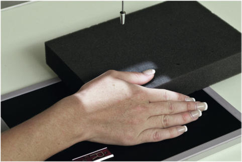
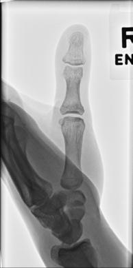
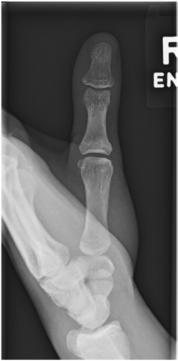
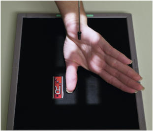

# Rx police AP (anteroposterior)

  📷 Radiografie Convențională (Rx)
  <strong>Actualizat:</strong> 2026-09-15
  <strong>Autor:</strong> Departamentul de Radiologie / Referință Bontrager

---

-   __1. Rezumat Clinic & Indicații__

    ---

    === "Indicații Clinice"

        - Suspiciune de fractură și luxație / subluxație articulară a falangelor distală și proximală, a metacarpianului distal și a articulațiilor asociate
        - Procese patologice, precum osteoporoza și artroza / modificările degenerative articulare. Se consultă incidența AP axială modificată Robert pentru suspiciunea de fractură Bennett la baza primului metacarpian.

    === "Ghid Național IRIS"

        !!! info "Referință Primară: Ghidul Național IRIS (Ordinul MS 1342/2012)"
            - **Capitol Ghid IRIS:** *Aparat locomotor & Membru superior*
            - **Grad de Recomandare:** **Grad A**
            - **Nivel de Iradiere Estimată:** `Clasa 1 (Minimă < 0.01 mSv)`

            [:octicons-search-16: Deschide Ghidul IRIS](../../iris.md){ .md-button .md-button--primary } [:material-open-in-new: Aplicația Oficială PWA](https://radiologie-pediatrica.ro/iris/){ .md-button target="_blank" rel="noopener" }

-   __2. Poziționare & Centrare Fascicul__

    ---

    - **Poziție Pacient:** Pacient: AP. Pacientul stă pe scaun, cu fața către masă, cu brațele întinse anterior, cu mâna rotită intern pentru a supina policele în incidență anteroposterioară (AP) (Fig. 4.51).; Regiune anatomică: AP. Mai întâi, demonstrați această poziție dificilă pe dumneavoastră, astfel încât pacientul să poată vedea cum se efectuează și să înțeleagă mai bine ce i se solicită. Rotiți intern mâna cu degetele întinse până când suprafața posterioară a policelui este în contact cu receptorul de imagine. Imobilizați celelalte degete cu bandă adezivă pentru a izola policele, dacă este necesar (vezi Fig. 4.51). Aliniați policele cu axa longitudinală a receptorului de imagine. Centrați primele articulații metacarpofalangiene (MCF) pe raza centrală și în centrul receptorului de imagine. Excepție—PA (numai dacă pacientul nu poate adopta poziția pentru incidența AP anterioară): plasați mâna într-o poziție aproape laterală și sprijiniți policele pe un suport din burete suficient de înalt, astfel încât policele să nu fie rotit, ci să se afle în poziția pentru adevărata incidență posteroanterioară (PA) (Fig. 4.52).
    - **Punct de Centrare Fascicul:** și dimensiunea centrală a câmpului de colimare trebuie să fie la primele articulații metacarpofalangiene (MCF). Expunere: expunerea optimă a receptorului de imagine și contrastul, fără mișcare, evidențiază clar marginile părților moi, contururile osoase și traveele trabeculare, fără artefacte de mișcare.
    - **Distanță Focar-Film (DFF / SID):** 100 cm
    - **Comandă Respiratorie:** Apnee pe durata expunerii (sau conform cooperării pacientului)

-   __3. Parametri Tehnici Expunere__

    ---

    | Parametru Tehnic | Valoare Configurare Generator / Tub |
    |:-----------------|:-------------------------------------|
    | **Tensiune Tub (kV)** | 55 kV |
    | **Sarcină / Produs Curent-Timp (mAs)** | DE CONFIGURAT PE APARAT |
    | **Distanță Focar-Film (DFF / SID)** | 100 cm |
    | **Grilă Antidifuzoare (Bucky)** | Fără grilă (expunere directă) |
    | **Dimensiune Focar** | Focar Mic (0.6 mm) |
    | **Camere de Ionizare AEC** | DE CONFIGURAT PE APARAT |
    | **Colimare Fascicul** | Dimensiunea câmpului: se colimează pe cele patru laturi la nivelul regiunii policelui, ținând cont că policele include întregul prim metacarpian și trapezul. POLICE — INCIDENȚE DE RUTINĂ: AP, PA oblică, profil. Fig. 4.51 Police în incidență AP — raza centrală la prima articulație metacarpofalangiană (MCF). Fig. 4.53 Police în incidență AP. Falangă distală; falangă proximală; metacarpianul 1; articulația carpometacarpiană (CMC) 1; trapez. Fig. 4.54 Police în incidență AP. Fig. 4.52 PA (excepție). |
    | **Filtrare Tub** | Totală ≥ 2.5 mm Al echivalent |

-   __4. Criterii de Calitate & Reușită Imagine__

    ---

    - Falangele distală și proximală, primul metacarpian, trapezul și articulațiile asociate sunt vizibile.
    - Articulațiile interfalangiene și metacarpofalangiene (MCF) trebuie să apară deschise (Fig. 4.53 și 4.54). Poziție:
    - Axa longitudinală a policelui trebuie să fie aliniată cu marginea laterală a receptorului de imagine.
    - Absența rotației anatomice: claviculele echidistante față de linia apofizelor spinoase, evidențiată prin marginile concave ale falangelor și prin cantități egale de țesuturi moi vizibile pe fiecare parte a falangelor, trebuie să fie prezentă. Articulațiile interfalangiene (IF) trebuie să apară deschise, indicând că policele a fost complet extins și că a fost utilizată localizarea corectă a razei centrale.

-   __5. Protecție Radiologică (ALARA)__

    ---

    - Ecranare gonadică și a organelor radiosensibile conform procedurilor locale de radioprotecție ALARA.
    - Colimare strictă la aria de interes pentru limitarea radiației difuze.
    - Verificarea posibilității unei sarcini la pacientele de vârstă fertilă înainte de expunere.

!!! note "Observații Clinice & Tehnice"
    Ca regulă, PA nu este recomandată deoarece determină pierderea definiției cauzată de creșterea OID.

### 🖼️ Imagini

<figure class="protocol-image-card" markdown>

<figcaption><strong>Fig. 4.51 AP police—raza centrală la primele articulații metacarpofalangiene (MCF).</strong> — Poziționarea pacientului conform Ghidului Bontrager (Fig. 4.51 AP police—raza centrală la primele articulații metacarpofalangiene (MCF).)</figcaption>

</figure>

<figure class="protocol-image-card" markdown>

<figcaption><strong>Fig. 4.53 AP police.</strong> — Aspect radiografic de referință conform Ghidului Bontrager (Fig. 4.53 AP police.)</figcaption>

</figure>

<figure class="protocol-image-card" markdown>

<figcaption><strong>Fig. 4.54 AP police.</strong> — Aspect radiografic de referință conform Ghidului Bontrager (Fig. 4.54 AP police.)</figcaption>

</figure>

<figure class="protocol-image-card" markdown>

<figcaption><strong>Fig. 4.52 PA (excepție).</strong> — Aspect radiografic de referință conform Ghidului Bontrager (Fig. 4.52 PA (excepție).)</figcaption>

</figure>

=== "Ghid Rapid de Execuție"

    1. **Identificarea și verificarea pacientului:** verificare identitate, zonă de examinat, consimțământ conform procedurii și evaluarea posibilității unei sarcini, când este relevantă.
    2. **Pregătire:** îndepărtarea oricăror obiecte radiopace (bijuterii, agrafe, fermoare, proteze, pansamente dense).
    3. **Poziționare precisă:** alinierea receptorului de imagine și a tubului la distanța prescrisă (100 cm).
    4. **Colimare strictă:** adaptarea fasciculului strict la regiunea de diagnostic pentru scăderea iradierii și reducerea radiației difuze.
    5. **Radioprotecție:** verificarea [politicii RX](../radioprotectie.md), cu măsuri distincte pentru pacient, personal și însoțitor.

## Surse de documentare

- [Bontrager's Textbook of Radiographic Positioning (Ed. 9/10), Pagina 155](https://www.elsevier.com/books/textbook-of-radiographic-positioning-and-related-anatomy/lampignano/978-0-323-65367-1)
