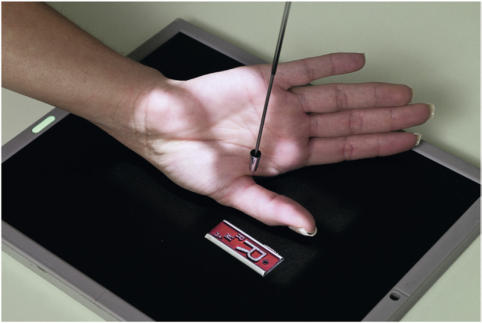
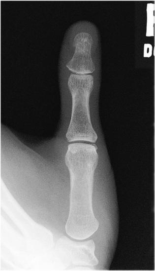
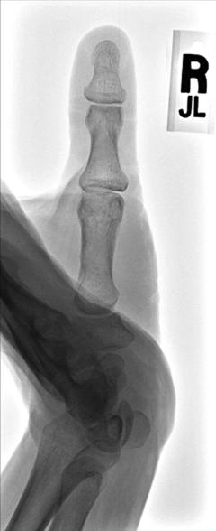

# Rx Police AP Axială (MODIFIED ROBERT METHOD)6

  📷 Radiografie Convențională (Rx)
  <strong>Actualizat:</strong> 2026-09-15
  <strong>Autor:</strong> Departamentul de Radiologie / Referință Bontrager

---

-   __1. Rezumat Clinic & Indicații__

    ---

    === "Indicații Clinice"

        - Base de first metacarpal este evidențiat pentru ruling out Bennett suspiciune de fractură.
        - This incidență specială complementară evidențiază suspiciune de fractură, luxație / subluxație articulară, sau pathology de base de first metacarpal și trapezium

    === "Ghid Național IRIS"

        !!! info "Referință Primară: Ghidul Național IRIS (Ordinul MS 1342/2012)"
            - **Capitol Ghid IRIS:** *Ghidul Național IRIS*
            - **Grad de Recomandare:** **De verificat pe indicație; fără grad atribuit automat**
            - **Nivel de Iradiere Estimată:** `De verificat pentru examinarea și populația selectate`

            [:octicons-search-16: Deschide Ghidul IRIS](../../iris.md){ .md-button .md-button--primary } [:material-open-in-new: Aplicația Oficială PWA](https://radiologie-pediatrica.ro/iris/){ .md-button target="_blank" rel="noopener" }
-   __2. Poziționare & Centrare Fascicul__

    ---

    - **Poziție Pacient:** Pacient: Seat pacient paralel la end de table, cu Mână și braț fully extins.; Regiune anatomică: Rotate braț internally until posterior aspect de Police rests pe receptorul de imagine. Place Police în center de receptorul de imagine, paralel la side margine de receptorul de imagine. Extend Degete Mână.
    - **Punct de Centrare Fascicul:** Fig. 4.63 AP axial projectionmodified Robert method.
    - **Distanță Focar-Film (DFF / SID):** 100 cm
    - **Comandă Respiratorie:** Apnee pe durata expunerii (sau conform cooperării pacientului)

-   __3. Parametri Tehnici Expunere__

    ---

    | Parametru Tehnic | Valoare Configurare Generator / Tub |
    |:-----------------|:-------------------------------------|
    | **Tensiune Tub (kV)** | 55 kV |
    | **Sarcină / Produs Curent-Timp (mAs)** | DE CONFIGURAT PE APARAT |
    | **Distanță Focar-Film (DFF / SID)** | 100 cm |
    | **Grilă Antidifuzoare (Bucky)** | Fără grilă (expunere directă) |
    | **Dimensiune Focar** | Focar Mic (0.6 mm) |
    | **Camere de Ionizare AEC** | DE CONFIGURAT PE APARAT |
    | **Colimare Fascicul** | Field Size Collimate pe four sides la area de Police și first articulații carpometacarpiene (CMC). |
    | **Filtrare Tub** | Totală ≥ 2.5 mm Al echivalent |

-   __4. Criterii de Calitate & Reușită Imagine__

    ---

    - Incidență Antero-Posterioară (AP) de Police și first articulații carpometacarpiene (CMC) sunt vizibil fără superimposition.
    - Base de first metacarpal și trapezium trebuie să fie well visualized (Figs. 4.62 și 4.63). poziție:
    - axa longitudinală de Police trebuie să fie aliniat cu side margine de receptorul de imagine.
    - Absența rotației anatomice: clavicule echidistante față de linia apofizelor spinoase, ca evidenced prin simetric appearance de ambele concave sides de falange și prin equal amounts de părți moi that appear pe fiecare side de falange.
    - First CMC și articulații metacarpofalangiene (MCF) trebuie să appear open.
    - raza centrală și center de collimation field size trebuie să fie la first articulații carpometacarpiene (CMC). expunere:
    - optim receptorul de imagine expunere și contrast cu fără mișcare evidențiază părți moi margins și clear, Contururi osoase și travee trabeculare nete, fără artefacte de mișcare. Fig. 4.62 Incidență AP Axială—Lewis modification.

-   __5. Protecție Radiologică (ALARA)__

    ---

    - Ecranare gonadică și a organelor radiosensibile conform procedurilor locale de radioprotecție ALARA.
    - Colimare strictă la aria de interes pentru limitarea radiației difuze.
    - Verificarea posibilității unei sarcini la pacientele de vârstă fertilă înainte de expunere.

!!! note "Observații Clinice & Tehnice"
    This incidență was first described prin P. Roberts în 1936 la evidențiază first articulații carpometacarpiene (CMC) cu use de perpendicular raza centrală.7 incidență was later modified la include 15° proximal raza centrală angle la first articulații carpometacarpiene (CMC). Lewis modification centers raza centrală la first articulații metacarpofalangiene (MCF) cu a 10° la 15° proximal angle8 (Fig. 4.61). Police SPECIAL AP axial, modified Robert method Fig. 4.61 Incidență AP Axială—Lewis modification, raza centrală 10° to15° la articulații metacarpofalangiene (MCF).

### 🖼️ Imagini

<figure class="protocol-image-card" markdown>

<figcaption><strong>Fig. 4.61 Incidență AP Axială—Lewis modification, raza centrală 10° to15° la</strong> — Poziționare pacient conform Ghidului Bontrager (Fig. 4.61 AP axial incidență—Lewis modification, raza centrală 10° to15° la)</figcaption>

</figure>

<figure class="protocol-image-card" markdown>

<figcaption><strong>Fig. 4.62 Incidență AP Axială—Lewis</strong> — Aspect radiografic de referință conform Ghidului Bontrager (Fig. 4.62 AP axial incidență—Lewis)</figcaption>

</figure>

<figure class="protocol-image-card" markdown>

<figcaption><strong>Fig. 4.63 Incidență AP Axială—</strong> — Aspect radiografic de referință conform Ghidului Bontrager (Fig. 4.63 AP axial incidență—)</figcaption>

</figure>

=== "Ghid Rapid de Execuție"

    1. **Identificarea și verificarea pacientului:** verificare identitate, zonă de examinat, consimțământ conform procedurii și evaluarea posibilității unei sarcini, când este relevantă.
    2. **Pregătire:** îndepărtarea oricăror obiecte radiopace (bijuterii, agrafe, fermoare, proteze, pansamente dense).
    3. **Poziționare precisă:** alinierea receptorului de imagine și a tubului la distanța prescrisă (100 cm).
    4. **Colimare strictă:** adaptarea fasciculului strict la regiunea de diagnostic pentru scăderea iradierii și reducerea radiației difuze.
    5. **Radioprotecție:** verificarea [politicii RX](../radioprotectie.md), cu măsuri distincte pentru pacient, personal și însoțitor.

## Surse de documentare

- [Bontrager's Textbook of Radiographic Positioning (Ed. 9/10), Pagina 158](https://www.elsevier.com/books/textbook-of-radiographic-positioning-and-related-anatomy/lampignano/978-0-323-65367-1)
