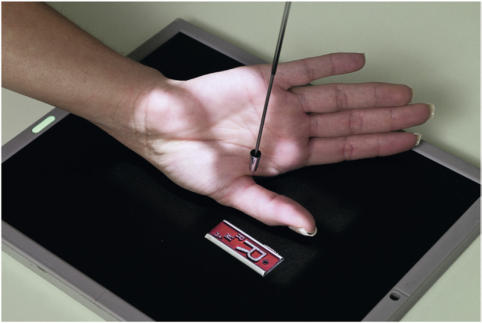
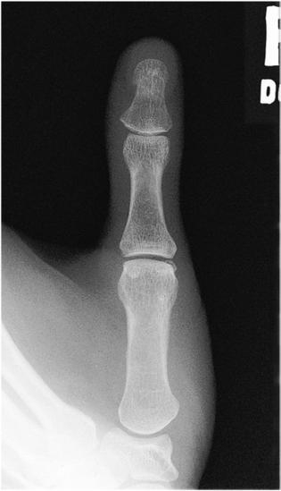
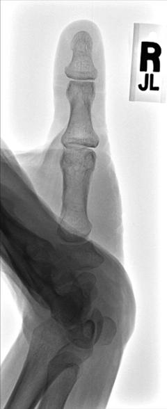

# Rx police, incidență AP axială (METODA ROBERT MODIFICATĂ)6

  📷 Radiografie Convențională (Rx)
  <strong>Actualizat:</strong> 2026-09-15
  <strong>Autor:</strong> Departamentul de Radiologie / Referință Bontrager

---

-   __1. Rezumat Clinic & Indicații__

    ---

    === "Indicații Clinice"

        - Baza primului metacarpian este evidențiată pentru excluderea unei fracturi Bennett.
        - Această incidență specială complementară evidențiază fractura, luxația/subluxația articulară sau patologia bazei primului metacarpian și a trapezului.

    === "Ghid Național IRIS"

        !!! info "Referință Primară: Ghidul Național IRIS (Ordinul MS 1342/2012)"
            - **Capitol Ghid IRIS:** *Aparat locomotor & Membru superior*
            - **Grad de Recomandare:** **Grad A**
            - **Nivel de Iradiere Estimată:** `Clasa 1 (Minimă < 0.01 mSv)`

            [:octicons-search-16: Deschide Ghidul IRIS](../../iris.md){ .md-button .md-button--primary } [:material-open-in-new: Aplicația Oficială PWA](https://radiologie-pediatrica.ro/iris/){ .md-button target="_blank" rel="noopener" }

-   __2. Poziționare & Centrare Fascicul__

    ---

    - **Poziție Pacient:** Pacient: Așezați pacientul paralel cu capătul mesei, cu mâna și brațul complet extinse.; Regiune anatomică: Rotiți brațul în rotație internă până când aspectul posterior al policelui se sprijină pe receptorul de imagine. Plasați policele în centrul receptorului de imagine, paralel cu marginea laterală a receptorului de imagine. Extindeți degetele mâinii.
    - **Punct de Centrare Fascicul:** Fig. 4.63 Incidență AP axială, metoda Robert modificată.
    - **Distanță Focar-Film (DFF / SID):** 100 cm
    - **Comandă Respiratorie:** Apnee pe durata expunerii (sau conform cooperării pacientului)

-   __3. Parametri Tehnici Expunere__

    ---

    | Parametru Tehnic | Valoare Configurare Generator / Tub |
    |:-----------------|:-------------------------------------|
    | **Tensiune Tub (kV)** | 55 kV |
    | **Sarcină / Produs Curent-Timp (mAs)** | DE CONFIGURAT PE APARAT |
    | **Distanță Focar-Film (DFF / SID)** | 100 cm |
    | **Grilă Antidifuzoare (Bucky)** | Fără grilă (expunere directă) |
    | **Dimensiune Focar** | Focar Mic (0.6 mm) |
    | **Camere de Ionizare AEC** | DE CONFIGURAT PE APARAT |
    | **Colimare Fascicul** | Dimensiunea câmpului: Colimați pe patru laturi până la nivelul policelui și al primei articulații carpometacarpiene (CMC). |
    | **Filtrare Tub** | Totală ≥ 2.5 mm Al echivalent |

-   __4. Criterii de Calitate & Reușită Imagine__

    ---

    - Incidența anteroposterioară (AP) a policelui și prima articulație carpometacarpiană (CMC) sunt vizibile fără suprapunere.
    - Baza primului metacarpian și trapezul trebuie să fie bine vizualizate (Fig. 4.62 și 4.63). Poziție:
    - Axa longitudinală a policelui trebuie să fie aliniată cu marginea laterală a receptorului de imagine.
    - Absența rotației anatomice: claviculele sunt echidistante față de linia apofizelor spinoase, evidențiată prin aspectul simetric al ambelor fețe concave ale falangelor și prin cantități egale de părți moi vizibile pe fiecare parte a falangelor.
    - Prima articulație CMC și articulațiile metacarpofalangiene (MCF) trebuie să apară deschise.
    - Raza centrală și centrul câmpului de colimare trebuie să fie la nivelul primei articulații carpometacarpiene (CMC). Expunere:
    - Expunere și contrast optime ale receptorului de imagine, fără mișcare, evidențiază marginile părților moi și contururi osoase și travee trabeculare clare și nete, fără artefacte de mișcare. Fig. 4.62 Incidență AP axială—modificarea Lewis.

-   __5. Protecție Radiologică (ALARA)__

    ---

    - Ecranare gonadică și a organelor radiosensibile conform procedurilor locale de radioprotecție ALARA.
    - Colimare strictă la aria de interes pentru limitarea radiației difuze.
    - Verificarea posibilității unei sarcini la pacientele de vârstă fertilă înainte de expunere.

!!! note "Observații Clinice & Tehnice"
    Această incidență a fost descrisă pentru prima dată de P. Roberts în 1936 pentru evidențierea primei articulații carpometacarpiene (CMC), utilizând o rază centrală perpendiculară.7 Incidența a fost modificată ulterior pentru a include un unghi al razei centrale de 15° proximal față de prima articulație carpometacarpiană (CMC). Modificarea Lewis centrează raza centrală pe prima articulație metacarpofalangiană (MCF), cu un unghi de 10° până la 15° proximal8 (Fig. 4.61). Incidență AP axială a policelui, metoda Robert modificată. Fig. 4.61 Incidență AP axială—modificarea Lewis, raza centrală la 10° până la 15° față de articulația metacarpofalangiană (MCF).

### 🖼️ Imagini

<figure class="protocol-image-card" markdown>

<figcaption><strong>Fig. 4.61 Incidență AP axială—modificarea Lewis, raza centrală la 10° până la 15° față de</strong> — Poziționarea pacientului conform Ghidului Bontrager (Fig. 4.61 incidență AP axială—modificarea Lewis, raza centrală la 10° până la 15° față de)</figcaption>

</figure>

<figure class="protocol-image-card" markdown>

<figcaption><strong>Fig. 4.62 Incidență AP axială—Lewis</strong> — Aspect radiografic de referință conform Ghidului Bontrager (Fig. 4.62 incidență AP axială—Lewis)</figcaption>

</figure>

<figure class="protocol-image-card" markdown>

<figcaption><strong>Fig. 4.63 Incidență AP axială—</strong> — Aspect radiografic de referință conform Ghidului Bontrager (Fig. 4.63 incidență AP axială—)</figcaption>

</figure>

=== "Ghid Rapid de Execuție"

    1. **Identificarea și verificarea pacientului:** verificare identitate, zonă de examinat, consimțământ conform procedurii și evaluarea posibilității unei sarcini, când este relevantă.
    2. **Pregătire:** îndepărtarea oricăror obiecte radiopace (bijuterii, agrafe, fermoare, proteze, pansamente dense).
    3. **Poziționare precisă:** alinierea receptorului de imagine și a tubului la distanța prescrisă (100 cm).
    4. **Colimare strictă:** adaptarea fasciculului strict la regiunea de diagnostic pentru scăderea iradierii și reducerea radiației difuze.
    5. **Radioprotecție:** verificarea [politicii RX](../radioprotectie.md), cu măsuri distincte pentru pacient, personal și însoțitor.

## Surse de documentare

- [Bontrager's Textbook of Radiographic Positioning (Ed. 9/10), Pagina 158](https://www.elsevier.com/books/textbook-of-radiographic-positioning-and-related-anatomy/lampignano/978-0-323-65367-1)
