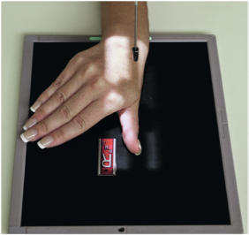
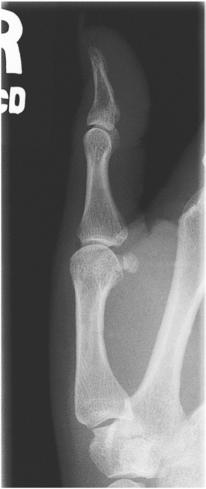
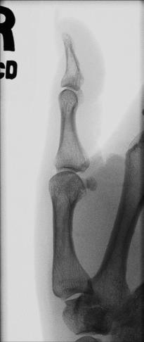

# Rx Police Profil (Lateral)

  📷 Radiografie Convențională (Rx)
  <strong>Actualizat:</strong> 2026-09-15
  <strong>Autor:</strong> Departamentul de Radiologie / Referință Bontrager

---

-   __1. Rezumat Clinic & Indicații__

    ---

    === "Indicații Clinice"

        - suspiciune de fractură și luxație / subluxație articulară de distal și proximal falange, distal metacarpal, și associated articulații
        - Pathologic processes, such ca osteoporosis și artroză / modificări degenerative articulare

    === "Ghid Național IRIS"

        !!! info "Referință Primară: Ghidul Național IRIS (Ordinul MS 1342/2012)"
            - **Capitol Ghid IRIS:** *Ghidul Național IRIS*
            - **Grad de Recomandare:** **De verificat pe indicație; fără grad atribuit automat**
            - **Nivel de Iradiere Estimată:** `De verificat pentru examinarea și populația selectate`

            [:octicons-search-16: Deschide Ghidul IRIS](../../iris.md){ .md-button .md-button--primary } [:material-open-in-new: Aplicația Oficială PWA](https://radiologie-pediatrica.ro/iris/){ .md-button target="_blank" rel="noopener" }
-   __2. Poziționare & Centrare Fascicul__

    ---

    - **Poziție Pacient:** Pacient: Seat pacient la end de table, cu Cot flectat about 90° cu Mână resting pe receptorul de imagine, palm down.; Regiune anatomică: Start cu Mână în pronație și Police în abducție, cu Degete Mână și Mână slightly arched; then rotate Mână slightly medial until Police este în true Incidență de Profil (lateral). (You poate need la provide sponge sau other support under lateral portion de Mână). Align axa longitudinală de Police cu axa longitudinală de receptorul de imagine. Center first articulații metacarpofalangiene (MCF) la raza centrală și la center de receptorul de imagine. Ensure that entire lateral aspect de Police este în direct contact cu receptorul de imagine (Fig. 4.58).
    - **Punct de Centrare Fascicul:** perpendicular pe receptorul de imagine, orientat la first articulații metacarpofalangiene (MCF)
    - **Distanță Focar-Film (DFF / SID):** 100 cm
    - **Comandă Respiratorie:** Apnee pe durata expunerii (sau conform cooperării pacientului)

-   __3. Parametri Tehnici Expunere__

    ---

    | Parametru Tehnic | Valoare Configurare Generator / Tub |
    |:-----------------|:-------------------------------------|
    | **Tensiune Tub (kV)** | 55 kV |
    | **Sarcină / Produs Curent-Timp (mAs)** | DE CONFIGURAT PE APARAT |
    | **Distanță Focar-Film (DFF / SID)** | 100 cm |
    | **Grilă Antidifuzoare (Bucky)** | Fără grilă (expunere directă) |
    | **Dimensiune Focar** | Focar Mic (0.6 mm) |
    | **Camere de Ionizare AEC** | DE CONFIGURAT PE APARAT |
    | **Colimare Fascicul** | field size trebuie să fie la first articulații metacarpofalangiene (MCF). expunere: optim receptorul de imagine expunere și contrast cu fără mișcare evidențiază părți moi margins și clear, Contururi osoase și travee trabeculare nete, fără artefacte de mișcare. |
    | **Filtrare Tub** | Totală ≥ 2.5 mm Al echivalent |

-   __4. Criterii de Calitate & Reușită Imagine__

    ---

    - distal și proximal falange, first metacarpal, trapezium (superimposed), și associated articulații sunt visualized în Incidență de Profil (lateral) (Figs. 4.59 și 4.60). poziție:
    - axa longitudinală de Police trebuie să fie aliniat cu side margine de receptorul de imagine.
    - Police trebuie să fie în true Incidență de Profil (lateral), evidenced prin concaveshaped anterior surface de proximal phalanx și first metacarpal și relatively straight posterior surfaces.
    - Interphalangeal și articulații metacarpofalangiene (MCF) trebuie să appear open if falange sunt paralel cu receptorul de imagine (RI) și if raza centrală location este correct.
    - raza centrală și center de

-   __5. Protecție Radiologică (ALARA)__

    ---

    - Ecranare gonadică și a organelor radiosensibile conform procedurilor locale de radioprotecție ALARA.
    - Colimare strictă la aria de interes pentru limitarea radiației difuze.
    - Verificarea posibilității unei sarcini la pacientele de vârstă fertilă înainte de expunere.

### 🖼️ Imagini

<figure class="protocol-image-card" markdown>

<figcaption><strong>Fig. 4.59 lateral Police.</strong> — Poziționare pacient conform Ghidului Bontrager (Fig. 4.59 lateral thumb.)</figcaption>

</figure>

<figure class="protocol-image-card" markdown>

<figcaption><strong>Fig. 4.60 lateral Police.</strong> — Aspect radiografic de referință conform Ghidului Bontrager (Fig. 4.60 lateral thumb.)</figcaption>

</figure>

<figure class="protocol-image-card" markdown>

<figcaption><strong>Fig. 4.58 Part poziție—lateral Police; raza centrală la first articulații metacarpofalangiene (MCF).</strong> — Aspect radiografic de referință conform Ghidului Bontrager (Fig. 4.58 Part poziție—lateral thumb; raza centrală la first articulații metacarpofalangiene (MCF).)</figcaption>

</figure>

=== "Ghid Rapid de Execuție"

    1. **Identificarea și verificarea pacientului:** verificare identitate, zonă de examinat, consimțământ conform procedurii și evaluarea posibilității unei sarcini, când este relevantă.
    2. **Pregătire:** îndepărtarea oricăror obiecte radiopace (bijuterii, agrafe, fermoare, proteze, pansamente dense).
    3. **Poziționare precisă:** alinierea receptorului de imagine și a tubului la distanța prescrisă (100 cm).
    4. **Colimare strictă:** adaptarea fasciculului strict la regiunea de diagnostic pentru scăderea iradierii și reducerea radiației difuze.
    5. **Radioprotecție:** verificarea [politicii RX](../radioprotectie.md), cu măsuri distincte pentru pacient, personal și însoțitor.

## Surse de documentare

- [Bontrager's Textbook of Radiographic Positioning (Ed. 9/10), Pagina 157](https://www.elsevier.com/books/textbook-of-radiographic-positioning-and-related-anatomy/lampignano/978-0-323-65367-1)
