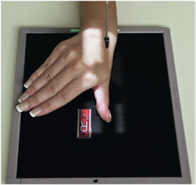
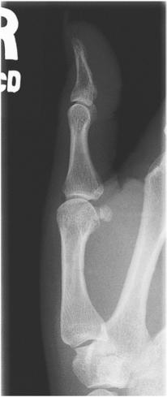
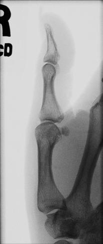

# Rx police, incidență de profil (lateral)

  📷 Radiografie Convențională (Rx)
  <strong>Actualizat:</strong> 2026-09-15
  <strong>Autor:</strong> Departamentul de Radiologie / Referință Bontrager

---

-   __1. Rezumat Clinic & Indicații__

    ---

    === "Indicații Clinice"

        - Suspiciune de fractură și luxație / subluxație articulară a falangelor distală și proximală, a metacarpianului distal și a articulațiilor asociate
        - Procese patologice, precum osteoporoza și artroza / modificările degenerative articulare

    === "Ghid Național IRIS"

        !!! info "Referință Primară: Ghidul Național IRIS (Ordinul MS 1342/2012)"
            - **Capitol Ghid IRIS:** *Aparat locomotor & Membru superior*
            - **Grad de Recomandare:** **Grad A**
            - **Nivel de Iradiere Estimată:** `Clasa 1 (Minimă < 0.01 mSv)`

            [:octicons-search-16: Deschide Ghidul IRIS](../../iris.md){ .md-button .md-button--primary } [:material-open-in-new: Aplicația Oficială PWA](https://radiologie-pediatrica.ro/iris/){ .md-button target="_blank" rel="noopener" }

-   __2. Poziționare & Centrare Fascicul__

    ---

    - **Poziție Pacient:** Pacient: Așezați pacientul la capătul mesei, cu cotul flectat la aproximativ 90°, cu mâna sprijinită pe receptorul de imagine, cu palma în jos.; Regiune anatomică: Începeți cu mâna în pronație și policele în abducție, cu degetele mâinii și mâna ușor arcuite; apoi rotiți mâna ușor medial până când policele este în adevărata incidență de profil (lateral). (Este posibil să fie necesar să plasați un burete sau un alt suport sub porțiunea laterală a mâinii.) Aliniați axa longitudinală a policelui cu axa longitudinală a receptorului de imagine. Centrați prima articulație metacarpofalangiană (MCF) pe raza centrală și în centrul receptorului de imagine. Asigurați-vă că întregul aspect lateral al policelui este în contact direct cu receptorul de imagine (Fig. 4.58).
    - **Punct de Centrare Fascicul:** Perpendicular pe receptorul de imagine, orientat către prima articulație metacarpofalangiană (MCF)
    - **Distanță Focar-Film (DFF / SID):** 100 cm
    - **Comandă Respiratorie:** Apnee pe durata expunerii (sau conform cooperării pacientului)

-   __3. Parametri Tehnici Expunere__

    ---

    | Parametru Tehnic | Valoare Configurare Generator / Tub |
    |:-----------------|:-------------------------------------|
    | **Tensiune Tub (kV)** | 55 kV |
    | **Sarcină / Produs Curent-Timp (mAs)** | DE CONFIGURAT PE APARAT |
    | **Distanță Focar-Film (DFF / SID)** | 100 cm |
    | **Grilă Antidifuzoare (Bucky)** | Fără grilă (expunere directă) |
    | **Dimensiune Focar** | Focar Mic (0.6 mm) |
    | **Camere de Ionizare AEC** | DE CONFIGURAT PE APARAT |
    | **Colimare Fascicul** | Dimensiunea câmpului trebuie să fie la nivelul primei articulații metacarpofalangiene (MCF). Expunere: expunere și contrast optime ale receptorului de imagine, fără mișcare, evidențiază marginile părților moi și contururi osoase și travee trabeculare clare și nete, fără artefacte de mișcare. |
    | **Filtrare Tub** | Totală ≥ 2.5 mm Al echivalent |

-   __4. Criterii de Calitate & Reușită Imagine__

    ---

    - Falangele distală și proximală, primul metacarpian, trapezul (suprapus) și articulațiile asociate sunt vizualizate în incidență de profil (lateral) (Fig. 4.59 și 4.60). Poziție:
    - Axa longitudinală a policelui trebuie să fie aliniată cu marginea laterală a receptorului de imagine.
    - Policele trebuie să fie în adevărata incidență de profil (lateral), evidențiată prin suprafața anterioară concavă a falangei proximale și a primului metacarpian și prin suprafețele posterioare relativ drepte.
    - Articulațiile interfalangiene și metacarpofalangiene (MCF) trebuie să apară deschise dacă falangele sunt paralele cu receptorul de imagine (RI) și dacă localizarea razei centrale este corectă.
    - Raza centrală și centrul

-   __5. Protecție Radiologică (ALARA)__

    ---

    - Ecranare gonadică și a organelor radiosensibile conform procedurilor locale de radioprotecție ALARA.
    - Colimare strictă la aria de interes pentru limitarea radiației difuze.
    - Verificarea posibilității unei sarcini la pacientele de vârstă fertilă înainte de expunere.

### 🖼️ Imagini

<figure class="protocol-image-card" markdown>

<figcaption><strong>Fig. 4.59 Police în incidență laterală.</strong> — Poziționarea pacientului conform Ghidului Bontrager (Fig. 4.59 police în incidență laterală.)</figcaption>

</figure>

<figure class="protocol-image-card" markdown>

<figcaption><strong>Fig. 4.60 Police în incidență laterală.</strong> — Aspect radiografic de referință conform Ghidului Bontrager (Fig. 4.60 police în incidență laterală.)</figcaption>

</figure>

<figure class="protocol-image-card" markdown>

<figcaption><strong>Fig. 4.58 Poziția părții—police în incidență laterală; raza centrală la prima articulație metacarpofalangiană (MCF).</strong> — Aspect radiografic de referință conform Ghidului Bontrager (Fig. 4.58 Poziția părții—police în incidență laterală; raza centrală la prima articulație metacarpofalangiană (MCF).)</figcaption>

</figure>

=== "Ghid Rapid de Execuție"

    1. **Identificarea și verificarea pacientului:** verificare identitate, zonă de examinat, consimțământ conform procedurii și evaluarea posibilității unei sarcini, când este relevantă.
    2. **Pregătire:** îndepărtarea oricăror obiecte radiopace (bijuterii, agrafe, fermoare, proteze, pansamente dense).
    3. **Poziționare precisă:** alinierea receptorului de imagine și a tubului la distanța prescrisă (100 cm).
    4. **Colimare strictă:** adaptarea fasciculului strict la regiunea de diagnostic pentru scăderea iradierii și reducerea radiației difuze.
    5. **Radioprotecție:** verificarea [politicii RX](../radioprotectie.md), cu măsuri distincte pentru pacient, personal și însoțitor.

## Surse de documentare

- [Bontrager's Textbook of Radiographic Positioning (Ed. 9/10), Pagina 157](https://www.elsevier.com/books/textbook-of-radiographic-positioning-and-related-anatomy/lampignano/978-0-323-65367-1)
