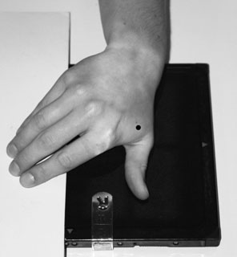
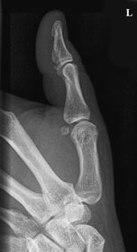
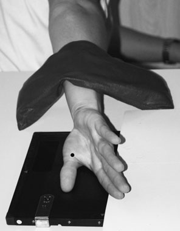
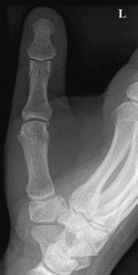
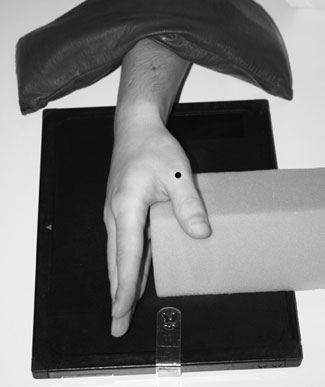
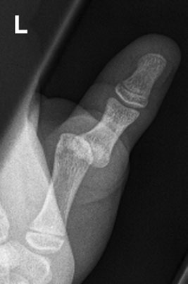
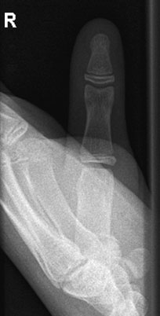
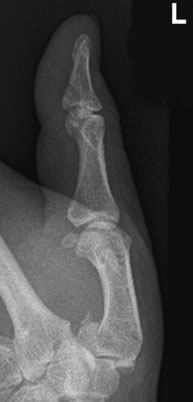

# Rx Police Profil (Lateral)

  📷 Radiografie Convențională (Rx)
  <strong>Actualizat:</strong> 2026-09-16
  <strong>Autor:</strong> Departamentul de Radiologie / Referință Clark (Ed. 12)

---

-   __1. Rezumat Clinic & Indicații__

    ---

    === "Indicații Clinice"

        - suspiciune de fractură de base de first metacarpal through articulație surface poate fie associated cu luxație articulară due la pull de abductor și extensor tendons de Police. This este known ca Bennett’s suspiciune de fractură și poate cause functional impairment și early degenerative disease if nu corrected. în contrast, suspiciune de fractură that does nu transgress articular surface does nu dislocate și does nu have same significance (Rolando suspiciune de fractură). Postero-anterior (PA) Police – evidențiind luxație articulară la first articulații metacarpofalangiene (MCF) radiografie de Police evidențiind Bennett’s suspiciune de fractură Antero-posterior (AP) radiografie de Police – incorrectly poziționat

    === "Ghid Național IRIS"

        !!! info "Referință Primară: Ghidul Național IRIS (Ordinul MS 1342/2012)"
            - **Capitol Ghid IRIS:** *Ghidul Național IRIS*
            - **Grad de Recomandare:** **De verificat pe indicație; fără grad atribuit automat**
            - **Nivel de Iradiere Estimată:** `De verificat pentru examinarea și populația selectate`

            [:octicons-search-16: Deschide Ghidul IRIS](../../iris.md){ .md-button .md-button--primary } [:material-open-in-new: Aplicația Oficială PWA](https://radiologie-pediatrica.ro/iris/){ .md-button target="_blank" rel="noopener" }
-   __2. Poziționare & Centrare Fascicul__

    ---

    - **Poziție Pacient:** • pacientul este așezat pe scaun facing away de la masa de examinare cu braț extins backwards și medially rotit la Umăr.
Mână poate fie slightly rotit la ensure that second, third și fourth oase metacarpiene sunt nu superimposed pe base de first metacarpal.
• pacientul leans forward, lowering Umăr astfel încât first metacarpal este paralel cu tabletop.
• caseta este plasat under Pumn (Articulație Radiocarpiană) și Police și oriented la axa longitudinală de metacarpal.

• cu Mână în Postero-anterior (PA) poziție, palm de Mână este rotit through 90 grade la bring medial aspect de Mână în contact cu masa de examinare și palm vertical.
• caseta este plasat under Mână și Pumn (Articulație Radiocarpiană), cu its axa longitudinală along line de Police.
• Degete Mână sunt extins și Mână este rotit slightly forwards until anterior aspect de Police este paralel cu casetă.
• Police este sprijinit în poziție pe non-opaque pad.
    - **Punct de Centrare Fascicul:** • Raza centrală verticală este centrată pe base de first metacarpal.
48 Normal Profil (lateral) radiografie de Police Normal Antero-posterior (AP) radiografie de Police

• raza centrală verticală centrală este centred la first articulații metacarpofalangiene (MCF).
    - **Distanță Focar-Film (DFF / SID):** 100 cm
    - **Comandă Respiratorie:** Apnee pe durata expunerii (apnee în inspir pentru torace; expir pentru Abdomen/bazin).

-   __3. Parametri Tehnici Expunere__

    ---

    | Parametru Tehnic | Valoare Configurare Generator / Tub |
    |:-----------------|:-------------------------------------|
    | **Tensiune Tub (kV)** | DE CONFIGURAT PE APARAT |
    | **Sarcină / Produs Curent-Timp (mAs)** | Conform AEC / grosime anatomică |
    | **Distanță Focar-Film (DFF / SID)** | 100 cm |
    | **Grilă Antidifuzoare (Bucky)** | Conform grosimii anatomice (> 10-12 cm cu grilă) |
    | **Dimensiune Focar** | Focar Mic (0.6 mm) |
    | **Camere de Ionizare AEC** | DE CONFIGURAT PE APARAT |
    | **Colimare Fascicul** | Colimare strictă adaptată pe receptor 18 x 24 cm |
    | **Filtrare Tub** | Totală ≥ 2.5 mm Al echivalent (conform Clark: 3.0 mm Al eq.) |

-   __4. Criterii de Calitate & Reușită Imagine__

    ---

    - Where there este possibility de injury la base de first metacarpal, carpo-metacarpal articulație trebuie să fie included pe imagine. Antero-posterior (AP)
    - Where there este possibility de injury la base de first metacarpal, carpo-metacarpal articulație trebuie să fie included pe imagine.
    - second, third, fourth și fifth oase metacarpiene trebuie să nu fie superimposed pe first.

-   __5. Protecție Radiologică (ALARA)__

    ---

    - Ecranare gonadică cu șorț plumbat dacă gonadele sunt în apropierea fasciculului util (regula ALARA).
    - Colimare precisă la dimensiunea anatomică strict necesară pentru reducerea dozei și a radiației difuze.
    - Verificarea posibilității unei sarcini la pacientele de vârstă fertilă înainte de expunere.

!!! note "Observații Clinice & Tehnice"
    • Postero-anterior (PA) incidență increases object-la-film radiologic distance și hence, potentially, unsharpness, but it este sometimes easier și less painful pentru pacientul.
• use de Postero-anterior (PA) incidență maintains relationship de adjacent bones, i.e. radius și ulna, which este essential în cases de suspected corp străin radiopac în thenar eminence.

### 🖼️ Imagini

<figure class="protocol-image-card" markdown>

<figcaption><strong>Normal Profil (lateral) radiografie de Police</strong> — Poziționare pacient și centrare fascicul conform Clark (Ed. 12)</figcaption>

</figure>

<figure class="protocol-image-card" markdown>

<figcaption><strong>Normal Antero-posterior (AP) radiografie de Police</strong> — Aspect radiografic / ghid de poziționare conform tratatului Clark (Ed. 12)</figcaption>

</figure>

<figure class="protocol-image-card" markdown>

<figcaption><strong>Figura 3: Aspect radiografic / Poziționare (Clark Ed. 12)</strong> — Aspect radiografic / ghid de poziționare conform tratatului Clark (Ed. 12)</figcaption>

</figure>

<figure class="protocol-image-card" markdown>

<figcaption><strong>Figura 4: Aspect radiografic / Poziționare (Clark Ed. 12)</strong> — Aspect radiografic / ghid de poziționare conform tratatului Clark (Ed. 12)</figcaption>

</figure>

<figure class="protocol-image-card" markdown>

<figcaption><strong>suspiciune de fractură de base de first metacarpal through articulație</strong> — Aspect radiografic / ghid de poziționare conform tratatului Clark (Ed. 12)</figcaption>

</figure>

<figure class="protocol-image-card" markdown>

<figcaption><strong>Bennett’s suspiciune de fractură și poate cause functional impairment și</strong> — Aspect radiografic / ghid de poziționare conform tratatului Clark (Ed. 12)</figcaption>

</figure>

<figure class="protocol-image-card" markdown>

<figcaption><strong>locate și does nu have same significance (Rolando suspiciune de fractură).</strong> — Aspect radiografic / ghid de poziționare conform tratatului Clark (Ed. 12)</figcaption>

</figure>

<figure class="protocol-image-card" markdown>

<figcaption><strong>Postero-anterior (PA) Police – evidențiind luxație articulară la first</strong> — Aspect radiografic / ghid de poziționare conform tratatului Clark (Ed. 12)</figcaption>

</figure>

=== "Ghid Rapid de Execuție"

    1. **Identificarea și verificarea pacientului:** verificare identitate, zonă de examinat, consimțământ conform procedurii și evaluarea posibilității unei sarcini, când este relevantă.
    2. **Pregătire:** îndepărtarea oricăror obiecte radiopace (bijuterii, agrafe, fermoare, proteze, pansamente dense).
    3. **Poziționare precisă:** alinierea receptorului de imagine și a tubului la distanța prescrisă (100 cm).
    4. **Colimare strictă:** adaptarea fasciculului strict la regiunea de diagnostic pentru scăderea iradierii și reducerea radiației difuze.
    5. **Radioprotecție:** verificarea [politicii RX](../radioprotectie.md), cu măsuri distincte pentru pacient, personal și însoțitor.

## Surse de documentare

- [Clark's Positioning in Radiography (Ed. 12), Pagina 63](../../assets/protocols/sources/Clark___Positioning_in_Radiography__12th_edition.pdf#page=63)
