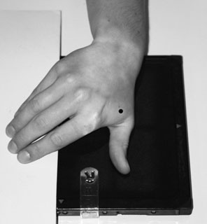
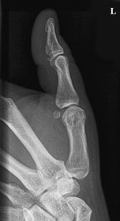
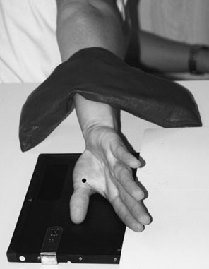
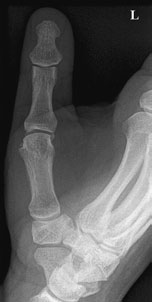
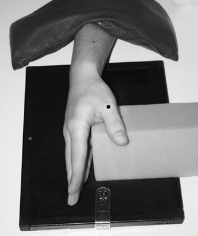
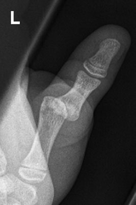
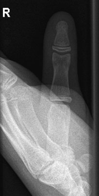
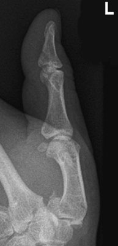

# Rx police, incidență de profil (lateral)

  📷 Radiografie Convențională (Rx)
  <strong>Actualizat:</strong> 2026-09-16
  <strong>Autor:</strong> Departamentul de Radiologie / Referință Clark (Ed. 12)

---

-   __1. Rezumat Clinic & Indicații__

    ---

    === "Indicații Clinice"

        - Fractura bazei primului metacarpian, care traversează suprafața articulară, poate fi asociată cu luxația articulară datorită tracțiunii exercitate de tendoanele abductorului și extensorului policelui. Aceasta este cunoscută drept fractura Bennett și poate cauza afectare funcțională și boală degenerativă precoce dacă nu este corectată. În schimb, fractura care nu traversează suprafața articulară nu se luxează și nu are aceeași semnificație (fractura Rolando). Police în incidență postero-anterioară (PA) – evidențiind luxația articulară la prima articulație metacarpofalangiană (MCF). Radiografie a policelui evidențiind fractura Bennett. Radiografie anteroposterioară (AP) a policelui – poziționată incorect.

    === "Ghid Național IRIS"

        !!! info "Referință Primară: Ghidul Național IRIS (Ordinul MS 1342/2012)"
            - **Capitol Ghid IRIS:** *Aparat locomotor & Membru superior*
            - **Grad de Recomandare:** **Grad A**
            - **Nivel de Iradiere Estimată:** `Clasa 1 (Minimă < 0.01 mSv)`

            [:octicons-search-16: Deschide Ghidul IRIS](../../iris.md){ .md-button .md-button--primary } [:material-open-in-new: Aplicația Oficială PWA](https://radiologie-pediatrica.ro/iris/){ .md-button target="_blank" rel="noopener" }

-   __2. Poziționare & Centrare Fascicul__

    ---

    - **Poziție Pacient:**
        - Pacientul este așezat pe scaun, cu fața opusă mesei de examinare, cu brațul extins posterior și rotit medial la nivelul umărului. Mâna poate fi rotită ușor pentru a asigura că al doilea, al treilea și al patrulea metacarpian nu se suprapun peste baza primului metacarpian.
        - Pacientul se apleacă înainte, coborând umărul astfel încât primul metacarpian să fie paralel cu suprafața mesei.
        - Caseta este plasată sub pumn (articulația radiocarpiană) și police și orientată pe axa longitudinală a metacarpianului.
        - Cu mâna în poziție postero-anterioară (PA), palma mâinii este rotită la 90 de grade pentru a aduce aspectul medial al mâinii în contact cu masa de examinare, cu palma verticală.
        - Caseta este plasată sub mână și pumn (articulația radiocarpiană), cu axa sa longitudinală de-a lungul liniei policelui.
        - Degetele mâinii sunt extinse, iar mâna este rotită ușor anterior până când aspectul anterior al policelui este paralel cu caseta.
        - Policele este susținut în poziție pe un suport radiotransparent.
    - **Punct de Centrare Fascicul:**
        - Raza centrală verticală este centrată pe baza primului metacarpian. 48 Radiografie normală de profil (lateral) a policelui. Radiografie normală anteroposterioară (AP) a policelui.
        - Raza centrală verticală este centrată pe prima articulație metacarpofalangiană (MCF).
    - **Distanță Focar-Film (DFF / SID):** 100 cm
    - **Comandă Respiratorie:** Apnee pe durata expunerii (apnee în inspir pentru torace; expir pentru Abdomen/bazin).

-   __3. Parametri Tehnici Expunere__

    ---

    | Parametru Tehnic | Valoare Configurare Generator / Tub |
    |:-----------------|:-------------------------------------|
    | **Tensiune Tub (kV)** | DE CONFIGURAT PE APARAT |
    | **Sarcină / Produs Curent-Timp (mAs)** | Conform AEC / grosimii anatomice |
    | **Distanță Focar-Film (DFF / SID)** | 100 cm |
    | **Grilă Antidifuzoare (Bucky)** | Conform grosimii anatomice (> 10-12 cm cu grilă) |
    | **Dimensiune Focar** | Focar Mic (0.6 mm) |
    | **Camere de Ionizare AEC** | DE CONFIGURAT PE APARAT |
    | **Colimare Fascicul** | Colimare strictă adaptată pe receptor 18 x 24 cm |
    | **Filtrare Tub** | Totală ≥ 2.5 mm Al echivalent (conform Clark: 3.0 mm Al echivalent) |

-   __4. Criterii de Calitate & Reușită Imagine__

    ---

    - În cazul posibilității unei leziuni la baza primului metacarpian, articulația carpometacarpiană trebuie inclusă în imagine. Anteroposterior (AP)
    - În cazul posibilității unei leziuni la baza primului metacarpian, articulația carpometacarpiană trebuie inclusă în imagine.
    - Al doilea, al treilea, al patrulea și al cincilea metacarpian nu trebuie să se suprapună peste primul.

-   __5. Protecție Radiologică (ALARA)__

    ---

    - Ecranare gonadică cu șorț plumbat dacă gonadele sunt în apropierea fasciculului util (regula ALARA).
    - Colimare precisă la dimensiunea anatomică strict necesară pentru reducerea dozei și a radiației difuze.
    - Verificarea posibilității unei sarcini la pacientele de vârstă fertilă înainte de expunere.

!!! note "Observații Clinice & Tehnice"
    - Incidența postero-anterioară (PA) crește distanța obiect–film radiologic și, prin urmare, neclaritatea potențială, dar este uneori mai ușoară și mai puțin dureroasă pentru pacient.
    - Utilizarea incidenței postero-anterioare (PA) menține relația oaselor adiacente, adică radiusul și ulna, ceea ce este esențial în cazurile de suspiciune a unui corp străin radiopac în eminența tenară.

### 🖼️ Imagini

<figure class="protocol-image-card" markdown>

<figcaption><strong>Radiografie normală de profil (lateral) a policelui</strong> — Poziționarea pacientului și centrarea fasciculului conform Clark (Ed. 12)</figcaption>

</figure>

<figure class="protocol-image-card" markdown>

<figcaption><strong>Radiografie normală anteroposterioară (AP) a policelui</strong> — Aspect radiografic / ghid de poziționare conform tratatului Clark (Ed. 12)</figcaption>

</figure>

<figure class="protocol-image-card" markdown>

<figcaption><strong>Figura 3: Aspect radiografic / Poziționare (Clark Ed. 12)</strong> — Aspect radiografic / ghid de poziționare conform tratatului Clark (Ed. 12)</figcaption>

</figure>

<figure class="protocol-image-card" markdown>

<figcaption><strong>Figura 4: Aspect radiografic / Poziționare (Clark Ed. 12)</strong> — Aspect radiografic / ghid de poziționare conform tratatului Clark (Ed. 12)</figcaption>

</figure>

<figure class="protocol-image-card" markdown>

<figcaption><strong>Fractura bazei primului metacarpian care traversează articulația</strong> — Aspect radiografic / ghid de poziționare conform tratatului Clark (Ed. 12)</figcaption>

</figure>

<figure class="protocol-image-card" markdown>

<figcaption><strong>Fractura Bennett și poate cauza afectare funcțională și</strong> — Aspect radiografic / ghid de poziționare conform tratatului Clark (Ed. 12)</figcaption>

</figure>

<figure class="protocol-image-card" markdown>

<figcaption><strong>localizată și nu are aceeași semnificație (fractura Rolando).</strong> — Aspect radiografic / ghid de poziționare conform tratatului Clark (Ed. 12)</figcaption>

</figure>

<figure class="protocol-image-card" markdown>

<figcaption><strong>Police în incidență postero-anterioară (PA) – evidențiind luxația articulară la prima</strong> — Aspect radiografic / ghid de poziționare conform tratatului Clark (Ed. 12)</figcaption>

</figure>

=== "Ghid Rapid de Execuție"

    1. **Identificarea și verificarea pacientului:** verificare identitate, zonă de examinat, consimțământ conform procedurii și evaluarea posibilității unei sarcini, când este relevantă.
    2. **Pregătire:** îndepărtarea oricăror obiecte radiopace (bijuterii, agrafe, fermoare, proteze, pansamente dense).
    3. **Poziționare precisă:** alinierea receptorului de imagine și a tubului la distanța prescrisă (100 cm).
    4. **Colimare strictă:** adaptarea fasciculului strict la regiunea de diagnostic pentru scăderea iradierii și reducerea radiației difuze.
    5. **Radioprotecție:** verificarea [politicii RX](../radioprotectie.md), cu măsuri distincte pentru pacient, personal și însoțitor.

## Surse de documentare

- [Clark's Positioning in Radiography (Ed. 12), Pagina 63](https://books.google.com/books/about/Clark_s_Positioning_in_Radiography.html?id=Xxu6MwEACAAJ)
