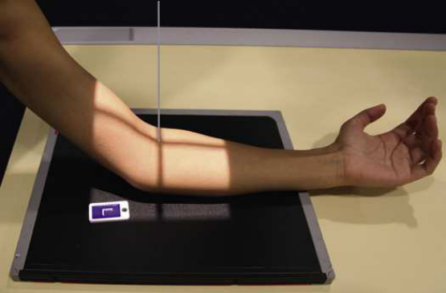
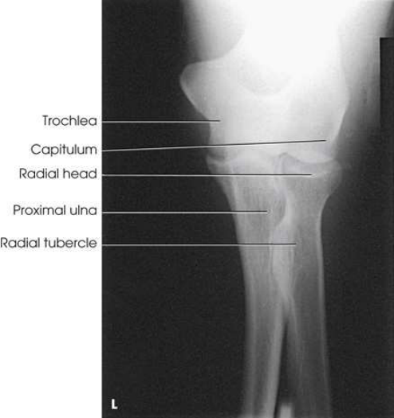
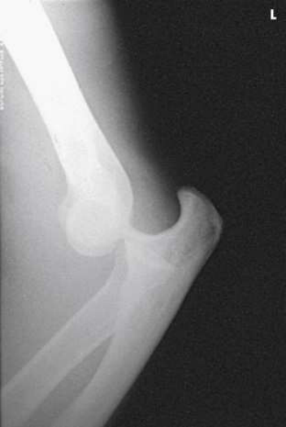

# Rx Proximal Antebraț — Incidență Antero-Posterioară (AP) — Partial flexion (Merrill)

  📷 Radiografie Convențională (Rx)
  <strong>Actualizat:</strong> 2026-09-16
  <strong>Autor:</strong> Referință Merrill

---

-   __1. Rezumat Clinic & Indicații__

    ---

    === "Indicații Clinice"

        - Conform reperelor anatomice standard din tratat

    === "Ghid Național IRIS"

        !!! info "Referință Primară: Ghidul Național IRIS (Ordinul MS 1342/2012)"
            - **Capitol Ghid IRIS:** *Ghidul Național IRIS*
            - **Grad de Recomandare:** **De verificat pe indicație; fără grad atribuit automat**
            - **Nivel de Iradiere Estimată:** `De verificat pentru examinarea și populația selectate`

            [:octicons-search-16: Deschide Ghidul IRIS](../../iris.md){ .md-button .md-button--primary } [:material-open-in-new: Aplicația Oficială PWA](https://radiologie-pediatrica.ro/iris/){ .md-button target="_blank" rel="noopener" }
-   __2. Poziționare & Centrare Fascicul__

    ---

    - **Poziție Pacient:** se așază pacientul pe scaun la end de masa radiologică, cu Mână în supinație.; se așază pacientul pe scaun high enough la permit dorsal surface de Antebraț la rest pe masa de examinare (Fig. 5.123).
    - **Punct de Centrare Fascicul:** perpendicular pe Cot articulație și axa longitudinală de Antebraț se ajustează receptorul de imagine astfel încât raza centrală passes la its midpoint.
    - **Distanță Focar-Film (DFF / SID):** Nespecificat în fragmentul extras; de verificat în sursă
    - **Comandă Respiratorie:** Conform reperelor anatomice standard din tratat

-   __3. Parametri Tehnici Expunere__

    ---

    | Parametru Tehnic | Valoare Configurare Generator / Tub |
    |:-----------------|:-------------------------------------|
    | **Tensiune Tub (kV)** | DE CONFIGURAT PE APARAT |
    | **Sarcină / Produs Curent-Timp (mAs)** | DE CONFIGURAT PE APARAT |
    | **Distanță Focar-Film (DFF / SID)** | Nespecificat în fragmentul extras; de verificat în sursă |
    | **Grilă Antidifuzoare (Bucky)** | DE CONFIGURAT PE APARAT |
    | **Dimensiune Focar** | DE CONFIGURAT PE APARAT |
    | **Camere de Ionizare AEC** | DE CONFIGURAT PE APARAT |
    | **Colimare Fascicul** | Adjust câmp de iradiere la 3 inches (8 cm) proximal și distal la Cot articulație și 1 inch (2.5 cm) pe sides. Se plasează markerul de lateralitate în câmpul colimat. |
    | **Filtrare Tub** | DE CONFIGURAT PE APARAT |

-   __4. Criterii de Calitate & Reușită Imagine__

    ---

    - Criterii radiologice de calitate imaginii:
    - Colimare adecvată vizibilă și prezența markerului de lateralitate (D/S) plasat clear de anatomy de interest
    - proximal radius și ulna fără rotație sau distortion
    - cap radial, neck, și tuberosity slightly superimposed over proximal ulna
    - Partially open Cot articulație
    - Foreshortened distal Humerus
    - Bony detalii trabeculare osoase de proximal radius și ulna, ca well ca soft tissues surrounding Cot

-   __5. Protecție Radiologică (ALARA)__

    ---

    - Nespecificat în fragmentul extras; de verificat în sursă

!!! note "Observații Clinice & Tehnice"
    If this poziție este impossible, elevate extremity pe support, se ajustează extremity în Incidență de Profil (lateral), place receptorul de imagine în vertical poziție behind upper end de Antebraț, și se orientează raza centrală centrală horizontally. se efectuează ecranarea gonadelor cu șorț plumbat. Holly 32 described method de obtaining Incidență Antero-Posterioară (AP) de cap radial. pacientul este poziționat ca described pentru distal Humerus. Cot este extins ca much ca possible, și Antebraț este sprijinit. Antebraț trebuie să fie în supinație enough la place plan orizontal de Pumn (Articulație Radiocarpiană) la un unghi de 30 grade de la orizontal.

### 🖼️ Imagini

<figure class="protocol-image-card" markdown>

<figcaption><strong>Merrill — pagina PDF 332, imaginea 1</strong> — Imagine din fragmentul sursă; asocierea necesită revizie.</figcaption>

</figure>

<figure class="protocol-image-card" markdown>

<figcaption><strong>Merrill — pagina PDF 333, imaginea 2</strong> — Imagine din fragmentul sursă; asocierea necesită revizie.</figcaption>

</figure>

<figure class="protocol-image-card" markdown>

<figcaption><strong>Merrill — pagina PDF 334, imaginea 3</strong> — Imagine din fragmentul sursă; asocierea necesită revizie.</figcaption>

</figure>

=== "Ghid Rapid de Execuție"

    1. **Identificarea și verificarea pacientului:** verificare identitate, zonă de examinat, consimțământ conform procedurii și evaluarea posibilității unei sarcini, când este relevantă.
    2. **Pregătire:** îndepărtarea oricăror obiecte radiopace (bijuterii, agrafe, fermoare, proteze, pansamente dense).
    3. **Poziționare precisă:** alinierea receptorului de imagine și a tubului la distanța prescrisă (Nespecificat în fragmentul extras; de verificat în sursă).
    4. **Colimare strictă:** adaptarea fasciculului strict la regiunea de diagnostic pentru scăderea iradierii și reducerea radiației difuze.
    5. **Radioprotecție:** verificarea [politicii RX](../radioprotectie.md), cu măsuri distincte pentru pacient, personal și însoțitor.

## Surse de documentare

- [Merrill’s Atlas, 5. Upper Extremity, pagini PDF 331–334](../../assets/protocols/sources/a56d45c16829_Merrills_Atlas_of_Radiographic_Positioning__Procedures_3Vol_Set.pdf#page=331)

## Fragmente sursă traduse (referință tehnică)

### anatomy

proximal forearm when cot cannot fie fully extins (Figs. 5.124 și 5.125).

### collimation

• Adjust câmp de iradiere la 3 inches (8 cm) proximal și distal la cot articulație și 1 inch (2.5 cm) pe sides. Place marker de lateralitate (D/S) în collimated expunere field.

### cr

• perpendicular pe cot articulație și axa longitudinală de forearm
• se ajustează receptorul de imagine astfel încât raza centrală passes la its midpoint.

### criteria

Criterii radiologice de calitate imaginii:
• Colimare adecvată vizibilă și prezența markerului de lateralitate (D/S) plasat clear de anatomy de interest
• proximal radius și ulna fără rotație sau distortion
• cap radial, neck, și tuberosity slightly superimposed over proximal ulna
• Partially open cot articulație
• Foreshortened distal humerus
• Bony detalii trabeculare osoase de proximal radius și ulna, ca well ca soft tissues surrounding cot

### notes

If this poziție este impossible, elevate extremity pe support, se ajustează extremity în poziție de profil (lateral), place receptorul de imagine în vertical poziție behind upper end de forearm, și se orientează raza centrală centrală horizontally.
• se efectuează ecranarea gonadelor cu șorț plumbat.
Holly 32 described method de obtaining AP incidență de cap radial. pacientul este poziționat ca described pentru distal
humerus. cot este extins ca much ca possible, și forearm este sprijinit. forearm trebuie să fie în supinație enough la place plan orizontal de wrist la un unghi de 30 grade de la orizontal.

### part_pos

• se așază pacientul pe scaun high enough la permit dorsal surface de forearm la rest pe masa de examinare (Fig. 5.123).

### patient_pos

• se așază pacientul pe scaun la end de masa radiologică, cu mână în supinație.

### tech

poziționat prin manufacturer sau department protocol pentru corect anatomy display orientation; raza centrală plate: 10 × 12 inches (24 × 30 cm) longitudinal.

