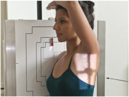
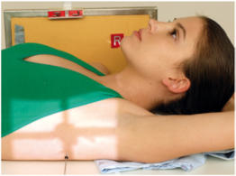
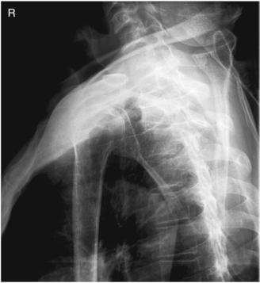
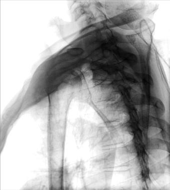

# Rx PROXIMAL Humerus (traumatism acuttism / Regim Urgență) TRANSTHORACIC Profil (Lateral) (Metoda Lawrence)

  📷 Radiografie Convențională (Rx)
  <strong>Actualizat:</strong> 2026-09-15
  <strong>Autor:</strong> Departamentul de Radiologie / Referință Bontrager

---

-   __1. Rezumat Clinic & Indicații__

    ---

    === "Indicații Clinice"

        - suspiciune de fractură or luxație / subluxație articulară of proximal Humerus

    === "Ghid Național IRIS"

        !!! info "Referință Primară: Ghidul Național IRIS (Ordinul MS 1342/2012)"
            - **Capitol Ghid IRIS:** *Ghidul Național IRIS*
            - **Grad de Recomandare:** **De verificat pe indicație; fără grad atribuit automat**
            - **Nivel de Iradiere Estimată:** `De verificat pentru examinarea și populația selectate`

            [:octicons-search-16: Deschide Ghidul IRIS](../../iris.md){ .md-button .md-button--primary } [:material-open-in-new: Aplicația Oficială PWA](https://radiologie-pediatrica.ro/iris/){ .md-button target="_blank" rel="noopener" }
-   __2. Poziționare & Centrare Fascicul__

    ---

    - **Poziție Pacient:** Pacient: Perform radiograph with patient in Ortostatism or Decubit Dorsal position. (The Ortostatism position is preferred and may be more comfortable for patient.) Place patient in Incidență de Profil (Lateral) with side of interest against IR. With patient Decubit Dorsal, place grid lines vertically and center CR to centerline to prevent grid cutoff (Figs. 5.73 and 5.74).; Regiune anatomică: Place affected arm at patient’s side in neutral rotation; drop Umăr if possible. Raise opposite arm and place Mână over top of head; elevate Umăr as much as possible to prevent superimposition of affected Umăr. Center surgical neck and center of IR to CR as projected through thorax. Ensure that thorax is in a true Incidență de Profil (Lateral) or has slight anterior rotation of unaffected Umăr to minimize superimposition of Humerus by thoracic vertebrae.
    - **Punct de Centrare Fascicul:** perpendicular to IR, directed through thorax to level of affected surgical neck (see NOTE)
    - **Distanță Focar-Film (DFF / SID):** 100 cm
    - **Comandă Respiratorie:** Expose on Inspir profund adecvat: minim 9-10 arcuri costale posterioare vizibile. orthostatic (breathing) technique is preferred if patient can cooperate. Patient should be asked to breathe gently short, shallow breaths without moving affected arm or Umăr. (This best visualizes proximal Humerus by blurring out Coaste (Grilaj Costal) and lung structures.)

-   __3. Parametri Tehnici Expunere__

    ---

    | Parametru Tehnic | Valoare Configurare Generator / Tub |
    |:-----------------|:-------------------------------------|
    | **Tensiune Tub (kV)** | 70-80 kV |
    | **Sarcină / Produs Curent-Timp (mAs)** | DE CONFIGURAT PE APARAT |
    | **Distanță Focar-Film (DFF / SID)** | 100 cm |
    | **Grilă Antidifuzoare (Bucky)** | Cu grilă antidifuzoare Bucky |
    | **Dimensiune Focar** | Focar Mic (0.6 mm) |
    | **Camere de Ionizare AEC** | Camerele laterale (sau camera centrală funcție de regiune) |
    | **Colimare Fascicul** | Field Size Collimate on four sides to area of interest. |
    | **Filtrare Tub** | Totală ≥ 2.5 mm Al echivalent |

-   __4. Criterii de Calitate & Reușită Imagine__

    ---

    - Lateral view of proximal half of the Humerus and scapulohumeral joint should be visualized through the thorax without superimposition of the opposite Umăr (Figs. 5.75 and 5.76). Position:
    - Outline of the shaft of the proximal Humerus should be clearly visualized anterior to the thoracic vertebrae.
    - Relationship of the humeral head and the glenoid cavity should be demonstrated.
    - Collimation field size to area of interest. Exposure:
    - Optimal image receptor exposure and contrast demonstrate entire outline of the humeral head and the proximal half of the Humerus.
    - Overlying Coaste (Grilaj Costal) and lung markings should appear blurred because of breathing technique, but bony outlines of the Humerus should appear sharp, indicating no motion of the arm during the exposure. Fig. 5.73 Ortostatism transthoracic Incidență de Profil (Lateral) (R lateral). Fig. 5.74 Decubit Dorsal transthoracic Incidență de Profil (Lateral) (R lateral). Fig. 5.75 Ortostatism transthoracic lateral. Head of Humerus Claviculă R Greater tubercle Intertubercle groove Lesser tubercle Shaft of the Humerus Omoplat (Scapulă) Fig. 5.76 Ortostatism transthoracic lateral.

-   __5. Protecție Radiologică (ALARA)__

    ---

    - Ecranare gonadică și a organelor radiosensibile conform procedurilor locale de radioprotecție ALARA.
    - Colimare strictă la aria de interes pentru limitarea radiației difuze.
    - Verificarea posibilității unei sarcini la pacientele de vârstă fertilă înainte de expunere.

!!! note "Observații Clinice & Tehnice"
    If patient is in too much pain to drop injured Umăr and elevate uninjured arm and Umăr fully to prevent superimposition of shoulders, angle CR 10° to 15° cephalad. Umăr (traumatism acuttism / Regim Urgență) ROUTINE AP (neutral rotation) Transthoracic lateral or PA oblique (scapular Y lateral)

### 🖼️ Imagini

<figure class="protocol-image-card" markdown>

<figcaption><strong>Fig. 5.73 Ortostatism transthoracic</strong> — Poziționare pacient conform Ghidului Bontrager (Fig. 5.73 Erect transthoracic)</figcaption>

</figure>

<figure class="protocol-image-card" markdown>

<figcaption><strong>Fig. 5.74 Decubit Dorsal transthoracic</strong> — Aspect radiografic de referință conform Ghidului Bontrager (Fig. 5.74 Supine transthoracic)</figcaption>

</figure>

<figure class="protocol-image-card" markdown>

<figcaption><strong>Fig. 5.75 Ortostatism transthoracic lateral.</strong> — Aspect radiografic de referință conform Ghidului Bontrager (Fig. 5.75 Erect transthoracic lateral.)</figcaption>

</figure>

<figure class="protocol-image-card" markdown>

<figcaption><strong>Fig. 5.76 Ortostatism transthoracic lateral.</strong> — Aspect radiografic de referință conform Ghidului Bontrager (Fig. 5.76 Erect transthoracic lateral.)</figcaption>

</figure>

=== "Ghid Rapid de Execuție"

    1. **Identificarea și verificarea pacientului:** verificare identitate, zonă de examinat, consimțământ conform procedurii și evaluarea posibilității unei sarcini, când este relevantă.
    2. **Pregătire:** îndepărtarea oricăror obiecte radiopace (bijuterii, agrafe, fermoare, proteze, pansamente dense).
    3. **Poziționare precisă:** alinierea receptorului de imagine și a tubului la distanța prescrisă (100 cm).
    4. **Colimare strictă:** adaptarea fasciculului strict la regiunea de diagnostic pentru scăderea iradierii și reducerea radiației difuze.
    5. **Radioprotecție:** verificarea [politicii RX](../radioprotectie.md), cu măsuri distincte pentru pacient, personal și însoțitor.

## Surse de documentare

- [Bontrager's Textbook of Radiographic Positioning (Ed. 9/10), Pagina 213](https://www.elsevier.com/books/textbook-of-radiographic-positioning-and-related-anatomy/lampignano/978-0-323-65367-1)
