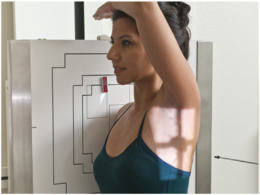
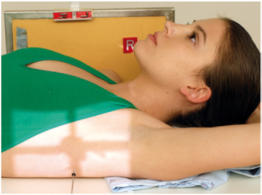
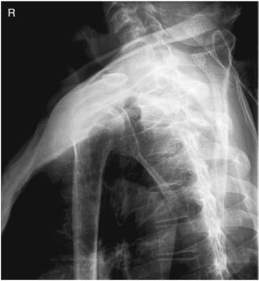
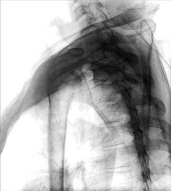

# Rx HUMERUS PROXIMAL (traumatism acut / regim de urgență) PROFIL TRANSTHORACIC (lateral) (Metoda Lawrence)

  📷 Radiografie Convențională (Rx)
  <strong>Actualizat:</strong> 2026-09-15
  <strong>Autor:</strong> Departamentul de Radiologie / Referință Bontrager

---

-   __1. Rezumat Clinic & Indicații__

    ---

    === "Indicații Clinice"

        - Suspiciune de fractură sau luxație / subluxație articulară a humerusului proximal

    === "Ghid Național IRIS"

        !!! info "Referință Primară: Ghidul Național IRIS (Ordinul MS 1342/2012)"
            - **Capitol Ghid IRIS:** *Aparat locomotor & Membru superior*
            - **Grad de Recomandare:** **Grad A**
            - **Nivel de Iradiere Estimată:** `Clasa 1 (Minimă < 0.02 mSv)`

            [:octicons-search-16: Deschide Ghidul IRIS](../../iris.md){ .md-button .md-button--primary } [:material-open-in-new: Aplicația Oficială PWA](https://radiologie-pediatrica.ro/iris/){ .md-button target="_blank" rel="noopener" }

-   __2. Poziționare & Centrare Fascicul__

    ---

    - **Poziție Pacient:** Pacient: Se efectuează radiografia cu pacientul în ortostatism sau în decubit dorsal. (Poziția în ortostatism este preferată și poate fi mai confortabilă pentru pacient.) Se plasează pacientul în incidență de profil (lateral), cu partea de interes în contact cu receptorul de imagine. Cu pacientul în decubit dorsal, se plasează liniile grilei vertical și se centrează raza centrală pe linia mediană pentru a preveni tăierea grilei (Figs. 5.73 și 5.74).; Regiune anatomică: Se plasează brațul afectat pe lângă corpul pacientului, în rotație neutră; se coboară umărul dacă este posibil. Se ridică brațul opus și se plasează mâna deasupra capului; se ridică umărul cât mai mult posibil pentru a preveni suprapunerea umărului afectat. Se centrează colul chirurgical și centrul receptorului de imagine pe raza centrală proiectată prin torace. Se asigură că toracele este în incidență de profil (lateral) adevărată sau are o ușoară rotație anterioară a umărului neafectat pentru a minimiza suprapunerea humerusului prin coloana toracală.
    - **Punct de Centrare Fascicul:** Perpendicular pe receptorul de imagine, orientat prin torace la nivelul colului chirurgical afectat (vezi NOTA)
    - **Distanță Focar-Film (DFF / SID):** 100 cm
    - **Comandă Respiratorie:** Se efectuează la o inspirație profundă adecvată: sunt vizibile minimum 9-10 arcuri costale posterioare. Tehnica ortostatică (respiratorie) este preferată dacă pacientul poate coopera. Pacientului i se cere să respire ușor, cu respirații scurte și superficiale, fără să miște brațul sau umărul afectat. (Aceasta vizualizează cel mai bine humerusul proximal prin estomparea coastelor (grilajului costal) și a structurilor pulmonare.)

-   __3. Parametri Tehnici Expunere__

    ---

    | Parametru Tehnic | Valoare Configurare Generator / Tub |
    |:-----------------|:-------------------------------------|
    | **Tensiune Tub (kV)** | 70-80 kV |
    | **Sarcină / Produs Curent-Timp (mAs)** | DE CONFIGURAT PE APARAT |
    | **Distanță Focar-Film (DFF / SID)** | 100 cm |
    | **Grilă Antidifuzoare (Bucky)** | Cu grilă antidifuzoare Bucky |
    | **Dimensiune Focar** | Focar Mic (0.6 mm) |
    | **Camere de Ionizare AEC** | Camerele laterale (sau camera centrală, în funcție de regiune) |
    | **Colimare Fascicul** | Dimensiunea câmpului. Colimați pe cele patru laturi la aria de interes diagnostic. |
    | **Filtrare Tub** | Totală ≥ 2.5 mm Al echivalent |

-   __4. Criterii de Calitate & Reușită Imagine__

    ---

    - Incidența laterală a jumătății proximale a humerusului și articulației scapulohumerale trebuie să fie vizualizată prin torace, fără suprapunerea umărului opus (Figs. 5.75 și 5.76). Poziție:
    - Conturul diafizei humerusului proximal trebuie să fie vizualizat clar anterior de coloana toracală.
    - Relația dintre capul humeral și cavitatea glenoidă trebuie evidențiată.
    - Dimensiunea câmpului de colimare până la aria de interes diagnostic. Expunere:
    - Expunerea optimă a receptorului de imagine și contrastul evidențiază întregul contur al capului humeral și jumătatea proximală a humerusului.
    - Coastele suprapuse (grilajul costal) și desenul pulmonar trebuie să apară estompate din cauza tehnicii de estompare prin respirație superficială (tehnica respiratorie), dar contururile osoase ale humerusului trebuie să apară nete, indicând absența mișcării brațului în timpul expunerii. Fig. 5.73 Incidență de profil transthoracică în ortostatism (R lateral). Fig. 5.74 Incidență de profil transthoracică în decubit dorsal (R lateral). Fig. 5.75 Profil transthoracic în ortostatism. Capul humerusului Claviculă R Marea tuberozitate humerală (trohiter) Șanțul intertubercular Mica tuberozitate humerală (trohin) Diafiza humerusului Omoplat (scapulă) Fig. 5.76 Profil transthoracic în ortostatism.

-   __5. Protecție Radiologică (ALARA)__

    ---

    - Ecranare gonadică și a organelor radiosensibile conform procedurilor locale de radioprotecție ALARA.
    - Colimare strictă la aria de interes pentru limitarea radiației difuze.
    - Verificarea posibilității unei sarcini la pacientele de vârstă fertilă înainte de expunere.

!!! note "Observații Clinice & Tehnice"
    Dacă pacientul are dureri prea mari pentru a coborî umărul lezat și a ridica complet brațul și umărul nelezat pentru a preveni suprapunerea umerilor, raza centrală se înclină cu 10°–15° cranial (spre cap). Umăr (traumatism acut / regim de urgență) AP DE RUTINĂ (rotație neutră) Profil transthoracic sau PA oblic (profil în Y scapular)

### 🖼️ Imagini

<figure class="protocol-image-card" markdown>

<figcaption><strong>Fig. 5.73 Ortostatism transthoracic</strong> — Poziționarea pacientului conform Ghidului Bontrager (Fig. 5.73 în ortostatism transthoracic)</figcaption>

</figure>

<figure class="protocol-image-card" markdown>

<figcaption><strong>Fig. 5.74 Decubit dorsal transthoracic</strong> — Aspect radiografic de referință conform Ghidului Bontrager (Fig. 5.74 în decubit dorsal transthoracic)</figcaption>

</figure>

<figure class="protocol-image-card" markdown>

<figcaption><strong>Fig. 5.75 Profil transthoracic în ortostatism.</strong> — Aspect radiografic de referință conform Ghidului Bontrager (Fig. 5.75 în profil transthoracic în ortostatism.)</figcaption>

</figure>

<figure class="protocol-image-card" markdown>

<figcaption><strong>Fig. 5.76 Profil transthoracic în ortostatism.</strong> — Aspect radiografic de referință conform Ghidului Bontrager (Fig. 5.76 în profil transthoracic în ortostatism.)</figcaption>

</figure>

=== "Ghid Rapid de Execuție"

    1. **Identificarea și verificarea pacientului:** verificare identitate, zonă de examinat, consimțământ conform procedurii și evaluarea posibilității unei sarcini, când este relevantă.
    2. **Pregătire:** îndepărtarea oricăror obiecte radiopace (bijuterii, agrafe, fermoare, proteze, pansamente dense).
    3. **Poziționare precisă:** alinierea receptorului de imagine și a tubului la distanța prescrisă (100 cm).
    4. **Colimare strictă:** adaptarea fasciculului strict la regiunea de diagnostic pentru scăderea iradierii și reducerea radiației difuze.
    5. **Radioprotecție:** verificarea [politicii RX](../radioprotectie.md), cu măsuri distincte pentru pacient, personal și însoțitor.

## Surse de documentare

- [Bontrager's Textbook of Radiographic Positioning (Ed. 9/10), Pagina 213](https://www.elsevier.com/books/textbook-of-radiographic-positioning-and-related-anatomy/lampignano/978-0-323-65367-1)
