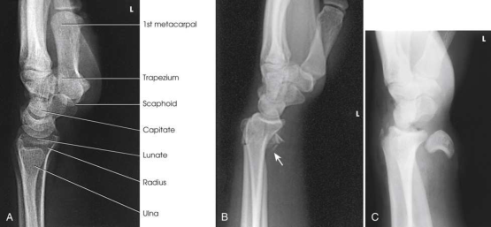
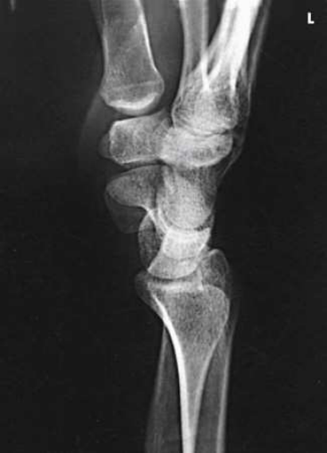
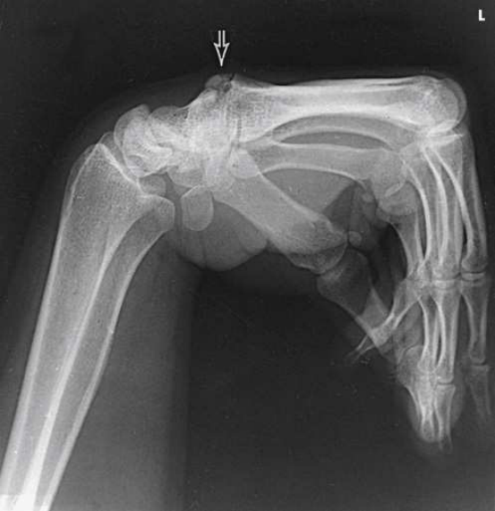
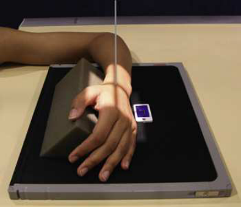

# Rx Pumn (Articulație Radiocarpiană) — Incidență de Profil (Lateral) — Latero-Medial (Merrill)

  📷 Radiografie Convențională (Rx)
  <strong>Actualizat:</strong> 2026-09-16
  <strong>Autor:</strong> Referință Merrill

---

-   __1. Rezumat Clinic & Indicații__

    ---

    === "Indicații Clinice"

        - Conform reperelor anatomice standard din tratat

    === "Ghid Național IRIS"

        !!! info "Referință Primară: Ghidul Național IRIS (Ordinul MS 1342/2012)"
            - **Capitol Ghid IRIS:** *Ghidul Național IRIS*
            - **Grad de Recomandare:** **De verificat pe indicație; fără grad atribuit automat**
            - **Nivel de Iradiere Estimată:** `De verificat pentru examinarea și populația selectate`

            [:octicons-search-16: Deschide Ghidul IRIS](../../iris.md){ .md-button .md-button--primary } [:material-open-in-new: Aplicația Oficială PWA](https://radiologie-pediatrica.ro/iris/){ .md-button target="_blank" rel="noopener" }
-   __2. Poziționare & Centrare Fascicul__

    ---

    - **Poziție Pacient:** se așază pacientul pe scaun la end de masa radiologică. Se instruiește pacientul să rest braț și Antebraț pe masa de examinare la ensure upper extremity este aliniat în same plane.; Se instruiește pacientul să se flectează Cot 90 grade la se rotește ulna la Incidență de Profil (lateral). se centrează receptorul de imagine la Pumn (Articulație Radiocarpiană) (radiocarpal) articulație. se ajustează Antebraț și Mână, placing humeral epicondyles și styloid processes superimposed și perpendicular pe receptorul de imagine (RI), astfel încât Pumn (Articulație Radiocarpiană) este în true Incidență de Profil (lateral) (Fig. 5.73). se efectuează ecranarea gonadelor cu șorț plumbat.
    - **Punct de Centrare Fascicul:** perpendicular pe Pumn (Articulație Radiocarpiană) articulație
    - **Distanță Focar-Film (DFF / SID):** Nespecificat în fragmentul extras; de verificat în sursă
    - **Comandă Respiratorie:** Conform reperelor anatomice standard din tratat

-   __3. Parametri Tehnici Expunere__

    ---

    | Parametru Tehnic | Valoare Configurare Generator / Tub |
    |:-----------------|:-------------------------------------|
    | **Tensiune Tub (kV)** | DE CONFIGURAT PE APARAT |
    | **Sarcină / Produs Curent-Timp (mAs)** | DE CONFIGURAT PE APARAT |
    | **Distanță Focar-Film (DFF / SID)** | Nespecificat în fragmentul extras; de verificat în sursă |
    | **Grilă Antidifuzoare (Bucky)** | DE CONFIGURAT PE APARAT |
    | **Dimensiune Focar** | DE CONFIGURAT PE APARAT |
    | **Camere de Ionizare AEC** | DE CONFIGURAT PE APARAT |
    | **Colimare Fascicul** | Adjust câmp de iradiere la 2.5 inches (6 cm) proximal și distal la Pumn (Articulație Radiocarpiană) articulație și 1 inch (2.5 cm) pe palmar și dorsal surfaces. Se plasează markerul de lateralitate în câmpul colimat. |
    | **Filtrare Tub** | DE CONFIGURAT PE APARAT |

-   __4. Criterii de Calitate & Reușită Imagine__

    ---

    - Criterii radiologice de calitate imaginii:
    - Colimare adecvată vizibilă și prezența markerului de lateralitate (D/S) plasat clear de anatomy de interest
    - distal radius și ulna, oase carpiene, și proximal half de oase metacarpiene
    - Superimposed distal radius și ulna
    - Superimposed oase metacarpiene
    - Bony detalii trabeculare osoase și surrounding soft tissues

-   __5. Protecție Radiologică (ALARA)__

    ---

    - Nespecificat în fragmentul extras; de verificat în sursă

!!! note "Observații Clinice & Tehnice"
    Burman et al. 17 suСested that Incidență de Profil (lateral) de scaphoid trebuie să fie obtained cu Pumn (Articulație Radiocarpiană) în palmar flexion because this action rotates bone anteriorly into dorsovolar poziție (Fig. 5.76). However, this poziție este valuable only when suficient flexion este permitted. Fiolle 18, 19 was first la describe small bony growth occurring pe dorsal surface de third articulații carpometacarpiene (CMC). He termed condition carpe bossu (carpal boss) și found that it este vizualizat best în Incidență de Profil (lateral) cu Pumn (Articulație Radiocarpiană) în palmar flexion (see Fig. 5.76).

### 🖼️ Imagini

<figure class="protocol-image-card" markdown>

<figcaption><strong>Merrill — pagina PDF 293, imaginea 1</strong> — Imagine din fragmentul sursă; asocierea necesită revizie.</figcaption>

</figure>

<figure class="protocol-image-card" markdown>

<figcaption><strong>Merrill — pagina PDF 294, imaginea 2</strong> — Imagine din fragmentul sursă; asocierea necesită revizie.</figcaption>

</figure>

<figure class="protocol-image-card" markdown>

<figcaption><strong>Merrill — pagina PDF 294, imaginea 3</strong> — Imagine din fragmentul sursă; asocierea necesită revizie.</figcaption>

</figure>

<figure class="protocol-image-card" markdown>

<figcaption><strong>Merrill — pagina PDF 295, imaginea 4</strong> — Imagine din fragmentul sursă; asocierea necesită revizie.</figcaption>

</figure>

=== "Ghid Rapid de Execuție"

    1. **Identificarea și verificarea pacientului:** verificare identitate, zonă de examinat, consimțământ conform procedurii și evaluarea posibilității unei sarcini, când este relevantă.
    2. **Pregătire:** îndepărtarea oricăror obiecte radiopace (bijuterii, agrafe, fermoare, proteze, pansamente dense).
    3. **Poziționare precisă:** alinierea receptorului de imagine și a tubului la distanța prescrisă (Nespecificat în fragmentul extras; de verificat în sursă).
    4. **Colimare strictă:** adaptarea fasciculului strict la regiunea de diagnostic pentru scăderea iradierii și reducerea radiației difuze.
    5. **Radioprotecție:** verificarea [politicii RX](../radioprotectie.md), cu măsuri distincte pentru pacient, personal și însoțitor.

## Surse de documentare

- [Merrill’s Atlas, 5. Upper Extremity, pagini PDF 292–295](../../assets/protocols/sources/a56d45c16829_Merrills_Atlas_of_Radiographic_Positioning__Procedures_3Vol_Set.pdf#page=292)

## Fragmente sursă traduse (referință tehnică)

### anatomy

lateral incidență de proximal oase metacarpiene, oase carpiene, și distal radius și ulna (Fig. 5.74). imagine obtained cu radial surface against
receptorul de imagine (Fig. 5.75) este vizualizat pentru comparison. This poziție poate also fie used la show anterior sau posterior displacement în suspiciune de fractură.

### collimation

• Adjust câmp de iradiere la 2.5 inches (6 cm) proximal și distal la wrist articulație și 1 inch (2.5 cm) pe palmar și dorsal surfaces.
Se plasează markerul de lateralitate în câmpul colimat.

### cr

• perpendicular pe wrist articulație

### criteria

Criterii radiologice de calitate imaginii:
• Colimare adecvată vizibilă și prezența markerului de lateralitate (D/S) plasat clear de anatomy de interest
• distal radius și ulna, oase carpiene, și proximal half de oase metacarpiene
• Superimposed distal radius și ulna
• Superimposed oase metacarpiene
• Bony detalii trabeculare osoase și surrounding soft tissues

### notes

Burman et al. 17 suСested that poziție de profil (lateral) de scaphoid trebuie să fie obtained cu wrist în palmar flexion because this
action rotates bone anteriorly into dorsovolar poziție (Fig. 5.76). However, this poziție este valuable only when suficient flexion este
permitted.
Fiolle 18, 19 was first la describe small bony growth occurring pe dorsal surface de third articulații carpometacarpiene (CMC). He termed condition
carpe bossu (carpal boss) și found that it este vizualizat best în poziție de profil (lateral) cu wrist în palmar flexion (see Fig. 5.76).

### part_pos

• Se instruiește pacientul să se flectează cot 90 grade la se rotește ulna la poziție de profil (lateral).
• se centrează receptorul de imagine la wrist (radiocarpal) articulație.
• se ajustează forearm și mână, placing humeral epicondyles și styloid processes superimposed și perpendicular pe receptorul de imagine (RI), so that
wrist este în true poziție de profil (lateral) (Fig. 5.73).
• se efectuează ecranarea gonadelor cu șorț plumbat.

### patient_pos

• se așază pacientul pe scaun la end de masa radiologică.
• Se instruiește pacientul să rest braț și forearm pe masa de examinare la ensure upper extremity este aliniat în same plane.

### tech

poziționat prin manufacturer sau department protocol pentru corect anatomy display orientation; raza centrală plate: 10 × 12 inches (24 × 30 cm) longitudinal

