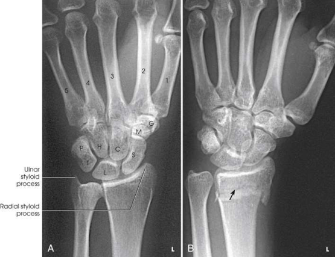

# Rx Pumn (Articulație Radiocarpiană) — Incidență Postero-Anterioară (PA) (Merrill)

  📷 Radiografie Convențională (Rx)
  <strong>Actualizat:</strong> 2026-09-16
  <strong>Autor:</strong> Referință Merrill

---

-   __1. Rezumat Clinic & Indicații__

    ---

    === "Indicații Clinice"

        - Conform reperelor anatomice standard din tratat

    === "Ghid Național IRIS"

        !!! info "Referință Primară: Ghidul Național IRIS (Ordinul MS 1342/2012)"
            - **Capitol Ghid IRIS:** *Aparat locomotor & Membru superior*
            - **Grad de Recomandare:** **Grad A**
            - **Nivel de Iradiere Estimată:** `Clasa 1 (Minimă < 0.01 mSv)`

            [:octicons-search-16: Deschide Ghidul IRIS](../../iris.md){ .md-button .md-button--primary } [:material-open-in-new: Aplicația Oficială PWA](https://radiologie-pediatrica.ro/iris/){ .md-button target="_blank" rel="noopener" }

-   __2. Poziționare & Centrare Fascicul__

    ---

    - **Poziție Pacient:** Se așază pacientul pe un scaun suficient de jos pentru a plasa axila în contact cu masa de examinare sau se ridică extremitatea la nivelul umărului, pe un suport adecvat. Această poziție plasează articulațiile umărului, cotului și pumnului în același plan, pentru a permite rotația la unghi drept a ulnei și radiusului pentru incidența de profil.; Se instruiește pacientul să sprijine antebrațul pe masa de examinare, apoi se centrează articulația pumnului (radiocarpiană) la nivelul receptorului de imagine. Articulația pumnului (radiocarpiană) se află la nivelul imediat distal față de procesul stiloid ulnar. Când este dificil să se determine localizarea exactă a articulației radiocarpiene din cauza tumefierii pumnului, se instruiește pacientul să flecteze ușor pumnul și se centrează receptorul de imagine la punctul de flexie. Când pumnul este în aparat gipsat sau atelă, punctul exact de centrare poate fi determinat prin comparație cu partea opusă. Se ajustează mâna și antebrațul pentru a fi paralele cu axa longitudinală a receptorului de imagine. Se arcuiește ușor mâna la nivelul articulațiilor metacarpofalangiene (MCF), prin flectarea falangelor, pentru a plasa pumnul în contact strâns cu receptorul de imagine (Fig. 5.69). Când este necesar, se plasează un suport sub falange pentru a le imobiliza. Se efectuează ecranarea gonadelor cu șorț plumbat.
    - **Punct de Centrare Fascicul:** Perpendicular pe regiunea mediocarpiană
    - **Distanță Focar-Film (DFF / SID):** Nespecificat în fragmentul extras; de verificat în sursă
    - **Comandă Respiratorie:** Conform reperelor anatomice standard din tratat

-   __3. Parametri Tehnici Expunere__

    ---

    | Parametru Tehnic | Valoare Configurare Generator / Tub |
    |:-----------------|:-------------------------------------|
    | **Tensiune Tub (kV)** | DE CONFIGURAT PE APARAT |
    | **Sarcină / Produs Curent-Timp (mAs)** | DE CONFIGURAT PE APARAT |
    | **Distanță Focar-Film (DFF / SID)** | Nespecificat în fragmentul extras; de verificat în sursă |
    | **Grilă Antidifuzoare (Bucky)** | DE CONFIGURAT PE APARAT |
    | **Dimensiune Focar** | DE CONFIGURAT PE APARAT |
    | **Camere de Ionizare AEC** | DE CONFIGURAT PE APARAT |
    | **Colimare Fascicul** | Ajustați câmpul de iradiere la 2.5 țoli (6 cm) proximal și distal față de articulația pumnului și la 1 țol (2.5 cm) pe laturi. Se plasează markerul de lateralitate în câmpul colimat. |
    | **Filtrare Tub** | DE CONFIGURAT PE APARAT |

-   __4. Criterii de Calitate & Reușită Imagine__

    ---

    - Criterii radiologice de calitate a imaginii:
    - Colimare adecvată vizibilă și prezența markerului de lateralitate (D/S) plasat în afara structurilor anatomice de interes
    - Radiusul și ulna distale, oasele carpiene și jumătatea proximală a oaselor metacarpiene
    - Fără flexia excesivă a falangelor, care să se suprapună și să ascundă oasele metacarpiene
    - Absența rotației anatomice (simetrie bilaterală perfectă) la nivelul oaselor carpiene, oaselor metacarpiene, radiusului și ulnei
    - Spații articulare radioulnare deschise
    - Detalii trabeculare osoase și țesuturile moi înconjurătoare

-   __5. Protecție Radiologică (ALARA)__

    ---

    - Nespecificat în fragmentul extras; de verificat în sursă

!!! note "Observații Clinice & Tehnice"
    Pentru a evidenția mai bine scafoidul și osul capitat, Dafner et al. 16 au recomandat angularea razei centrale atunci când pacientul este poziționat pentru radiografie PA. O angulare a razei centrale de 30 grade spre cot alungește scafoidul și osul capitat, în timp ce o angulare de 30 grade spre vârfurile degetelor alungește numai osul capitat.

### 🖼️ Imagini

<figure class="protocol-image-card" markdown>

<figcaption><strong>Merrill — pagina 289, imaginea 1</strong> — Imagine din fragmentul sursă; asocierea necesită revizie.</figcaption>

</figure>

=== "Ghid Rapid de Execuție"

    1. **Identificarea și verificarea pacientului:** verificare identitate, zonă de examinat, consimțământ conform procedurii și evaluarea posibilității unei sarcini, când este relevantă.
    2. **Pregătire:** îndepărtarea oricăror obiecte radiopace (bijuterii, agrafe, fermoare, proteze, pansamente dense).
    3. **Poziționare precisă:** alinierea receptorului de imagine și a tubului la distanța prescrisă (Nespecificat în fragmentul extras; de verificat în sursă).
    4. **Colimare strictă:** adaptarea fasciculului strict la regiunea de diagnostic pentru scăderea iradierii și reducerea radiației difuze.
    5. **Radioprotecție:** verificarea [politicii RX](../radioprotectie.md), cu măsuri distincte pentru pacient, personal și însoțitor.

## Surse de documentare

- [Merrill’s Atlas, 5. Upper Extremity, pagini 288–289](https://books.google.com/books/about/Merrill_s_Atlas_of_Radiographic_Position.html?id=BM0lEQAAQBAJ)
