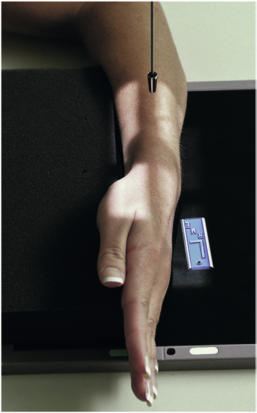
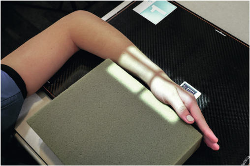
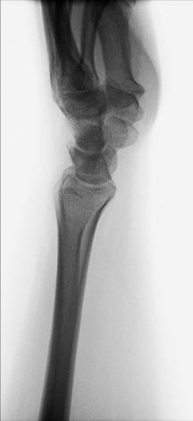
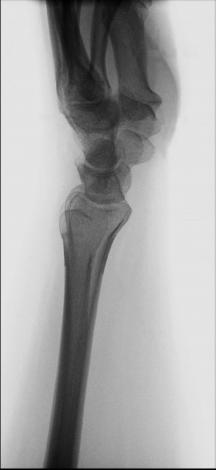

# Rx Pumn (Articulație Radiocarpiană) Incidență Latero-Medială

  📷 Radiografie Convențională (Rx)
  <strong>Actualizat:</strong> 2026-09-15
  <strong>Autor:</strong> Departamentul de Radiologie / Referință Bontrager

---

-   __1. Rezumat Clinic & Indicații__

    ---

    === "Indicații Clinice"

        - suspiciune de fractură sau luxație / subluxație articulară de distal radius sau ulna, specifically anteroposterior fragment displacements pentru Barton, Colles, sau Smith suspiciune de fractură
        - artroză / modificări degenerative articulare poate also fie evidențiat primarily în trapezium și first articulații carpometacarpiene (CMC)

    === "Ghid Național IRIS"

        !!! info "Referință Primară: Ghidul Național IRIS (Ordinul MS 1342/2012)"
            - **Capitol Ghid IRIS:** *Ghidul Național IRIS*
            - **Grad de Recomandare:** **De verificat pe indicație; fără grad atribuit automat**
            - **Nivel de Iradiere Estimată:** `De verificat pentru examinarea și populația selectate`

            [:octicons-search-16: Deschide Ghidul IRIS](../../iris.md){ .md-button .md-button--primary } [:material-open-in-new: Aplicația Oficială PWA](https://radiologie-pediatrica.ro/iris/){ .md-button target="_blank" rel="noopener" }
-   __2. Poziționare & Centrare Fascicul__

    ---

    - **Poziție Pacient:** Pacient: Seat pacient la end de table, cu braț și Antebraț resting pe masa de examinare. Place Pumn (Articulație Radiocarpiană) și Mână pe receptorul de imagine în thumbup Incidență de Profil (lateral). Umăr, Cot, și Pumn (Articulație Radiocarpiană) trebuie să fie pe same plan orizontal.; Regiune anatomică: Align și center Mână și Pumn (Articulație Radiocarpiană) la axa longitudinală de receptorul de imagine. Adjust Mână și Pumn (Articulație Radiocarpiană) into true Incidență de Profil (lateral), cu Degete Mână comfortably extins (Fig. 4.94); if support este needed la prevent mișcare, use radiolucent support block și săculeți cu nisip, și place block against extins Mână și Degete Mână (Fig. 4.95).
    - **Punct de Centrare Fascicul:** perpendicular pe receptorul de imagine, orientat la aria medio-carpiană
    - **Distanță Focar-Film (DFF / SID):** 100 cm
    - **Comandă Respiratorie:** Apnee pe durata expunerii (sau conform cooperării pacientului)

-   __3. Parametri Tehnici Expunere__

    ---

    | Parametru Tehnic | Valoare Configurare Generator / Tub |
    |:-----------------|:-------------------------------------|
    | **Tensiune Tub (kV)** | 60 kV |
    | **Sarcină / Produs Curent-Timp (mAs)** | DE CONFIGURAT PE APARAT |
    | **Distanță Focar-Film (DFF / SID)** | 100 cm |
    | **Grilă Antidifuzoare (Bucky)** | Fără grilă (expunere directă) |
    | **Dimensiune Focar** | Focar Mic (0.6 mm) |
    | **Camere de Ionizare AEC** | DE CONFIGURAT PE APARAT |
    | **Colimare Fascicul** | Field Size Collimate pe four sides, including distal radius și ulna și metacarpal area. Routine PA PA oblic lateral Fig. 4.94 Part poziție—lateral Pumn (Articulație Radiocarpiană) Fig. 4.95 pacient poziție—lateral Pumn (Articulație Radiocarpiană) cu support. Fig. 4.96 Incidență de Profil (lateral) de stâng Pumn (Articulație Radiocarpiană). 1st metacarpal Scaphoid Radius Trapezium Capitate Ulna Fig. 4.97 lateral Pumn (Articulație Radiocarpiană). |
    | **Filtrare Tub** | Totală ≥ 2.5 mm Al echivalent |

-   __4. Criterii de Calitate & Reușită Imagine__

    ---

    - distal radius și ulna, oase carpiene, și la least midmetacarpal area sunt vizibil. poziție:
    - axa longitudinală de Mână, Pumn (Articulație Radiocarpiană), și Antebraț trebuie să fie aliniat cu axa longitudinală de receptorul de imagine.
    - True Incidență de Profil (lateral) este evidenced prin: ulnar cap trebuie să fie superimposed over distal radius; proximal second through fifth oase metacarpiene toate trebuie să appear aliniat și superimposed (Figs. 4.96 și 4.97).
    - raza centrală și center de collimation field size trebuie să fie la midcarpal region. expunere:
    - optim receptorul de imagine expunere și contrast cu fără mișcare evidențiază clear, net bony ‘trabecular markings și părți moi, such ca margins de pertinent fat pads de Pumn (Articulație Radiocarpiană) și margini de distal ulna, seen through superimposed radius.

-   __5. Protecție Radiologică (ALARA)__

    ---

    - Ecranare gonadică și a organelor radiosensibile conform procedurilor locale de radioprotecție ALARA.
    - Colimare strictă la aria de interes pentru limitarea radiației difuze.
    - Verificarea posibilității unei sarcini la pacientele de vârstă fertilă înainte de expunere.

### 🖼️ Imagini

<figure class="protocol-image-card" markdown>

<figcaption><strong>Fig. 4.94 Part poziție—lateral Pumn (Articulație Radiocarpiană)</strong> — Poziționare pacient conform Ghidului Bontrager (Fig. 4.94 Part poziție—lateral wrist)</figcaption>

</figure>

<figure class="protocol-image-card" markdown>

<figcaption><strong>Fig. 4.95 pacient poziție—lateral Pumn (Articulație Radiocarpiană) cu support.</strong> — Aspect radiografic de referință conform Ghidului Bontrager (Fig. 4.95 pacient poziție—lateral wrist cu support.)</figcaption>

</figure>

<figure class="protocol-image-card" markdown>

<figcaption><strong>Fig. 4.96 Incidență de Profil (lateral)</strong> — Aspect radiografic de referință conform Ghidului Bontrager (Fig. 4.96 lateral incidență)</figcaption>

</figure>

<figure class="protocol-image-card" markdown>

<figcaption><strong>Fig. 4.97 lateral Pumn (Articulație Radiocarpiană).</strong> — Aspect radiografic de referință conform Ghidului Bontrager (Fig. 4.97 lateral wrist.)</figcaption>

</figure>

=== "Ghid Rapid de Execuție"

    1. **Identificarea și verificarea pacientului:** verificare identitate, zonă de examinat, consimțământ conform procedurii și evaluarea posibilității unei sarcini, când este relevantă.
    2. **Pregătire:** îndepărtarea oricăror obiecte radiopace (bijuterii, agrafe, fermoare, proteze, pansamente dense).
    3. **Poziționare precisă:** alinierea receptorului de imagine și a tubului la distanța prescrisă (100 cm).
    4. **Colimare strictă:** adaptarea fasciculului strict la regiunea de diagnostic pentru scăderea iradierii și reducerea radiației difuze.
    5. **Radioprotecție:** verificarea [politicii RX](../radioprotectie.md), cu măsuri distincte pentru pacient, personal și însoțitor.

## Surse de documentare

- [Bontrager's Textbook of Radiographic Positioning (Ed. 9/10), Pagina 167](https://www.elsevier.com/books/textbook-of-radiographic-positioning-and-related-anatomy/lampignano/978-0-323-65367-1)
