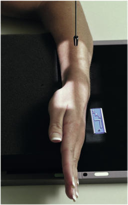
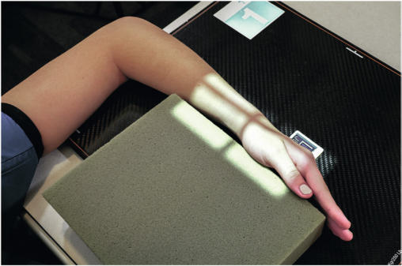
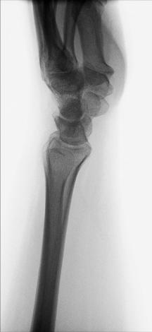
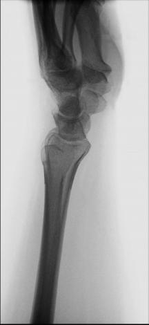

# Rx Pumn (Articulație Radiocarpiană) Incidență Latero-Medială

  📷 Radiografie Convențională (Rx)
  <strong>Actualizat:</strong> 2026-09-15
  <strong>Autor:</strong> Departamentul de Radiologie / Referință Bontrager

---

-   __1. Rezumat Clinic & Indicații__

    ---

    === "Indicații Clinice"

        - suspiciune de fractură sau luxație / subluxație articulară a radiusului sau ulnei distale, în special deplasări anteroposterioare ale fragmentelor în suspiciunea de fractură Barton, Colles sau Smith
        - artroza / modificările degenerative articulare pot fi evidențiate și în principal la nivelul trapezului și al primei articulații carpometacarpiene (CMC)

    === "Ghid Național IRIS"

        !!! info "Referință Primară: Ghidul Național IRIS (Ordinul MS 1342/2012)"
            - **Capitol Ghid IRIS:** *Aparat locomotor & Membru superior*
            - **Grad de Recomandare:** **Grad A**
            - **Nivel de Iradiere Estimată:** `Clasa 1 (Minimă < 0.01 mSv)`

            [:octicons-search-16: Deschide Ghidul IRIS](../../iris.md){ .md-button .md-button--primary } [:material-open-in-new: Aplicația Oficială PWA](https://radiologie-pediatrica.ro/iris/){ .md-button target="_blank" rel="noopener" }

-   __2. Poziționare & Centrare Fascicul__

    ---

    - **Poziție Pacient:** Pacient: Așezați pacientul la capătul mesei, cu brațul și antebrațul sprijinite pe masa de examinare. Plasați pumnul (articulația radiocarpiană) și mâna pe receptorul de imagine în incidență de profil, cu policele în sus. Umărul, cotul și pumnul (articulația radiocarpiană) trebuie să se afle în același plan orizontal.; Regiune anatomică: Aliniați și centrați mâna și pumnul (articulația radiocarpiană) pe axa longitudinală a receptorului de imagine. Ajustați mâna și pumnul (articulația radiocarpiană) în adevărată incidență de profil, cu degetele mâinii confortabil extinse (Fig. 4.94); dacă este necesar un suport pentru prevenirea mișcării, utilizați un bloc radiotransparent și săculeți cu nisip și plasați blocul împotriva mâinii și degetelor mâinii extinse (Fig. 4.95).
    - **Punct de Centrare Fascicul:** Perpendicular pe receptorul de imagine, orientat spre aria mediocarpiană
    - **Distanță Focar-Film (DFF / SID):** 100 cm
    - **Comandă Respiratorie:** Apnee pe durata expunerii (sau conform cooperării pacientului)

-   __3. Parametri Tehnici Expunere__

    ---

    | Parametru Tehnic | Valoare Configurare Generator / Tub |
    |:-----------------|:-------------------------------------|
    | **Tensiune Tub (kV)** | 60 kV |
    | **Sarcină / Produs Curent-Timp (mAs)** | DE CONFIGURAT PE APARAT |
    | **Distanță Focar-Film (DFF / SID)** | 100 cm |
    | **Grilă Antidifuzoare (Bucky)** | Fără grilă (expunere directă) |
    | **Dimensiune Focar** | Focar Mic (0.6 mm) |
    | **Camere de Ionizare AEC** | DE CONFIGURAT PE APARAT |
    | **Colimare Fascicul** | Dimensiunea câmpului: se colimează pe cele patru laturi, incluzând porțiunile distale ale radiusului și ulnei, precum și regiunea metacarpiană. Incidențe de rutină: PA, PA oblică, profil. Fig. 4.94 Poziționarea regiunii — pumnul (articulația radiocarpiană) de profil. Fig. 4.95 Poziționarea pacientului — pumnul (articulația radiocarpiană) de profil, cu suport. Fig. 4.96 Incidență de profil a pumnului (articulației radiocarpiene) stâng. Metacarpianul 1; scafoid; radius; trapez; capitat; ulnă. Fig. 4.97 Pumnul (articulația radiocarpiană) de profil. |
    | **Filtrare Tub** | Totală ≥ 2.5 mm Al echivalent |

-   __4. Criterii de Calitate & Reușită Imagine__

    ---

    - radiusul și ulna distale, oasele carpiene și cel puțin regiunea mediometacarpiană sunt vizibile. poziție:
    - axa longitudinală a mâinii, pumnului și antebrațului trebuie să fie aliniată cu axa longitudinală a receptorului de imagine.
    - Adevărata incidență de profil este evidențiată prin: capul ulnar trebuie să fie suprapus peste radiusul distal; oasele metacarpiene proximale de la al doilea până la al cincilea trebuie să apară toate aliniate și suprapuse (Figs. 4.96 și 4.97).
    - raza centrală și centrul dimensiunii câmpului de colimare trebuie să fie la nivelul regiunii mediocarpiene. expunere:
    - expunerea și contrastul optime ale receptorului de imagine, fără mișcare, evidențiază clar, net, reperele trabeculare osoase și părțile moi, cum ar fi contururile pertinentelor pernițe adipoase ale Pumnului (Articulației Radiocarpiene) și marginile ulnei distale, vizibile prin radiusul suprapus.

-   __5. Protecție Radiologică (ALARA)__

    ---

    - Ecranare gonadică și a organelor radiosensibile conform procedurilor locale de radioprotecție ALARA.
    - Colimare strictă la aria de interes pentru limitarea radiației difuze.
    - Verificarea posibilității unei sarcini la pacientele de vârstă fertilă înainte de expunere.

### 🖼️ Imagini

<figure class="protocol-image-card" markdown>

<figcaption><strong>Fig. 4.94 Poziționarea segmentului—profil Pumn (Articulație Radiocarpiană)</strong> — Poziționarea pacientului conform Ghidului Bontrager (Fig. 4.94 Poziționarea segmentului—profil Pumn)</figcaption>

</figure>

<figure class="protocol-image-card" markdown>

<figcaption><strong>Fig. 4.95 Poziționarea pacientului—profil Pumn (Articulație Radiocarpiană) cu suport.</strong> — Aspect radiografic de referință conform Ghidului Bontrager (Fig. 4.95 Poziționarea pacientului—profil Pumn cu suport.)</figcaption>

</figure>

<figure class="protocol-image-card" markdown>

<figcaption><strong>Fig. 4.96 Incidență de profil (laterală)</strong> — Aspect radiografic de referință conform Ghidului Bontrager (Fig. 4.96 incidență de profil)</figcaption>

</figure>

<figure class="protocol-image-card" markdown>

<figcaption><strong>Fig. 4.97 Pumn (Articulație Radiocarpiană) în incidență de profil.</strong> — Aspect radiografic de referință conform Ghidului Bontrager (Fig. 4.97 Pumn în incidență de profil.)</figcaption>

</figure>

=== "Ghid Rapid de Execuție"

    1. **Identificarea și verificarea pacientului:** verificare identitate, zonă de examinat, consimțământ conform procedurii și evaluarea posibilității unei sarcini, când este relevantă.
    2. **Pregătire:** îndepărtarea oricăror obiecte radiopace (bijuterii, agrafe, fermoare, proteze, pansamente dense).
    3. **Poziționare precisă:** alinierea receptorului de imagine și a tubului la distanța prescrisă (100 cm).
    4. **Colimare strictă:** adaptarea fasciculului strict la regiunea de diagnostic pentru scăderea iradierii și reducerea radiației difuze.
    5. **Radioprotecție:** verificarea [politicii RX](../radioprotectie.md), cu măsuri distincte pentru pacient, personal și însoțitor.

## Surse de documentare

- [Bontrager's Textbook of Radiographic Positioning (Ed. 9/10), Pagina 167](https://www.elsevier.com/books/textbook-of-radiographic-positioning-and-related-anatomy/lampignano/978-0-323-65367-1)
