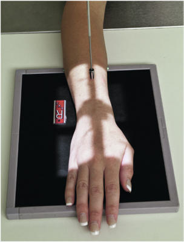
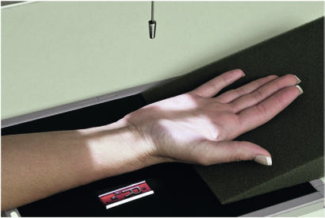
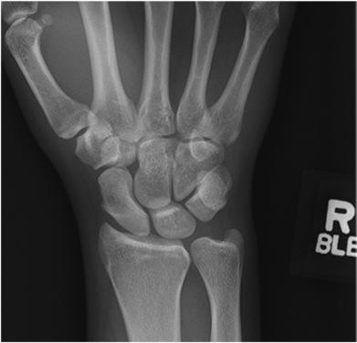
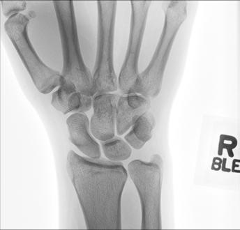

# Rx Pumn (Articulație Radiocarpiană) PA (AP) PROJECTION

  📷 Radiografie Convențională (Rx)
  <strong>Actualizat:</strong> 2026-09-15
  <strong>Autor:</strong> Departamentul de Radiologie / Referință Bontrager

---

-   __1. Rezumat Clinic & Indicații__

    ---

    === "Indicații Clinice"

        - suspiciune de fractură of distal radius or ulna, isolated suspiciune de fractură of radial or ulnar styloid processes, and suspiciune de fractură of individual carpal bones
        - Pathologic processes, such as osteomielită / leziuni inflamatorii osoase and arthritis

    === "Ghid Național IRIS"

        !!! info "Referință Primară: Ghidul Național IRIS (Ordinul MS 1342/2012)"
            - **Capitol Ghid IRIS:** *Ghidul Național IRIS*
            - **Grad de Recomandare:** **De verificat pe indicație; fără grad atribuit automat**
            - **Nivel de Iradiere Estimată:** `De verificat pentru examinarea și populația selectate`

            [:octicons-search-16: Deschide Ghidul IRIS](../../iris.md){ .md-button .md-button--primary } [:material-open-in-new: Aplicația Oficială PWA](https://radiologie-pediatrica.ro/iris/){ .md-button target="_blank" rel="noopener" }
-   __2. Poziționare & Centrare Fascicul__

    ---

    - **Poziție Pacient:** Pacient: Seat patient at end of table with Mână and Antebraț extended. Drop Umăr so that Umăr, Cot, and Pumn (Articulație Radiocarpiană) are on same horizontal plane.; Regiune anatomică: Align and center long axis of Mână and Pumn (Articulație Radiocarpiană) to IR, with carpal area centered to CR. With Mână pronated, arch Mână slightly to place Pumn (Articulație Radiocarpiană) and carpal area in close contact with IR (Fig. 4.86).
    - **Punct de Centrare Fascicul:** perpendicular to IR, directed to aria medio-carpiană
    - **Distanță Focar-Film (DFF / SID):** 100 cm
    - **Comandă Respiratorie:** Apnee pe durata expunerii (sau conform cooperării pacientului)

-   __3. Parametri Tehnici Expunere__

    ---

    | Parametru Tehnic | Valoare Configurare Generator / Tub |
    |:-----------------|:-------------------------------------|
    | **Tensiune Tub (kV)** | 55 kV |
    | **Sarcină / Produs Curent-Timp (mAs)** | DE CONFIGURAT PE APARAT |
    | **Distanță Focar-Film (DFF / SID)** | 100 cm |
    | **Grilă Antidifuzoare (Bucky)** | Fără grilă (expunere directă) |
    | **Dimensiune Focar** | Focar Mic (0.6 mm) |
    | **Camere de Ionizare AEC** | DE CONFIGURAT PE APARAT |
    | **Colimare Fascicul** | Field Size Collimate to outer edges of Mână and Pumn (Articulație Radiocarpiană). Alternative AP An AP Pumn (Articulație Radiocarpiană) may be taken, with Mână slightly arched to place Pumn (Articulație Radiocarpiană) and carpals in close contact with IR, to demonstrate intercarpal spaces and Pumn (Articulație Radiocarpiană) joint better and to place the intercarpal spaces more parallel to the divergent rays (Fig. 4.87). This Pumn (Articulație Radiocarpiană) projection is good for visualizing the carpals if the patient can assume this position easily. Pumn (Articulație Radiocarpiană) ROUTINE PA PA oblique Lateral |
    | **Filtrare Tub** | Totală ≥ 2.5 mm Al echivalent |

-   __4. Criterii de Calitate & Reușită Imagine__

    ---

    - Midmetacarpals and proximal metacarpals; carpals; distal radius, ulna, and associated joints; and pertinent soft tissues of the Pumn (Articulație Radiocarpiană) joint, such as fat pads and fat stripes, are visible.
    - All the intercarpal spaces do not appear open because of irregular shapes that result in overlapping (Figs. 4.88 and 4.89). Position:
    - Long axis of the Mână, Pumn (Articulație Radiocarpiană), and Antebraț is aligned with IR.
    - True PA is evidenced by equal concavity shapes are on each side of the shafts of the proximal metacarpals; nearequal distances exist among the proximal metacarpals; separation of the distal radius and ulna is present except for possible minimal superimposition at the distal radioulnar joint.
    - CR and center of collimation field size should be to the aria medio-carpiană. Exposure:
    - Optimal image receptor exposure and contrast with no motion should visualize soft tissue, such as pertinent fat pads, and sharp, bony margins of the carpals and clear trabecular markings. Fig. 4.86 PA Pumn (Articulație Radiocarpiană). Fig. 4.87 Alternative AP Pumn (Articulație Radiocarpiană). Fig. 4.88 PA Pumn (Articulație Radiocarpiană). Trapezoid Trapezium Capitate Scaphoid Radius Pisiform Hamate Triquetrum Lunate Ulna Fig. 4.89 PA of right Pumn (Articulație Radiocarpiană).

-   __5. Protecție Radiologică (ALARA)__

    ---

    - Ecranare gonadică și a organelor radiosensibile conform procedurilor locale de radioprotecție ALARA.
    - Colimare strictă la aria de interes pentru limitarea radiației difuze.
    - Verificarea posibilității unei sarcini la pacientele de vârstă fertilă înainte de expunere.

### 🖼️ Imagini

<figure class="protocol-image-card" markdown>

<figcaption><strong>Fig. 4.86 PA Pumn (Articulație Radiocarpiană).</strong> — Poziționare pacient conform Ghidului Bontrager (Fig. 4.86 PA wrist.)</figcaption>

</figure>

<figure class="protocol-image-card" markdown>

<figcaption><strong>Fig. 4.87 Alternative AP Pumn (Articulație Radiocarpiană).</strong> — Aspect radiografic de referință conform Ghidului Bontrager (Fig. 4.87 Alternative AP wrist.)</figcaption>

</figure>

<figure class="protocol-image-card" markdown>

<figcaption><strong>Fig. 4.88 PA Pumn (Articulație Radiocarpiană).</strong> — Aspect radiografic de referință conform Ghidului Bontrager (Fig. 4.88 PA wrist.)</figcaption>

</figure>

<figure class="protocol-image-card" markdown>

<figcaption><strong>Fig. 4.89 PA of right Pumn (Articulație Radiocarpiană).</strong> — Aspect radiografic de referință conform Ghidului Bontrager (Fig. 4.89 PA of right wrist.)</figcaption>

</figure>

=== "Ghid Rapid de Execuție"

    1. **Identificarea și verificarea pacientului:** verificare identitate, zonă de examinat, consimțământ conform procedurii și evaluarea posibilității unei sarcini, când este relevantă.
    2. **Pregătire:** îndepărtarea oricăror obiecte radiopace (bijuterii, agrafe, fermoare, proteze, pansamente dense).
    3. **Poziționare precisă:** alinierea receptorului de imagine și a tubului la distanța prescrisă (100 cm).
    4. **Colimare strictă:** adaptarea fasciculului strict la regiunea de diagnostic pentru scăderea iradierii și reducerea radiației difuze.
    5. **Radioprotecție:** verificarea [politicii RX](../radioprotectie.md), cu măsuri distincte pentru pacient, personal și însoțitor.

## Surse de documentare

- [Bontrager's Textbook of Radiographic Positioning (Ed. 9/10), Pagina 165](https://www.elsevier.com/books/textbook-of-radiographic-positioning-and-related-anatomy/lampignano/978-0-323-65367-1)
