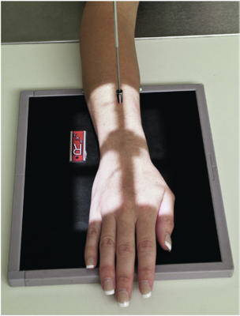
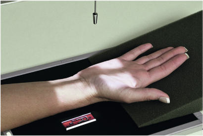
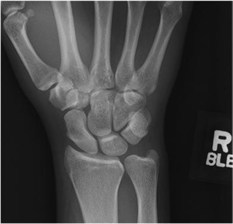
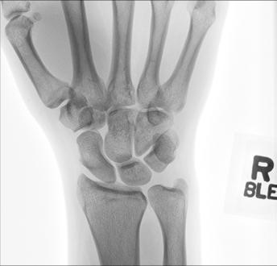

# Rx Pumn (Articulație Radiocarpiană) Incidență PA (AP)

  📷 Radiografie Convențională (Rx)
  <strong>Actualizat:</strong> 2026-09-15
  <strong>Autor:</strong> Departamentul de Radiologie / Referință Bontrager

---

-   __1. Rezumat Clinic & Indicații__

    ---

    === "Indicații Clinice"

        - Suspiciune de fractură a radiusului sau ulnei distale, suspiciune izolată de fractură a proceselor stiloide radial sau ulnar și suspiciune de fractură a oaselor carpiene individuale
        - Procese patologice, cum ar fi osteomielita / leziuni inflamatorii osoase și artrita

    === "Ghid Național IRIS"

        !!! info "Referință Primară: Ghidul Național IRIS (Ordinul MS 1342/2012)"
            - **Capitol Ghid IRIS:** *Aparat locomotor & Membru superior*
            - **Grad de Recomandare:** **Grad A**
            - **Nivel de Iradiere Estimată:** `Clasa 1 (Minimă < 0.01 mSv)`

            [:octicons-search-16: Deschide Ghidul IRIS](../../iris.md){ .md-button .md-button--primary } [:material-open-in-new: Aplicația Oficială PWA](https://radiologie-pediatrica.ro/iris/){ .md-button target="_blank" rel="noopener" }

-   __2. Poziționare & Centrare Fascicul__

    ---

    - **Poziție Pacient:** Pacient: așezați pacientul la capătul mesei, cu Mâna și Antebrațul extinse. Coborâți Umărul astfel încât Umărul, Cotul și Pumnul (Articulația Radiocarpiană) să fie în același plan orizontal.; Regiune anatomică: aliniați și centrați axa longitudinală a Mâinii și Pumnului (Articulației Radiocarpiene) la receptorul de imagine, cu regiunea carpiană centrată pe raza centrală. Cu Mâna în pronație, arcuiți ușor Mâna pentru a plasa Pumnul (Articulația Radiocarpiană) și regiunea carpiană în contact strâns cu receptorul de imagine (Fig. 4.86).
    - **Punct de Centrare Fascicul:** Perpendicular pe receptorul de imagine, orientat spre aria mediocarpiană
    - **Distanță Focar-Film (DFF / SID):** 100 cm
    - **Comandă Respiratorie:** Apnee pe durata expunerii (sau conform cooperării pacientului)

-   __3. Parametri Tehnici Expunere__

    ---

    | Parametru Tehnic | Valoare Configurare Generator / Tub |
    |:-----------------|:-------------------------------------|
    | **Tensiune Tub (kV)** | 55 kV |
    | **Sarcină / Produs Curent-Timp (mAs)** | DE CONFIGURAT PE APARAT |
    | **Distanță Focar-Film (DFF / SID)** | 100 cm |
    | **Grilă Antidifuzoare (Bucky)** | Fără grilă (expunere directă) |
    | **Dimensiune Focar** | Focar Mic (0.6 mm) |
    | **Camere de Ionizare AEC** | DE CONFIGURAT PE APARAT |
    | **Colimare Fascicul** | Dimensiunea câmpului: se colimează la marginile externe ale Mâinii și Pumnului (Articulației Radiocarpiene). AP alternativă AP Pumnul (Articulația Radiocarpiană) poate fi efectuat, cu Mâna ușor arcuită pentru a plasa Pumnul (Articulația Radiocarpiană) și oasele carpiene în contact strâns cu receptorul de imagine, pentru a evidenția mai bine spațiile intercarpiene și articulația Pumnului (Articulației Radiocarpiene) și pentru a plasa spațiile intercarpiene mai paralel cu razele divergente (Fig. 4.87). Această incidență a Pumnului (Articulației Radiocarpiene) este utilă pentru vizualizarea oaselor carpiene dacă pacientul poate adopta cu ușurință această poziție. Pumnul (Articulația Radiocarpiană) DE RUTINĂ PA PA oblic lateral |
    | **Filtrare Tub** | Totală ≥ 2.5 mm Al echivalent |

-   __4. Criterii de Calitate & Reușită Imagine__

    ---

    - Porțiunile mijlocii ale metacarpienelor și oasele metacarpiene proximale; oasele carpiene; radiusul distal, ulna distală și articulațiile asociate; precum și țesuturile moi pertinente ale articulației Pumnului (Articulației Radiocarpiene), cum ar fi pernițele și fâșiile adipoase, sunt vizibile.
    - toate spațiile intercarpiene nu apar deschise din cauza formelor neregulate care determină suprapunerea (Fig. 4.88 și 4.89). poziție:
    - axa longitudinală a Mâinii, Pumnului (Articulației Radiocarpiene) și Antebrațului este aliniată cu receptorul de imagine.
    - Incidența PA adevărată este evidențiată prin forme cu concavitate egală pe fiecare parte a diafizelor oaselor metacarpiene proximale; există distanțe inegale între oasele metacarpiene proximale; separarea radiusului distal de ulna distală este prezentă, cu excepția unei posibile suprapuneri minime la articulația radioulnară distală.
    - Raza centrală și centrul câmpului de colimare trebuie să fie la nivelul regiunii mediocarpiene. Expunere:
    - expunerea și contrastul optime ale receptorului de imagine, fără mișcare, trebuie să vizualizeze părțile moi, cum ar fi pernițele adipoase pertinente, precum și marginile osoase nete ale oaselor carpiene și reperele trabeculare clare. Fig. 4.86 Pumn (Articulație Radiocarpiană) PA. Fig. 4.87 Pumn (Articulație Radiocarpiană) AP alternativă. Fig. 4.88 Pumn (Articulație Radiocarpiană) PA. Trapezoid Trapez Capitat Scafoid Radius Pisiform Hamatus Triquetrum Semilunar Ulna Fig. 4.89 Pumn (Articulație Radiocarpiană) drept PA.

-   __5. Protecție Radiologică (ALARA)__

    ---

    - Ecranare gonadică și a organelor radiosensibile conform procedurilor locale de radioprotecție ALARA.
    - Colimare strictă la aria de interes pentru limitarea radiației difuze.
    - Verificarea posibilității unei sarcini la pacientele de vârstă fertilă înainte de expunere.

### 🖼️ Imagini

<figure class="protocol-image-card" markdown>

<figcaption><strong>Fig. 4.86 Pumn (Articulație Radiocarpiană) PA.</strong> — Poziționarea pacientului conform Ghidului Bontrager (Fig. 4.86 Pumn PA.)</figcaption>

</figure>

<figure class="protocol-image-card" markdown>

<figcaption><strong>Fig. 4.87 Pumn (Articulație Radiocarpiană) AP alternativă.</strong> — Aspect radiografic de referință conform Ghidului Bontrager (Fig. 4.87 Pumn AP alternativ.)</figcaption>

</figure>

<figure class="protocol-image-card" markdown>

<figcaption><strong>Fig. 4.88 Pumn (Articulație Radiocarpiană) PA.</strong> — Aspect radiografic de referință conform Ghidului Bontrager (Fig. 4.88 Pumn PA.)</figcaption>

</figure>

<figure class="protocol-image-card" markdown>

<figcaption><strong>Fig. 4.89 Pumn drept (Articulație Radiocarpiană) PA.</strong> — Aspect radiografic de referință conform Ghidului Bontrager (Fig. 4.89 Pumn drept PA.)</figcaption>

</figure>

=== "Ghid Rapid de Execuție"

    1. **Identificarea și verificarea pacientului:** verificare identitate, zonă de examinat, consimțământ conform procedurii și evaluarea posibilității unei sarcini, când este relevantă.
    2. **Pregătire:** îndepărtarea oricăror obiecte radiopace (bijuterii, agrafe, fermoare, proteze, pansamente dense).
    3. **Poziționare precisă:** alinierea receptorului de imagine și a tubului la distanța prescrisă (100 cm).
    4. **Colimare strictă:** adaptarea fasciculului strict la regiunea de diagnostic pentru scăderea iradierii și reducerea radiației difuze.
    5. **Radioprotecție:** verificarea [politicii RX](../radioprotectie.md), cu măsuri distincte pentru pacient, personal și însoțitor.

## Surse de documentare

- [Bontrager's Textbook of Radiographic Positioning (Ed. 9/10), Pagina 165](https://www.elsevier.com/books/textbook-of-radiographic-positioning-and-related-anatomy/lampignano/978-0-323-65367-1)
