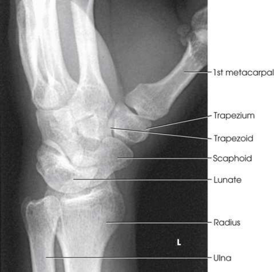
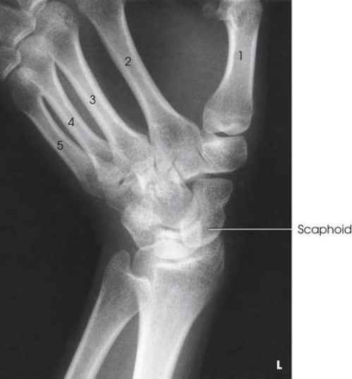
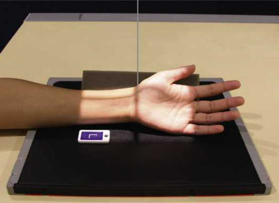
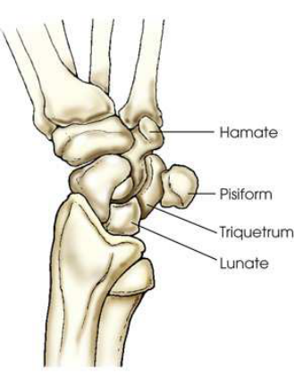
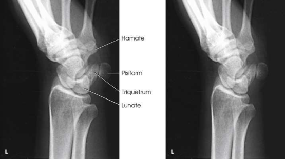
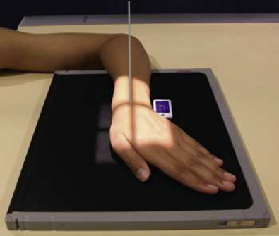

# Rx Pumn (Articulație Radiocarpiană) — Oblică Postero-Anterioară (PA) — Rotație Externă (Laterală) (Merrill)

  📷 Radiografie Convențională (Rx)
  <strong>Actualizat:</strong> 2026-09-16
  <strong>Autor:</strong> Referință Merrill

---

-   __1. Rezumat Clinic & Indicații__

    ---

    === "Indicații Clinice"

        - Conform reperelor anatomice standard din tratat

    === "Ghid Național IRIS"

        !!! info "Referință Primară: Ghidul Național IRIS (Ordinul MS 1342/2012)"
            - **Capitol Ghid IRIS:** *Ghidul Național IRIS*
            - **Grad de Recomandare:** **De verificat pe indicație; fără grad atribuit automat**
            - **Nivel de Iradiere Estimată:** `De verificat pentru examinarea și populația selectate`

            [:octicons-search-16: Deschide Ghidul IRIS](../../iris.md){ .md-button .md-button--primary } [:material-open-in-new: Aplicația Oficială PWA](https://radiologie-pediatrica.ro/iris/){ .md-button target="_blank" rel="noopener" }
-   __2. Poziționare & Centrare Fascicul__

    ---

    - **Poziție Pacient:** se așază pacientul pe scaun la end de masa radiologică, placing axilla în contact cu masa de examinare. se așază pacientul pe scaun la end de masa radiologică. Se instruiește pacientul să rest Antebraț pe masa de examinare în Decubit dorsal poziție.; Rest palmar surface de Pumn (Articulație Radiocarpiană) pe receptorul de imagine. se ajustează receptorul de imagine so that its center point este under scaphoid when Pumn (Articulație Radiocarpiană) este rotit de la în pronație poziție. de la în pronație poziție, se rotește Pumn (Articulație Radiocarpiană) laterally (externally) until plan coronal forms angle de approximately 45 grade cu plane de receptorul de imagine. pentru exact positioning și la ensure duplication în follow-up examinations, place a 45-grade foam wedge under ridicat side de Pumn (Articulație Radiocarpiană). se extinde Pumn (Articulație Radiocarpiană) slightly, și if falange do nu touch masa de examinare, support them în place (Fig. 5.77). When scaphoid este under examination, se ajustează Pumn (Articulație Radiocarpiană) în ulnar deviation. Place săculeți cu nisip across Antebraț. se efectuează ecranarea gonadelor cu șorț plumbat. Place receptorul de imagine under Pumn (Articulație Radiocarpiană), și center it la dorsal surface de Pumn (Articulație Radiocarpiană). se rotește Pumn (Articulație Radiocarpiană) medially (internally) until plan coronal forms angle de approximately 45 grade la plane de receptorul de imagine (Fig. 5.80). se efectuează ecranarea gonadelor cu șorț plumbat.
    - **Punct de Centrare Fascicul:** perpendicular pe midcarpal area; it enters just distal la radius perpendicular pe midcarpal area; it enters anterior surface de Pumn (Articulație Radiocarpiană) midway între its medial și lateral margini
    - **Distanță Focar-Film (DFF / SID):** Nespecificat în fragmentul extras; de verificat în sursă
    - **Comandă Respiratorie:** Conform reperelor anatomice standard din tratat

-   __3. Parametri Tehnici Expunere__

    ---

    | Parametru Tehnic | Valoare Configurare Generator / Tub |
    |:-----------------|:-------------------------------------|
    | **Tensiune Tub (kV)** | DE CONFIGURAT PE APARAT |
    | **Sarcină / Produs Curent-Timp (mAs)** | DE CONFIGURAT PE APARAT |
    | **Distanță Focar-Film (DFF / SID)** | Nespecificat în fragmentul extras; de verificat în sursă |
    | **Grilă Antidifuzoare (Bucky)** | DE CONFIGURAT PE APARAT |
    | **Dimensiune Focar** | DE CONFIGURAT PE APARAT |
    | **Camere de Ionizare AEC** | DE CONFIGURAT PE APARAT |
    | **Colimare Fascicul** | Adjust câmp de iradiere la 2.5 inches (6 cm) proximal și distal la Pumn (Articulație Radiocarpiană) articulație și 1 inch (2.5 cm) pe sides. Se plasează markerul de lateralitate în câmpul colimat. Adjust câmp de iradiere la 2.5 inches (6 cm) proximal și distal la Pumn (Articulație Radiocarpiană) articulație și 1 inch (2.5 cm) pe sides. Se plasează markerul de lateralitate în câmpul colimat. |
    | **Filtrare Tub** | DE CONFIGURAT PE APARAT |

-   __4. Criterii de Calitate & Reușită Imagine__

    ---

    - Criterii radiologice de calitate imaginii:
    - Colimare adecvată vizibilă și prezența markerului de lateralitate (D/S) plasat clear de anatomy de interest
    - distal radius și ulna, oase carpiene, și proximal half de oase metacarpiene
    - 45-grade rotație de anatomy
    - Slight interosseous space între third, fourth, și fifth metacarpal corpuri
    - Slight overlap de distal radius și ulna
    - oase carpiene pe lateral side de Pumn (Articulație Radiocarpiană)
    - Trapezium și distal half de scaphoid fără superimposition
    - Open trapeziotrapezoid și scaphotrapezial spații articulare
    - Bony detalii trabeculare osoase și surrounding soft tissues Criterii radiologice de calitate imaginii:
    - Colimare adecvată vizibilă și prezența markerului de lateralitate (D/S) plasat clear de anatomy de interest
    - distal radius și ulna, oase carpiene, și proximal half de oase metacarpiene
    - oase carpiene pe medial side de Pumn (Articulație Radiocarpiană)
    - Triquetrum, hook de hamate, și pisiform liber de superimposition și în profile
    - Bony detalii trabeculare osoase și surrounding soft tissues

-   __5. Protecție Radiologică (ALARA)__

    ---

    - Nespecificat în fragmentul extras; de verificat în sursă

!!! note "Observații Clinice & Tehnice"
    Conform reperelor anatomice standard din tratat

### 🖼️ Imagini

<figure class="protocol-image-card" markdown>

<figcaption><strong>Merrill — pagina PDF 296, imaginea 1</strong> — Imagine din fragmentul sursă; asocierea necesită revizie.</figcaption>

</figure>

<figure class="protocol-image-card" markdown>

<figcaption><strong>Merrill — pagina PDF 297, imaginea 2</strong> — Imagine din fragmentul sursă; asocierea necesită revizie.</figcaption>

</figure>

<figure class="protocol-image-card" markdown>

<figcaption><strong>Merrill — pagina PDF 298, imaginea 3</strong> — Imagine din fragmentul sursă; asocierea necesită revizie.</figcaption>

</figure>

<figure class="protocol-image-card" markdown>

<figcaption><strong>Merrill — pagina PDF 298, imaginea 4</strong> — Imagine din fragmentul sursă; asocierea necesită revizie.</figcaption>

</figure>

<figure class="protocol-image-card" markdown>

<figcaption><strong>Merrill — pagina PDF 299, imaginea 5</strong> — Imagine din fragmentul sursă; asocierea necesită revizie.</figcaption>

</figure>

<figure class="protocol-image-card" markdown>

<figcaption><strong>Merrill — pagina PDF 299, imaginea 6</strong> — Imagine din fragmentul sursă; asocierea necesită revizie.</figcaption>

</figure>

=== "Ghid Rapid de Execuție"

    1. **Identificarea și verificarea pacientului:** verificare identitate, zonă de examinat, consimțământ conform procedurii și evaluarea posibilității unei sarcini, când este relevantă.
    2. **Pregătire:** îndepărtarea oricăror obiecte radiopace (bijuterii, agrafe, fermoare, proteze, pansamente dense).
    3. **Poziționare precisă:** alinierea receptorului de imagine și a tubului la distanța prescrisă (Nespecificat în fragmentul extras; de verificat în sursă).
    4. **Colimare strictă:** adaptarea fasciculului strict la regiunea de diagnostic pentru scăderea iradierii și reducerea radiației difuze.
    5. **Radioprotecție:** verificarea [politicii RX](../radioprotectie.md), cu măsuri distincte pentru pacient, personal și însoțitor.

## Surse de documentare

- [Merrill’s Atlas, 5. Upper Extremity, pagini PDF 295–299](../../assets/protocols/sources/a56d45c16829_Merrills_Atlas_of_Radiographic_Positioning__Procedures_3Vol_Set.pdf#page=295)

## Fragmente sursă traduse (referință tehnică)

### anatomy

oase carpiene pe lateral side de wrist, particularly trapezium și scaphoid. scaphoid este superimposed pe itself în direct PA
incidență (Figs. 5.78 și 5.79).
This poziție separates pisiform de la adjacent oase carpiene. It also provides more distinct radiografie de triquetrum și hamate
(compare Figs. 5.81 și 5.82).

### collimation

• Adjust câmp de iradiere la 2.5 inches (6 cm) proximal și distal la wrist articulație și 1 inch (2.5 cm) pe sides. Place marker de lateralitate (D/S) în
collimated expunere field.
• Adjust câmp de iradiere la 2.5 inches (6 cm) proximal și distal la wrist articulație și 1 inch (2.5 cm) pe sides. Place marker de lateralitate (D/S) în
collimated expunere field.

### cr

• perpendicular pe midcarpal area; it enters just distal la radius
• perpendicular pe midcarpal area; it enters anterior surface de wrist midway între its medial și lateral margini

### criteria

Criterii radiologice de calitate imaginii:
• Colimare adecvată vizibilă și prezența markerului de lateralitate (D/S) plasat clear de anatomy de interest
• distal radius și ulna, oase carpiene, și proximal half de oase metacarpiene
• 45-grade rotație de anatomy
• Slight interosseous space între third, fourth, și fifth metacarpal corpuri
• Slight overlap de distal radius și ulna
• oase carpiene pe lateral side de wrist
• Trapezium și distal half de scaphoid fără superimposition
• Open trapeziotrapezoid și scaphotrapezial spații articulare
• Bony detalii trabeculare osoase și surrounding soft tissues
Criterii radiologice de calitate imaginii:
• Colimare adecvată vizibilă și prezența markerului de lateralitate (D/S) plasat clear de anatomy de interest
• distal radius și ulna, oase carpiene, și proximal half de oase metacarpiene
• oase carpiene pe medial side de wrist
• Triquetrum, hook de hamate, și pisiform liber de superimposition și în profile
• Bony detalii trabeculare osoase și surrounding soft tissues

### part_pos

• Rest palmar surface de wrist pe receptorul de imagine.
• se ajustează receptorul de imagine so that its center point este under scaphoid when wrist este rotit de la în pronație poziție.
• de la în pronație poziție, se rotește wrist laterally (externally) until plan coronal forms angle de approximately 45 grade
cu plane de receptorul de imagine. pentru exact positioning și la ensure duplication în follow-up examinations, place a 45-grade foam wedge
under ridicat side de wrist.
• se extinde wrist slightly, și if falange do nu touch masa de examinare, support them în place (Fig. 5.77).
• When scaphoid este under examination, se ajustează wrist în ulnar deviation. Place săculeți cu nisip across forearm.
• se efectuează ecranarea gonadelor cu șorț plumbat.
• Place receptorul de imagine under wrist, și center it la dorsal surface de wrist.
• se rotește wrist medially (internally) until plan coronal forms angle de approximately 45 grade la plane de receptorul de imagine (Fig.
5.80).
• se efectuează ecranarea gonadelor cu șorț plumbat.

### patient_pos

• se așază pacientul pe scaun la end de masa radiologică, placing axilla în contact cu masa de examinare.
• se așază pacientul pe scaun la end de masa radiologică.
• Se instruiește pacientul să rest forearm pe masa de examinare în decubit dorsal.

### tech

poziționat prin manufacturer sau department protocol pentru corect anatomy display orientation; raza centrală plate: 10 × 12 inches (24 × 30 cm) longitudinal.
poziționat prin manufacturer sau department protocol pentru corect anatomy display orientation; raza centrală plate: 10 × 12 inches (24 × 30 cm) longitudinal.

