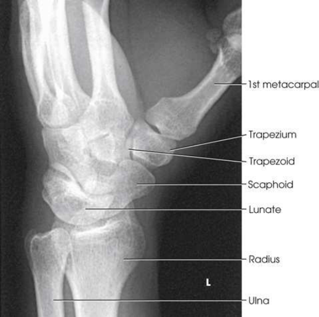
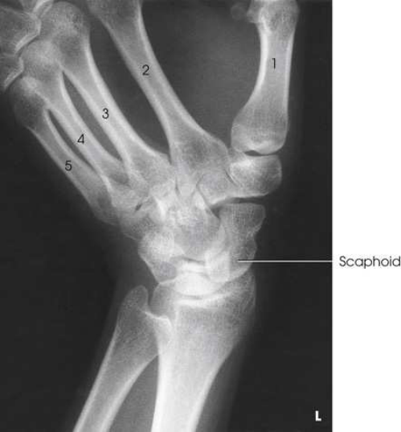
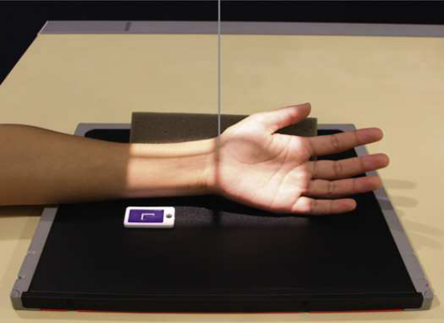
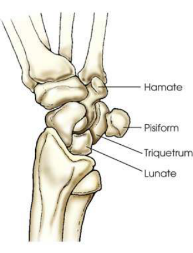
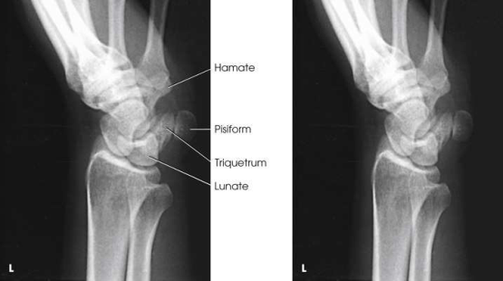
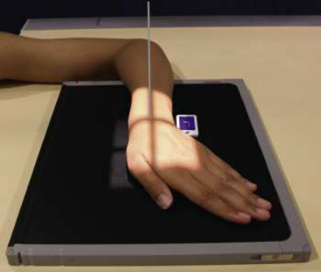

# Rx Pumn (Articulație Radiocarpiană) — Oblică Postero-Anterioară (PA) — Rotație Externă (Laterală) (Merrill)

  📷 Radiografie Convențională (Rx)
  <strong>Actualizat:</strong> 2026-09-16
  <strong>Autor:</strong> Referință Merrill

---

-   __1. Rezumat Clinic & Indicații__

    ---

    === "Indicații Clinice"

        - Conform reperelor anatomice standard din tratat

    === "Ghid Național IRIS"

        !!! info "Referință Primară: Ghidul Național IRIS (Ordinul MS 1342/2012)"
            - **Capitol Ghid IRIS:** *Aparat locomotor & Membru superior*
            - **Grad de Recomandare:** **Grad A**
            - **Nivel de Iradiere Estimată:** `Clasa 1 (Minimă < 0.01 mSv)`

            [:octicons-search-16: Deschide Ghidul IRIS](../../iris.md){ .md-button .md-button--primary } [:material-open-in-new: Aplicația Oficială PWA](https://radiologie-pediatrica.ro/iris/){ .md-button target="_blank" rel="noopener" }

-   __2. Poziționare & Centrare Fascicul__

    ---

    - **Poziție Pacient:** pacientul se așază pe scaun la capătul mesei radiologice, plasând axila în contact cu masa de examinare. Pacientul se așază pe scaun la capătul mesei radiologice. Pacientului i se indică să-și sprijine Antebrațul pe masa de examinare în decubit dorsal.; se sprijină suprafața palmară a Pumnului (Articulației Radiocarpiene) pe receptorul de imagine. Se ajustează receptorul de imagine astfel încât punctul său central să fie sub scafoid când Pumnul (Articulația Radiocarpiană) este rotit din poziția de pronație. Din poziția de pronație, se rotește Pumnul (Articulația Radiocarpiană) lateral (extern) până când planul coronal formează un unghi de aproximativ 45 grade cu planul receptorului de imagine. Pentru poziționare exactă și pentru a asigura duplicarea la examinările de urmărire, se plasează o pană de spumă de 45 grade sub partea ridicată a Pumnului (Articulației Radiocarpiene). Se extinde ușor Pumnul (Articulația Radiocarpiană), iar dacă falangele nu ating masa de examinare, se sprijină în poziție (Fig. 5.77). Când scafoidul este examinat, se ajustează Pumnul (Articulația Radiocarpiană) în deviație ulnară. Se plasează săculeți cu nisip peste Antebraț. Se efectuează ecranarea gonadelor cu șorț plumbat. Se plasează receptorul de imagine sub Pumnul (Articulația Radiocarpiană) și se centrează pe suprafața dorsală a Pumnului (Articulației Radiocarpiene). Se rotește Pumnul (Articulația Radiocarpiană) medial (intern) până când planul coronal formează un unghi de aproximativ 45 grade cu planul receptorului de imagine (Fig. 5.80). Se efectuează ecranarea gonadelor cu șorț plumbat.
    - **Punct de Centrare Fascicul:** perpendicular pe regiunea mediocarpiană; intră imediat distal de radius, perpendicular pe regiunea mediocarpiană; intră pe suprafața anterioară a Pumnului (Articulației Radiocarpiene), la jumătatea distanței dintre marginile sale medială și laterală
    - **Distanță Focar-Film (DFF / SID):** Nespecificat în fragmentul extras; de verificat în sursă
    - **Comandă Respiratorie:** Conform reperelor anatomice standard din tratat

-   __3. Parametri Tehnici Expunere__

    ---

    | Parametru Tehnic | Valoare Configurare Generator / Tub |
    |:-----------------|:-------------------------------------|
    | **Tensiune Tub (kV)** | DE CONFIGURAT PE APARAT |
    | **Sarcină / Produs Curent-Timp (mAs)** | DE CONFIGURAT PE APARAT |
    | **Distanță Focar-Film (DFF / SID)** | Nespecificat în fragmentul extras; de verificat în sursă |
    | **Grilă Antidifuzoare (Bucky)** | DE CONFIGURAT PE APARAT |
    | **Dimensiune Focar** | DE CONFIGURAT PE APARAT |
    | **Camere de Ionizare AEC** | DE CONFIGURAT PE APARAT |
    | **Colimare Fascicul** | Se ajustează câmpul de iradiere la 2.5 țoli (6 cm) proximal și distal față de articulația Pumnului (Articulației Radiocarpiene) și la 1 țol (2.5 cm) pe laturi. Se plasează markerul de lateralitate în câmpul colimat. Se ajustează câmpul de iradiere la 2.5 țoli (6 cm) proximal și distal față de articulația Pumnului (Articulației Radiocarpiene) și la 1 țol (2.5 cm) pe laturi. Se plasează markerul de lateralitate în câmpul colimat. |
    | **Filtrare Tub** | DE CONFIGURAT PE APARAT |

-   __4. Criterii de Calitate & Reușită Imagine__

    ---

    - Criterii radiologice de calitate a imaginii:
    - Colimare adecvată vizibilă și prezența markerului de lateralitate (D/S) plasat în afara structurilor anatomice de interes
    - Radiusul și ulna distale, oasele carpiene și jumătatea proximală a oaselor metacarpiene
    - rotație de 45 grade a anatomiei
    - spațiu interosos ușor între corpurile metacarpienelor al treilea, al patrulea și al cincilea
    - ușoară suprapunere a radiusului și ulnei distale
    - oasele carpiene de pe partea laterală a Pumnului (Articulației Radiocarpiene)
    - Trapezul și jumătatea distală a scafoidului fără suprapunere
    - spațiile articulare trapezo-trapezoidiene și scafo-trapeziene deschise
    - detalii osoase trabeculare și țesuturile moi înconjurătoare. Criterii radiologice de calitate a imaginii:
    - Colimare adecvată vizibilă și prezența markerului de lateralitate (D/S) plasat în afara structurilor anatomice de interes
    - Radiusul și ulna distale, oasele carpiene și jumătatea proximală a oaselor metacarpiene
    - oasele carpiene de pe partea medială a Pumnului (Articulației Radiocarpiene)
    - Triquetrumul, cârligul hamatului și pisiformul libere de suprapunere și în profil
    - Detalii trabeculare osoase și țesuturile moi înconjurătoare

-   __5. Protecție Radiologică (ALARA)__

    ---

    - Nespecificat în fragmentul extras; de verificat în sursă

!!! note "Observații Clinice & Tehnice"
    Conform reperelor anatomice standard din tratat

### 🖼️ Imagini

<figure class="protocol-image-card" markdown>

<figcaption><strong>Merrill — pagina 296, imaginea 1</strong> — Imagine din fragmentul sursă; asocierea necesită revizie.</figcaption>

</figure>

<figure class="protocol-image-card" markdown>

<figcaption><strong>Merrill — pagina 297, imaginea 2</strong> — Imagine din fragmentul sursă; asocierea necesită revizie.</figcaption>

</figure>

<figure class="protocol-image-card" markdown>

<figcaption><strong>Merrill — pagina 298, imaginea 3</strong> — Imagine din fragmentul sursă; asocierea necesită revizie.</figcaption>

</figure>

<figure class="protocol-image-card" markdown>

<figcaption><strong>Merrill — pagina 298, imaginea 4</strong> — Imagine din fragmentul sursă; asocierea necesită revizie.</figcaption>

</figure>

<figure class="protocol-image-card" markdown>

<figcaption><strong>Merrill — pagina 299, imaginea 5</strong> — Imagine din fragmentul sursă; asocierea necesită revizie.</figcaption>

</figure>

<figure class="protocol-image-card" markdown>

<figcaption><strong>Merrill — pagina 299, imaginea 6</strong> — Imagine din fragmentul sursă; asocierea necesită revizie.</figcaption>

</figure>

=== "Ghid Rapid de Execuție"

    1. **Identificarea și verificarea pacientului:** verificare identitate, zonă de examinat, consimțământ conform procedurii și evaluarea posibilității unei sarcini, când este relevantă.
    2. **Pregătire:** îndepărtarea oricăror obiecte radiopace (bijuterii, agrafe, fermoare, proteze, pansamente dense).
    3. **Poziționare precisă:** alinierea receptorului de imagine și a tubului la distanța prescrisă (Nespecificat în fragmentul extras; de verificat în sursă).
    4. **Colimare strictă:** adaptarea fasciculului strict la regiunea de diagnostic pentru scăderea iradierii și reducerea radiației difuze.
    5. **Radioprotecție:** verificarea [politicii RX](../radioprotectie.md), cu măsuri distincte pentru pacient, personal și însoțitor.

## Surse de documentare

- [Merrill’s Atlas, 5. Upper Extremity, pagini 295–299](https://books.google.com/books/about/Merrill_s_Atlas_of_Radiographic_Position.html?id=BM0lEQAAQBAJ)
