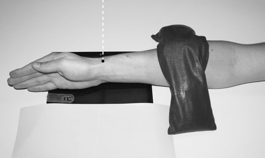
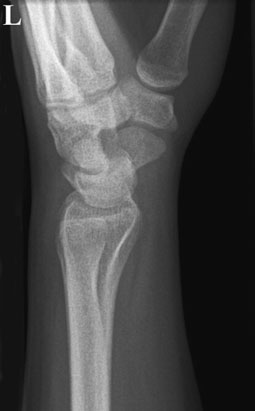
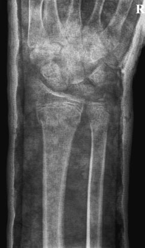
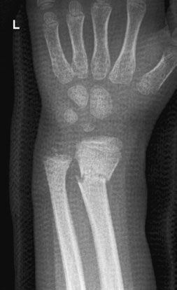
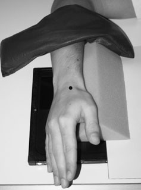
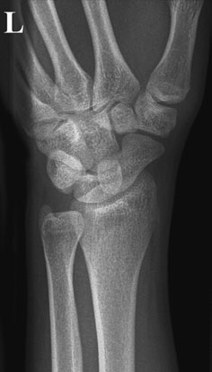
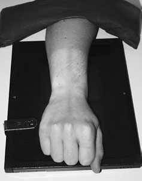
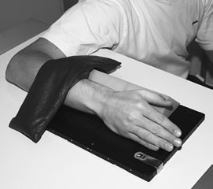
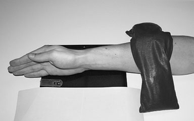

# Rx Pumn (Articulație Radiocarpiană) Profil (Lateral) - method 2

  📷 Radiografie Convențională (Rx)
  <strong>Actualizat:</strong> 2026-09-16
  <strong>Autor:</strong> Departamentul de Radiologie / Referință Clark (Ed. 12)

---

-   __1. Rezumat Clinic & Indicații__

    ---

    === "Indicații Clinice"

        - suspiciune de fractură de distal radius poate fie undisplaced, dorsally angulated (Colles’ suspiciune de fractură) sau ventrally angulated (Smith’s suspiciune de fractură). importance de Smith’s suspiciune de fractură lies în fact that it este less stable than Colles’ suspiciune de fractură.
        - luxație articulară de carpus sunt uncommon, but again they carry potential pentru serious disability. One manifestation de lunate luxație articulară este increased gap între it și Scafoid Carpian, which will fie missed if Pumn (Articulație Radiocarpiană) este rotit pe posteroanterior incidență. 58 Normal Oblică Anterioară radiografie de Pumn (Articulație Radiocarpiană) la change incidență de ulna, braț trebuie să fie rotit ca vizualizat în three photographs above

    === "Ghid Național IRIS"

        !!! info "Referință Primară: Ghidul Național IRIS (Ordinul MS 1342/2012)"
            - **Capitol Ghid IRIS:** *Ghidul Național IRIS*
            - **Grad de Recomandare:** **De verificat pe indicație; fără grad atribuit automat**
            - **Nivel de Iradiere Estimată:** `De verificat pentru examinarea și populația selectate`

            [:octicons-search-16: Deschide Ghidul IRIS](../../iris.md){ .md-button .md-button--primary } [:material-open-in-new: Aplicația Oficială PWA](https://radiologie-pediatrica.ro/iris/){ .md-button target="_blank" rel="noopener" }
-   __2. Poziționare & Centrare Fascicul__

    ---

    - **Poziție Pacient:** • de la Postero-anterior (PA) poziție, Humerus este externally rotit through 90 grade.
• Cot articulație este extins la bring medial aspect de Antebraț (Radius și Ulna), Pumn (Articulație Radiocarpiană) și Mână into contact cu masa de examinare.
• Pumn (Articulație Radiocarpiană) articulație este poziționat over unexposed half de caseta pentru include lower part de radius și ulna și proximal two-thirds de oase metacarpiene.
• Mână este rotit externally slightly further la ensure that radial și styloid processes sunt superimposed.
• Antebrațul este imobilizat cu ajutorul unui săculeț cu nisip.

• Pacientul stă așezat pe scaun lângă masa de examinare, cu partea afectată sprijinită pe masă.
• Cot articulație este flectat la 90 grade și braț este în abducție, astfel încât anterior aspect de Antebraț (Radius și Ulna) și palm de Mână rest pe tabletop.
• If mobility de pacientul permits, then Umăr articulație trebuie să fie la same height ca Antebraț (Radius și Ulna).
• Pumn (Articulație Radiocarpiană) articulație este plasat pe casetă și ajustat pentru include lower part de radius și ulna și proximal two-thirds de oase metacarpiene.
• Mână este externally rotit through 45 grade și sprijinit în this poziție using non-opaque pad.
• Antebrațul este imobilizat cu ajutorul unui săculeț cu nisip.
    - **Punct de Centrare Fascicul:** • Raza centrală verticală este centrată pe styloid process de radius.

• raza centrală verticală centrală este centred midway între radial și ulnar styloid processes.
    - **Distanță Focar-Film (DFF / SID):** 100 cm
    - **Comandă Respiratorie:** Apnee pe durata expunerii (apnee în inspir pentru torace; expir pentru Abdomen/bazin).

-   __3. Parametri Tehnici Expunere__

    ---

    | Parametru Tehnic | Valoare Configurare Generator / Tub |
    |:-----------------|:-------------------------------------|
    | **Tensiune Tub (kV)** | DE CONFIGURAT PE APARAT |
    | **Sarcină / Produs Curent-Timp (mAs)** | Conform AEC / grosime anatomică |
    | **Distanță Focar-Film (DFF / SID)** | 100 cm |
    | **Grilă Antidifuzoare (Bucky)** | Conform grosimii anatomice (> 10-12 cm cu grilă) |
    | **Dimensiune Focar** | Focar Mic (0.6 mm) |
    | **Camere de Ionizare AEC** | DE CONFIGURAT PE APARAT |
    | **Colimare Fascicul** | Colimare strictă la aria anatomică de interes diagnostic |
    | **Filtrare Tub** | Totală ≥ 2.5 mm Al echivalent (conform Clark: 3.0 mm Al eq.) |

-   __4. Criterii de Calitate & Reușită Imagine__

    ---

    - expunere trebuie să provide adecvat penetration la visualize oase carpiene.
    - radial și ulnar styloid processes trebuie să fie superimposed.
    - imagine trebuie să evidențiază proximal two-thirds de oase metacarpiene, oase carpiene și distal third de radius și ulna.
    - expunere trebuie să provide adecvat penetration la visualize oase carpiene.
    - imagine trebuie să evidențiază proximal two-thirds de oase metacarpiene, oase carpiene, și distal third de radius și ulna.

-   __5. Protecție Radiologică (ALARA)__

    ---

    - Ecranare gonadică cu șorț plumbat dacă gonadele sunt în apropierea fasciculului util (regula ALARA).
    - Colimare precisă la dimensiunea anatomică strict necesară pentru reducerea dozei și a radiației difuze.
    - Verificarea posibilității unei sarcini la pacientele de vârstă fertilă înainte de expunere.

!!! note "Observații Clinice & Tehnice"
    • If pacientul’s limb este imobilizat în plaster de Paris, then it poate fie necessary la modify positioning de pacientul la obtain precis Postero-anterior (PA) și Profil (lateral) incidențe.
Increased parametri de expunere will fie necessary la penetrate plaster, și resultant imagine will fie de reduced contrast.
• Light-weight plasters constructed de la polyester knit fabric sunt radio-lucent și require parametri de expunere similar la uncasted areas.
Normal Profil (lateral) radiografie de Pumn (Articulație Radiocarpiană), method 2 Postero-anterior (PA) radiografie de Pumn (Articulație Radiocarpiană) through conventional plaster Postero-anterior (PA) radiografie de Pumn (Articulație Radiocarpiană) through light-weight plaster

• This incidență results în additional Oblică incidență de oase metacarpiene, oase carpiene și lower end de radius. la obtain additional incidență de lower end de ulna, it este necessary la se rotește Humerus (see Pumn (Articulație Radiocarpiană), Profil (lateral) – method 2, p. 57).
• three incidențe, Postero-anterior (PA), Profil (lateral) și Oblică, poate toate fie taken pe same casetă using lead rubber la mask off toate but one-third de caseta being used.

### 🖼️ Imagini

<figure class="protocol-image-card" markdown>

<figcaption><strong>Normal Profil (lateral) radiografie de Pumn (Articulație Radiocarpiană), method 2</strong> — Poziționare pacient și centrare fascicul conform Clark (Ed. 12)</figcaption>

</figure>

<figure class="protocol-image-card" markdown>

<figcaption><strong>Postero-anterior (PA) radiografie de</strong> — Aspect radiografic / ghid de poziționare conform tratatului Clark (Ed. 12)</figcaption>

</figure>

<figure class="protocol-image-card" markdown>

<figcaption><strong>Postero-anterior (PA) radiografie de Pumn (Articulație Radiocarpiană)</strong> — Aspect radiografic / ghid de poziționare conform tratatului Clark (Ed. 12)</figcaption>

</figure>

<figure class="protocol-image-card" markdown>

<figcaption><strong>Figura 4: Aspect radiografic / Poziționare (Clark Ed. 12)</strong> — Aspect radiografic / ghid de poziționare conform tratatului Clark (Ed. 12)</figcaption>

</figure>

<figure class="protocol-image-card" markdown>

<figcaption><strong>• suspiciune de fractură de distal radius poate fie undisplaced, dorsally</strong> — Aspect radiografic / ghid de poziționare conform tratatului Clark (Ed. 12)</figcaption>

</figure>

<figure class="protocol-image-card" markdown>

<figcaption><strong>angulated (Colles’ suspiciune de fractură) sau ventrally angulated (Smith’s</strong> — Aspect radiografic / ghid de poziționare conform tratatului Clark (Ed. 12)</figcaption>

</figure>

<figure class="protocol-image-card" markdown>

<figcaption><strong>suspiciune de fractură). importance de Smith’s suspiciune de fractură lies în fact</strong> — Aspect radiografic / ghid de poziționare conform tratatului Clark (Ed. 12)</figcaption>

</figure>

<figure class="protocol-image-card" markdown>

<figcaption><strong>that it este less stable than Colles’ suspiciune de fractură.</strong> — Aspect radiografic / ghid de poziționare conform tratatului Clark (Ed. 12)</figcaption>

</figure>

<figure class="protocol-image-card" markdown>

<figcaption><strong>Normal Oblică Anterioară radiografie de Pumn (Articulație Radiocarpiană)</strong> — Aspect radiografic / ghid de poziționare conform tratatului Clark (Ed. 12)</figcaption>

</figure>

=== "Ghid Rapid de Execuție"

    1. **Identificarea și verificarea pacientului:** verificare identitate, zonă de examinat, consimțământ conform procedurii și evaluarea posibilității unei sarcini, când este relevantă.
    2. **Pregătire:** îndepărtarea oricăror obiecte radiopace (bijuterii, agrafe, fermoare, proteze, pansamente dense).
    3. **Poziționare precisă:** alinierea receptorului de imagine și a tubului la distanța prescrisă (100 cm).
    4. **Colimare strictă:** adaptarea fasciculului strict la regiunea de diagnostic pentru scăderea iradierii și reducerea radiației difuze.
    5. **Radioprotecție:** verificarea [politicii RX](../radioprotectie.md), cu măsuri distincte pentru pacient, personal și însoțitor.

## Surse de documentare

- [Clark's Positioning in Radiography (Ed. 12), Pagina 72](../../assets/protocols/sources/Clark___Positioning_in_Radiography__12th_edition.pdf#page=72)
