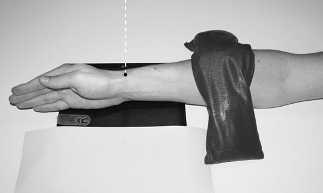
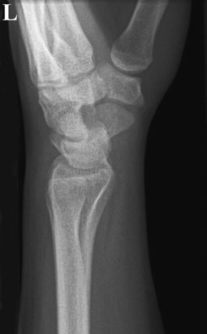
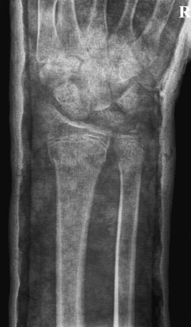
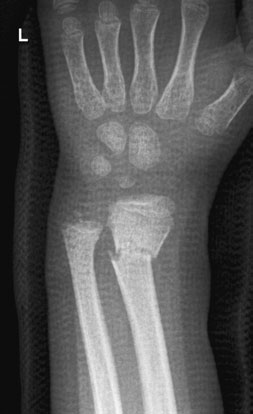
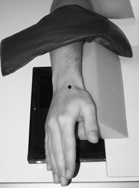
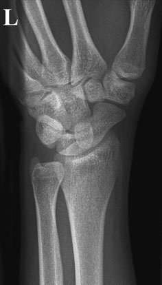
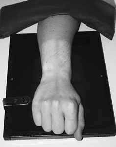
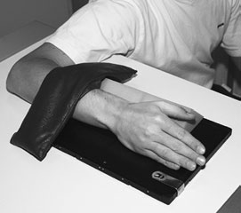
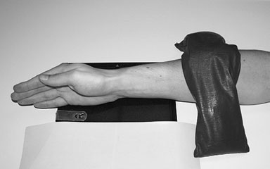

# Rx pumn (articulație radiocarpiană) de profil — metoda 2

  📷 Radiografie Convențională (Rx)
  <strong>Actualizat:</strong> 2026-09-16
  <strong>Autor:</strong> Departamentul de Radiologie / Referință Clark (Ed. 12)

---

-   __1. Rezumat Clinic & Indicații__

    ---

    === "Indicații Clinice"

        - suspiciunea de fractură a radiusului distal poate fi fără deplasare, angulată dorsal (suspiciune de fractură Colles) sau angulată volar (suspiciune de fractură Smith). Importanța suspiciunii de fractură Smith constă în faptul că aceasta este mai puțin stabilă decât suspiciunea de fractură Colles.
        - Luxațiile articulare ale carpului sunt neobișnuite, dar pot produce, din nou, dizabilități grave. O manifestare a luxației semilunarului este creșterea spațiului dintre acesta și scafoidul carpian, care va fi omisă dacă pumnul (articulația radiocarpiană) este rotit în incidența postero-anterioară. 58 Radiografie oblică anterioară normală a pumnului (articulației radiocarpiene) La schimbarea incidenței spre ulnă, brațul trebuie rotit astfel cum se observă în cele trei imagini de mai sus

    === "Ghid Național IRIS"

        !!! info "Referință Primară: Ghidul Național IRIS (Ordinul MS 1342/2012)"
            - **Capitol Ghid IRIS:** *Aparat locomotor & Membru superior*
            - **Grad de Recomandare:** **Grad A**
            - **Nivel de Iradiere Estimată:** `Clasa 1 (Minimă < 0.01 mSv)`

            [:octicons-search-16: Deschide Ghidul IRIS](../../iris.md){ .md-button .md-button--primary } [:material-open-in-new: Aplicația Oficială PWA](https://radiologie-pediatrica.ro/iris/){ .md-button target="_blank" rel="noopener" }

-   __2. Poziționare & Centrare Fascicul__

    ---

    - **Poziție Pacient:**
        - Din poziția postero-anterioară (PA), humerusul este rotit extern la 90 grade.
        - Articulația cotului este extinsă pentru a aduce în contact cu masa de examinare aspectul medial al antebrațului (radius și ulnă), pumnul (articulația radiocarpiană) și mâna.
        - Articulația pumnului (radiocarpiană) este poziționată peste jumătatea neexpusă a casetei, pentru a include porțiunea inferioară a radiusului și ulnei și două treimi proximale ale oaselor metacarpiene.
        - Mâna este rotită extern puțin mai mult pentru a asigura suprapunerea proceselor stiloide radial și ulnar.
        - Antebrațul este imobilizat cu ajutorul unui săculeț cu nisip.
        - Pacientul stă așezat pe scaun lângă masa de examinare, cu partea afectată sprijinită pe masă.
        - Articulația cotului este flectată la 90 grade, iar brațul este în abducție, astfel încât aspectul anterior al antebrațului (radius și ulnă) și palma mâinii să se sprijine pe masă.
        - Dacă mobilitatea pacientului permite, articulația umărului trebuie să fie la aceeași înălțime cu antebrațul (radius și ulnă).
        - Articulația pumnului (radiocarpiană) este plasată pe casetă și ajustată pentru a include porțiunea inferioară a radiusului și ulnei și două treimi proximale ale oaselor metacarpiene.
        - Mâna este rotită extern la 45 grade și sprijinită în această poziție folosind un suport radiotransparent.
        - Antebrațul este imobilizat cu ajutorul unui săculeț cu nisip.
    - **Punct de Centrare Fascicul:**
        - Raza centrală verticală este centrată pe procesul stiloid al radiusului.
        - Raza centrală verticală este centrată la jumătatea distanței dintre procesele stiloide radial și ulnar.
    - **Distanță Focar-Film (DFF / SID):** 100 cm
    - **Comandă Respiratorie:** Apnee pe durata expunerii (apnee în inspir pentru torace; expir pentru Abdomen/bazin).

-   __3. Parametri Tehnici Expunere__

    ---

    | Parametru Tehnic | Valoare Configurare Generator / Tub |
    |:-----------------|:-------------------------------------|
    | **Tensiune Tub (kV)** | DE CONFIGURAT PE APARAT |
    | **Sarcină / Produs Curent-Timp (mAs)** | Conform AEC / grosimii anatomice |
    | **Distanță Focar-Film (DFF / SID)** | 100 cm |
    | **Grilă Antidifuzoare (Bucky)** | Conform grosimii anatomice (> 10-12 cm cu grilă) |
    | **Dimensiune Focar** | Focar Mic (0.6 mm) |
    | **Camere de Ionizare AEC** | DE CONFIGURAT PE APARAT |
    | **Colimare Fascicul** | Colimare strictă la aria anatomică de interes diagnostic |
    | **Filtrare Tub** | Totală ≥ 2.5 mm Al echivalent (conform Clark: 3.0 mm Al echivalent) |

-   __4. Criterii de Calitate & Reușită Imagine__

    ---

    - expunerea trebuie să asigure o penetrare adecvată pentru vizualizarea oaselor carpiene.
    - Procesele stiloide radial și ulnar trebuie să fie suprapuse.
    - Imaginea trebuie să evidențieze două treimi proximale ale oaselor metacarpiene, oasele carpiene și treimea distală a radiusului și ulnei.
    - expunerea trebuie să asigure o penetrare adecvată pentru vizualizarea oaselor carpiene.
    - Imaginea trebuie să evidențieze două treimi proximale ale oaselor metacarpiene, oasele carpiene și treimea distală a radiusului și ulnei.

-   __5. Protecție Radiologică (ALARA)__

    ---

    - Ecranare gonadică cu șorț plumbat dacă gonadele sunt în apropierea fasciculului util (regula ALARA).
    - Colimare precisă la dimensiunea anatomică strict necesară pentru reducerea dozei și a radiației difuze.
    - Verificarea posibilității unei sarcini la pacientele de vârstă fertilă înainte de expunere.

!!! note "Observații Clinice & Tehnice"
    - Dacă membrul pacientului este imobilizat în ghips, poate fi necesară modificarea poziționării pacientului pentru obținerea unor incidențe postero-anterioare (PA) și de profil (lateral) precise. Creșterea parametrilor de expunere va fi necesară pentru penetrarea ghipsului, iar imaginea rezultată va avea un contrast redus.
    - Ghipsurile ușoare confecționate din țesătură tricotată din poliester sunt radiotransparente și necesită parametri de expunere similari zonelor fără ghips. Radiografie normală de profil (lateral) a pumnului (articulației radiocarpiene), metoda 2 Radiografie postero-anterioară (PA) a pumnului (articulației radiocarpiene) prin ghips convențional Radiografie postero-anterioară (PA) a pumnului (articulației radiocarpiene) prin ghips ușor
    - Această incidență evidențiază suplimentar oasele metacarpiene, oasele carpiene și extremitatea distală a radiusului. Pentru obținerea unei incidențe suplimentare a extremității distale a ulnei, este necesară rotirea humerusului (vezi Pumn (articulație radiocarpiană), profil (lateral) – metoda 2, p. 57).
    - Cele trei incidențe, postero-anterioară (PA), de profil (lateral) și oblică, pot fi efectuate toate pe aceeași casetă, folosind cauciuc plumbat pentru a acoperi toate zonele, cu excepția unei treimi a casetei utilizate.

### 🖼️ Imagini

<figure class="protocol-image-card" markdown>

<figcaption><strong>Radiografie normală de profil (lateral) a pumnului (articulației radiocarpiene), metoda 2</strong> — Poziționarea pacientului și centrarea fasciculului conform Clark (Ed. 12)</figcaption>

</figure>

<figure class="protocol-image-card" markdown>

<figcaption><strong>Radiografie postero-anterioară (PA) a</strong> — Aspect radiografic / ghid de poziționare conform tratatului Clark (Ed. 12)</figcaption>

</figure>

<figure class="protocol-image-card" markdown>

<figcaption><strong>Radiografie postero-anterioară (PA) a pumnului (articulației radiocarpiene)</strong> — Aspect radiografic / ghid de poziționare conform tratatului Clark (Ed. 12)</figcaption>

</figure>

<figure class="protocol-image-card" markdown>

<figcaption><strong>Figura 4: Aspect radiografic / Poziționare (Clark Ed. 12)</strong> — Aspect radiografic / ghid de poziționare conform tratatului Clark (Ed. 12)</figcaption>

</figure>

<figure class="protocol-image-card" markdown>

<figcaption><strong>• fractura suspectată a extremității distale a radiusului poate fi fără deplasare, cu angulație dorsală</strong> — Aspect radiografic / ghid de poziționare conform tratatului Clark (Ed. 12)</figcaption>

</figure>

<figure class="protocol-image-card" markdown>

<figcaption><strong>angulată (fractură Colles) sau cu angulație ventrală (fractură Smith</strong> — Aspect radiografic / ghid de poziționare conform tratatului Clark (Ed. 12)</figcaption>

</figure>

<figure class="protocol-image-card" markdown>

<figcaption><strong>suspectată). Importanța fracturii Smith constă în faptul</strong> — Aspect radiografic / ghid de poziționare conform tratatului Clark (Ed. 12)</figcaption>

</figure>

<figure class="protocol-image-card" markdown>

<figcaption><strong>că este mai puțin stabilă decât fractura Colles.</strong> — Aspect radiografic / ghid de poziționare conform tratatului Clark (Ed. 12)</figcaption>

</figure>

<figure class="protocol-image-card" markdown>

<figcaption><strong>Radiografie oblică anterioară normală a pumnului (articulației radiocarpiene)</strong> — Aspect radiografic / ghid de poziționare conform tratatului Clark (Ed. 12)</figcaption>

</figure>

=== "Ghid Rapid de Execuție"

    1. **Identificarea și verificarea pacientului:** verificare identitate, zonă de examinat, consimțământ conform procedurii și evaluarea posibilității unei sarcini, când este relevantă.
    2. **Pregătire:** îndepărtarea oricăror obiecte radiopace (bijuterii, agrafe, fermoare, proteze, pansamente dense).
    3. **Poziționare precisă:** alinierea receptorului de imagine și a tubului la distanța prescrisă (100 cm).
    4. **Colimare strictă:** adaptarea fasciculului strict la regiunea de diagnostic pentru scăderea iradierii și reducerea radiației difuze.
    5. **Radioprotecție:** verificarea [politicii RX](../radioprotectie.md), cu măsuri distincte pentru pacient, personal și însoțitor.

## Surse de documentare

- [Clark's Positioning in Radiography (Ed. 12), Pagina 72](https://books.google.com/books/about/Clark_s_Positioning_in_Radiography.html?id=Xxu6MwEACAAJ)
