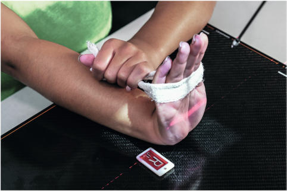
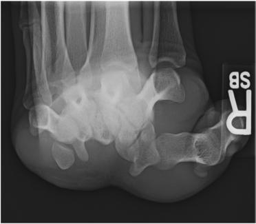

# Rx Pumn (Articulație Radiocarpiană) PROJECTION (GAYNOR)

  📷 Radiografie Convențională (Rx)
  <strong>Actualizat:</strong> 2026-09-15
  <strong>Autor:</strong> Departamentul de Radiologie / Referință Bontrager

---

-   __1. Rezumat Clinic & Indicații__

    ---

    === "Indicații Clinice"

        - Rule out abnormal calcification and bony changes in the carpal sulcus that may impinge on the median nerve, as with carpal tunnel syndrome
        - Possible suspiciune de fractură of the hamulus process of the hamate, pisiform, and trapezium

    === "Ghid Național IRIS"

        !!! info "Referință Primară: Ghidul Național IRIS (Ordinul MS 1342/2012)"
            - **Capitol Ghid IRIS:** *Ghidul Național IRIS*
            - **Grad de Recomandare:** **De verificat pe indicație; fără grad atribuit automat**
            - **Nivel de Iradiere Estimată:** `De verificat pentru examinarea și populația selectate`

            [:octicons-search-16: Deschide Ghidul IRIS](../../iris.md){ .md-button .md-button--primary } [:material-open-in-new: Aplicația Oficială PWA](https://radiologie-pediatrica.ro/iris/){ .md-button target="_blank" rel="noopener" }
-   __2. Poziționare & Centrare Fascicul__

    ---

    - **Poziție Pacient:** Pacient: Seat patient at end of table, with Pumn (Articulație Radiocarpiană) and Mână on IR and palm down (pronated).; Regiune anatomică: Align Mână and Pumn (Articulație Radiocarpiană) with long axis of the IR. Ask patient to hyperextend Pumn (Articulație Radiocarpiană) (dorsiflex) as far as possible by the use of a piece of tape or band, gently but firmly hyperextending the Pumn (Articulație Radiocarpiană) until the long axis of the metacarpals and the Degete Mână are as near vertical (90° to Antebraț) as possible (without lifting the Pumn (Articulație Radiocarpiană) and Antebraț from the IR). Rotate entire Mână and Pumn (Articulație Radiocarpiană) about 10° internally (toward radial side) to prevent superimposition of pisiform and hamate (Fig. 4.111).
    - **Punct de Centrare Fascicul:** angle with ulnar deviation, or alternate modified Incidență Scafoid (Metoda Stecher) Radial deviation Carpal canal Fig. 4.112 Tangential (GaynorHart method) projection. Fig. 4.111 Tangential projection. CR 25° to 30° to long axis of Mână.
    - **Distanță Focar-Film (DFF / SID):** 100 cm
    - **Comandă Respiratorie:** Apnee pe durata expunerii (sau conform cooperării pacientului)

-   __3. Parametri Tehnici Expunere__

    ---

    | Parametru Tehnic | Valoare Configurare Generator / Tub |
    |:-----------------|:-------------------------------------|
    | **Tensiune Tub (kV)** | 55 kV |
    | **Sarcină / Produs Curent-Timp (mAs)** | DE CONFIGURAT PE APARAT |
    | **Distanță Focar-Film (DFF / SID)** | 100 cm |
    | **Grilă Antidifuzoare (Bucky)** | Fără grilă (expunere directă) |
    | **Dimensiune Focar** | Focar Mic (0.6 mm) |
    | **Camere de Ionizare AEC** | DE CONFIGURAT PE APARAT |
    | **Colimare Fascicul** | Field Size Collimate on four sides to anatomy of interest. Alternative Imaging Sonography for carpal tunnel: Highresolution ultrasonography allows for noninvasive imaging of the carpal tunnel and related anatomy. Fig. 4.112 demonstrates the “bowing” of the flexor retinaculum (arrows) with the “flattening” of the median nerve below it, indicating compression.15 Pumn (Articulație Radiocarpiană) SPECIAL Scaphoid projections: |
    | **Filtrare Tub** | Totală ≥ 2.5 mm Al echivalent |

-   __4. Criterii de Calitate & Reușită Imagine__

    ---

    - Vizualizarea completă a regiunii anatomice explorate
    - Absența artefactelor de mișcare sau a suprapunerilor neadecvate
    - Contrast și penetrare optime pentru decelarea structurilor osoase și a părților moi

-   __5. Protecție Radiologică (ALARA)__

    ---

    - Ecranare gonadică și a organelor radiosensibile conform procedurilor locale de radioprotecție ALARA.
    - Colimare strictă la aria de interes pentru limitarea radiației difuze.
    - Verificarea posibilității unei sarcini la pacientele de vârstă fertilă înainte de expunere.

### 🖼️ Imagini

<figure class="protocol-image-card" markdown>

<figcaption><strong>Fig. 4.112 Tangential (Gaynor-</strong> — Poziționare pacient conform Ghidului Bontrager (Fig. 4.112 Tangential (Gaynor-)</figcaption>

</figure>

<figure class="protocol-image-card" markdown>

<figcaption><strong>Fig. 4.111 Tangential projection. CR 25° to 30° to long axis of Mână.</strong> — Aspect radiografic de referință conform Ghidului Bontrager (Fig. 4.111 Tangential projection. CR 25° to 30° to long axis of hand.)</figcaption>

</figure>

=== "Ghid Rapid de Execuție"

    1. **Identificarea și verificarea pacientului:** verificare identitate, zonă de examinat, consimțământ conform procedurii și evaluarea posibilității unei sarcini, când este relevantă.
    2. **Pregătire:** îndepărtarea oricăror obiecte radiopace (bijuterii, agrafe, fermoare, proteze, pansamente dense).
    3. **Poziționare precisă:** alinierea receptorului de imagine și a tubului la distanța prescrisă (100 cm).
    4. **Colimare strictă:** adaptarea fasciculului strict la regiunea de diagnostic pentru scăderea iradierii și reducerea radiației difuze.
    5. **Radioprotecție:** verificarea [politicii RX](../radioprotectie.md), cu măsuri distincte pentru pacient, personal și însoțitor.

## Surse de documentare

- [Bontrager's Textbook of Radiographic Positioning (Ed. 9/10), Pagina 172](https://www.elsevier.com/books/textbook-of-radiographic-positioning-and-related-anatomy/lampignano/978-0-323-65367-1)
