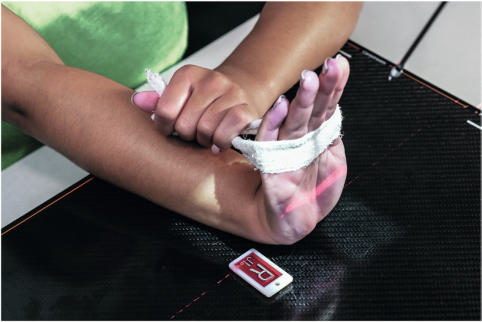
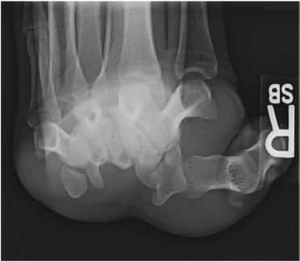

# Rx pumn (articulație radiocarpiană) incidență (GAYNOR)

  📷 Radiografie Convențională (Rx)
  <strong>Actualizat:</strong> 2026-09-15
  <strong>Autor:</strong> Departamentul de Radiologie / Referință Bontrager

---

-   __1. Rezumat Clinic & Indicații__

    ---

    === "Indicații Clinice"

        - Excluderea calcificărilor anormale și a modificărilor osoase din șanțul carpian care pot comprima nervul median, ca în sindromul de tunel carpian
        - Posibilă fractură suspectată a procesului hamulus al osului hamat, a pisiformului și a trapezului

    === "Ghid Național IRIS"

        !!! info "Referință Primară: Ghidul Național IRIS (Ordinul MS 1342/2012)"
            - **Capitol Ghid IRIS:** *Aparat locomotor & Membru superior*
            - **Grad de Recomandare:** **Grad A**
            - **Nivel de Iradiere Estimată:** `Clasa 1 (Minimă < 0.01 mSv)`

            [:octicons-search-16: Deschide Ghidul IRIS](../../iris.md){ .md-button .md-button--primary } [:material-open-in-new: Aplicația Oficială PWA](https://radiologie-pediatrica.ro/iris/){ .md-button target="_blank" rel="noopener" }

-   __2. Poziționare & Centrare Fascicul__

    ---

    - **Poziție Pacient:** Pacient: Așezați pacientul la capătul mesei, cu pumnul (articulația radiocarpiană) și mâna pe receptorul de imagine, cu palma în jos (în pronație).; Regiune anatomică: Aliniați mâna și pumnul (articulația radiocarpiană) cu axa longitudinală a receptorului de imagine. Solicitați pacientului să hiperextindă pumnul (dorsiflexie) cât mai mult posibil, folosind o bucată de bandă sau o fașă, hiperextinzând ușor, dar ferm, pumnul până când axa longitudinală a oaselor metacarpiene și degetele mâinii sunt cât mai aproape posibil de verticală (90° față de antebraț) fără ridicarea pumnului și antebrațului de pe receptorul de imagine. Rotiți întreaga mână și pumnul (articulația radiocarpiană) cu aproximativ 10° spre interior (spre partea radială) pentru a preveni suprapunerea pisiformului și hamatului (Fig. 4.111).
    - **Punct de Centrare Fascicul:** unghi cu deviație ulnară sau incidență scafoidă modificată alternativ (metoda Stecher) Incidență tangențială a canalului carpian (metoda GaynorHart) Fig. 4.112 incidență tangențială. Fig. 4.111 incidență tangențială. Raza centrală la 25° până la 30° față de axa longitudinală a mâinii.
    - **Distanță Focar-Film (DFF / SID):** 100 cm
    - **Comandă Respiratorie:** Apnee pe durata expunerii (sau conform cooperării pacientului)

-   __3. Parametri Tehnici Expunere__

    ---

    | Parametru Tehnic | Valoare Configurare Generator / Tub |
    |:-----------------|:-------------------------------------|
    | **Tensiune Tub (kV)** | 55 kV |
    | **Sarcină / Produs Curent-Timp (mAs)** | DE CONFIGURAT PE APARAT |
    | **Distanță Focar-Film (DFF / SID)** | 100 cm |
    | **Grilă Antidifuzoare (Bucky)** | Fără grilă (expunere directă) |
    | **Dimensiune Focar** | Focar Mic (0.6 mm) |
    | **Camere de Ionizare AEC** | DE CONFIGURAT PE APARAT |
    | **Colimare Fascicul** | Dimensiunea câmpului Colimați pe patru laturi până la nivelul anatomiei de interes. Imagistică alternativă Ecografia pentru tunelul carpian: Ultrasonografia de înaltă rezoluție permite imagistica neinvazivă a tunelului carpian și a anatomiei asociate. Fig. 4.112 evidențiază „bombarea” retinaculului flexorilor (săgeți), cu „aplatizarea” nervului median dedesubt, indicând compresia.15 Pumn (articulație radiocarpiană) SPECIAL Incidențe pentru scafoid: |
    | **Filtrare Tub** | Totală ≥ 2.5 mm Al echivalent |

-   __4. Criterii de Calitate & Reușită Imagine__

    ---

    - Vizualizarea completă a regiunii anatomice explorate
    - Absența artefactelor de mișcare sau a suprapunerilor neadecvate
    - Contrast și penetrare optime pentru decelarea structurilor osoase și a părților moi

-   __5. Protecție Radiologică (ALARA)__

    ---

    - Ecranare gonadică și a organelor radiosensibile conform procedurilor locale de radioprotecție ALARA.
    - Colimare strictă la aria de interes pentru limitarea radiației difuze.
    - Verificarea posibilității unei sarcini la pacientele de vârstă fertilă înainte de expunere.

### 🖼️ Imagini

<figure class="protocol-image-card" markdown>

<figcaption><strong>Fig. 4.112 tangențială (Gaynor-</strong> — Poziționarea pacientului conform Ghidului Bontrager (Fig. 4.112 incidență tangențială (Gaynor-)</figcaption>

</figure>

<figure class="protocol-image-card" markdown>

<figcaption><strong>Fig. 4.111 incidență tangențială. Raza centrală la 25° până la 30° față de axa longitudinală a mâinii.</strong> — Aspect radiografic de referință conform Ghidului Bontrager (Fig. 4.111 incidență tangențială. Raza centrală la 25° până la 30° față de axa longitudinală a mâinii.)</figcaption>

</figure>

=== "Ghid Rapid de Execuție"

    1. **Identificarea și verificarea pacientului:** verificare identitate, zonă de examinat, consimțământ conform procedurii și evaluarea posibilității unei sarcini, când este relevantă.
    2. **Pregătire:** îndepărtarea oricăror obiecte radiopace (bijuterii, agrafe, fermoare, proteze, pansamente dense).
    3. **Poziționare precisă:** alinierea receptorului de imagine și a tubului la distanța prescrisă (100 cm).
    4. **Colimare strictă:** adaptarea fasciculului strict la regiunea de diagnostic pentru scăderea iradierii și reducerea radiației difuze.
    5. **Radioprotecție:** verificarea [politicii RX](../radioprotectie.md), cu măsuri distincte pentru pacient, personal și însoțitor.

## Surse de documentare

- [Bontrager's Textbook of Radiographic Positioning (Ed. 9/10), Pagina 172](https://www.elsevier.com/books/textbook-of-radiographic-positioning-and-related-anatomy/lampignano/978-0-323-65367-1)
