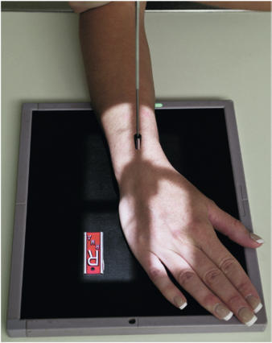
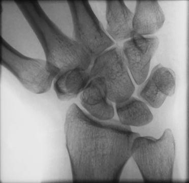

# Rx RADIAL DEVIATION PA (Postero-Anterior) (Pumn (Articulație Radiocarpiană))

  📷 Radiografie Convențională (Rx)
  <strong>Actualizat:</strong> 2026-09-15
  <strong>Autor:</strong> Departamentul de Radiologie / Referință Bontrager

---

-   __1. Rezumat Clinic & Indicații__

    ---

    === "Indicații Clinice"

        - Possible suspiciune de fractură de oase carpiene pe ulnar side de Pumn (Articulație Radiocarpiană), especially lunate, triquetrum, pisiform, și hamate

    === "Ghid Național IRIS"

        !!! info "Referință Primară: Ghidul Național IRIS (Ordinul MS 1342/2012)"
            - **Capitol Ghid IRIS:** *Ghidul Național IRIS*
            - **Grad de Recomandare:** **De verificat pe indicație; fără grad atribuit automat**
            - **Nivel de Iradiere Estimată:** `De verificat pentru examinarea și populația selectate`

            [:octicons-search-16: Deschide Ghidul IRIS](../../iris.md){ .md-button .md-button--primary } [:material-open-in-new: Aplicația Oficială PWA](https://radiologie-pediatrica.ro/iris/){ .md-button target="_blank" rel="noopener" }
-   __2. Poziționare & Centrare Fascicul__

    ---

    - **Poziție Pacient:** Pacient: Seat pacient la end de table cu Mână și Antebraț extins. Drop Umăr so that Umăr, Cot, și Pumn (Articulație Radiocarpiană) sunt pe same plan orizontal.; Regiune anatomică: poziție Pumn (Articulație Radiocarpiană) ca pentru Incidență Postero-Anterioară (PA)—palm down cu Pumn (Articulație Radiocarpiană) și Mână aliniat cu center de axa longitudinală de receptorul de imagine. fără moving Antebraț, gently invert Mână (move medially spre Police side) ca far ca pacient poate tolerate fără lifting sau rotating distal Antebraț (Fig. 4.108).
    - **Punct de Centrare Fascicul:** și center de collimation field size trebuie să fie la aria medio-carpiană. expunere: optim receptorul de imagine expunere și contrast cu fără mișcare visualize carpal margini și clear, Contururi osoase și travee trabeculare nete, fără artefacte de mișcare. Fig. 4.109 Radial deviation. 5th metacarpal Pisiform Ulna Hamate Triquetrum Lunate Hamulus de hamate Fig. 4.110 Radial deviation.
    - **Distanță Focar-Film (DFF / SID):** 100 cm
    - **Comandă Respiratorie:** Apnee pe durata expunerii (sau conform cooperării pacientului)

-   __3. Parametri Tehnici Expunere__

    ---

    | Parametru Tehnic | Valoare Configurare Generator / Tub |
    |:-----------------|:-------------------------------------|
    | **Tensiune Tub (kV)** | 55 kV |
    | **Sarcină / Produs Curent-Timp (mAs)** | DE CONFIGURAT PE APARAT |
    | **Distanță Focar-Film (DFF / SID)** | 100 cm |
    | **Grilă Antidifuzoare (Bucky)** | Fără grilă (expunere directă) |
    | **Dimensiune Focar** | Focar Mic (0.6 mm) |
    | **Camere de Ionizare AEC** | DE CONFIGURAT PE APARAT |
    | **Colimare Fascicul** | Field Size Collimate pe four sides la carpal region. Pumn (Articulație Radiocarpiană) SPECIAL Scaphoid incidențe: |
    | **Filtrare Tub** | Totală ≥ 2.5 mm Al echivalent |

-   __4. Criterii de Calitate & Reușită Imagine__

    ---

    - distal radius și ulna, oase carpiene, și proximal oase metacarpiene sunt vizibil.
    - oase carpiene sunt vizibil, cu adjacent interspaces more open pe medial (ulnar) side de Pumn (Articulație Radiocarpiană) (Figs. 4.109 și 4.110). poziție:
    - axa longitudinală de Antebraț este aliniat cu side margine de receptorul de imagine.
    - Extreme radial deviation este evidenced prin angle de axa longitudinală de oase metacarpiene la that de radius și ulna și space între triquetrum/pisiform și styloid process de ulna.
    - Absența rotației anatomice: clavicule echidistante față de linia apofizelor spinoase de Pumn (Articulație Radiocarpiană) este evidenced prin appearance de distal radius și ulna.

-   __5. Protecție Radiologică (ALARA)__

    ---

    - Ecranare gonadică și a organelor radiosensibile conform procedurilor locale de radioprotecție ALARA.
    - Colimare strictă la aria de interes pentru limitarea radiației difuze.
    - Verificarea posibilității unei sarcini la pacientele de vârstă fertilă înainte de expunere.

### 🖼️ Imagini

<figure class="protocol-image-card" markdown>

<figcaption><strong>Fig. 4.108 PA Pumn (Articulație Radiocarpiană)—radial deviation.</strong> — Poziționare pacient conform Ghidului Bontrager (Fig. 4.108 PA wrist—radial deviation.)</figcaption>

</figure>

<figure class="protocol-image-card" markdown>

<figcaption><strong>Fig. 4.109 Radial deviation.</strong> — Aspect radiografic de referință conform Ghidului Bontrager (Fig. 4.109 Radial deviation.)</figcaption>

</figure>

<figure class="protocol-image-card" markdown>

<figcaption><strong>Fig. 4.110 Radial deviation.</strong> — Aspect radiografic de referință conform Ghidului Bontrager (Fig. 4.110 Radial deviation.)</figcaption>

</figure>

=== "Ghid Rapid de Execuție"

    1. **Identificarea și verificarea pacientului:** verificare identitate, zonă de examinat, consimțământ conform procedurii și evaluarea posibilității unei sarcini, când este relevantă.
    2. **Pregătire:** îndepărtarea oricăror obiecte radiopace (bijuterii, agrafe, fermoare, proteze, pansamente dense).
    3. **Poziționare precisă:** alinierea receptorului de imagine și a tubului la distanța prescrisă (100 cm).
    4. **Colimare strictă:** adaptarea fasciculului strict la regiunea de diagnostic pentru scăderea iradierii și reducerea radiației difuze.
    5. **Radioprotecție:** verificarea [politicii RX](../radioprotectie.md), cu măsuri distincte pentru pacient, personal și însoțitor.

## Surse de documentare

- [Bontrager's Textbook of Radiographic Positioning (Ed. 9/10), Pagina 171](https://www.elsevier.com/books/textbook-of-radiographic-positioning-and-related-anatomy/lampignano/978-0-323-65367-1)
