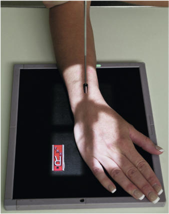
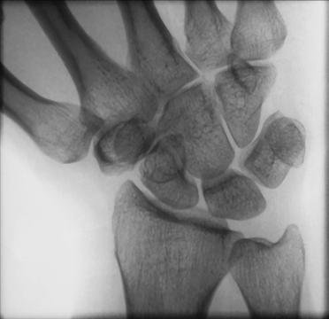

# Rx DEVIAȚIE RADIALĂ PA (POSTERO-ANTERIOARĂ) (PUMN (ARTICULAȚIE RADIOCARPIANĂ))

  📷 Radiografie Convențională (Rx)
  <strong>Actualizat:</strong> 2026-09-15
  <strong>Autor:</strong> Departamentul de Radiologie / Referință Bontrager

---

-   __1. Rezumat Clinic & Indicații__

    ---

    === "Indicații Clinice"

        - Posibilă fractură suspectată a oaselor carpiene pe partea ulnară a pumnului (articulației radiocarpiene), în special a semilunarului, triquetrului, pisiformului și hamatului

    === "Ghid Național IRIS"

        !!! info "Referință Primară: Ghidul Național IRIS (Ordinul MS 1342/2012)"
            - **Capitol Ghid IRIS:** *Aparat locomotor & Membru superior*
            - **Grad de Recomandare:** **Grad A**
            - **Nivel de Iradiere Estimată:** `Clasa 1 (Minimă < 0.01 mSv)`

            [:octicons-search-16: Deschide Ghidul IRIS](../../iris.md){ .md-button .md-button--primary } [:material-open-in-new: Aplicația Oficială PWA](https://radiologie-pediatrica.ro/iris/){ .md-button target="_blank" rel="noopener" }

-   __2. Poziționare & Centrare Fascicul__

    ---

    - **Poziție Pacient:** Pacient: Așezați pacientul la capătul mesei, cu mâna și antebrațul extinse. Coborâți umărul astfel încât umărul, cotul și pumnul (articulația radiocarpiană) să fie în același plan orizontal.; Regiune anatomică: poziționați pumnul (articulația radiocarpiană) ca pentru incidența postero-anterioară (PA)—palma în jos, cu pumnul (articulația radiocarpiană) și mâna aliniate cu centrul axei longitudinale a receptorului de imagine. Fără a mișca antebrațul, inversați ușor mâna (deplasați-o medial, spre partea policelui) atât cât poate tolera pacientul, fără ridicarea sau rotirea antebrațului distal (Fig. 4.108).
    - **Punct de Centrare Fascicul:** [Fragment incomplet în sursă] iar centrul câmpului de colimare trebuie să fie în regiunea mediocarpiană. Expunere: expunerea optimă a receptorului de imagine și contrastul, în absența mișcării, evidențiază marginile oaselor carpiene, contururile osoase și traveele trabeculare nete, fără artefacte de mișcare. Fig. 4.109 Deviație radială. Metacarpianul 5; pisiform; ulnă; os cu cârlig; piramidal; semilunar; cârligul osului cu cârlig. Fig. 4.110 Deviație radială.
    - **Distanță Focar-Film (DFF / SID):** 100 cm
    - **Comandă Respiratorie:** Apnee pe durata expunerii (sau conform cooperării pacientului)

-   __3. Parametri Tehnici Expunere__

    ---

    | Parametru Tehnic | Valoare Configurare Generator / Tub |
    |:-----------------|:-------------------------------------|
    | **Tensiune Tub (kV)** | 55 kV |
    | **Sarcină / Produs Curent-Timp (mAs)** | DE CONFIGURAT PE APARAT |
    | **Distanță Focar-Film (DFF / SID)** | 100 cm |
    | **Grilă Antidifuzoare (Bucky)** | Fără grilă (expunere directă) |
    | **Dimensiune Focar** | Focar Mic (0.6 mm) |
    | **Camere de Ionizare AEC** | DE CONFIGURAT PE APARAT |
    | **Colimare Fascicul** | Dimensiunea câmpului Colimați pe patru laturi până la nivelul regiunii carpiene. Pumn (articulație radiocarpiană) SPECIAL Incidențe pentru scafoid: |
    | **Filtrare Tub** | Totală ≥ 2.5 mm Al echivalent |

-   __4. Criterii de Calitate & Reușită Imagine__

    ---

    - Radiusul și ulna distale, oasele carpiene și oasele metacarpiene proximale sunt vizibile.
    - Oasele carpiene sunt vizibile, cu interspațiile adiacente mai deschise pe partea medială (ulnară) a pumnului (articulației radiocarpiene) (Fig. 4.109 și 4.110). Poziție:
    - Axa longitudinală a antebrațului este aliniată cu marginea laterală a receptorului de imagine.
    - Deviația radială extremă este evidențiată prin unghiul dintre axa longitudinală a oaselor metacarpiene și cea a radiusului și ulnei și prin spațiul dintre triquetrum/pisiform și procesul stiloid al ulnei.
    - Absența rotației anatomice: claviculele echidistante față de linia apofizelor spinoase. Poziția pumnului (articulației radiocarpiene) este evidențiată prin aspectul radiusului și ulnei distale.

-   __5. Protecție Radiologică (ALARA)__

    ---

    - Ecranare gonadică și a organelor radiosensibile conform procedurilor locale de radioprotecție ALARA.
    - Colimare strictă la aria de interes pentru limitarea radiației difuze.
    - Verificarea posibilității unei sarcini la pacientele de vârstă fertilă înainte de expunere.

### 🖼️ Imagini

<figure class="protocol-image-card" markdown>

<figcaption><strong>Fig. 4.108 PA pumn (articulație radiocarpiană)—deviație radială.</strong> — Poziționarea pacientului conform Ghidului Bontrager (Fig. 4.108 pumn PA—deviație radială.)</figcaption>

</figure>

<figure class="protocol-image-card" markdown>

<figcaption><strong>Fig. 4.109 Deviație radială.</strong> — Aspect radiografic de referință conform Ghidului Bontrager (Fig. 4.109 Deviație radială.)</figcaption>

</figure>

<figure class="protocol-image-card" markdown>

<figcaption><strong>Fig. 4.110 Deviație radială.</strong> — Aspect radiografic de referință conform Ghidului Bontrager (Fig. 4.110 Deviație radială.)</figcaption>

</figure>

=== "Ghid Rapid de Execuție"

    1. **Identificarea și verificarea pacientului:** verificare identitate, zonă de examinat, consimțământ conform procedurii și evaluarea posibilității unei sarcini, când este relevantă.
    2. **Pregătire:** îndepărtarea oricăror obiecte radiopace (bijuterii, agrafe, fermoare, proteze, pansamente dense).
    3. **Poziționare precisă:** alinierea receptorului de imagine și a tubului la distanța prescrisă (100 cm).
    4. **Colimare strictă:** adaptarea fasciculului strict la regiunea de diagnostic pentru scăderea iradierii și reducerea radiației difuze.
    5. **Radioprotecție:** verificarea [politicii RX](../radioprotectie.md), cu măsuri distincte pentru pacient, personal și însoțitor.

## Surse de documentare

- [Bontrager's Textbook of Radiographic Positioning (Ed. 9/10), Pagina 171](https://www.elsevier.com/books/textbook-of-radiographic-positioning-and-related-anatomy/lampignano/978-0-323-65367-1)
