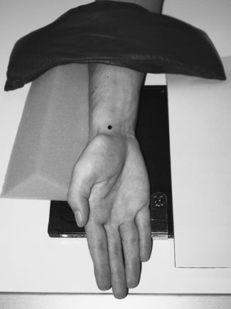
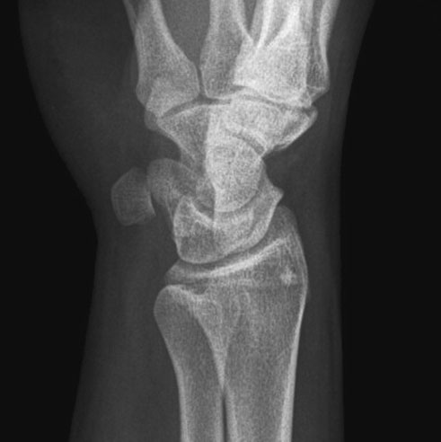
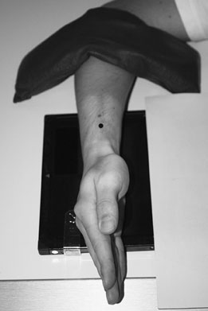
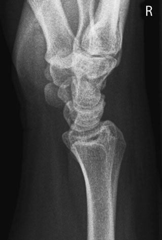
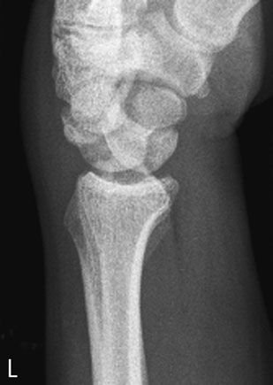

# Rx Scafoid Carpian Oblică Posterioară

  📷 Radiografie Convențională (Rx)
  <strong>Actualizat:</strong> 2026-09-16
  <strong>Autor:</strong> Departamentul de Radiologie / Referință Clark (Ed. 12)

---

-   __1. Rezumat Clinic & Indicații__

    ---

    === "Indicații Clinice"

        - suspiciune de fractură de waist de Scafoid Carpian poate fie very poorly vizibil, if la toate, la presentation. It carries high risk de delayed avascular necrosis de distal pole, which poate cause severe disability. If suspected clinically, pacientul poate fie re-examined after 10 days de imobilizare, otherwise technetium bone scan sau magnetic resonance imaging (MRI) poate offer immediate diagnosis. 1st metacarpal Trapezoid Hamate Capitate Triquetral Styloid de radius Styloid process de ulna Shaft de ulna Trapezium Pisiform Lunate Radio-carpal articulație Shaft de radius Tubercle de Scafoid Carpian oase metacarpiene 2–5 Profil (lateral) radiografie de Pumn (Articulație Radiocarpiană) Normal Profil (lateral) radiografie de Pumn (Articulație Radiocarpiană) Profil (lateral) radiografie de Pumn (Articulație Radiocarpiană) evidențiind luxație articulară de lunate. lunate bone este rotit și anteriorly displaced

    === "Ghid Național IRIS"

        !!! info "Referință Primară: Ghidul Național IRIS (Ordinul MS 1342/2012)"
            - **Capitol Ghid IRIS:** *Ghidul Național IRIS*
            - **Grad de Recomandare:** **De verificat pe indicație; fără grad atribuit automat**
            - **Nivel de Iradiere Estimată:** `De verificat pentru examinarea și populația selectate`

            [:octicons-search-16: Deschide Ghidul IRIS](../../iris.md){ .md-button .md-button--primary } [:material-open-in-new: Aplicația Oficială PWA](https://radiologie-pediatrica.ro/iris/){ .md-button target="_blank" rel="noopener" }
-   __2. Poziționare & Centrare Fascicul__

    ---

    - **Poziție Pacient:** • de la Oblică Anterioară poziție, Mână și Pumn (Articulație Radiocarpiană) sunt rotit externally through 90 grade, astfel încât posterior aspect de Mână și Pumn (Articulație Radiocarpiană) sunt la 45 grade la caseta.
• Pumn (Articulație Radiocarpiană) este plasat over unexposed quarter de caseta, cu Pumn (Articulație Radiocarpiană) și Mână sprijinit pe a 45-grade non-opaque foam pad.
• Antebrațul este imobilizat cu ajutorul unui săculeț cu nisip.

• de la Oblică Posterioară poziție, Mână și Pumn (Articulație Radiocarpiană) sunt rotit internally through 45 grade, astfel încât medial aspect de Pumn (Articulație Radiocarpiană) este în contact cu caseta.
• Mână este ajustat la ensure that radial și ulnar styloid processes sunt superimposed.
• Mână și Pumn (Articulație Radiocarpiană) sunt imobilizat using non-opaque pads și săculeți cu nisip.
    - **Punct de Centrare Fascicul:** • Raza centrală verticală este centrată pe styloid process de ulna.

• Raza centrală verticală este centrată pe radial styloid process.
    - **Distanță Focar-Film (DFF / SID):** 100 cm
    - **Comandă Respiratorie:** Apnee pe durata expunerii (apnee în inspir pentru torace; expir pentru Abdomen/bazin).

-   __3. Parametri Tehnici Expunere__

    ---

    | Parametru Tehnic | Valoare Configurare Generator / Tub |
    |:-----------------|:-------------------------------------|
    | **Tensiune Tub (kV)** | DE CONFIGURAT PE APARAT |
    | **Sarcină / Produs Curent-Timp (mAs)** | Conform AEC / grosime anatomică |
    | **Distanță Focar-Film (DFF / SID)** | 100 cm |
    | **Grilă Antidifuzoare (Bucky)** | Conform grosimii anatomice (> 10-12 cm cu grilă) |
    | **Dimensiune Focar** | Focar Mic (0.6 mm) |
    | **Camere de Ionizare AEC** | DE CONFIGURAT PE APARAT |
    | **Colimare Fascicul** | Colimare strictă la aria anatomică de interes diagnostic |
    | **Filtrare Tub** | Totală ≥ 2.5 mm Al echivalent (conform Clark: 3.0 mm Al eq.) |

-   __4. Criterii de Calitate & Reușită Imagine__

    ---

    - imagine trebuie să include extremitatea distală radius și ulna și extremitatea proximală oase metacarpiene.
    - pisiform trebuie să fie seen clearly în profile situated anterior la triquetral.
    - axa longitudinală de Scafoid Carpian trebuie să fie seen perpendicular pe casetă. 52 Hook de hamate Capitate Triquetral Pisiform Lunate Ulna articulații carpometacarpiene (CMC) 1-5 Trapezoid Trapezium Scafoid Carpian Radio-carpal articulație Radius 1 2 3 4 5 Oblică Posterioară radiografie de Pumn (Articulație Radiocarpiană) Normal Oblică Posterioară radiografie de Pumn (Articulație Radiocarpiană)
    - imagine trebuie să include extremitatea distală radius și ulna și extremitatea proximală oase metacarpiene.
    - imagine trebuie să evidențiază clearly orice subluxation sau luxație articulară de oase carpiene.

-   __5. Protecție Radiologică (ALARA)__

    ---

    - Ecranare gonadică cu șorț plumbat dacă gonadele sunt în apropierea fasciculului util (regula ALARA).
    - Colimare precisă la dimensiunea anatomică strict necesară pentru reducerea dozei și a radiației difuze.
    - Verificarea posibilității unei sarcini la pacientele de vârstă fertilă înainte de expunere.

!!! note "Observații Clinice & Tehnice"
    Pregătirea pacientului prin îndepărtarea tuturor accesoriilor radio-opace.

### 🖼️ Imagini

<figure class="protocol-image-card" markdown>

<figcaption><strong>Oblică Posterioară radiografie de Pumn (Articulație Radiocarpiană)</strong> — Poziționare pacient și centrare fascicul conform Clark (Ed. 12)</figcaption>

</figure>

<figure class="protocol-image-card" markdown>

<figcaption><strong>Normal Oblică Posterioară radiografie de Pumn (Articulație Radiocarpiană)</strong> — Aspect radiografic / ghid de poziționare conform tratatului Clark (Ed. 12)</figcaption>

</figure>

<figure class="protocol-image-card" markdown>

<figcaption><strong>Figura 3: Aspect radiografic / Poziționare (Clark Ed. 12)</strong> — Aspect radiografic / ghid de poziționare conform tratatului Clark (Ed. 12)</figcaption>

</figure>

<figure class="protocol-image-card" markdown>

<figcaption><strong>• suspiciune de fractură de waist de Scafoid Carpian poate fie very poorly vis-</strong> — Aspect radiografic / ghid de poziționare conform tratatului Clark (Ed. 12)</figcaption>

</figure>

<figure class="protocol-image-card" markdown>

<figcaption><strong>Profil (lateral) radiografie de Pumn (Articulație Radiocarpiană)</strong> — Aspect radiografic / ghid de poziționare conform tratatului Clark (Ed. 12)</figcaption>

</figure>

<figure class="protocol-image-card" markdown>

<figcaption><strong>Normal Profil (lateral) radiografie de Pumn (Articulație Radiocarpiană)</strong> — Aspect radiografic / ghid de poziționare conform tratatului Clark (Ed. 12)</figcaption>

</figure>

<figure class="protocol-image-card" markdown>

<figcaption><strong>Profil (lateral) radiografie de Pumn (Articulație Radiocarpiană) evidențiind luxație articulară de lunate. lunate</strong> — Aspect radiografic / ghid de poziționare conform tratatului Clark (Ed. 12)</figcaption>

</figure>

=== "Ghid Rapid de Execuție"

    1. **Identificarea și verificarea pacientului:** verificare identitate, zonă de examinat, consimțământ conform procedurii și evaluarea posibilității unei sarcini, când este relevantă.
    2. **Pregătire:** îndepărtarea oricăror obiecte radiopace (bijuterii, agrafe, fermoare, proteze, pansamente dense).
    3. **Poziționare precisă:** alinierea receptorului de imagine și a tubului la distanța prescrisă (100 cm).
    4. **Colimare strictă:** adaptarea fasciculului strict la regiunea de diagnostic pentru scăderea iradierii și reducerea radiației difuze.
    5. **Radioprotecție:** verificarea [politicii RX](../radioprotectie.md), cu măsuri distincte pentru pacient, personal și însoțitor.

## Surse de documentare

- [Clark's Positioning in Radiography (Ed. 12), Pagina 67](../../assets/protocols/sources/Clark___Positioning_in_Radiography__12th_edition.pdf#page=67)
