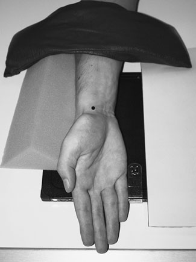
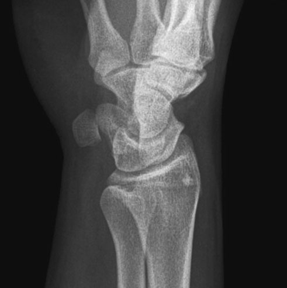
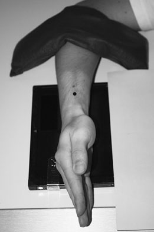
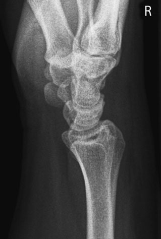
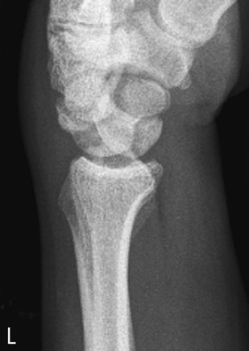

# Rx scafoid carpian, incidență oblică posterioară

  📷 Radiografie Convențională (Rx)
  <strong>Actualizat:</strong> 2026-09-16
  <strong>Autor:</strong> Departamentul de Radiologie / Referință Clark (Ed. 12)

---

-   __1. Rezumat Clinic & Indicații__

    ---

    === "Indicații Clinice"

        - Fractura suspectată la nivelul taliei scafoidului carpian poate fi foarte slab vizibilă sau chiar invizibilă la prezentare. Aceasta prezintă un risc crescut de necroză avasculară tardivă a polului distal, care poate cauza dizabilitate severă. Dacă există suspiciune clinică, pacientul poate fi reexaminat după 10 zile de imobilizare; în caz contrar, scintigrafia osoasă cu technețiu sau imagistica prin rezonanță magnetică (MRI) poate oferi un diagnostic imediat. Metacarpianul 1; trapezoid; os cu cârlig; capitat; piramidal; procesul stiloid al radiusului; procesul stiloid al ulnei; diafiza ulnei; trapez; pisiform; semilunar; articulație radiocarpiană; diafiza radiusului; tuberculul scafoidului carpian; metacarpienele 2–5. Radiografie de profil a pumnului (articulației radiocarpiene). Normal. Radiografie de profil a pumnului (articulației radiocarpiene). Radiografie de profil a pumnului (articulației radiocarpiene), evidențiind luxația semilunarului. Osul semilunar este rotit și deplasat anterior.

    === "Ghid Național IRIS"

        !!! info "Referință Primară: Ghidul Național IRIS (Ordinul MS 1342/2012)"
            - **Capitol Ghid IRIS:** *Aparat locomotor & Membru superior*
            - **Grad de Recomandare:** **Grad A**
            - **Nivel de Iradiere Estimată:** `Clasa 1 (Minimă < 0.01 mSv)`

            [:octicons-search-16: Deschide Ghidul IRIS](../../iris.md){ .md-button .md-button--primary } [:material-open-in-new: Aplicația Oficială PWA](https://radiologie-pediatrica.ro/iris/){ .md-button target="_blank" rel="noopener" }

-   __2. Poziționare & Centrare Fascicul__

    ---

    - **Poziție Pacient:**
        - Din poziția oblică anterioară, mâna și pumnul (articulația radiocarpiană) sunt rotite extern cu 90 de grade, astfel încât aspectul posterior al mâinii și pumnului (articulației radiocarpiene) să fie la 45 de grade față de casetă.
        - Pumnul (articulația radiocarpiană) este așezat peste un sfert neexpus al casetei, cu pumnul (articulația radiocarpiană) și mâna sprijinite pe un suport din spumă radiotransparentă de 45 de grade.
        - Antebrațul este imobilizat cu ajutorul unui săculeț cu nisip.
        - Din poziția oblică posterioară, mâna și pumnul (articulația radiocarpiană) sunt rotite intern cu 45 de grade, astfel încât aspectul medial al pumnului (articulației radiocarpiene) să fie în contact cu caseta.
        - Mâna este ajustată pentru a asigura suprapunerea proceselor stiloide radial și ulnar.
        - Mâna și pumnul (articulația radiocarpiană) sunt imobilizate folosind suporturi radiotransparente și săculeți cu nisip.
    - **Punct de Centrare Fascicul:**
        - Raza centrală verticală este centrată pe procesul stiloid al ulnei.
        - Raza centrală verticală este centrată pe procesul stiloid radial.
    - **Distanță Focar-Film (DFF / SID):** 100 cm
    - **Comandă Respiratorie:** Apnee pe durata expunerii (apnee în inspir pentru torace; expir pentru Abdomen/bazin).

-   __3. Parametri Tehnici Expunere__

    ---

    | Parametru Tehnic | Valoare Configurare Generator / Tub |
    |:-----------------|:-------------------------------------|
    | **Tensiune Tub (kV)** | DE CONFIGURAT PE APARAT |
    | **Sarcină / Produs Curent-Timp (mAs)** | Conform AEC / grosimii anatomice |
    | **Distanță Focar-Film (DFF / SID)** | 100 cm |
    | **Grilă Antidifuzoare (Bucky)** | Conform grosimii anatomice (> 10-12 cm cu grilă) |
    | **Dimensiune Focar** | Focar Mic (0.6 mm) |
    | **Camere de Ionizare AEC** | DE CONFIGURAT PE APARAT |
    | **Colimare Fascicul** | Colimare strictă la aria anatomică de interes diagnostic |
    | **Filtrare Tub** | Totală ≥ 2.5 mm Al echivalent (conform Clark: 3.0 mm Al echivalent) |

-   __4. Criterii de Calitate & Reușită Imagine__

    ---

    - Imaginea trebuie să includă extremitatea distală a radiusului și ulnei și extremitatea proximală a oaselor metacarpiene.
    - Pisiformul trebuie să fie vizibil clar în profil, situat anterior față de triquetrum.
    - Axa longitudinală a scafoidului carpian trebuie să fie vizibilă perpendicular pe casetă. 52 Cârligul hamatului Capitat Triquetrum Pisiform Semilunar Ulna Articulații carpometacarpiene (CMC) 1-5 Trapezoid Trapez Scafoid carpian Articulație radiocarpiană Radius 1 2 3 4 5 Radiografie oblică posterioară a pumnului (articulației radiocarpiene) Normal Radiografie oblică posterioară a pumnului (articulației radiocarpiene)
    - Imaginea trebuie să includă extremitatea distală a radiusului și ulnei și extremitatea proximală a oaselor metacarpiene.
    - Imaginea trebuie să evidențieze clar orice subluxație sau luxație articulară a oaselor carpiene.

-   __5. Protecție Radiologică (ALARA)__

    ---

    - Ecranare gonadică cu șorț plumbat dacă gonadele sunt în apropierea fasciculului util (regula ALARA).
    - Colimare precisă la dimensiunea anatomică strict necesară pentru reducerea dozei și a radiației difuze.
    - Verificarea posibilității unei sarcini la pacientele de vârstă fertilă înainte de expunere.

!!! note "Observații Clinice & Tehnice"
    Pregătirea pacientului prin îndepărtarea tuturor accesoriilor radio-opace.

### 🖼️ Imagini

<figure class="protocol-image-card" markdown>

<figcaption><strong>Radiografie oblică posterioară a pumnului (articulației radiocarpiene)</strong> — Poziționarea pacientului și centrarea fasciculului conform Clark (Ed. 12)</figcaption>

</figure>

<figure class="protocol-image-card" markdown>

<figcaption><strong>Radiografie oblică posterioară normală a pumnului (articulației radiocarpiene)</strong> — Aspect radiografic / ghid de poziționare conform tratatului Clark (Ed. 12)</figcaption>

</figure>

<figure class="protocol-image-card" markdown>

<figcaption><strong>Figura 3: Aspect radiografic / Poziționare (Clark Ed. 12)</strong> — Aspect radiografic / ghid de poziționare conform tratatului Clark (Ed. 12)</figcaption>

</figure>

<figure class="protocol-image-card" markdown>

<figcaption><strong>• Fractura suspectată a taliei scafoidului carpian poate fi foarte puțin viz-</strong> — Aspect radiografic / ghid de poziționare conform tratatului Clark (Ed. 12)</figcaption>

</figure>

<figure class="protocol-image-card" markdown>

<figcaption><strong>Radiografie de profil (laterală) a pumnului (articulației radiocarpiene)</strong> — Aspect radiografic / ghid de poziționare conform tratatului Clark (Ed. 12)</figcaption>

</figure>

<figure class="protocol-image-card" markdown>

<figcaption><strong>Radiografie normală de profil (laterală) a pumnului (articulației radiocarpiene)</strong> — Aspect radiografic / ghid de poziționare conform tratatului Clark (Ed. 12)</figcaption>

</figure>

<figure class="protocol-image-card" markdown>

<figcaption><strong>Radiografie de profil (laterală) a pumnului (articulației radiocarpiene), evidențiind luxația articulară a semilunarului. semilunarul</strong> — Aspect radiografic / ghid de poziționare conform tratatului Clark (Ed. 12)</figcaption>

</figure>

=== "Ghid Rapid de Execuție"

    1. **Identificarea și verificarea pacientului:** verificare identitate, zonă de examinat, consimțământ conform procedurii și evaluarea posibilității unei sarcini, când este relevantă.
    2. **Pregătire:** îndepărtarea oricăror obiecte radiopace (bijuterii, agrafe, fermoare, proteze, pansamente dense).
    3. **Poziționare precisă:** alinierea receptorului de imagine și a tubului la distanța prescrisă (100 cm).
    4. **Colimare strictă:** adaptarea fasciculului strict la regiunea de diagnostic pentru scăderea iradierii și reducerea radiației difuze.
    5. **Radioprotecție:** verificarea [politicii RX](../radioprotectie.md), cu măsuri distincte pentru pacient, personal și însoțitor.

## Surse de documentare

- [Clark's Positioning in Radiography (Ed. 12), Pagina 67](https://books.google.com/books/about/Clark_s_Positioning_in_Radiography.html?id=Xxu6MwEACAAJ)
