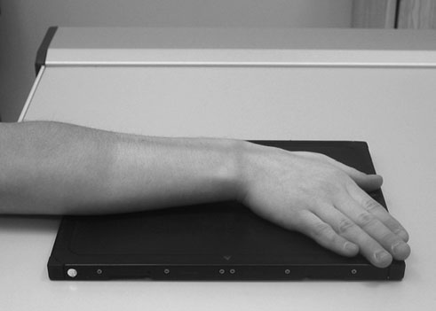
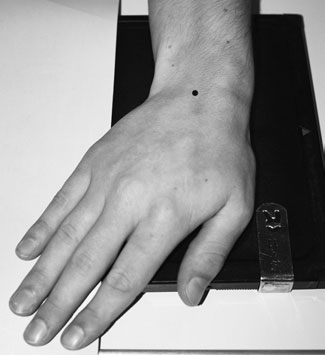
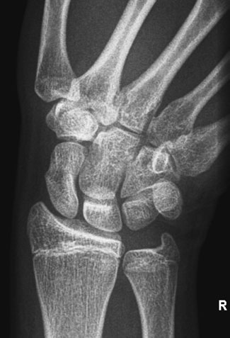
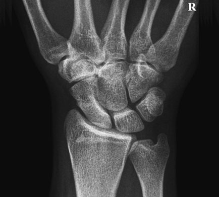

# Rx Scafoid Carpian Postero-Anterior (PA) - Deviație Ulnară

  📷 Radiografie Convențională (Rx)
  <strong>Actualizat:</strong> 2026-09-16
  <strong>Autor:</strong> Departamentul de Radiologie / Referință Clark (Ed. 12)

---

-   __1. Rezumat Clinic & Indicații__

    ---

    === "Indicații Clinice"

        - Four incidențe poate fie taken la evidențiază toate oase carpiene using a 24  30-cm casetă, fiecare quarter being used în turn, cu other three-quarters masked off using lead rubber. pentru Scafoid Carpian suspiciune de fractură, three incidențe sunt normally taken: Postero-anterior (PA), Oblică Anterioară și Profil (lateral).

    === "Ghid Național IRIS"

        !!! info "Referință Primară: Ghidul Național IRIS (Ordinul MS 1342/2012)"
            - **Capitol Ghid IRIS:** *Ghidul Național IRIS*
            - **Grad de Recomandare:** **De verificat pe indicație; fără grad atribuit automat**
            - **Nivel de Iradiere Estimată:** `De verificat pentru examinarea și populația selectate`

            [:octicons-search-16: Deschide Ghidul IRIS](../../iris.md){ .md-button .md-button--primary } [:material-open-in-new: Aplicația Oficială PWA](https://radiologie-pediatrica.ro/iris/){ .md-button target="_blank" rel="noopener" }
-   __2. Poziționare & Centrare Fascicul__

    ---

    - **Poziție Pacient:** • Pacientul este așezat pe scaun lângă masa de examinare cu partea afectată nearest masa de examinare.
• braț este extins across masa de examinare cu Cot flectat și Antebraț (Radius și Ulna) în pronație.
• If possible, Umăr, Cot și Pumn (Articulație Radiocarpiană) trebuie să fie la nivelul tabletop.
• Pumn (Articulație Radiocarpiană) este poziționat over one-quarter de caseta și Mână este în adducție (Deviație Ulnară).
• Ensure that radial și ulnar styloid processes sunt echidistant față de caseta.
• Mână și lower Antebraț (Radius și Ulna) sunt imobilizat using săculeți cu nisip.
    - **Punct de Centrare Fascicul:** • raza centrală verticală centrală este centred midway între radial și ulnar styloid processes.
    - **Distanță Focar-Film (DFF / SID):** 100 cm
    - **Comandă Respiratorie:** Apnee pe durata expunerii (apnee în inspir pentru torace; expir pentru Abdomen/bazin).

-   __3. Parametri Tehnici Expunere__

    ---

    | Parametru Tehnic | Valoare Configurare Generator / Tub |
    |:-----------------|:-------------------------------------|
    | **Tensiune Tub (kV)** | DE CONFIGURAT PE APARAT |
    | **Sarcină / Produs Curent-Timp (mAs)** | Conform AEC / grosime anatomică |
    | **Distanță Focar-Film (DFF / SID)** | 100 cm |
    | **Grilă Antidifuzoare (Bucky)** | Conform grosimii anatomice (> 10-12 cm cu grilă) |
    | **Dimensiune Focar** | Focar Mic (0.6 mm) |
    | **Camere de Ionizare AEC** | DE CONFIGURAT PE APARAT |
    | **Colimare Fascicul** | Colimare strictă adaptată pe receptor 24 x 30 cm |
    | **Filtrare Tub** | Totală ≥ 2.5 mm Al echivalent (conform Clark: 3.0 mm Al eq.) |

-   __4. Criterii de Calitate & Reușită Imagine__

    ---

    - imagine trebuie să include extremitatea distală radius și ulna și extremitatea proximală oase metacarpiene.
    - spații articulare around Scafoid Carpian trebuie să fie clar evidențiat(e). 50 articulații carpometacarpiene (CMC) Trapezium Trapezoid Capitate Scafoid Carpian Styloid process de radius Radio-carpal articulație Hook de hamate Hamate Triquetral Pisiform Lunate Styloid process de ulna Radio-ulnar articulație 1 2 3 4 5 Antero-posterior (AP) radiografie de Pumn (Articulație Radiocarpiană) Normal Postero-anterior (PA) radiografie de Scafoid Carpian în Deviație Ulnară

-   __5. Protecție Radiologică (ALARA)__

    ---

    - Ecranare gonadică cu șorț plumbat dacă gonadele sunt în apropierea fasciculului util (regula ALARA).
    - Colimare precisă la dimensiunea anatomică strict necesară pentru reducerea dozei și a radiației difuze.
    - Verificarea posibilității unei sarcini la pacientele de vârstă fertilă înainte de expunere.

!!! note "Observații Clinice & Tehnice"
    Pregătirea pacientului prin îndepărtarea tuturor accesoriilor radio-opace.

### 🖼️ Imagini

<figure class="protocol-image-card" markdown>

<figcaption><strong>pentru Scafoid Carpian suspiciune de fractură, three incidențe sunt normally taken:</strong> — Poziționare pacient și centrare fascicul conform Clark (Ed. 12)</figcaption>

</figure>

<figure class="protocol-image-card" markdown>

<figcaption><strong>• spații articulare around Scafoid Carpian trebuie să fie evidențiat</strong> — Aspect radiografic / ghid de poziționare conform tratatului Clark (Ed. 12)</figcaption>

</figure>

<figure class="protocol-image-card" markdown>

<figcaption><strong>Antero-posterior (AP) radiografie de Pumn (Articulație Radiocarpiană)</strong> — Aspect radiografic / ghid de poziționare conform tratatului Clark (Ed. 12)</figcaption>

</figure>

<figure class="protocol-image-card" markdown>

<figcaption><strong>Normal Postero-anterior (PA) radiografie de Scafoid Carpian în Deviație Ulnară</strong> — Aspect radiografic / ghid de poziționare conform tratatului Clark (Ed. 12)</figcaption>

</figure>

=== "Ghid Rapid de Execuție"

    1. **Identificarea și verificarea pacientului:** verificare identitate, zonă de examinat, consimțământ conform procedurii și evaluarea posibilității unei sarcini, când este relevantă.
    2. **Pregătire:** îndepărtarea oricăror obiecte radiopace (bijuterii, agrafe, fermoare, proteze, pansamente dense).
    3. **Poziționare precisă:** alinierea receptorului de imagine și a tubului la distanța prescrisă (100 cm).
    4. **Colimare strictă:** adaptarea fasciculului strict la regiunea de diagnostic pentru scăderea iradierii și reducerea radiației difuze.
    5. **Radioprotecție:** verificarea [politicii RX](../radioprotectie.md), cu măsuri distincte pentru pacient, personal și însoțitor.

## Surse de documentare

- [Clark's Positioning in Radiography (Ed. 12), Pagina 65](../../assets/protocols/sources/Clark___Positioning_in_Radiography__12th_edition.pdf#page=65)
