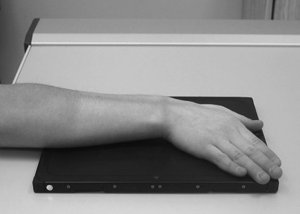
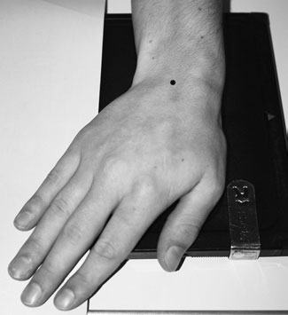
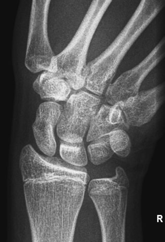
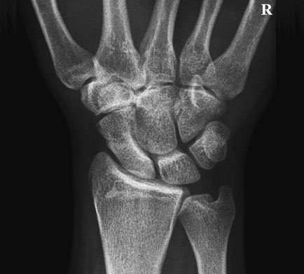

# Rx scafoid carpian, incidență postero-anterioară (PA) – deviație ulnară

  📷 Radiografie Convențională (Rx)
  <strong>Actualizat:</strong> 2026-09-16
  <strong>Autor:</strong> Departamentul de Radiologie / Referință Clark (Ed. 12)

---

-   __1. Rezumat Clinic & Indicații__

    ---

    === "Indicații Clinice"

        - Patru incidențe pot fi efectuate pentru a evidenția toate oasele carpiene folosind o casetă de 24 × 30 cm, fiecare sfert fiind utilizat pe rând, iar celelalte trei sferturi fiind ecranate cu cauciuc plumbat. Pentru suspiciunea de fractură a scafoidului carpian, se efectuează de obicei trei incidențe: postero-anterioară (PA), oblică anterioară și de profil (laterală).

    === "Ghid Național IRIS"

        !!! info "Referință Primară: Ghidul Național IRIS (Ordinul MS 1342/2012)"
            - **Capitol Ghid IRIS:** *Aparat locomotor & Membru superior*
            - **Grad de Recomandare:** **Grad A**
            - **Nivel de Iradiere Estimată:** `Clasa 1 (Minimă < 0.01 mSv)`

            [:octicons-search-16: Deschide Ghidul IRIS](../../iris.md){ .md-button .md-button--primary } [:material-open-in-new: Aplicația Oficială PWA](https://radiologie-pediatrica.ro/iris/){ .md-button target="_blank" rel="noopener" }

-   __2. Poziționare & Centrare Fascicul__

    ---

    - **Poziție Pacient:**
        - Pacientul este așezat pe scaun lângă masa de examinare, cu partea afectată cea mai apropiată de masa de examinare.
        - Brațul este extins peste masa de examinare, cu cotul flectat și antebrațul (radiusul și ulna) în pronație.
        - Dacă este posibil, umărul, cotul și pumnul (articulația radiocarpiană) trebuie să fie la nivelul mesei.
        - Pumnul (articulația radiocarpiană) este poziționat peste un sfert al casetei, iar mâna este în adducție (deviație ulnară).
        - Asigurați-vă că procesele stiloide radial și ulnar sunt echidistante față de casetă.
        - Mâna și partea distală a antebrațului (radiusul și ulna) sunt imobilizate folosind săculeți cu nisip.
    - **Punct de Centrare Fascicul:** • Raza centrală verticală este centrată la jumătatea distanței dintre procesele stiloide radial și ulnar.
    - **Distanță Focar-Film (DFF / SID):** 100 cm
    - **Comandă Respiratorie:** Apnee pe durata expunerii (apnee în inspir pentru torace; expir pentru Abdomen/bazin).

-   __3. Parametri Tehnici Expunere__

    ---

    | Parametru Tehnic | Valoare Configurare Generator / Tub |
    |:-----------------|:-------------------------------------|
    | **Tensiune Tub (kV)** | DE CONFIGURAT PE APARAT |
    | **Sarcină / Produs Curent-Timp (mAs)** | Conform AEC / grosimii anatomice |
    | **Distanță Focar-Film (DFF / SID)** | 100 cm |
    | **Grilă Antidifuzoare (Bucky)** | Conform grosimii anatomice (> 10-12 cm cu grilă) |
    | **Dimensiune Focar** | Focar Mic (0.6 mm) |
    | **Camere de Ionizare AEC** | DE CONFIGURAT PE APARAT |
    | **Colimare Fascicul** | Colimare strictă adaptată pe receptor 24 x 30 cm |
    | **Filtrare Tub** | Totală ≥ 2.5 mm Al echivalent (conform Clark: 3.0 mm Al echivalent) |

-   __4. Criterii de Calitate & Reușită Imagine__

    ---

    - Imaginea trebuie să includă extremitatea distală a radiusului și ulnei și extremitatea proximală a oaselor metacarpiene.
    - Spațiile articulare din jurul scafoidului carpian trebuie să fie evidențiate clar. 50 Articulații carpometacarpiene (CMC) Trapez Trapezoid Capitat Scafoid carpian Proces stiloid al radiusului Articulație radiocarpiană Cârligul hamatului Hamatus Triquetrum Pisiform Semilunar Proces stiloid al ulnei Articulație radioulnară 1 2 3 4 5 Radiografie anteroposterioară (AP) a pumnului (articulației radiocarpiene) Normal Radiografie postero-anterioară (PA) a scafoidului carpian în deviație ulnară

-   __5. Protecție Radiologică (ALARA)__

    ---

    - Ecranare gonadică cu șorț plumbat dacă gonadele sunt în apropierea fasciculului util (regula ALARA).
    - Colimare precisă la dimensiunea anatomică strict necesară pentru reducerea dozei și a radiației difuze.
    - Verificarea posibilității unei sarcini la pacientele de vârstă fertilă înainte de expunere.

!!! note "Observații Clinice & Tehnice"
    Pregătirea pacientului prin îndepărtarea tuturor accesoriilor radio-opace.

### 🖼️ Imagini

<figure class="protocol-image-card" markdown>

<figcaption><strong>Pentru suspiciunea de fractură a scafoidului carpian, se efectuează de obicei trei incidențe:</strong> — Poziționarea pacientului și centrarea fasciculului conform Clark (Ed. 12)</figcaption>

</figure>

<figure class="protocol-image-card" markdown>

<figcaption><strong>• Spațiile articulare din jurul scafoidului carpian trebuie să fie evidențiate</strong> — Aspect radiografic / ghid de poziționare conform tratatului Clark (Ed. 12)</figcaption>

</figure>

<figure class="protocol-image-card" markdown>

<figcaption><strong>Radiografie anteroposterioară (AP) a pumnului (articulației radiocarpiene)</strong> — Aspect radiografic / ghid de poziționare conform tratatului Clark (Ed. 12)</figcaption>

</figure>

<figure class="protocol-image-card" markdown>

<figcaption><strong>Radiografie postero-anterioară (PA) normală a scafoidului carpian în deviație ulnară</strong> — Aspect radiografic / ghid de poziționare conform tratatului Clark (Ed. 12)</figcaption>

</figure>

=== "Ghid Rapid de Execuție"

    1. **Identificarea și verificarea pacientului:** verificare identitate, zonă de examinat, consimțământ conform procedurii și evaluarea posibilității unei sarcini, când este relevantă.
    2. **Pregătire:** îndepărtarea oricăror obiecte radiopace (bijuterii, agrafe, fermoare, proteze, pansamente dense).
    3. **Poziționare precisă:** alinierea receptorului de imagine și a tubului la distanța prescrisă (100 cm).
    4. **Colimare strictă:** adaptarea fasciculului strict la regiunea de diagnostic pentru scăderea iradierii și reducerea radiației difuze.
    5. **Radioprotecție:** verificarea [politicii RX](../radioprotectie.md), cu măsuri distincte pentru pacient, personal și însoțitor.

## Surse de documentare

- [Clark's Positioning in Radiography (Ed. 12), Pagina 65](https://books.google.com/books/about/Clark_s_Positioning_in_Radiography.html?id=Xxu6MwEACAAJ)
