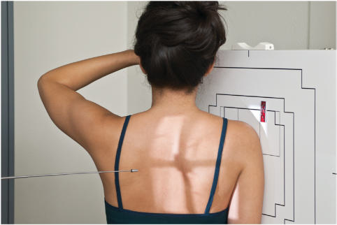
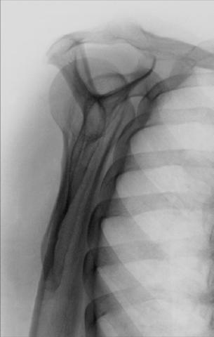
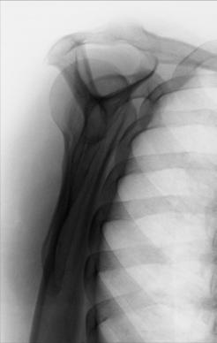
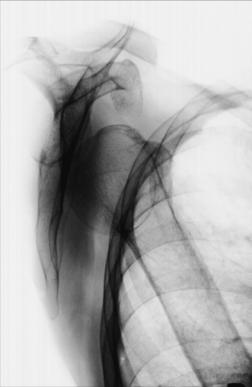

# Rx SCAPULAR Y LATERAL PA Oblică (Umăr (traumatism acuttism / Regim Urgență))

  📷 Radiografie Convențională (Rx)
  <strong>Actualizat:</strong> 2026-09-15
  <strong>Autor:</strong> Departamentul de Radiologie / Referință Bontrager

---

-   __1. Rezumat Clinic & Indicații__

    ---

    === "Indicații Clinice"

        - suspiciune de fractură or luxație / subluxație articulară of proximal Humerus and Omoplat (Scapulă)
        - Humeral head is demonstrated inferior to coracoid process with anterior luxație / subluxație articulară; for less common posterior luxație / subluxație articulară, humeral head is demonstrated inferior to acromion process

    === "Ghid Național IRIS"

        !!! info "Referință Primară: Ghidul Național IRIS (Ordinul MS 1342/2012)"
            - **Capitol Ghid IRIS:** *Ghidul Național IRIS*
            - **Grad de Recomandare:** **De verificat pe indicație; fără grad atribuit automat**
            - **Nivel de Iradiere Estimată:** `De verificat pentru examinarea și populația selectate`

            [:octicons-search-16: Deschide Ghidul IRIS](../../iris.md){ .md-button .md-button--primary } [:material-open-in-new: Aplicația Oficială PWA](https://radiologie-pediatrica.ro/iris/){ .md-button target="_blank" rel="noopener" }
-   __2. Poziționare & Centrare Fascicul__

    ---

    - **Poziție Pacient:** Pacient: Perform radiograph with patient in Ortostatism or Decubit position. (The Ortostatism position is usually more comfortable for the patient.); Regiune anatomică: Rotate into an anterior Incidență Oblică as for a lateral Omoplat (Scapulă) with patient facing IR. Palpate the superior angle of the Omoplat (Scapulă) and AC joint articulation. Rotate the patient until an imaginary line between those two points is perpendicular to IR. Because of differences among patients, the amount of body obliquity may range from 45° to 60° (Fig. 5.77). Center scapulohumeral joint to CR and to center of IR. Abduct arm slightly, if possible, so as not to superimpose proximal Humerus over Coaste (Grilaj Costal); do not attempt to rotate arm.
    - **Punct de Centrare Fascicul:** perpendicular to IR, directed to scapulohumeral joint (2 inches [5 cm] below AC joint) (see NOTE)
    - **Distanță Focar-Film (DFF / SID):** 100 cm
    - **Comandă Respiratorie:** Suspend respiration during exposure.

-   __3. Parametri Tehnici Expunere__

    ---

    | Parametru Tehnic | Valoare Configurare Generator / Tub |
    |:-----------------|:-------------------------------------|
    | **Tensiune Tub (kV)** | 70-85 kV |
    | **Sarcină / Produs Curent-Timp (mAs)** | DE CONFIGURAT PE APARAT |
    | **Distanță Focar-Film (DFF / SID)** | 100 cm |
    | **Grilă Antidifuzoare (Bucky)** | Cu grilă antidifuzoare Bucky |
    | **Dimensiune Focar** | Focar Mic (0.6 mm) |
    | **Camere de Ionizare AEC** | Camerele laterale (sau camera centrală funcție de regiune) |
    | **Colimare Fascicul** | Field Size Collimate on four sides to area of interest. |
    | **Filtrare Tub** | Totală ≥ 2.5 mm Al echivalent |

-   __4. Criterii de Calitate & Reușită Imagine__

    ---

    - True lateral view of the Omoplat (Scapulă), proximal Humerus, and scapulohumeral joint. Position:
    - The thin body of the Omoplat (Scapulă) should be seen on end without rib superimposition (Fig. 5.78).
    - The acromion and coracoid processes should appear as nearly symmetric upper limbs of the Y.
    - The humeral head should appear superimposed over the base of the Y if the Humerus is not dislocated (Fig. 5.79). Fig. 5.80 shows an anterior luxație / subluxație articulară of the proximal Humerus.
    - Collimation field size to area of interest. Exposure:
    - Optimal image receptor exposure and contrast with no motion visualize sharp bony borders and the outline of the body of the Omoplat (Scapulă) through the proximal Humerus. Fig. 5.77 PA oblique (scapular Y lateral) with Raza centrală perpendiculară. Humerus Inferior angle Acromion R Claviculă Coracoid process Body of Omoplat (Scapulă) Head of Humerus Fig. 5.78 PA oblique (scapular Y lateral) projection. R Fig. 5.79 PA oblique (scapular Y lateral) with no luxație / subluxație articulară. R Fig. 5.80 PA oblique (scapular Y lateral) with anterior luxație / subluxație articulară.

-   __5. Protecție Radiologică (ALARA)__

    ---

    - Ecranare gonadică și a organelor radiosensibile conform procedurilor locale de radioprotecție ALARA.
    - Colimare strictă la aria de interes pentru limitarea radiației difuze.
    - Verificarea posibilității unei sarcini la pacientele de vârstă fertilă înainte de expunere.

!!! note "Observații Clinice & Tehnice"
    If necessary, because of the patient’s condition, this PA oblique (scapular Y lateral) may be taken Decubit in the opposite AP Incidență Oblică with injured Umăr elevated (see Lateral Omoplat (Scapulă), Decubit). Umăr (traumatism acuttism / Regim Urgență) ROUTINE AP (neutral rotation) Transthoracic lateral or PA oblique (scapular Y lateral)

### 🖼️ Imagini

<figure class="protocol-image-card" markdown>

<figcaption><strong>Fig. 5.77 PA oblique (scapular Y lateral) with Raza centrală perpendiculară.</strong> — Poziționare pacient conform Ghidului Bontrager (Fig. 5.77 PA oblique (scapular Y lateral) with CR perpendicular.)</figcaption>

</figure>

<figure class="protocol-image-card" markdown>

<figcaption><strong>Fig. 5.78 PA oblique (scapular Y lateral) projection.</strong> — Aspect radiografic de referință conform Ghidului Bontrager (Fig. 5.78 PA oblique (scapular Y lateral) projection.)</figcaption>

</figure>

<figure class="protocol-image-card" markdown>

<figcaption><strong>Fig. 5.79 PA oblique (scapular Y</strong> — Aspect radiografic de referință conform Ghidului Bontrager (Fig. 5.79 PA oblique (scapular Y)</figcaption>

</figure>

<figure class="protocol-image-card" markdown>

<figcaption><strong>Fig. 5.80 PA oblique (scapular Y</strong> — Aspect radiografic de referință conform Ghidului Bontrager (Fig. 5.80 PA oblique (scapular Y)</figcaption>

</figure>

=== "Ghid Rapid de Execuție"

    1. **Identificarea și verificarea pacientului:** verificare identitate, zonă de examinat, consimțământ conform procedurii și evaluarea posibilității unei sarcini, când este relevantă.
    2. **Pregătire:** îndepărtarea oricăror obiecte radiopace (bijuterii, agrafe, fermoare, proteze, pansamente dense).
    3. **Poziționare precisă:** alinierea receptorului de imagine și a tubului la distanța prescrisă (100 cm).
    4. **Colimare strictă:** adaptarea fasciculului strict la regiunea de diagnostic pentru scăderea iradierii și reducerea radiației difuze.
    5. **Radioprotecție:** verificarea [politicii RX](../radioprotectie.md), cu măsuri distincte pentru pacient, personal și însoțitor.

## Surse de documentare

- [Bontrager's Textbook of Radiographic Positioning (Ed. 9/10), Pagina 214](https://www.elsevier.com/books/textbook-of-radiographic-positioning-and-related-anatomy/lampignano/978-0-323-65367-1)
