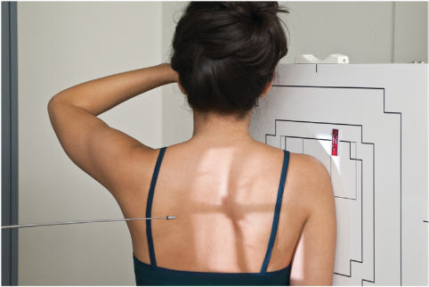
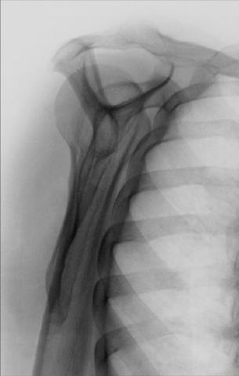
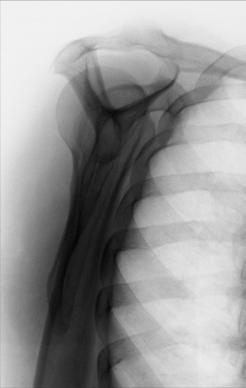
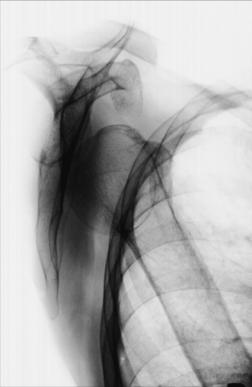

# Rx PROFIL LATERAL ÎN Y SCAPULAR PA OBLICĂ (UMĂR (TRAUMATISM ACUT/REGIM DE URGENȚĂ))

  📷 Radiografie Convențională (Rx)
  <strong>Actualizat:</strong> 2026-09-15
  <strong>Autor:</strong> Departamentul de Radiologie / Referință Bontrager

---

-   __1. Rezumat Clinic & Indicații__

    ---

    === "Indicații Clinice"

        - Fractură sau luxație/subluxație articulară suspectată a humerusului proximal și omoplatului (scapulei)
        - Capul humeral este evidențiat inferior față de procesul coracoid în luxația/subluxația articulară anterioară; pentru luxația/subluxația articulară posterioară, mai puțin frecventă, capul humeral este evidențiat inferior față de acromion

    === "Ghid Național IRIS"

        !!! info "Referință Primară: Ghidul Național IRIS (Ordinul MS 1342/2012)"
            - **Capitol Ghid IRIS:** *Aparat locomotor & Membru superior*
            - **Grad de Recomandare:** **Grad A**
            - **Nivel de Iradiere Estimată:** `Clasa 1 (Minimă < 0.05 mSv)`

            [:octicons-search-16: Deschide Ghidul IRIS](../../iris.md){ .md-button .md-button--primary } [:material-open-in-new: Aplicația Oficială PWA](https://radiologie-pediatrica.ro/iris/){ .md-button target="_blank" rel="noopener" }

-   __2. Poziționare & Centrare Fascicul__

    ---

    - **Poziție Pacient:** Pacient: Efectuați radiografia cu pacientul în ortostatism sau în decubit. (Poziția în ortostatism este de obicei mai confortabilă pentru pacient.); Regiune anatomică: Rotiți în incidență oblică anterioară, ca pentru profilul omoplatului (scapulei), cu pacientul orientat către receptorul de imagine. Palpați unghiul superior al omoplatului (scapulei) și articulația acromioclaviculară. Rotiți pacientul până când linia imaginară dintre aceste două puncte este perpendiculară pe receptorul de imagine. Din cauza diferențelor dintre pacienți, gradul de oblicitate a corpului poate varia de la 45° la 60° (Fig. 5.77). Centrați articulația scapulohumerală pe raza centrală și pe centrul receptorului de imagine. Abduceți ușor brațul, dacă este posibil, pentru a nu suprapune humerusul proximal peste coaste (grilaj costal); nu încercați să rotiți brațul.
    - **Punct de Centrare Fascicul:** Perpendicular pe receptorul de imagine, orientat către articulația scapulohumerală (2 țoli [5 cm] sub articulațiile acromioclaviculare) (vezi NOTĂ)
    - **Distanță Focar-Film (DFF / SID):** 100 cm
    - **Comandă Respiratorie:** Apnee pe durata expunerii.

-   __3. Parametri Tehnici Expunere__

    ---

    | Parametru Tehnic | Valoare Configurare Generator / Tub |
    |:-----------------|:-------------------------------------|
    | **Tensiune Tub (kV)** | 70-85 kV |
    | **Sarcină / Produs Curent-Timp (mAs)** | DE CONFIGURAT PE APARAT |
    | **Distanță Focar-Film (DFF / SID)** | 100 cm |
    | **Grilă Antidifuzoare (Bucky)** | Cu grilă antidifuzoare Bucky |
    | **Dimensiune Focar** | Focar Mic (0.6 mm) |
    | **Camere de Ionizare AEC** | Camerele laterale (sau camera centrală, în funcție de regiune) |
    | **Colimare Fascicul** | Dimensiunea câmpului. Colimați pe cele patru laturi la aria de interes diagnostic. |
    | **Filtrare Tub** | Totală ≥ 2.5 mm Al echivalent |

-   __4. Criterii de Calitate & Reușită Imagine__

    ---

    - Incidență adevărată de profil a omoplatului (scapulei), humerusului proximal și articulației scapulohumerale. Poziție:
    - Corpul subțire al omoplatului (scapulei) trebuie să fie vizibil la extremitate, fără suprapunere costală (Fig. 5.78).
    - Procesele acromion și coracoid trebuie să apară ca brațe superioare aproape simetrice ale literei Y.
    - Capul humeral trebuie să apară suprapus peste baza literei Y dacă humerusul nu este luxat (Fig. 5.79). Fig. 5.80 prezintă luxația/subluxația articulară anterioară a humerusului proximal.
    - Dimensiunea câmpului de colimare până la aria de interes diagnostic. Expunere:
    - Expunerea și contrastul optime ale receptorului de imagine, fără mișcare, vizualizează clar marginile osoase și conturul corpului omoplatului (scapulei) prin humerusul proximal. Fig. 5.77 Incidență PA oblică (profil lateral în Y scapular), cu raza centrală perpendiculară. Humerus, unghi inferior, acromion, R, claviculă, proces coracoid, corpul omoplatului (scapulei), capul humerusului. Fig. 5.78 Incidență PA oblică (profil lateral în Y scapular). R. Fig. 5.79 Incidență PA oblică (profil lateral în Y scapular), fără luxație/subluxație articulară. R. Fig. 5.80 Incidență PA oblică (profil lateral în Y scapular), cu luxație/subluxație articulară anterioară.

-   __5. Protecție Radiologică (ALARA)__

    ---

    - Ecranare gonadică și a organelor radiosensibile conform procedurilor locale de radioprotecție ALARA.
    - Colimare strictă la aria de interes pentru limitarea radiației difuze.
    - Verificarea posibilității unei sarcini la pacientele de vârstă fertilă înainte de expunere.

!!! note "Observații Clinice & Tehnice"
    Dacă este necesar, din cauza stării pacientului, această incidență PA oblică (profil lateral în Y scapular) poate fi efectuată în decubit, ca incidență AP oblică opusă, cu umărul lezat ridicat (vezi Omoplat (scapulă) lateral, decubit). Umăr (traumatism acut/regim de urgență): AP DE RUTINĂ (rotație neutră), profil transtoracic sau PA oblică (profil lateral în Y scapular)

### 🖼️ Imagini

<figure class="protocol-image-card" markdown>

<figcaption><strong>Fig. 5.77 Incidență PA oblică (profil lateral în Y scapular), cu raza centrală perpendiculară.</strong> — Poziționarea pacientului conform Ghidului Bontrager (Fig. 5.77 Incidență PA oblică (profil lateral în Y scapular), cu raza centrală perpendiculară.)</figcaption>

</figure>

<figure class="protocol-image-card" markdown>

<figcaption><strong>Fig. 5.78 Incidență PA oblică (profil lateral în Y scapular).</strong> — Aspect radiografic de referință conform Ghidului Bontrager (Fig. 5.78 Incidență PA oblică (profil lateral în Y scapular).)</figcaption>

</figure>

<figure class="protocol-image-card" markdown>

<figcaption><strong>Fig. 5.79 Incidență PA oblică (profil lateral în Y scapular)</strong> — Aspect radiografic de referință conform Ghidului Bontrager (Fig. 5.79, incidență PA oblică (Y scapular)</figcaption>

</figure>

<figure class="protocol-image-card" markdown>

<figcaption><strong>Fig. 5.80, incidență PA oblică (Y scapular)</strong> — Aspect radiografic de referință conform Ghidului Bontrager (Fig. 5.80, incidență PA oblică (Y scapular)</figcaption>

</figure>

=== "Ghid Rapid de Execuție"

    1. **Identificarea și verificarea pacientului:** verificare identitate, zonă de examinat, consimțământ conform procedurii și evaluarea posibilității unei sarcini, când este relevantă.
    2. **Pregătire:** îndepărtarea oricăror obiecte radiopace (bijuterii, agrafe, fermoare, proteze, pansamente dense).
    3. **Poziționare precisă:** alinierea receptorului de imagine și a tubului la distanța prescrisă (100 cm).
    4. **Colimare strictă:** adaptarea fasciculului strict la regiunea de diagnostic pentru scăderea iradierii și reducerea radiației difuze.
    5. **Radioprotecție:** verificarea [politicii RX](../radioprotectie.md), cu măsuri distincte pentru pacient, personal și însoțitor.

## Surse de documentare

- [Bontrager's Textbook of Radiographic Positioning (Ed. 9/10), Pagina 214](https://www.elsevier.com/books/textbook-of-radiographic-positioning-and-related-anatomy/lampignano/978-0-323-65367-1)
