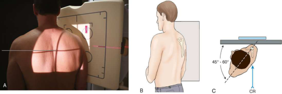
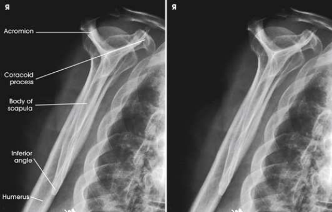
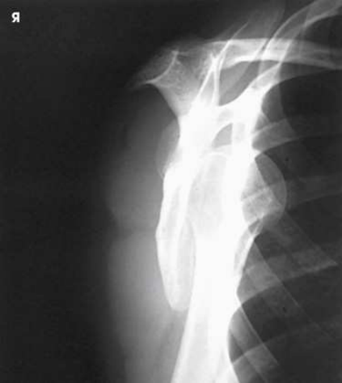
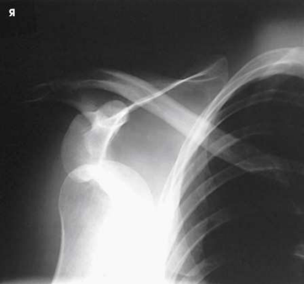
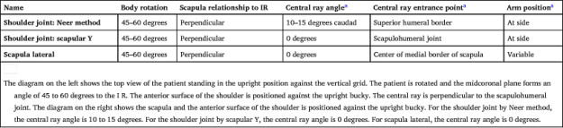

# Rx Scapular Y — Oblică Postero-Anterioară (PA) — RAO or Oblică Anterioară Stângă (OAS / LAO) Umăr dislocations. (Merrill)

  📷 Radiografie Convențională (Rx)
  <strong>Actualizat:</strong> 2026-09-16
  <strong>Autor:</strong> Referință Merrill

---

-   __1. Rezumat Clinic & Indicații__

    ---

    === "Indicații Clinice"

        - Conform reperelor anatomice standard din tratat

    === "Ghid Național IRIS"

        !!! info "Referință Primară: Ghidul Național IRIS (Ordinul MS 1342/2012)"
            - **Capitol Ghid IRIS:** *Ghidul Național IRIS*
            - **Grad de Recomandare:** **De verificat pe indicație; fără grad atribuit automat**
            - **Nivel de Iradiere Estimată:** `De verificat pentru examinarea și populația selectate`

            [:octicons-search-16: Deschide Ghidul IRIS](../../iris.md){ .md-button .md-button--primary } [:material-open-in-new: Aplicația Oficială PWA](https://radiologie-pediatrica.ro/iris/){ .md-button target="_blank" rel="noopener" }
-   __2. Poziționare & Centrare Fascicul__

    ---

    - **Poziție Pacient:** radiografie pacientul în ortostatism sau Decubit corp poziție; ortostatism este preferred. When pacientul este severely injured și Decubit, modify anterior Incidență Oblică prin placing pacientul în posterior Incidență Oblică. This poziție does nu require pacientul la lie pe injured Umăr.; poziție anterior surface de Umăr being examined pe / sprijinit de stativ vertical Bucky. se rotește pacient astfel încât plan mediocoronal forms angle de 45 la 60 grade la receptorul de imagine. poziție de braț este nu critical because it does nu alter relationship de cap humeral la cavitate glenoidă (Fig. 6.36). Palpate Omoplat (Scapulă), și place its flat surface perpendicular pe receptorul de imagine (RI). According la Johnston et al., 1 this este accomplished prin orienting plane through superior angle de Omoplat (Scapulă) și acromial tip, perpendicular pe receptorul de imagine (RI). poziție center de receptorul de imagine la nivelul scapulohumeral articulație. se efectuează ecranarea gonadelor cu șorț plumbat.
    - **Punct de Centrare Fascicul:** perpendicular pe scapulohumeral articulație (Table 6.3)
    - **Distanță Focar-Film (DFF / SID):** Nespecificat în fragmentul extras; de verificat în sursă
    - **Comandă Respiratorie:** apnee (oprirea respirației). Compensating Filter Use de specially designed compensating filter pentru Umăr, called boomerang, improves quality de imagine because de large amount de primary fascicul radiation striking receptorul de imagine.

-   __3. Parametri Tehnici Expunere__

    ---

    | Parametru Tehnic | Valoare Configurare Generator / Tub |
    |:-----------------|:-------------------------------------|
    | **Tensiune Tub (kV)** | DE CONFIGURAT PE APARAT |
    | **Sarcină / Produs Curent-Timp (mAs)** | DE CONFIGURAT PE APARAT |
    | **Distanță Focar-Film (DFF / SID)** | Nespecificat în fragmentul extras; de verificat în sursă |
    | **Grilă Antidifuzoare (Bucky)** | DE CONFIGURAT PE APARAT |
    | **Dimensiune Focar** | DE CONFIGURAT PE APARAT |
    | **Camere de Ionizare AEC** | DE CONFIGURAT PE APARAT |
    | **Colimare Fascicul** | Adjust câmp de iradiere la 12 inches (30 cm) în length pe collimator și la 1 inch (2.5 cm) beyond lateral shadow. Se plasează markerul de lateralitate în câmpul colimat. |
    | **Filtrare Tub** | DE CONFIGURAT PE APARAT |

-   __4. Criterii de Calitate & Reușită Imagine__

    ---

    - Criterii radiologice de calitate imaginii:
    - Colimare adecvată vizibilă și prezența markerului de lateralitate (D/S) plasat clear de anatomy de interest
    - cap humeral și cavitate glenoidă superimposed
    - Humeral shaft și scapular corp superimposed
    - fără superimposition de scapular corp over Grilaj Costal și Stern
    - acromion projected laterally și liber de superimposition
    - Coracoid possibly superimposed sau projected below Claviculă
    - Omoplat (Scapulă) în lateral profile cu lateral și vertebral margini superimposed
    - Bony detalii trabeculare osoase și surrounding soft tissues TABLE 6.3 raza centrală angles și entrance points și braț poziții sunt only differences among these three incidențe. Supraspinatus “Outlet”

-   __5. Protecție Radiologică (ALARA)__

    ---

    - Nespecificat în fragmentul extras; de verificat în sursă

!!! note "Observații Clinice & Tehnice"
    Conform reperelor anatomice standard din tratat

### 🖼️ Imagini

<figure class="protocol-image-card" markdown>

<figcaption><strong>Merrill — pagina PDF 400, imaginea 1</strong> — Imagine din fragmentul sursă; asocierea necesită revizie.</figcaption>

</figure>

<figure class="protocol-image-card" markdown>

<figcaption><strong>Merrill — pagina PDF 400, imaginea 2</strong> — Imagine din fragmentul sursă; asocierea necesită revizie.</figcaption>

</figure>

<figure class="protocol-image-card" markdown>

<figcaption><strong>Merrill — pagina PDF 401, imaginea 3</strong> — Imagine din fragmentul sursă; asocierea necesită revizie.</figcaption>

</figure>

<figure class="protocol-image-card" markdown>

<figcaption><strong>Merrill — pagina PDF 401, imaginea 4</strong> — Imagine din fragmentul sursă; asocierea necesită revizie.</figcaption>

</figure>

<figure class="protocol-image-card" markdown>

<figcaption><strong>Merrill — pagina PDF 402, imaginea 5</strong> — Imagine din fragmentul sursă; asocierea necesită revizie.</figcaption>

</figure>

=== "Ghid Rapid de Execuție"

    1. **Identificarea și verificarea pacientului:** verificare identitate, zonă de examinat, consimțământ conform procedurii și evaluarea posibilității unei sarcini, când este relevantă.
    2. **Pregătire:** îndepărtarea oricăror obiecte radiopace (bijuterii, agrafe, fermoare, proteze, pansamente dense).
    3. **Poziționare precisă:** alinierea receptorului de imagine și a tubului la distanța prescrisă (Nespecificat în fragmentul extras; de verificat în sursă).
    4. **Colimare strictă:** adaptarea fasciculului strict la regiunea de diagnostic pentru scăderea iradierii și reducerea radiației difuze.
    5. **Radioprotecție:** verificarea [politicii RX](../radioprotectie.md), cu măsuri distincte pentru pacient, personal și însoțitor.

## Surse de documentare

- [Merrill’s Atlas, 6. Shoulder Girdle, pagini PDF 399–402](../../assets/protocols/sources/a56d45c16829_Merrills_Atlas_of_Radiographic_Positioning__Procedures_3Vol_Set.pdf#page=399)

## Fragmente sursă traduse (referință tehnică)

### anatomy

scapular Y este vizualizat pe oblic imagine de umăr. în normal umăr, cap humeral este directly superimposed over junction
de Y (Fig. 6.37). în anterior (subcoracoid) luxație articulară, cap humeral este beneath proces coracoid (Fig. 6.38); în posterior (subacromial)
luxație articulară, it este projected beneath acromion. AP umăr incidență este vizualizat pentru comparison (Fig. 6.39).

### collimation

• Adjust câmp de iradiere la 12 inches (30 cm) în length pe collimator și la 1 inch (2.5 cm) beyond lateral shadow. Place side
marker în collimated expunere field.

### cr

• perpendicular pe scapulohumeral articulație (Table 6.3)

### criteria

Criterii radiologice de calitate imaginii:
• Colimare adecvată vizibilă și prezența markerului de lateralitate (D/S) plasat clear de anatomy de interest
• cap humeral și cavitate glenoidă superimposed
• Humeral shaft și scapular corp superimposed
• fără superimposition de scapular corp over bony thorax
• acromion projected laterally și liber de superimposition
• Coracoid possibly superimposed sau projected below clavicle
• Scapula în lateral profile cu lateral și vertebral margini superimposed
• Bony detalii trabeculare osoase și surrounding soft tissues
TABLE 6.3
raza centrală angles și entrance points și braț poziții sunt only differences among these three incidențe.
Supraspinatus “Outlet”

### part_pos

• poziție anterior surface de umăr being examined pe / sprijinit de stativ vertical Bucky.
• se rotește pacient astfel încât plan mediocoronal forms angle de 45 la 60 grade la receptorul de imagine. poziție de braț este nu critical
because it does nu alter relationship de cap humeral la cavitate glenoidă (Fig. 6.36). Palpate scapula, și place its flat
surface perpendicular pe receptorul de imagine (RI). According la Johnston et al., 1 this este accomplished prin orienting plane through superior angle
de scapula și acromial tip, perpendicular pe receptorul de imagine (RI).
• poziție center de receptorul de imagine la nivelul scapulohumeral articulație.
• se efectuează ecranarea gonadelor cu șorț plumbat.

### patient_pos

• radiografie pacientul în ortostatism sau recumbent corp poziție; ortostatism este preferred.
• When pacientul este severely injured și recumbent, modify anterior oblic poziție prin placing pacientul în posterior
oblic poziție. This poziție does nu require pacientul la lie pe injured umăr.

### respiration

apnee (oprirea respirației).
Compensating Filter
Use de specially designed compensating filter pentru umăr, called boomerang, improves quality de imagine because de large
amount de primary fascicul radiation striking receptorul de imagine.

### tech

poziționat prin manufacturer sau department protocol pentru corect anatomy display orientation; raza centrală plate: 10 × 12 inches (24
× 30 cm) longitudinal.

