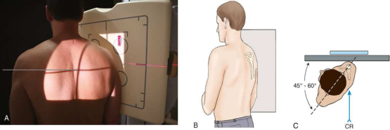
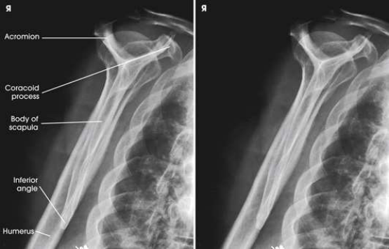
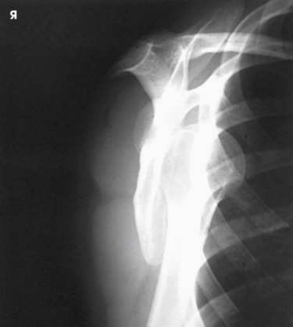
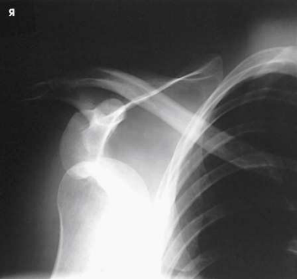
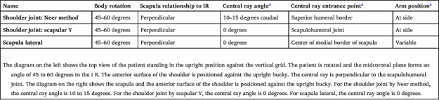

# Rx Y scapular — incidență oblică postero-anterioară (PA) — RAO sau oblică anterioară stângă (OAS / LAO), luxații ale umărului. (Merrill)

  📷 Radiografie Convențională (Rx)
  <strong>Actualizat:</strong> 2026-09-16
  <strong>Autor:</strong> Referință Merrill

---

-   __1. Rezumat Clinic & Indicații__

    ---

    === "Indicații Clinice"

        - Conform reperelor anatomice standard din tratat

    === "Ghid Național IRIS"

        !!! info "Referință Primară: Ghidul Național IRIS (Ordinul MS 1342/2012)"
            - **Capitol Ghid IRIS:** *Aparat locomotor & Membru superior*
            - **Grad de Recomandare:** **Grad A**
            - **Nivel de Iradiere Estimată:** `Clasa 1 (Minimă < 0.05 mSv)`

            [:octicons-search-16: Deschide Ghidul IRIS](../../iris.md){ .md-button .md-button--primary } [:material-open-in-new: Aplicația Oficială PWA](https://radiologie-pediatrica.ro/iris/){ .md-button target="_blank" rel="noopener" }

-   __2. Poziționare & Centrare Fascicul__

    ---

    - **Poziție Pacient:** Se efectuează radiografia cu pacientul în ortostatism sau în decubit; ortostatismul este preferat. Când pacientul este grav traumatizat și în decubit, se modifică incidența oblică anterioară prin plasarea pacientului în incidență oblică posterioară. Această poziție nu necesită ca pacientul să stea culcat pe umărul traumatizat; suprafața anterioară a umărului examinat se așază pe/sprijinită de stativul vertical Bucky. Se rotește pacientul astfel încât planul mediocoronal să formeze un unghi de 45 la 60 grade față de receptorul de imagine. Poziția brațului nu este critică, deoarece nu modifică raportul dintre capul humeral și cavitatea glenoidă (Fig. 6.36). Se palpează omoplatul (scapula) și se așază suprafața sa plată perpendicular pe receptorul de imagine (RI). Conform Johnston et al., 1 acest lucru se realizează prin orientarea planului care trece prin unghiul superior al omoplatului (scapulei) și vârful acromionului perpendicular pe receptorul de imagine (RI). Se centrează receptorul de imagine la nivelul articulației scapulohumerale. Se efectuează ecranarea gonadelor cu șorț plumbat.
    - **Punct de Centrare Fascicul:** perpendicular pe articulația scapulohumerală (Tabelul 6.3)
    - **Distanță Focar-Film (DFF / SID):** Nespecificat în fragmentul extras; de verificat în sursă
    - **Comandă Respiratorie:** apnee (oprirea respirației). Utilizarea filtrului compensator: utilizarea unui filtru compensator special conceput pentru umăr, numit boomerang, îmbunătățește calitatea imaginii deoarece o cantitate mare din fasciculul primar de radiație incidă pe receptorul de imagine.

-   __3. Parametri Tehnici Expunere__

    ---

    | Parametru Tehnic | Valoare Configurare Generator / Tub |
    |:-----------------|:-------------------------------------|
    | **Tensiune Tub (kV)** | DE CONFIGURAT PE APARAT |
    | **Sarcină / Produs Curent-Timp (mAs)** | DE CONFIGURAT PE APARAT |
    | **Distanță Focar-Film (DFF / SID)** | Nespecificat în fragmentul extras; de verificat în sursă |
    | **Grilă Antidifuzoare (Bucky)** | DE CONFIGURAT PE APARAT |
    | **Dimensiune Focar** | DE CONFIGURAT PE APARAT |
    | **Camere de Ionizare AEC** | DE CONFIGURAT PE APARAT |
    | **Colimare Fascicul** | Ajustați câmpul de iradiere la 12 țoli (30 cm) în lungime pe colimator și la 1 țol (2.5 cm) dincolo de marginea laterală. Se plasează markerul de lateralitate în câmpul colimat. |
    | **Filtrare Tub** | DE CONFIGURAT PE APARAT |

-   __4. Criterii de Calitate & Reușită Imagine__

    ---

    - Criterii radiologice de calitate a imaginii:
    - Colimare adecvată vizibilă și prezența markerului de lateralitate (D/S) plasat în afara structurilor anatomice de interes
    - capul humeral și cavitatea glenoidă suprapuse
    - diafiza humerală și corpul scapulei suprapuse
    - fără suprapunerea corpului scapulei peste cutia toracică și stern
    - acromionul proiectat lateral și liber de suprapunere
    - procesul coracoid posibil suprapus sau proiectat sub claviculă
    - omoplatul (scapula) în profil lateral, cu marginile laterală și vertebrală suprapuse
    - Detaliile trabeculare osoase și țesuturile moi înconjurătoare. TABELUL 6.3. Unghiurile razei centrale, punctele de intrare și pozițiile brațului sunt singurele diferențe dintre aceste trei incidențe. „Ieșirea” supraspinosului

-   __5. Protecție Radiologică (ALARA)__

    ---

    - Nespecificat în fragmentul extras; de verificat în sursă

!!! note "Observații Clinice & Tehnice"
    Conform reperelor anatomice standard din tratat

### 🖼️ Imagini

<figure class="protocol-image-card" markdown>

<figcaption><strong>Merrill — pagina 400, imaginea 1</strong> — Imagine din fragmentul sursă; asocierea necesită revizie.</figcaption>

</figure>

<figure class="protocol-image-card" markdown>

<figcaption><strong>Merrill — pagina 400, imaginea 2</strong> — Imagine din fragmentul sursă; asocierea necesită revizie.</figcaption>

</figure>

<figure class="protocol-image-card" markdown>

<figcaption><strong>Merrill — pagina 401, imaginea 3</strong> — Imagine din fragmentul sursă; asocierea necesită revizie.</figcaption>

</figure>

<figure class="protocol-image-card" markdown>

<figcaption><strong>Merrill — pagina 401, imaginea 4</strong> — Imagine din fragmentul sursă; asocierea necesită revizie.</figcaption>

</figure>

<figure class="protocol-image-card" markdown>

<figcaption><strong>Merrill — pagina 402, imaginea 5</strong> — Imagine din fragmentul sursă; asocierea necesită revizie.</figcaption>

</figure>

=== "Ghid Rapid de Execuție"

    1. **Identificarea și verificarea pacientului:** verificare identitate, zonă de examinat, consimțământ conform procedurii și evaluarea posibilității unei sarcini, când este relevantă.
    2. **Pregătire:** îndepărtarea oricăror obiecte radiopace (bijuterii, agrafe, fermoare, proteze, pansamente dense).
    3. **Poziționare precisă:** alinierea receptorului de imagine și a tubului la distanța prescrisă (Nespecificat în fragmentul extras; de verificat în sursă).
    4. **Colimare strictă:** adaptarea fasciculului strict la regiunea de diagnostic pentru scăderea iradierii și reducerea radiației difuze.
    5. **Radioprotecție:** verificarea [politicii RX](../radioprotectie.md), cu măsuri distincte pentru pacient, personal și însoțitor.

## Surse de documentare

- [Merrill’s Atlas, 6. Shoulder Girdle, pagini 399–402](https://books.google.com/books/about/Merrill_s_Atlas_of_Radiographic_Position.html?id=BM0lEQAAQBAJ)
