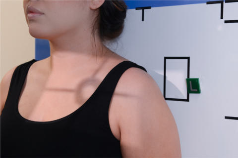
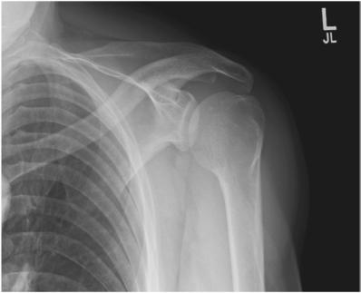
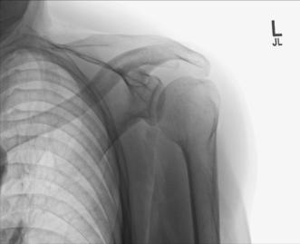

# Rx SHOULDER9 APICAL AP Axială

  📷 Radiografie Convențională (Rx)
  <strong>Actualizat:</strong> 2026-09-15
  <strong>Autor:</strong> Departamentul de Radiologie / Referință Bontrager

---

-   __1. Rezumat Clinic & Indicații__

    ---

    === "Indicații Clinice"

        - Demonstrate narrowing of acromiohumeral space and possible spurring of the anteroinferior aspect of acromion. Spurring may lead to injury to supraspinatus tendon partial or complete tears.
        - May demonstrate signs of Umăr impingement syndrome

    === "Ghid Național IRIS"

        !!! info "Referință Primară: Ghidul Național IRIS (Ordinul MS 1342/2012)"
            - **Capitol Ghid IRIS:** *Ghidul Național IRIS*
            - **Grad de Recomandare:** **De verificat pe indicație; fără grad atribuit automat**
            - **Nivel de Iradiere Estimată:** `De verificat pentru examinarea și populația selectate`

            [:octicons-search-16: Deschide Ghidul IRIS](../../iris.md){ .md-button .md-button--primary } [:material-open-in-new: Aplicația Oficială PWA](https://radiologie-pediatrica.ro/iris/){ .md-button target="_blank" rel="noopener" }
-   __2. Poziționare & Centrare Fascicul__

    ---

    - **Poziție Pacient:** Pacient: Perform radiograph with patient in an Ortostatism or a Decubit position. (The Ortostatism position is usually less painful for patient, if condition allows.); Regiune anatomică: Position patient into AP, Ortostatism position with Absența rotației anatomice: clavicule echidistante față de linia apofizelor spinoase. Extend and slightly abduct arm and Mână is placed into neutral rotation. Adjust image receptor so that top of IR is approximately 1 inch (2.5 cm) above Umăr and side of IR is approximately 2 inches (5 cm) from lateral border of Humerus (Fig. 5.62).
    - **Punct de Centrare Fascicul:** 30° caudal Fig. 5.62 Apical Incidență AP Axială.
    - **Distanță Focar-Film (DFF / SID):** 100 cm
    - **Comandă Respiratorie:** Suspend respiration during exposure. Umăr (Nontraumatism acut) SPECIAL AP Incidență Oblică (Grashey method) Apical Incidență AP Axială

-   __3. Parametri Tehnici Expunere__

    ---

    | Parametru Tehnic | Valoare Configurare Generator / Tub |
    |:-----------------|:-------------------------------------|
    | **Tensiune Tub (kV)** | 70-85 kV |
    | **Sarcină / Produs Curent-Timp (mAs)** | DE CONFIGURAT PE APARAT |
    | **Distanță Focar-Film (DFF / SID)** | 100 cm |
    | **Grilă Antidifuzoare (Bucky)** | Cu grilă antidifuzoare Bucky |
    | **Dimensiune Focar** | Focar Mic (0.6 mm) |
    | **Camere de Ionizare AEC** | Camerele laterale (sau camera centrală funcție de regiune) |
    | **Colimare Fascicul** | Field Size Collimate so that upper and lateral borders of the field are to the soft tissue margins. |
    | **Filtrare Tub** | Totală ≥ 2.5 mm Al echivalent |

-   __4. Criterii de Calitate & Reușită Imagine__

    ---

    - The anteroinferior aspect of the acromion process and acromiohumeral joint space is open (Figs. 5.63 and 5.64). Position:
    - Proximal Humerus is projected in neutral rotation position.
    - Acromiohumeral space is more open compared with routine AP Umăr projection.
    - Anteroinferior aspect of acromion is demonstrated. Exposure:
    - Optimal image receptor exposure and contrast with no motion visualize soft tissue margins and clear, Contururi osoase și travee trabeculare nete, fără artefacte de mișcare.
    - Soft tissue detail of the acromiohumeral space. Fig. 5.63 Apical AP axial. Superior scapular border Scapular spine Acromiohumeral joint space Acromion process Humeral head Fig. 5.64 Apical Incidență AP Axială.

-   __5. Protecție Radiologică (ALARA)__

    ---

    - Ecranare gonadică și a organelor radiosensibile conform procedurilor locale de radioprotecție ALARA.
    - Colimare strictă la aria de interes pentru limitarea radiației difuze.
    - Verificarea posibilității unei sarcini la pacientele de vârstă fertilă înainte de expunere.

### 🖼️ Imagini

<figure class="protocol-image-card" markdown>

<figcaption><strong>Fig. 5.63 Apical AP axial.</strong> — Poziționare pacient conform Ghidului Bontrager (Fig. 5.63 Apical AP axial.)</figcaption>

</figure>

<figure class="protocol-image-card" markdown>

<figcaption><strong>Fig. 5.64 Apical Incidență AP Axială.</strong> — Aspect radiografic de referință conform Ghidului Bontrager (Fig. 5.64 Apical AP axial projection.)</figcaption>

</figure>

<figure class="protocol-image-card" markdown>

<figcaption><strong>Fig. 5.62 Apical Incidență AP Axială.</strong> — Aspect radiografic de referință conform Ghidului Bontrager (Fig. 5.62 Apical AP axial projection.)</figcaption>

</figure>

=== "Ghid Rapid de Execuție"

    1. **Identificarea și verificarea pacientului:** verificare identitate, zonă de examinat, consimțământ conform procedurii și evaluarea posibilității unei sarcini, când este relevantă.
    2. **Pregătire:** îndepărtarea oricăror obiecte radiopace (bijuterii, agrafe, fermoare, proteze, pansamente dense).
    3. **Poziționare precisă:** alinierea receptorului de imagine și a tubului la distanța prescrisă (100 cm).
    4. **Colimare strictă:** adaptarea fasciculului strict la regiunea de diagnostic pentru scăderea iradierii și reducerea radiației difuze.
    5. **Radioprotecție:** verificarea [politicii RX](../radioprotectie.md), cu măsuri distincte pentru pacient, personal și însoțitor.

## Surse de documentare

- [Bontrager's Textbook of Radiographic Positioning (Ed. 9/10), Pagina 210](https://www.elsevier.com/books/textbook-of-radiographic-positioning-and-related-anatomy/lampignano/978-0-323-65367-1)
