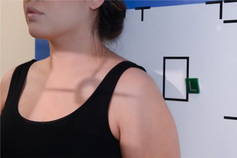
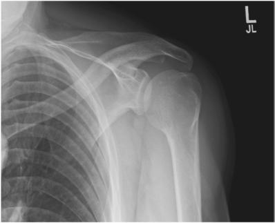
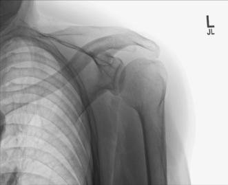

# Rx umăr 9 — AP apicală axială

  📷 Radiografie Convențională (Rx)
  <strong>Actualizat:</strong> 2026-09-15
  <strong>Autor:</strong> Departamentul de Radiologie / Referință Bontrager

---

-   __1. Rezumat Clinic & Indicații__

    ---

    === "Indicații Clinice"

        - evidențiază îngustarea spațiului acromiohumeral și posibile osteofite ale aspectului anteroinferior al acromionului. Osteofitele pot duce la leziuni ale tendonului supraspinos, cu rupturi parțiale sau complete.
        - poate evidenția semne de sindrom de impingement al umărului

    === "Ghid Național IRIS"

        !!! info "Referință Primară: Ghidul Național IRIS (Ordinul MS 1342/2012)"
            - **Capitol Ghid IRIS:** *Aparat locomotor & Membru superior*
            - **Grad de Recomandare:** **Grad A**
            - **Nivel de Iradiere Estimată:** `Clasa 1 (Minimă < 0.05 mSv)`

            [:octicons-search-16: Deschide Ghidul IRIS](../../iris.md){ .md-button .md-button--primary } [:material-open-in-new: Aplicația Oficială PWA](https://radiologie-pediatrica.ro/iris/){ .md-button target="_blank" rel="noopener" }

-   __2. Poziționare & Centrare Fascicul__

    ---

    - **Poziție Pacient:** Pacient: Se efectuează radiografia cu pacientul în ortostatism sau în decubit. (Poziția în ortostatism este de obicei mai puțin dureroasă pentru pacient, dacă starea permite.); Regiune anatomică: se poziționează pacientul în AP, în ortostatism, fără rotație anatomică: claviculele sunt echidistante față de linia apofizelor spinoase. Se extinde și se abduce ușor brațul, iar mâna se plasează în rotație neutră. Se ajustează receptorul de imagine astfel încât partea superioară a receptorului de imagine să fie la aproximativ 1 țol (2.5 cm) deasupra umărului, iar partea laterală a receptorului de imagine să fie la aproximativ 2 țoli (5 cm) de marginea laterală a humerusului (Fig. 5.62).
    - **Punct de Centrare Fascicul:** 30° caudal. Fig. 5.62. Incidență AP apicală axială.
    - **Distanță Focar-Film (DFF / SID):** 100 cm
    - **Comandă Respiratorie:** Apnee pe durata expunerii. Umăr (fără traumatism acut) SPECIAL: incidență AP oblică (metoda Grashey), incidență AP apicală axială

-   __3. Parametri Tehnici Expunere__

    ---

    | Parametru Tehnic | Valoare Configurare Generator / Tub |
    |:-----------------|:-------------------------------------|
    | **Tensiune Tub (kV)** | 70-85 kV |
    | **Sarcină / Produs Curent-Timp (mAs)** | DE CONFIGURAT PE APARAT |
    | **Distanță Focar-Film (DFF / SID)** | 100 cm |
    | **Grilă Antidifuzoare (Bucky)** | Cu grilă antidifuzoare Bucky |
    | **Dimensiune Focar** | Focar Mic (0.6 mm) |
    | **Camere de Ionizare AEC** | Camerele laterale (sau camera centrală, în funcție de regiune) |
    | **Colimare Fascicul** | Dimensiunea câmpului: Se colimează astfel încât marginile superioară și laterală ale câmpului să fie la nivelul marginilor țesuturilor moi. |
    | **Filtrare Tub** | Totală ≥ 2.5 mm Al echivalent |

-   __4. Criterii de Calitate & Reușită Imagine__

    ---

    - aspectul anteroinferior al acromionului și spațiile articulare acromiohumerale sunt deschise (Fig. 5.63 și 5.64). Poziție:
    - humerusul proximal este proiectat în poziție de rotație neutră.
    - Spațiul acromiohumeral este mai deschis comparativ cu incidența AP de rutină a umărului.
    - Aspectul anteroinferior al acromionului este evidențiat. Expunere:
    - Expunere și contrast optime ale receptorului de imagine, fără mișcare; vizualizare a marginilor țesuturilor moi și a contururilor osoase clare, precum și a traveelor trabeculare nete, fără artefacte de mișcare.
    - detaliile țesuturilor moi ale spațiului acromiohumeral. Fig. 5.63. AP apical axială. marginea scapulară superioară; spina scapulei; spațiile articulare acromiohumerale; acromion; cap humeral. Fig. 5.64. Incidență AP apicală axială.

-   __5. Protecție Radiologică (ALARA)__

    ---

    - Ecranare gonadică și a organelor radiosensibile conform procedurilor locale de radioprotecție ALARA.
    - Colimare strictă la aria de interes pentru limitarea radiației difuze.
    - Verificarea posibilității unei sarcini la pacientele de vârstă fertilă înainte de expunere.

### 🖼️ Imagini

<figure class="protocol-image-card" markdown>

<figcaption><strong>Fig. 5.63. AP apicală axială.</strong> — Poziționarea pacientului conform Ghidului Bontrager (Fig. 5.63. AP apicală axială.)</figcaption>

</figure>

<figure class="protocol-image-card" markdown>

<figcaption><strong>Fig. 5.64. Incidență AP apicală axială.</strong> — Aspect radiografic de referință conform Ghidului Bontrager (Fig. 5.64. Incidență AP apicală axială.)</figcaption>

</figure>

<figure class="protocol-image-card" markdown>

<figcaption><strong>Fig. 5.62. Incidență AP apicală axială.</strong> — Aspect radiografic de referință conform Ghidului Bontrager (Fig. 5.62. Incidență AP apicală axială.)</figcaption>

</figure>

=== "Ghid Rapid de Execuție"

    1. **Identificarea și verificarea pacientului:** verificare identitate, zonă de examinat, consimțământ conform procedurii și evaluarea posibilității unei sarcini, când este relevantă.
    2. **Pregătire:** îndepărtarea oricăror obiecte radiopace (bijuterii, agrafe, fermoare, proteze, pansamente dense).
    3. **Poziționare precisă:** alinierea receptorului de imagine și a tubului la distanța prescrisă (100 cm).
    4. **Colimare strictă:** adaptarea fasciculului strict la regiunea de diagnostic pentru scăderea iradierii și reducerea radiației difuze.
    5. **Radioprotecție:** verificarea [politicii RX](../radioprotectie.md), cu măsuri distincte pentru pacient, personal și însoțitor.

## Surse de documentare

- [Bontrager's Textbook of Radiographic Positioning (Ed. 9/10), Pagina 210](https://www.elsevier.com/books/textbook-of-radiographic-positioning-and-related-anatomy/lampignano/978-0-323-65367-1)
