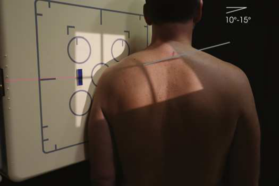
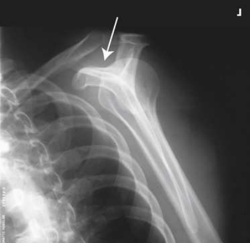
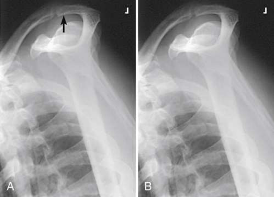

# Rx Supraspinatus “Outlet” — Tangential Incidență — Metoda Neer RAO or Oblică Anterioară Stângă (OAS / LAO) (Merrill)

  📷 Radiografie Convențională (Rx)
  <strong>Actualizat:</strong> 2026-09-16
  <strong>Autor:</strong> Referință Merrill

---

-   __1. Rezumat Clinic & Indicații__

    ---

    === "Indicații Clinice"

        - Conform reperelor anatomice standard din tratat

    === "Ghid Național IRIS"

        !!! info "Referință Primară: Ghidul Național IRIS (Ordinul MS 1342/2012)"
            - **Capitol Ghid IRIS:** *Ghidul Național IRIS*
            - **Grad de Recomandare:** **De verificat pe indicație; fără grad atribuit automat**
            - **Nivel de Iradiere Estimată:** `De verificat pentru examinarea și populația selectate`

            [:octicons-search-16: Deschide Ghidul IRIS](../../iris.md){ .md-button .md-button--primary } [:material-open-in-new: Aplicația Oficială PWA](https://radiologie-pediatrica.ro/iris/){ .md-button target="_blank" rel="noopener" }
-   __2. Poziționare & Centrare Fascicul__

    ---

    - **Poziție Pacient:** se așază pacientul în Poziție Șezândă sau în ortostatism poziție facing stativ vertical Bucky.; cu pacientul’s afected Umăr centrat și în contact cu receptorul de imagine, se rotește pacient’s unafected side away de la receptorul de imagine. Palpate flat aspect de afected Omoplat (Scapulă), și place it perpendicular pe receptorul de imagine (RI). grade de pacient obliquity varies de la pacient la pacient. average grade de pacient rotație varies de la 45 la 60 grade de la plane de receptorul de imagine (Fig. 6.40). se poziționează pacientul’s braț la pacientul’s side. se efectuează ecranarea gonadelor cu șorț plumbat.
    - **Punct de Centrare Fascicul:** Înclinat 10–15 grade caudal (spre picioare), entering superior aspect de cap humeral (see Table 6.3)
    - **Distanță Focar-Film (DFF / SID):** Nespecificat în fragmentul extras; de verificat în sursă
    - **Comandă Respiratorie:** apnee (oprirea respirației).

-   __3. Parametri Tehnici Expunere__

    ---

    | Parametru Tehnic | Valoare Configurare Generator / Tub |
    |:-----------------|:-------------------------------------|
    | **Tensiune Tub (kV)** | DE CONFIGURAT PE APARAT |
    | **Sarcină / Produs Curent-Timp (mAs)** | DE CONFIGURAT PE APARAT |
    | **Distanță Focar-Film (DFF / SID)** | Nespecificat în fragmentul extras; de verificat în sursă |
    | **Grilă Antidifuzoare (Bucky)** | DE CONFIGURAT PE APARAT |
    | **Dimensiune Focar** | DE CONFIGURAT PE APARAT |
    | **Camere de Ionizare AEC** | DE CONFIGURAT PE APARAT |
    | **Colimare Fascicul** | Adjust câmp de iradiere la 12 inches (30 cm) în length pe collimator și la 1 inch (2.5 cm) beyond lateral shadow. Se plasează markerul de lateralitate în câmpul colimat. |
    | **Filtrare Tub** | DE CONFIGURAT PE APARAT |

-   __4. Criterii de Calitate & Reușită Imagine__

    ---

    - Criterii radiologice de calitate imaginii:
    - Colimare adecvată vizibilă și prezența markerului de lateralitate (D/S) plasat clear de anatomy de interest
    - cap humeral projected below articulații acromioclaviculare
    - cap humeral și articulații acromioclaviculare cu bony detail
    - Humerus și scapular corp, generally paralel
    - Bony detalii trabeculare osoase și surrounding soft tissues

-   __5. Protecție Radiologică (ALARA)__

    ---

    - Nespecificat în fragmentul extras; de verificat în sursă

!!! note "Observații Clinice & Tehnice"
    Conform reperelor anatomice standard din tratat

### 🖼️ Imagini

<figure class="protocol-image-card" markdown>

<figcaption><strong>Merrill — pagina PDF 403, imaginea 1</strong> — Imagine din fragmentul sursă; asocierea necesită revizie.</figcaption>

</figure>

<figure class="protocol-image-card" markdown>

<figcaption><strong>Merrill — pagina PDF 404, imaginea 2</strong> — Imagine din fragmentul sursă; asocierea necesită revizie.</figcaption>

</figure>

<figure class="protocol-image-card" markdown>

<figcaption><strong>Merrill — pagina PDF 404, imaginea 3</strong> — Imagine din fragmentul sursă; asocierea necesită revizie.</figcaption>

</figure>

=== "Ghid Rapid de Execuție"

    1. **Identificarea și verificarea pacientului:** verificare identitate, zonă de examinat, consimțământ conform procedurii și evaluarea posibilității unei sarcini, când este relevantă.
    2. **Pregătire:** îndepărtarea oricăror obiecte radiopace (bijuterii, agrafe, fermoare, proteze, pansamente dense).
    3. **Poziționare precisă:** alinierea receptorului de imagine și a tubului la distanța prescrisă (Nespecificat în fragmentul extras; de verificat în sursă).
    4. **Colimare strictă:** adaptarea fasciculului strict la regiunea de diagnostic pentru scăderea iradierii și reducerea radiației difuze.
    5. **Radioprotecție:** verificarea [politicii RX](../radioprotectie.md), cu măsuri distincte pentru pacient, personal și însoțitor.

## Surse de documentare

- [Merrill’s Atlas, 6. Shoulder Girdle, pagini PDF 402–404](../../assets/protocols/sources/a56d45c16829_Merrills_Atlas_of_Radiographic_Positioning__Procedures_3Vol_Set.pdf#page=402)

## Fragmente sursă traduse (referință tehnică)

### anatomy

tangențial outlet imagine shows posterior surface de acromion și articulații acromioclaviculare identified ca superior margine de coracoacromial
outlet (Figs. 6.41 și 6.42).

### collimation

• Adjust câmp de iradiere la 12 inches (30 cm) în length pe collimator și la 1 inch (2.5 cm) beyond lateral shadow. Place side
marker în collimated expunere field.

### cr

• Înclinat 10–15 grade caudal (spre picioare), entering superior aspect de cap humeral (see Table 6.3)

### criteria

Criterii radiologice de calitate imaginii:
• Colimare adecvată vizibilă și prezența markerului de lateralitate (D/S) plasat clear de anatomy de interest
• cap humeral projected below articulații acromioclaviculare
• cap humeral și articulații acromioclaviculare cu bony detail
• Humerus și scapular corp, generally paralel
• Bony detalii trabeculare osoase și surrounding soft tissues

### part_pos

• cu pacientul’s afected umăr centrat și în contact cu receptorul de imagine, se rotește pacient’s unafected side away de la receptorul de imagine. Palpate
flat aspect de afected scapula, și place it perpendicular pe receptorul de imagine (RI). grade de pacient obliquity varies de la pacient la
pacient. average grade de pacient rotație varies de la 45 la 60 grade de la plane de receptorul de imagine (Fig. 6.40).
• se poziționează pacientul’s braț la pacientul’s side.
• se efectuează ecranarea gonadelor cu șorț plumbat.

### patient_pos

• se așază pacientul în așezat pe scaun sau în ortostatism poziție facing stativ vertical Bucky.

### respiration

apnee (oprirea respirației).

### tech

poziționat prin manufacturer sau department protocol pentru corect anatomy display orientation; raza centrală plate: 10 × 12 inches (24
× 30 cm) longitudinal.

