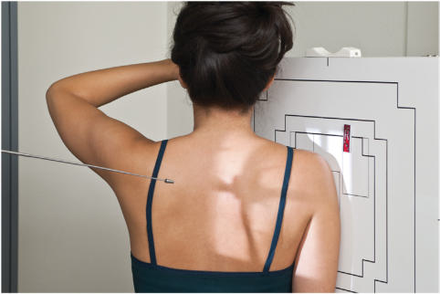
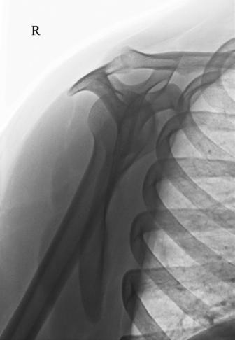

# Rx SUPRASPINATUS OUTLET TANGENTIAL PROJECTION (Umăr (traumatism acuttism / Regim Urgență) - NEER METHOD10)

  📷 Radiografie Convențională (Rx)
  <strong>Actualizat:</strong> 2026-09-15
  <strong>Autor:</strong> Departamentul de Radiologie / Referință Bontrager

---

-   __1. Rezumat Clinic & Indicații__

    ---

    === "Indicații Clinice"

        - suspiciune de fractură or luxație / subluxație articulară of proximal Humerus and Omoplat (Scapulă)
        - Specifically demonstrates coracoacromial arch for supraspinatus outlet region for possible Umăr impingement11

    === "Ghid Național IRIS"

        !!! info "Referință Primară: Ghidul Național IRIS (Ordinul MS 1342/2012)"
            - **Capitol Ghid IRIS:** *Ghidul Național IRIS*
            - **Grad de Recomandare:** **De verificat pe indicație; fără grad atribuit automat**
            - **Nivel de Iradiere Estimată:** `De verificat pentru examinarea și populația selectate`

            [:octicons-search-16: Deschide Ghidul IRIS](../../iris.md){ .md-button .md-button--primary } [:material-open-in-new: Aplicația Oficială PWA](https://radiologie-pediatrica.ro/iris/){ .md-button target="_blank" rel="noopener" }
-   __2. Poziționare & Centrare Fascicul__

    ---

    - **Poziție Pacient:** Pacient: Take radiograph with patient in Ortostatism or Decubit position. (The Ortostatism position is usually more comfortable for patient.); Regiune anatomică: With patient facing IR, rotate into anterior Incidență Oblică as for a lateral Omoplat (Scapulă). Palpate superior angle of Omoplat (Scapulă) and AC joint articulation. Rotate patient until an imaginary line between those two points is perpendicular to IR. Because of differences among patients, the amount of body obliquity may range from 45° to 60°. Center scapulohumeral joint to CR and to center of IR (Fig. 5.81). Abduct arm slightly so as not to superimpose proximal Humerus over Coaste (Grilaj Costal); do not attempt to rotate arm.
    - **Punct de Centrare Fascicul:** Requires 10° to 15° CR caudal angle, centered posteriorly to pass through superior margin of humeral head, which is located approximately 1 inch (2.5 cm) superior to medial aspect of scapular spine.12
    - **Distanță Focar-Film (DFF / SID):** 100 cm
    - **Comandă Respiratorie:** Suspend respiration during exposure. Umăr (traumatism acuttism / Regim Urgență) SPECIAL Supraspinatus outlet (Metoda Neer)

-   __3. Parametri Tehnici Expunere__

    ---

    | Parametru Tehnic | Valoare Configurare Generator / Tub |
    |:-----------------|:-------------------------------------|
    | **Tensiune Tub (kV)** | 70-85 kV |
    | **Sarcină / Produs Curent-Timp (mAs)** | DE CONFIGURAT PE APARAT |
    | **Distanță Focar-Film (DFF / SID)** | 100 cm |
    | **Grilă Antidifuzoare (Bucky)** | Cu grilă antidifuzoare Bucky |
    | **Dimensiune Focar** | Focar Mic (0.6 mm) |
    | **Camere de Ionizare AEC** | Camerele laterale (sau camera centrală funcție de regiune) |
    | **Colimare Fascicul** | Field Size Collimate on four sides to area of interest. |
    | **Filtrare Tub** | Totală ≥ 2.5 mm Al echivalent |

-   __4. Criterii de Calitate & Reușită Imagine__

    ---

    - Proximal Humerus is superimposed over thin body of the Omoplat (Scapulă), which should be seen on end without rib superimposition. Position:
    - Acromion and coracoid processes should appear as nearly symmetric upper limbs of the Y.
    - The humeral head should appear superimposed and centered to the glenoid fossa just below the supraspinatus outlet region.
    - The supraspinatus outlet region appears open, free of superimposition by the humeral head (see arrow in Fig. 5.82).
    - Collimation field size to area of interest. Exposure:
    - Optimal image receptor exposure and contrast demonstrate the Y appearance of the upper lateral Omoplat (Scapulă) superimposed by the humeral head with outline of the body of the Omoplat (Scapulă) visible through the Humerus.
    - Bony margins appear clear and sharp, indicating no motion. Fig. 5.81 Tangential projection—Metoda Neer with CR 10° to 15° caudal angle. Fig. 5.82 Tangential projection—Metoda Neer. (Courtesy Joss Wertz, DO.)

-   __5. Protecție Radiologică (ALARA)__

    ---

    - Ecranare gonadică și a organelor radiosensibile conform procedurilor locale de radioprotecție ALARA.
    - Colimare strictă la aria de interes pentru limitarea radiației difuze.
    - Verificarea posibilității unei sarcini la pacientele de vârstă fertilă înainte de expunere.

### 🖼️ Imagini

<figure class="protocol-image-card" markdown>

<figcaption><strong>Fig. 5.82). • Collimation field size to area of interest.</strong> — Poziționare pacient conform Ghidului Bontrager (Fig. 5.82). • Collimation field size to area of interest.)</figcaption>

</figure>

<figure class="protocol-image-card" markdown>

<figcaption><strong>Fig. 5.81 Tangential projection—Metoda Neer with CR 10° to 15°</strong> — Aspect radiografic de referință conform Ghidului Bontrager (Fig. 5.81 Tangential projection—Neer method with CR 10° to 15°)</figcaption>

</figure>

=== "Ghid Rapid de Execuție"

    1. **Identificarea și verificarea pacientului:** verificare identitate, zonă de examinat, consimțământ conform procedurii și evaluarea posibilității unei sarcini, când este relevantă.
    2. **Pregătire:** îndepărtarea oricăror obiecte radiopace (bijuterii, agrafe, fermoare, proteze, pansamente dense).
    3. **Poziționare precisă:** alinierea receptorului de imagine și a tubului la distanța prescrisă (100 cm).
    4. **Colimare strictă:** adaptarea fasciculului strict la regiunea de diagnostic pentru scăderea iradierii și reducerea radiației difuze.
    5. **Radioprotecție:** verificarea [politicii RX](../radioprotectie.md), cu măsuri distincte pentru pacient, personal și însoțitor.

## Surse de documentare

- [Bontrager's Textbook of Radiographic Positioning (Ed. 9/10), Pagina 215](https://www.elsevier.com/books/textbook-of-radiographic-positioning-and-related-anatomy/lampignano/978-0-323-65367-1)
