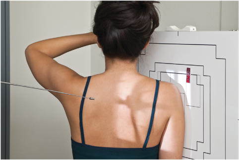
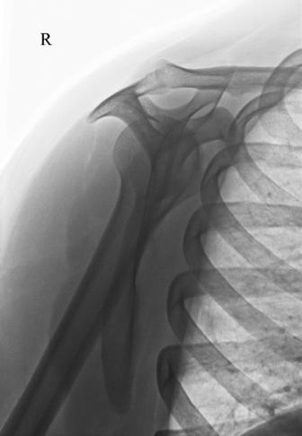

# Rx umăr în traumatism acut / regim de urgență — incidență tangențială pentru spațiul de ieșire al supraspinosului — metoda Neer [10]

  📷 Radiografie Convențională (Rx)
  <strong>Actualizat:</strong> 2026-09-15
  <strong>Autor:</strong> Departamentul de Radiologie / Referință Bontrager

---

-   __1. Rezumat Clinic & Indicații__

    ---

    === "Indicații Clinice"

        - Fractură sau luxație/subluxație articulară suspectată a humerusului proximal și omoplatului (scapulei)
        - Evidențiază în mod specific arcul coracoacromial pentru regiunea ieșirii supraspinosului, în vederea unei posibile impingementuri a umărului11

    === "Ghid Național IRIS"

        !!! info "Referință Primară: Ghidul Național IRIS (Ordinul MS 1342/2012)"
            - **Capitol Ghid IRIS:** *Aparat locomotor & Membru superior*
            - **Grad de Recomandare:** **Grad A**
            - **Nivel de Iradiere Estimată:** `Clasa 1 (Minimă < 0.05 mSv)`

            [:octicons-search-16: Deschide Ghidul IRIS](../../iris.md){ .md-button .md-button--primary } [:material-open-in-new: Aplicația Oficială PWA](https://radiologie-pediatrica.ro/iris/){ .md-button target="_blank" rel="noopener" }

-   __2. Poziționare & Centrare Fascicul__

    ---

    - **Poziție Pacient:** Pacient: Se efectuează radiografia cu pacientul în ortostatism sau în decubit. (Poziția în ortostatism este de obicei mai confortabilă pentru pacient.); Regiune anatomică: cu pacientul cu fața spre receptorul de imagine, se rotește în incidență oblică anterioară, ca pentru profilul lateral al omoplatului (scapulei). Se palpează unghiul superior al omoplatului (scapulei) și articulația acromioclaviculară. Se rotește pacientul până când linia imaginară dintre aceste două puncte este perpendiculară pe receptorul de imagine. Din cauza diferențelor dintre pacienți, gradul de oblicitate a corpului poate varia de la 45° la 60°. Se centrează articulația scapulohumerală pe raza centrală și în centrul receptorului de imagine (Fig. 5.81). Se abduce ușor brațul, astfel încât humerusul proximal să nu se suprapună peste coaste (cutia toracică); nu se încearcă rotirea brațului.
    - **Punct de Centrare Fascicul:** Necesită un unghi caudal al razei centrale de 10° la 15°, centrat posterior pentru a trece prin marginea superioară a capului humeral, situată la aproximativ 1 țol (2.5 cm) superior față de aspectul medial al spinei scapulei.12
    - **Distanță Focar-Film (DFF / SID):** 100 cm
    - **Comandă Respiratorie:** Apnee pe durata expunerii. Umăr (traumatism acut / regim de urgență) SPECIAL: ieșirea supraspinosului (metoda Neer)

-   __3. Parametri Tehnici Expunere__

    ---

    | Parametru Tehnic | Valoare Configurare Generator / Tub |
    |:-----------------|:-------------------------------------|
    | **Tensiune Tub (kV)** | 70-85 kV |
    | **Sarcină / Produs Curent-Timp (mAs)** | DE CONFIGURAT PE APARAT |
    | **Distanță Focar-Film (DFF / SID)** | 100 cm |
    | **Grilă Antidifuzoare (Bucky)** | Cu grilă antidifuzoare Bucky |
    | **Dimensiune Focar** | Focar Mic (0.6 mm) |
    | **Camere de Ionizare AEC** | Camerele laterale (sau camera centrală, în funcție de regiune) |
    | **Colimare Fascicul** | Dimensiunea câmpului. Colimați pe cele patru laturi la aria de interes diagnostic. |
    | **Filtrare Tub** | Totală ≥ 2.5 mm Al echivalent |

-   __4. Criterii de Calitate & Reușită Imagine__

    ---

    - Humerusul proximal este suprapus peste corpul subțire al omoplatului (scapulei), care trebuie să fie vizibil la capăt, fără suprapunere costală. Poziție:
    - Procesele acromion și coracoid trebuie să apară ca brațe superioare aproape simetrice ale literei Y.
    - capul humeral trebuie să apară suprapus și centrat pe cavitatea glenoidă, chiar sub regiunea ieșirii supraspinosului.
    - regiunea ieșirii supraspinosului apare deschisă, liberă de suprapunerea capului humeral (vezi săgeata din Fig. 5.82).
    - Dimensiunea câmpului de colimare până la aria de interes diagnostic. Expunere:
    - expunerea optimă a receptorului de imagine și contrastul evidențiază aspectul de Y al omoplatului (scapulei) superior-lateral, suprapus prin capul humeral, cu conturul corpului omoplatului (scapulei) vizibil prin humerus.
    - Marginile osoase apar clare și nete, indicând absența mișcării. Fig. 5.81. Incidență tangențială — metoda Neer, cu raza centrală în unghi caudal de 10° la 15°. Fig. 5.82. Incidență tangențială — metoda Neer. (Cu amabilitatea lui Joss Wertz, DO.)

-   __5. Protecție Radiologică (ALARA)__

    ---

    - Ecranare gonadică și a organelor radiosensibile conform procedurilor locale de radioprotecție ALARA.
    - Colimare strictă la aria de interes pentru limitarea radiației difuze.
    - Verificarea posibilității unei sarcini la pacientele de vârstă fertilă înainte de expunere.

### 🖼️ Imagini

<figure class="protocol-image-card" markdown>

<figcaption><strong>Fig. 5.82). • Dimensiunea câmpului de colimare la aria de interes diagnostic.</strong> — Poziționarea pacientului conform Ghidului Bontrager (Fig. 5.82). • Dimensiunea câmpului de colimare la aria de interes diagnostic.)</figcaption>

</figure>

<figure class="protocol-image-card" markdown>

<figcaption><strong>Fig. 5.81 Incidență tangențială — metoda Neer, cu raza centrală la 10° până la 15°.</strong> — Aspect radiografic de referință conform Ghidului Bontrager (Fig. 5.81 Incidență tangențială — metoda Neer, cu raza centrală la 10° până la 15°).</figcaption>

</figure>

=== "Ghid Rapid de Execuție"

    1. **Identificarea și verificarea pacientului:** verificare identitate, zonă de examinat, consimțământ conform procedurii și evaluarea posibilității unei sarcini, când este relevantă.
    2. **Pregătire:** îndepărtarea oricăror obiecte radiopace (bijuterii, agrafe, fermoare, proteze, pansamente dense).
    3. **Poziționare precisă:** alinierea receptorului de imagine și a tubului la distanța prescrisă (100 cm).
    4. **Colimare strictă:** adaptarea fasciculului strict la regiunea de diagnostic pentru scăderea iradierii și reducerea radiației difuze.
    5. **Radioprotecție:** verificarea [politicii RX](../radioprotectie.md), cu măsuri distincte pentru pacient, personal și însoțitor.

## Surse de documentare

- [Bontrager's Textbook of Radiographic Positioning (Ed. 9/10), Pagina 215](https://www.elsevier.com/books/textbook-of-radiographic-positioning-and-related-anatomy/lampignano/978-0-323-65367-1)
