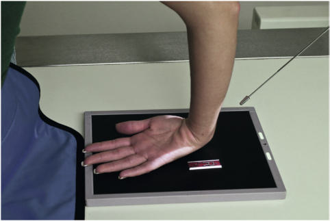
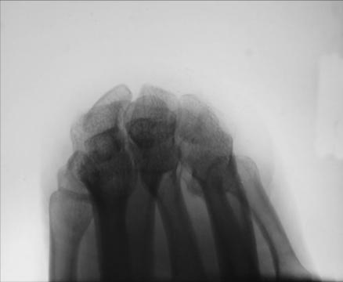
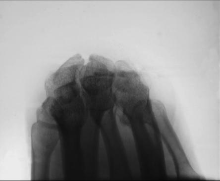

# Rx TANGENTIAL PROJECTION CARPAL BRIDGE (Pumn (Articulație Radiocarpiană))

  📷 Radiografie Convențională (Rx)
  <strong>Actualizat:</strong> 2026-09-15
  <strong>Autor:</strong> Departamentul de Radiologie / Referință Bontrager

---

-   __1. Rezumat Clinic & Indicații__

    ---

    === "Indicații Clinice"

        - Calcification or other pathology of the dorsal (posterior) aspect of the carpal bones

    === "Ghid Național IRIS"

        !!! info "Referință Primară: Ghidul Național IRIS (Ordinul MS 1342/2012)"
            - **Capitol Ghid IRIS:** *Ghidul Național IRIS*
            - **Grad de Recomandare:** **De verificat pe indicație; fără grad atribuit automat**
            - **Nivel de Iradiere Estimată:** `De verificat pentru examinarea și populația selectate`

            [:octicons-search-16: Deschide Ghidul IRIS](../../iris.md){ .md-button .md-button--primary } [:material-open-in-new: Aplicația Oficială PWA](https://radiologie-pediatrica.ro/iris/){ .md-button target="_blank" rel="noopener" }
-   __2. Poziționare & Centrare Fascicul__

    ---

    - **Poziție Pacient:** Pacient: Have patient stand or sit at end of the table and then lean over and place dorsal surface of Mână, palm upward, on IR.; Regiune anatomică: Center dorsal aspect of carpals to IR. Gently flex Pumn (Articulație Radiocarpiană) as far as patient can tolerate, or until the Mână and Antebraț form as near a 90° (right) angle as possible (Fig. 4.115).
    - **Punct de Centrare Fascicul:** angle with ulnar deviation, alternate modified Incidență Scafoid (Metoda Stecher) Radial deviation Carpal canal Carpal bridge Fig. 4.115 Carpal bridge—tangential projection; CR 45° to Antebraț.
    - **Distanță Focar-Film (DFF / SID):** 100 cm
    - **Comandă Respiratorie:** Apnee pe durata expunerii (sau conform cooperării pacientului)

-   __3. Parametri Tehnici Expunere__

    ---

    | Parametru Tehnic | Valoare Configurare Generator / Tub |
    |:-----------------|:-------------------------------------|
    | **Tensiune Tub (kV)** | 55 kV |
    | **Sarcină / Produs Curent-Timp (mAs)** | DE CONFIGURAT PE APARAT |
    | **Distanță Focar-Film (DFF / SID)** | 100 cm |
    | **Grilă Antidifuzoare (Bucky)** | Fără grilă (expunere directă) |
    | **Dimensiune Focar** | Focar Mic (0.6 mm) |
    | **Camere de Ionizare AEC** | DE CONFIGURAT PE APARAT |
    | **Colimare Fascicul** | Field Size Collimate on four sides to anatomy of interest. Pumn (Articulație Radiocarpiană) SPECIAL Scaphoid projections: |
    | **Filtrare Tub** | Totală ≥ 2.5 mm Al echivalent |

-   __4. Criterii de Calitate & Reușită Imagine__

    ---

    - Tangential view of the dorsal aspect of the scaphoid, lunate, and triquetrum is visible.
    - Outline of the capitate and trapezium superimposed is visible (Figs. 4.116 and 4.117). Position:
    - Dorsal aspect of the carpal bones should be visualized clear of superimposition and centered to IR.
    - CR and center of collimation field size should be to the area of the dorsal carpal bones. Exposure:
    - Optimal image receptor exposure and contrast with no motion should demonstrate the dorsal aspect of carpal bones, with sharp borders and clear, Contururi osoase și travee trabeculare nete, fără artefacte de mișcare.
    - Outlines of proximal metacarpals should be visualized through superimposed structures without overexposure of the dorsal aspects of carpals seen in profile. R Fig. 4.116 Carpal bridge tangential projection of right Pumn (Articulație Radiocarpiană). Capitate 5th metacarpal Triquetrum Trapezium and trapezoid Police Scaphoid Lunate R Fig. 4.117 Carpal bridge.

-   __5. Protecție Radiologică (ALARA)__

    ---

    - Ecranare gonadică și a organelor radiosensibile conform procedurilor locale de radioprotecție ALARA.
    - Colimare strictă la aria de interes pentru limitarea radiației difuze.
    - Verificarea posibilității unei sarcini la pacientele de vârstă fertilă înainte de expunere.

### 🖼️ Imagini

<figure class="protocol-image-card" markdown>

<figcaption><strong>Fig. 4.115 Carpal bridge—tangential projection; CR 45° to Antebraț.</strong> — Poziționare pacient conform Ghidului Bontrager (Fig. 4.115 Carpal bridge—tangential projection; CR 45° to forearm.)</figcaption>

</figure>

<figure class="protocol-image-card" markdown>

<figcaption><strong>Fig. 4.116 Carpal bridge tangential projection of right Pumn (Articulație Radiocarpiană).</strong> — Aspect radiografic de referință conform Ghidului Bontrager (Fig. 4.116 Carpal bridge tangential projection of right wrist.)</figcaption>

</figure>

<figure class="protocol-image-card" markdown>

<figcaption><strong>Fig. 4.117 Carpal bridge.</strong> — Aspect radiografic de referință conform Ghidului Bontrager (Fig. 4.117 Carpal bridge.)</figcaption>

</figure>

=== "Ghid Rapid de Execuție"

    1. **Identificarea și verificarea pacientului:** verificare identitate, zonă de examinat, consimțământ conform procedurii și evaluarea posibilității unei sarcini, când este relevantă.
    2. **Pregătire:** îndepărtarea oricăror obiecte radiopace (bijuterii, agrafe, fermoare, proteze, pansamente dense).
    3. **Poziționare precisă:** alinierea receptorului de imagine și a tubului la distanța prescrisă (100 cm).
    4. **Colimare strictă:** adaptarea fasciculului strict la regiunea de diagnostic pentru scăderea iradierii și reducerea radiației difuze.
    5. **Radioprotecție:** verificarea [politicii RX](../radioprotectie.md), cu măsuri distincte pentru pacient, personal și însoțitor.

## Surse de documentare

- [Bontrager's Textbook of Radiographic Positioning (Ed. 9/10), Pagina 174](https://www.elsevier.com/books/textbook-of-radiographic-positioning-and-related-anatomy/lampignano/978-0-323-65367-1)
