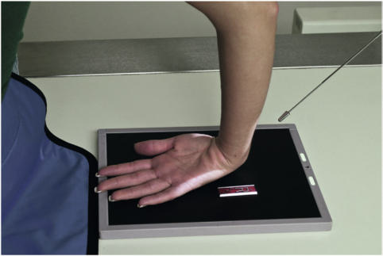
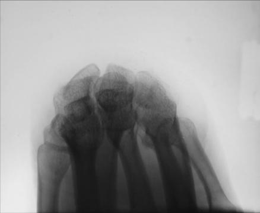
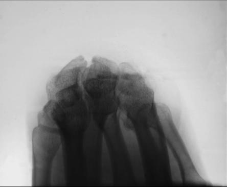

# Rx incidență tangențială PUNTE CARPIANĂ (Pumn (Articulație radiocarpiană))

  📷 Radiografie Convențională (Rx)
  <strong>Actualizat:</strong> 2026-09-15
  <strong>Autor:</strong> Departamentul de Radiologie / Referință Bontrager

---

-   __1. Rezumat Clinic & Indicații__

    ---

    === "Indicații Clinice"

        - Calcificare sau altă patologie a aspectului dorsal (posterior) al oaselor carpiene

    === "Ghid Național IRIS"

        !!! info "Referință Primară: Ghidul Național IRIS (Ordinul MS 1342/2012)"
            - **Capitol Ghid IRIS:** *Aparat locomotor & Membru superior*
            - **Grad de Recomandare:** **Grad A**
            - **Nivel de Iradiere Estimată:** `Clasa 1 (Minimă < 0.01 mSv)`

            [:octicons-search-16: Deschide Ghidul IRIS](../../iris.md){ .md-button .md-button--primary } [:material-open-in-new: Aplicația Oficială PWA](https://radiologie-pediatrica.ro/iris/){ .md-button target="_blank" rel="noopener" }

-   __2. Poziționare & Centrare Fascicul__

    ---

    - **Poziție Pacient:** Pacient: Pacientul să stea sau să șadă la capătul mesei de examinare, apoi să se aplece și să așeze suprafața dorsală a mâinii, cu palma în sus, pe receptorul de imagine.; Regiune anatomică: Centrați aspectul dorsal al oaselor carpiene la receptorul de imagine. Flectați ușor pumnul atât cât poate tolera pacientul sau până când mâna și antebrațul formează un unghi cât mai apropiat de 90° (drept) posibil (Fig. 4.115).
    - **Punct de Centrare Fascicul:** unghi cu deviație ulnară, incidență modificată alternativă pentru scafoid (metoda Stecher) deviație radială canal carpian punte carpiană Fig. 4.115 Punte carpiană—incidență tangențială; raza centrală la 45° față de antebraț.
    - **Distanță Focar-Film (DFF / SID):** 100 cm
    - **Comandă Respiratorie:** Apnee pe durata expunerii (sau conform cooperării pacientului)

-   __3. Parametri Tehnici Expunere__

    ---

    | Parametru Tehnic | Valoare Configurare Generator / Tub |
    |:-----------------|:-------------------------------------|
    | **Tensiune Tub (kV)** | 55 kV |
    | **Sarcină / Produs Curent-Timp (mAs)** | DE CONFIGURAT PE APARAT |
    | **Distanță Focar-Film (DFF / SID)** | 100 cm |
    | **Grilă Antidifuzoare (Bucky)** | Fără grilă (expunere directă) |
    | **Dimensiune Focar** | Focar Mic (0.6 mm) |
    | **Camere de Ionizare AEC** | DE CONFIGURAT PE APARAT |
    | **Colimare Fascicul** | Dimensiunea câmpului: colimați pe patru laturi la nivelul anatomiei de interes. Pumn—incidențe SPECIALE pentru scafoid: |
    | **Filtrare Tub** | Totală ≥ 2.5 mm Al echivalent |

-   __4. Criterii de Calitate & Reușită Imagine__

    ---

    - În incidența tangențială este vizibil aspectul dorsal al scafoidului, semilunarului și piramidalului.
    - Conturul suprapus al osului capitat și al trapezului este vizibil (Fig. 4.116 și 4.117). Poziție:
    - Aspectul dorsal al oaselor carpiene trebuie vizualizat clar, fără suprapuneri, și centrat pe receptorul de imagine.
    - Raza centrală și centrul câmpului de colimare trebuie să fie la nivelul oaselor carpiene dorsale. Expunere:
    - Expunerea și contrastul optime ale receptorului de imagine, fără mișcare, trebuie să evidențieze aspectul dorsal al oaselor carpiene, cu margini nete și contururi osoase și travee trabeculare clare, fără artefacte de mișcare.
    - Contururile porțiunilor proximale ale metacarpienelor trebuie vizualizate prin structurile suprapuse, fără supraexpunerea fețelor dorsale ale oaselor carpiene văzute din profil. R Fig. 4.116 Incidență tangențială a punții carpiene a pumnului (articulației radiocarpiene) drept. Capitat; metacarpianul 5; piramidal; trapez și trapezoid; police; scafoid; semilunar. R Fig. 4.117 Punte carpiană.

-   __5. Protecție Radiologică (ALARA)__

    ---

    - Ecranare gonadică și a organelor radiosensibile conform procedurilor locale de radioprotecție ALARA.
    - Colimare strictă la aria de interes pentru limitarea radiației difuze.
    - Verificarea posibilității unei sarcini la pacientele de vârstă fertilă înainte de expunere.

### 🖼️ Imagini

<figure class="protocol-image-card" markdown>

<figcaption><strong>Fig. 4.115 Punte carpiană—incidență tangențială; raza centrală la 45° față de antebraț.</strong> — Poziționarea pacientului conform Ghidului Bontrager (Fig. 4.115 Punte carpiană—incidență tangențială; raza centrală la 45° față de antebraț.)</figcaption>

</figure>

<figure class="protocol-image-card" markdown>

<figcaption><strong>Fig. 4.116 Punte carpiană, incidență tangențială a pumnului drept.</strong> — Aspect radiografic de referință conform Ghidului Bontrager (Fig. 4.116 Punte carpiană, incidență tangențială a pumnului drept.)</figcaption>

</figure>

<figure class="protocol-image-card" markdown>

<figcaption><strong>Fig. 4.117 Punte carpiană.</strong> — Aspect radiografic de referință conform Ghidului Bontrager (Fig. 4.117 Punte carpiană.)</figcaption>

</figure>

=== "Ghid Rapid de Execuție"

    1. **Identificarea și verificarea pacientului:** verificare identitate, zonă de examinat, consimțământ conform procedurii și evaluarea posibilității unei sarcini, când este relevantă.
    2. **Pregătire:** îndepărtarea oricăror obiecte radiopace (bijuterii, agrafe, fermoare, proteze, pansamente dense).
    3. **Poziționare precisă:** alinierea receptorului de imagine și a tubului la distanța prescrisă (100 cm).
    4. **Colimare strictă:** adaptarea fasciculului strict la regiunea de diagnostic pentru scăderea iradierii și reducerea radiației difuze.
    5. **Radioprotecție:** verificarea [politicii RX](../radioprotectie.md), cu măsuri distincte pentru pacient, personal și însoțitor.

## Surse de documentare

- [Bontrager's Textbook of Radiographic Positioning (Ed. 9/10), Pagina 174](https://www.elsevier.com/books/textbook-of-radiographic-positioning-and-related-anatomy/lampignano/978-0-323-65367-1)
