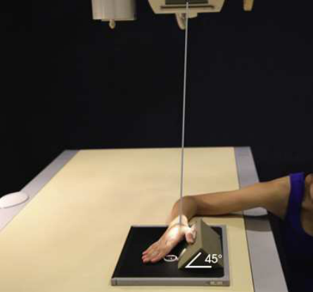
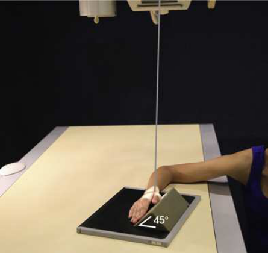
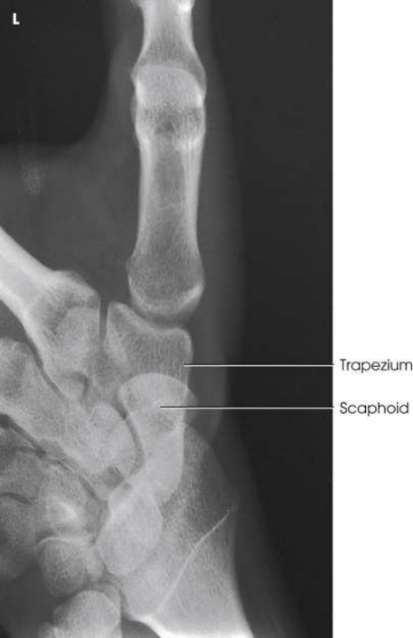

# Rx Trapezium — Oblică Axială PA — Clements-Nakayama Method (Merrill)

  📷 Radiografie Convențională (Rx)
  <strong>Actualizat:</strong> 2026-09-16
  <strong>Autor:</strong> Referință Merrill

---

-   __1. Rezumat Clinic & Indicații__

    ---

    === "Indicații Clinice"

        - Conform reperelor anatomice standard din tratat

    === "Ghid Național IRIS"

        !!! info "Referință Primară: Ghidul Național IRIS (Ordinul MS 1342/2012)"
            - **Capitol Ghid IRIS:** *Ghidul Național IRIS*
            - **Grad de Recomandare:** **De verificat pe indicație; fără grad atribuit automat**
            - **Nivel de Iradiere Estimată:** `De verificat pentru examinarea și populația selectate`

            [:octicons-search-16: Deschide Ghidul IRIS](../../iris.md){ .md-button .md-button--primary } [:material-open-in-new: Aplicația Oficială PWA](https://radiologie-pediatrica.ro/iris/){ .md-button target="_blank" rel="noopener" }
-   __2. Poziționare & Centrare Fascicul__

    ---

    - **Poziție Pacient:** cu pacientul Poziție Șezândă la end de masa radiologică, place Mână pe receptorul de imagine în Incidență de Profil (lateral).; Place Pumn (Articulație Radiocarpiană) în Incidență de Profil (lateral), resting pe ulnar surface over center de receptorul de imagine. Place a 45-grade sponge wedge pe / sprijinit de anterior surface, then se rotește Mână la come în contact cu sponge. If pacientul este able la achieve ulnar deviation, se ajustează receptorul de imagine astfel încât axa longitudinală de receptorul de imagine și Antebraț align cu raza centrală centrală (Fig. 5.93). If pacientul este unable la achieve ulnar deviation comfortably, se aliniază straight Pumn (Articulație Radiocarpiană) la receptorul de imagine, și se rotește Cot end de receptorul de imagine și braț 20 grade away de la raza centrală (Fig. 5.94). se efectuează ecranarea gonadelor cu șorț plumbat.
    - **Punct de Centrare Fascicul:** înclinat 45 grade distally la enter anatomic snuf-box de Pumn (Articulație Radiocarpiană) și pass through trapezium
    - **Distanță Focar-Film (DFF / SID):** Nespecificat în fragmentul extras; de verificat în sursă
    - **Comandă Respiratorie:** Conform reperelor anatomice standard din tratat

-   __3. Parametri Tehnici Expunere__

    ---

    | Parametru Tehnic | Valoare Configurare Generator / Tub |
    |:-----------------|:-------------------------------------|
    | **Tensiune Tub (kV)** | DE CONFIGURAT PE APARAT |
    | **Sarcină / Produs Curent-Timp (mAs)** | DE CONFIGURAT PE APARAT |
    | **Distanță Focar-Film (DFF / SID)** | Nespecificat în fragmentul extras; de verificat în sursă |
    | **Grilă Antidifuzoare (Bucky)** | DE CONFIGURAT PE APARAT |
    | **Dimensiune Focar** | DE CONFIGURAT PE APARAT |
    | **Camere de Ionizare AEC** | DE CONFIGURAT PE APARAT |
    | **Colimare Fascicul** | Adjust câmp de iradiere la 2.5 inches (6 cm) proximal și distal la Pumn (Articulație Radiocarpiană) articulație și 1 inch (2.5 cm) pe sides. Se plasează markerul de lateralitate în câmpul colimat. |
    | **Filtrare Tub** | DE CONFIGURAT PE APARAT |

-   __4. Criterii de Calitate & Reușită Imagine__

    ---

    - Criterii radiologice de calitate imaginii:
    - Colimare adecvată vizibilă și prezența markerului de lateralitate (D/S) plasat clear de anatomy de interest
    - Trapezium projected liber de other oase carpiene cu exception de articulation cu scaphoid
    - Bony detalii trabeculare osoase și surrounding soft tissues

-   __5. Protecție Radiologică (ALARA)__

    ---

    - Nespecificat în fragmentul extras; de verificat în sursă

!!! note "Observații Clinice & Tehnice"
    Holly 26 recommended variation de this method cu Mână în ulnar deviation pe a 37-grade sponge wedge. raza centrală este Orientat vertical, entering just proximal la first metacarpal base.

### 🖼️ Imagini

<figure class="protocol-image-card" markdown>

<figcaption><strong>Merrill — pagina PDF 308, imaginea 1</strong> — Imagine din fragmentul sursă; asocierea necesită revizie.</figcaption>

</figure>

<figure class="protocol-image-card" markdown>

<figcaption><strong>Merrill — pagina PDF 309, imaginea 2</strong> — Imagine din fragmentul sursă; asocierea necesită revizie.</figcaption>

</figure>

<figure class="protocol-image-card" markdown>

<figcaption><strong>Merrill — pagina PDF 310, imaginea 3</strong> — Imagine din fragmentul sursă; asocierea necesită revizie.</figcaption>

</figure>

=== "Ghid Rapid de Execuție"

    1. **Identificarea și verificarea pacientului:** verificare identitate, zonă de examinat, consimțământ conform procedurii și evaluarea posibilității unei sarcini, când este relevantă.
    2. **Pregătire:** îndepărtarea oricăror obiecte radiopace (bijuterii, agrafe, fermoare, proteze, pansamente dense).
    3. **Poziționare precisă:** alinierea receptorului de imagine și a tubului la distanța prescrisă (Nespecificat în fragmentul extras; de verificat în sursă).
    4. **Colimare strictă:** adaptarea fasciculului strict la regiunea de diagnostic pentru scăderea iradierii și reducerea radiației difuze.
    5. **Radioprotecție:** verificarea [politicii RX](../radioprotectie.md), cu măsuri distincte pentru pacient, personal și însoțitor.

## Surse de documentare

- [Merrill’s Atlas, 5. Upper Extremity, pagini PDF 307–310](../../assets/protocols/sources/a56d45c16829_Merrills_Atlas_of_Radiographic_Positioning__Procedures_3Vol_Set.pdf#page=307)

## Fragmente sursă traduse (referință tehnică)

### anatomy

trapezium și its articulations cu adjacent oase carpiene (Fig. 5.95). articulation de trapezium și scaphoid este nu vizualizat pe this
imagine.

### collimation

• Adjust câmp de iradiere la 2.5 inches (6 cm) proximal și distal la wrist articulație și 1 inch (2.5 cm) pe sides. Place marker de lateralitate (D/S) în
collimated expunere field.

### cr

• înclinat 45 grade distally la enter anatomic snuf-box de wrist și pass through trapezium

### criteria

Criterii radiologice de calitate imaginii:
• Colimare adecvată vizibilă și prezența markerului de lateralitate (D/S) plasat clear de anatomy de interest
• Trapezium projected liber de other oase carpiene cu exception de articulation cu scaphoid
• Bony detalii trabeculare osoase și surrounding soft tissues

### notes

Holly 26 recommended variation de this method cu mână în ulnar deviation pe a 37-grade sponge wedge. raza centrală este
Orientat vertical, entering just proximal la first metacarpal base.

### part_pos

• Place wrist în poziție de profil (lateral), resting pe ulnar surface over center de receptorul de imagine.
• Place a 45-grade sponge wedge pe / sprijinit de anterior surface, then se rotește mână la come în contact cu sponge.
• If pacientul este able la achieve ulnar deviation, se ajustează receptorul de imagine astfel încât axa longitudinală de receptorul de imagine și forearm align cu raza centrală centrală (Fig.
5.93).
• If pacientul este unable la achieve ulnar deviation comfortably, se aliniază straight wrist la receptorul de imagine, și se rotește cot end de receptorul de imagine
și braț 20 grade away de la raza centrală (Fig. 5.94).
• se efectuează ecranarea gonadelor cu șorț plumbat.

### patient_pos

• cu pacientul așezat pe scaun la end de masa radiologică, place mână pe receptorul de imagine în poziție de profil (lateral).

### tech

poziționat prin manufacturer sau department protocol pentru corect anatomy display orientation; raza centrală plate: 10 × 12 inches (24 × 30 cm) longitudinal.

