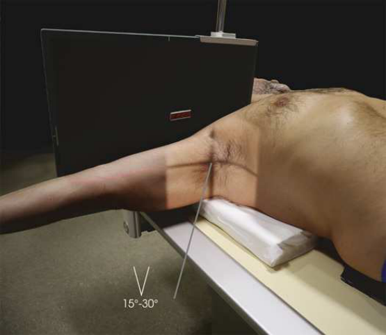
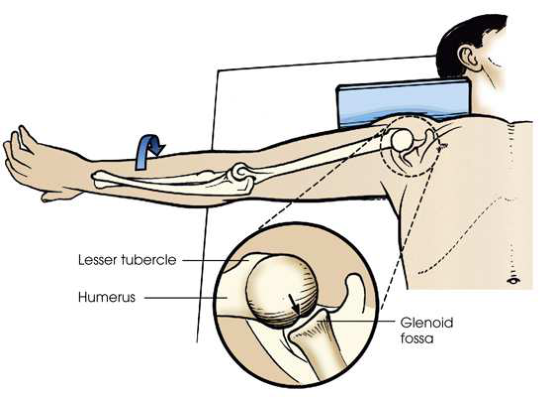
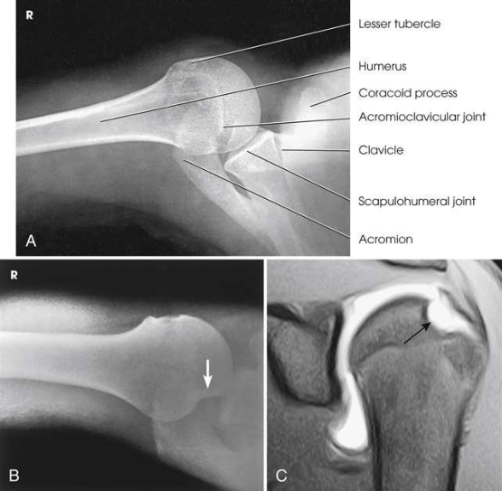
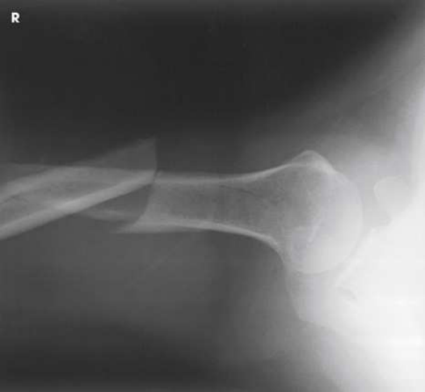
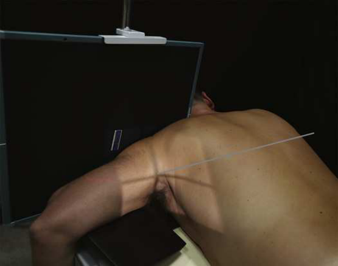
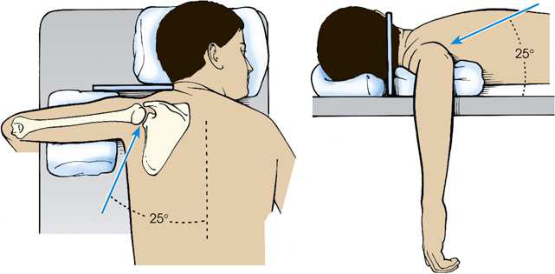

# Rx Umăr Joint — Inferosuperior Axial Incidență — Metoda Lawrence 4 Inferosuperior Axial Incidență Rafert et al. 5 Modification (Merrill)

  📷 Radiografie Convențională (Rx)
  <strong>Actualizat:</strong> 2026-09-16
  <strong>Autor:</strong> Referință Merrill

---

-   __1. Rezumat Clinic & Indicații__

    ---

    === "Indicații Clinice"

        - Conform reperelor anatomice standard din tratat

    === "Ghid Național IRIS"

        !!! info "Referință Primară: Ghidul Național IRIS (Ordinul MS 1342/2012)"
            - **Capitol Ghid IRIS:** *Ghidul Național IRIS*
            - **Grad de Recomandare:** **De verificat pe indicație; fără grad atribuit automat**
            - **Nivel de Iradiere Estimată:** `De verificat pentru examinarea și populația selectate`

            [:octicons-search-16: Deschide Ghidul IRIS](../../iris.md){ .md-button .md-button--primary } [:material-open-in-new: Aplicația Oficială PWA](https://radiologie-pediatrica.ro/iris/){ .md-button target="_blank" rel="noopener" }
-   __2. Poziționare & Centrare Fascicul__

    ---

    - **Poziție Pacient:** cu pacientul în Decubit dorsal poziție, elevate capul, umeri, și Cot approximately 3 inches (7.6 cm) pe radiolucent sponge.; Metoda Lawrence ca much ca possible, abduct braț de afected side în unghi drept față de axa longitudinală de corp. minimum de 20 grade este required la prevent superimposition de braț pe Umăr. Keep Humerus în extern ro̍ ation, then se ajustează Antebraț și Mână în comfortable poziție, grasping vertical support sau extins pe săculeți cu nisip sau firm pillow. Support poate fie necessary under Antebraț și Mână. Provide pacientul cu extension board pentru braț. Se instruiește pacientul să turn capul away de la side being examined astfel încât receptorul de imagine poate fie plasat pe / sprijinit de neck. Place receptorul de imagine pe edge pe / sprijinit de Umăr și ca close ca possible la gâtul. Support receptorul de imagine în poziție cu săculeți cu nisip sau use vertical receptorul de imagine holder (Fig. 6.27). Rafert modification anterior luxație articulară de cap humeral poate result în wedge-shaped compression suspiciune de fractură de articular surface de cap humeral, called Hill-Sachs defec̍. 6 suspiciune de fractură este located pe posterolateral cap humeral. exaͨ erated extern ro̍ ation de braț poate fie required la see defect. cu pacientul în poziție exactly ca pentru Metoda Lawrence, externally se rotește extins braț until Mână forms a 45-grade oblic angle. Police este pointing downward (Fig. 6.28). Assist pacientul în rotating braț la avoid overstressing Umăr articulație. se efectuează ecranarea gonadelor cu șorț plumbat.
    - **Punct de Centrare Fascicul:** Metoda Lawrence Horizontally through axilla la region de AC articulation. grade de medial angulation de raza centrală depends pe grade de abduction de braț. grade de medial angulation este often între 15 grade și 30 grade. greater abduction, greater angle. Rafert modification orizontal și înclinat approximately 15 grade medially, entering axilla și passing through articulații acromioclaviculare.
    - **Distanță Focar-Film (DFF / SID):** Nespecificat în fragmentul extras; de verificat în sursă
    - **Comandă Respiratorie:** apnee (oprirea respirației).

-   __3. Parametri Tehnici Expunere__

    ---

    | Parametru Tehnic | Valoare Configurare Generator / Tub |
    |:-----------------|:-------------------------------------|
    | **Tensiune Tub (kV)** | DE CONFIGURAT PE APARAT |
    | **Sarcină / Produs Curent-Timp (mAs)** | DE CONFIGURAT PE APARAT |
    | **Distanță Focar-Film (DFF / SID)** | Nespecificat în fragmentul extras; de verificat în sursă |
    | **Grilă Antidifuzoare (Bucky)** | DE CONFIGURAT PE APARAT |
    | **Dimensiune Focar** | DE CONFIGURAT PE APARAT |
    | **Camere de Ionizare AEC** | DE CONFIGURAT PE APARAT |
    | **Colimare Fascicul** | Adjust câmp de iradiere la 12 inches (30 cm) în width pe collimator și la 1 inch (2.5 cm) above anterior shadow de Umăr. Se plasează markerul de lateralitate în câmpul colimat. |
    | **Filtrare Tub** | DE CONFIGURAT PE APARAT |

-   __4. Criterii de Calitate & Reușită Imagine__

    ---

    - Criterii radiologice de calitate imaginii:
    - Colimare adecvată vizibilă și prezența markerului de lateralitate (D/S) plasat clear de anatomy de interest
    - Scapulohumeral articulație cu slight overlap
    - proces coracoid, pointing anteriorly
    - mică tuberozitate humerală (trohin) în profile și orientat anteriorly
    - articulații acromioclaviculare, acromion, și acromial end de Claviculă projected through cap humeral
    - Bony detalii trabeculare osoase și surrounding soft tissues

-   __5. Protecție Radiologică (ALARA)__

    ---

    - Nespecificat în fragmentul extras; de verificat în sursă

!!! note "Observații Clinice & Tehnice"
    Conform reperelor anatomice standard din tratat

### 🖼️ Imagini

<figure class="protocol-image-card" markdown>

<figcaption><strong>Merrill — pagina PDF 393, imaginea 1</strong> — Imagine din fragmentul sursă; asocierea necesită revizie.</figcaption>

</figure>

<figure class="protocol-image-card" markdown>

<figcaption><strong>Merrill — pagina PDF 393, imaginea 2</strong> — Imagine din fragmentul sursă; asocierea necesită revizie.</figcaption>

</figure>

<figure class="protocol-image-card" markdown>

<figcaption><strong>Merrill — pagina PDF 394, imaginea 3</strong> — Imagine din fragmentul sursă; asocierea necesită revizie.</figcaption>

</figure>

<figure class="protocol-image-card" markdown>

<figcaption><strong>Merrill — pagina PDF 395, imaginea 4</strong> — Imagine din fragmentul sursă; asocierea necesită revizie.</figcaption>

</figure>

<figure class="protocol-image-card" markdown>

<figcaption><strong>Merrill — pagina PDF 395, imaginea 5</strong> — Imagine din fragmentul sursă; asocierea necesită revizie.</figcaption>

</figure>

<figure class="protocol-image-card" markdown>

<figcaption><strong>Merrill — pagina PDF 396, imaginea 6</strong> — Imagine din fragmentul sursă; asocierea necesită revizie.</figcaption>

</figure>

=== "Ghid Rapid de Execuție"

    1. **Identificarea și verificarea pacientului:** verificare identitate, zonă de examinat, consimțământ conform procedurii și evaluarea posibilității unei sarcini, când este relevantă.
    2. **Pregătire:** îndepărtarea oricăror obiecte radiopace (bijuterii, agrafe, fermoare, proteze, pansamente dense).
    3. **Poziționare precisă:** alinierea receptorului de imagine și a tubului la distanța prescrisă (Nespecificat în fragmentul extras; de verificat în sursă).
    4. **Colimare strictă:** adaptarea fasciculului strict la regiunea de diagnostic pentru scăderea iradierii și reducerea radiației difuze.
    5. **Radioprotecție:** verificarea [politicii RX](../radioprotectie.md), cu măsuri distincte pentru pacient, personal și însoțitor.

## Surse de documentare

- [Merrill’s Atlas, 6. Shoulder Girdle, pagini PDF 391–396](../../assets/protocols/sources/a56d45c16829_Merrills_Atlas_of_Radiographic_Positioning__Procedures_3Vol_Set.pdf#page=391)

## Fragmente sursă traduse (referință tehnică)

### anatomy

inferosuperior axial imagine de proximal humerus, scapulohumeral articulație, lateral portion de proces coracoid, și AC articulation. insertion site de subscapular tendon pe mică tuberozitate humerală (trohin) de humerus și point de insertion de teres minor tendon pe greater
tubercle de humerus sunt also vizualizat. Hill-Sachs compression suspiciune de fractură pe posterolateral cap humeral poate fie seen using Rafert
modification (Figs. 6.29 și 6.30).

### collimation

• Adjust câmp de iradiere la 12 inches (30 cm) în width pe collimator și la 1 inch (2.5 cm) above anterior shadow de umăr.
Se plasează markerul de lateralitate în câmpul colimat.

### cr

Lawrence method
• Horizontally through axilla la region de AC articulation. grade de medial angulation de raza centrală depends pe grade
de abduction de braț. grade de medial angulation este often între 15 grade și 30 grade. greater abduction, greater angle.
Rafert modification
• orizontal și înclinat approximately 15 grade medially, entering axilla și passing through articulații acromioclaviculare.

### criteria

Criterii radiologice de calitate imaginii:
• Colimare adecvată vizibilă și prezența markerului de lateralitate (D/S) plasat clear de anatomy de interest
• Scapulohumeral articulație cu slight overlap
• proces coracoid, pointing anteriorly
• mică tuberozitate humerală (trohin) în profile și orientat anteriorly
• articulații acromioclaviculare, acromion, și acromial end de clavicle projected through cap humeral
• Bony detalii trabeculare osoase și surrounding soft tissues

### part_pos

Lawrence method
• ca much ca possible, abduct braț de afected side în unghi drept față de axa longitudinală de corp. minimum de 20 grade este
required la prevent superimposition de braț pe umăr.
• Keep humerus în extern ro̍ ation, then se ajustează forearm și mână în comfortable poziție, grasping vertical support sau
extins pe săculeți cu nisip sau firm pillow. Support poate fie necessary under forearm și mână. Provide pacientul cu extension
board pentru braț.
• Se instruiește pacientul să turn capul away de la side being examined astfel încât receptorul de imagine poate fie plasat pe / sprijinit de neck.
• Place receptorul de imagine pe edge pe / sprijinit de umăr și ca close ca possible la gâtul.
• Support receptorul de imagine în poziție cu săculeți cu nisip sau use vertical receptorul de imagine holder (Fig. 6.27).
Rafert modification
• anterior luxație articulară de cap humeral poate result în wedge-shaped compression suspiciune de fractură de articular surface de humeral
cap, called Hill-Sachs defec̍. 6 suspiciune de fractură este located pe posterolateral cap humeral. exaͨ erated extern ro̍ ation de braț
poate fie required la see defect.
• cu pacientul în poziție exactly ca pentru Lawrence method, externally se rotește extins braț until mână forms a 45-grade
oblic angle. policele este pointing downward (Fig. 6.28).
• Assist pacientul în rotating braț la avoid overstressing umăr articulație.
• se efectuează ecranarea gonadelor cu șorț plumbat.

### patient_pos

• cu pacientul în decubit dorsal, elevate capul, umeri, și cot approximately 3 inches (7.6 cm) pe radiolucent sponge.

### respiration

apnee (oprirea respirației).

### tech

poziționat prin manufacturer sau department protocol pentru corect anatomy display orientation; raza centrală plate: 10 × 12 inches (24 ×
30 cm) grilă transversal, plasat în vertical orientation în contact cu superior surface de umăr.

