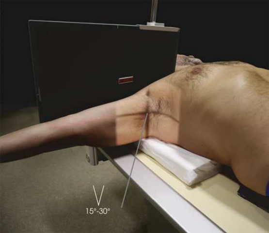
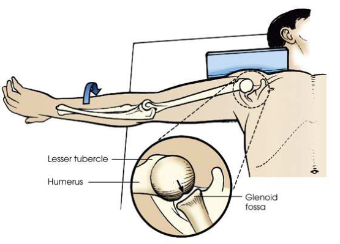
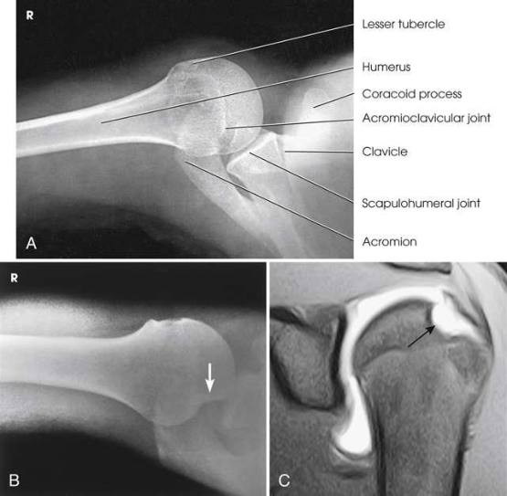
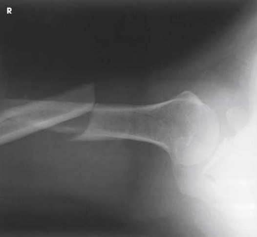
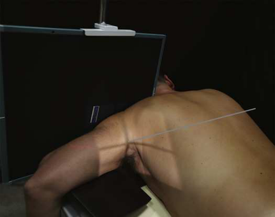
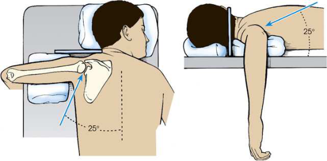

# Rx articulația umărului — incidență axială inferosuperioară — metoda Lawrence 4; incidență axială inferosuperioară Rafert et al. 5; modificare (Merrill)

  📷 Radiografie Convențională (Rx)
  <strong>Actualizat:</strong> 2026-09-16
  <strong>Autor:</strong> Referință Merrill

---

-   __1. Rezumat Clinic & Indicații__

    ---

    === "Indicații Clinice"

        - Conform reperelor anatomice standard din tratat

    === "Ghid Național IRIS"

        !!! info "Referință Primară: Ghidul Național IRIS (Ordinul MS 1342/2012)"
            - **Capitol Ghid IRIS:** *Aparat locomotor & Membru superior*
            - **Grad de Recomandare:** **Grad A**
            - **Nivel de Iradiere Estimată:** `Clasa 1 (Minimă < 0.05 mSv)`

            [:octicons-search-16: Deschide Ghidul IRIS](../../iris.md){ .md-button .md-button--primary } [:material-open-in-new: Aplicația Oficială PWA](https://radiologie-pediatrica.ro/iris/){ .md-button target="_blank" rel="noopener" }

-   __2. Poziționare & Centrare Fascicul__

    ---

    - **Poziție Pacient:**
        Cu pacientul în poziție de decubit dorsal, se ridică capul, umerii și cotul cu aproximativ 3 țoli (7.6 cm) pe un burete radiotransparent. Metoda Lawrence: pe cât posibil, se abduce brațul de partea afectată în unghi drept față de axa longitudinală a corpului. Este necesar un minimum de 20 grade pentru a preveni suprapunerea brațului peste umăr. Se menține humerusul în rotație externă, apoi se ajustează antebrațul și mâna într-o poziție confortabilă, prinzând un suport vertical sau întinzându-le pe saci cu nisip ori pe o pernă fermă. Poate fi necesar un suport sub antebraț și mână. Se pune la dispoziția pacientului o placă de extensie pentru braț. Pacientul este instruit să întoarcă capul în partea opusă celei examinate, astfel încât receptorul de imagine să poată fi plasat pe/lipit de gât. Se plasează receptorul de imagine pe muchie, pe/lipit de umăr, cât mai aproape de gât. Se susține receptorul de imagine în poziție cu saci cu nisip sau se utilizează un suport vertical pentru receptorul de imagine (Fig. 6.27).

        Modificarea Rafert

        O luxație anterioară a articulației capului humeral poate determina o compresie în formă de pană, suspectă pentru fractură, a suprafeței articulare a capului humeral, numită defect Hill-Sachs. 6 Suspiciunea de fractură este localizată pe partea posterolaterală a capului humeral. Pentru observarea defectului poate fi necesară o rotație externă exagerată a brațului. Cu pacientul în aceeași poziție ca pentru metoda Lawrence, se rotește extern brațul extins până când mâna formează un unghi oblic de 45 grade. Policele este orientat în jos (Fig. 6.28). Se asistă pacientul la rotirea brațului pentru a evita suprasolicitarea articulației umărului. Se efectuează ecranarea gonadelor cu șorț plumbat.

    - **Punct de Centrare Fascicul:**
        Metoda Lawrence

        Orizontal, prin axilă, către regiunea articulației AC. Gradul de angulație medială a razei centrale depinde de gradul de abducție a brațului. Gradul de angulație medială este adesea între 15 grade și 30 grade. Cu cât abducția este mai mare, cu atât unghiul este mai mare.

        Modificarea Rafert

        Orizontală și înclinată cu aproximativ 15 grade medial, intrând prin axilă și trecând prin articulația acromioclaviculară.

    - **Distanță Focar-Film (DFF / SID):** Nespecificat în fragmentul extras; de verificat în sursă
    - **Comandă Respiratorie:** apnee (oprirea respirației).

-   __3. Parametri Tehnici Expunere__

    ---

    | Parametru Tehnic | Valoare Configurare Generator / Tub |
    |:-----------------|:-------------------------------------|
    | **Tensiune Tub (kV)** | DE CONFIGURAT PE APARAT |
    | **Sarcină / Produs Curent-Timp (mAs)** | DE CONFIGURAT PE APARAT |
    | **Distanță Focar-Film (DFF / SID)** | Nespecificat în fragmentul extras; de verificat în sursă |
    | **Grilă Antidifuzoare (Bucky)** | DE CONFIGURAT PE APARAT |
    | **Dimensiune Focar** | DE CONFIGURAT PE APARAT |
    | **Camere de Ionizare AEC** | DE CONFIGURAT PE APARAT |
    | **Colimare Fascicul** | Se ajustează câmpul de iradiere la 12 țoli (30 cm) în lățime pe colimator și la 1 țol (2.5 cm) deasupra umbrei anterioare a umărului. Se plasează markerul de lateralitate în câmpul colimat. |
    | **Filtrare Tub** | DE CONFIGURAT PE APARAT |

-   __4. Criterii de Calitate & Reușită Imagine__

    ---

    - Criterii radiologice de calitate a imaginii:
    - Colimare adecvată vizibilă și prezența markerului de lateralitate (D/S) plasat în afara structurilor anatomice de interes
    - Articulația scapulohumerală cu ușoară suprapunere
    - Procesul coracoid, orientat anterior
    - Mica tuberozitate humerală (trohinul) în profil și orientată anterior
    - Articulația acromioclaviculară, acromionul și extremitatea acromială a claviculei proiectate prin capul humeral
    - Detalii trabeculare osoase și țesuturile moi înconjurătoare

-   __5. Protecție Radiologică (ALARA)__

    ---

    - Nespecificat în fragmentul extras; de verificat în sursă

!!! note "Observații Clinice & Tehnice"
    Conform reperelor anatomice standard din tratat

### 🖼️ Imagini

<figure class="protocol-image-card" markdown>

<figcaption><strong>Merrill — pagina 393, imaginea 1</strong> — Imagine din fragmentul sursă; asocierea necesită revizie.</figcaption>

</figure>

<figure class="protocol-image-card" markdown>

<figcaption><strong>Merrill — pagina 393, imaginea 2</strong> — Imagine din fragmentul sursă; asocierea necesită revizie.</figcaption>

</figure>

<figure class="protocol-image-card" markdown>

<figcaption><strong>Merrill — pagina 394, imaginea 3</strong> — Imagine din fragmentul sursă; asocierea necesită revizie.</figcaption>

</figure>

<figure class="protocol-image-card" markdown>

<figcaption><strong>Merrill — pagina 395, imaginea 4</strong> — Imagine din fragmentul sursă; asocierea necesită revizie.</figcaption>

</figure>

<figure class="protocol-image-card" markdown>

<figcaption><strong>Merrill — pagina 395, imaginea 5</strong> — Imagine din fragmentul sursă; asocierea necesită revizie.</figcaption>

</figure>

<figure class="protocol-image-card" markdown>

<figcaption><strong>Merrill — pagina 396, imaginea 6</strong> — Imagine din fragmentul sursă; asocierea necesită revizie.</figcaption>

</figure>

=== "Ghid Rapid de Execuție"

    1. **Identificarea și verificarea pacientului:** verificare identitate, zonă de examinat, consimțământ conform procedurii și evaluarea posibilității unei sarcini, când este relevantă.
    2. **Pregătire:** îndepărtarea oricăror obiecte radiopace (bijuterii, agrafe, fermoare, proteze, pansamente dense).
    3. **Poziționare precisă:** alinierea receptorului de imagine și a tubului la distanța prescrisă (Nespecificat în fragmentul extras; de verificat în sursă).
    4. **Colimare strictă:** adaptarea fasciculului strict la regiunea de diagnostic pentru scăderea iradierii și reducerea radiației difuze.
    5. **Radioprotecție:** verificarea [politicii RX](../radioprotectie.md), cu măsuri distincte pentru pacient, personal și însoțitor.

## Surse de documentare

- [Merrill’s Atlas, 6. Shoulder Girdle, pagini 391–396](https://books.google.com/books/about/Merrill_s_Atlas_of_Radiographic_Position.html?id=BM0lEQAAQBAJ)
