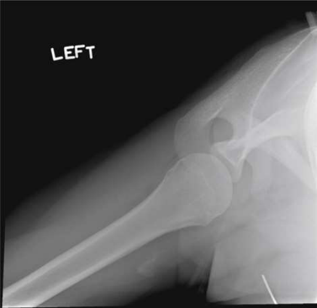

# Rx Umăr Joint — Inferosuperior Axial Incidență — West Point Method (Merrill)

  📷 Radiografie Convențională (Rx)
  <strong>Actualizat:</strong> 2026-09-16
  <strong>Autor:</strong> Referință Merrill

---

-   __1. Rezumat Clinic & Indicații__

    ---

    === "Indicații Clinice"

        - Conform reperelor anatomice standard din tratat

    === "Ghid Național IRIS"

        !!! info "Referință Primară: Ghidul Național IRIS (Ordinul MS 1342/2012)"
            - **Capitol Ghid IRIS:** *Ghidul Național IRIS*
            - **Grad de Recomandare:** **De verificat pe indicație; fără grad atribuit automat**
            - **Nivel de Iradiere Estimată:** `De verificat pentru examinarea și populația selectate`

            [:octicons-search-16: Deschide Ghidul IRIS](../../iris.md){ .md-button .md-button--primary } [:material-open-in-new: Aplicația Oficială PWA](https://radiologie-pediatrica.ro/iris/){ .md-button target="_blank" rel="noopener" }
-   __2. Poziționare & Centrare Fascicul__

    ---

    - **Poziție Pacient:** se ajustează pacient în Decubit ventral poziție cu approximately a 3-inch (7.6-cm) pad under Umăr being examined. Turn pacientul’s cap away de la side being examined.; Abduct braț de afected side prin 90 grade și rotate it astfel încât Antebraț rests over edge de masa de examinare sau tăvița Bucky, which poate fie used pentru support (Figs. 6.31 și 6.32). Place vertically sprijinit receptorul de imagine pe / sprijinit de superior aspect de Umăr cu edge de receptorul de imagine în contact cu gâtul. Support receptorul de imagine cu săculeți cu nisip sau vertical receptorul de imagine holder. se efectuează ecranarea gonadelor cu șorț plumbat.
    - **Punct de Centrare Fascicul:** orientat la dual angle de 25 grade anteriorly de la orizontal și 25 grade medially. raza centrală enters approximately 5 inches (13 cm) inferior și 1½ inches (3.8 cm) medial la acromial edge și exits cavitate glenoidă.
    - **Distanță Focar-Film (DFF / SID):** Nespecificat în fragmentul extras; de verificat în sursă
    - **Comandă Respiratorie:** apnee (oprirea respirației).

-   __3. Parametri Tehnici Expunere__

    ---

    | Parametru Tehnic | Valoare Configurare Generator / Tub |
    |:-----------------|:-------------------------------------|
    | **Tensiune Tub (kV)** | DE CONFIGURAT PE APARAT |
    | **Sarcină / Produs Curent-Timp (mAs)** | DE CONFIGURAT PE APARAT |
    | **Distanță Focar-Film (DFF / SID)** | Nespecificat în fragmentul extras; de verificat în sursă |
    | **Grilă Antidifuzoare (Bucky)** | DE CONFIGURAT PE APARAT |
    | **Dimensiune Focar** | DE CONFIGURAT PE APARAT |
    | **Camere de Ionizare AEC** | DE CONFIGURAT PE APARAT |
    | **Colimare Fascicul** | Adjust câmp de iradiere la 12 inches (30 cm) în width pe collimator și la 1 inch (2.5 cm) above posterior shadow de Umăr. Se plasează markerul de lateralitate în câmpul colimat. |
    | **Filtrare Tub** | DE CONFIGURAT PE APARAT |

-   __4. Criterii de Calitate & Reușită Imagine__

    ---

    - Criterii radiologice de calitate imaginii:
    - Colimare adecvată vizibilă și prezența markerului de lateralitate (D/S) plasat clear de anatomy de interest
    - Scapulohumeral articulație cu slight overlap
    - cap humeral projected liber de proces coracoid
    - acromion superimposed over posterior portion de cap humeral
    - Bony detalii trabeculare osoase și surrounding soft tissues

-   __5. Protecție Radiologică (ALARA)__

    ---

    - Nespecificat în fragmentul extras; de verificat în sursă

!!! note "Observații Clinice & Tehnice"
    Conform reperelor anatomice standard din tratat

### 🖼️ Imagini

<figure class="protocol-image-card" markdown>

<figcaption><strong>Merrill — pagina PDF 397, imaginea 1</strong> — Imagine din fragmentul sursă; asocierea necesită revizie.</figcaption>

</figure>

=== "Ghid Rapid de Execuție"

    1. **Identificarea și verificarea pacientului:** verificare identitate, zonă de examinat, consimțământ conform procedurii și evaluarea posibilității unei sarcini, când este relevantă.
    2. **Pregătire:** îndepărtarea oricăror obiecte radiopace (bijuterii, agrafe, fermoare, proteze, pansamente dense).
    3. **Poziționare precisă:** alinierea receptorului de imagine și a tubului la distanța prescrisă (Nespecificat în fragmentul extras; de verificat în sursă).
    4. **Colimare strictă:** adaptarea fasciculului strict la regiunea de diagnostic pentru scăderea iradierii și reducerea radiației difuze.
    5. **Radioprotecție:** verificarea [politicii RX](../radioprotectie.md), cu măsuri distincte pentru pacient, personal și însoțitor.

## Surse de documentare

- [Merrill’s Atlas, 6. Shoulder Girdle, pagini PDF 396–397](../../assets/protocols/sources/a56d45c16829_Merrills_Atlas_of_Radiographic_Positioning__Procedures_3Vol_Set.pdf#page=396)

## Fragmente sursă traduse (referință tehnică)

### anatomy

Bony abnormalities de anterior inferior rim de glenoid și Hill-Sachs defects de posterolateral cap humeral în pacienți cu chronic
instability de umăr (Fig. 6.33).

### collimation

• Adjust câmp de iradiere la 12 inches (30 cm) în width pe collimator și la 1 inch (2.5 cm) above posterior shadow de umăr.
Se plasează markerul de lateralitate în câmpul colimat.

### cr

• orientat la dual angle de 25 grade anteriorly de la orizontal și 25 grade medially. raza centrală enters approximately 5 inches (13
cm) inferior și 1½ inches (3.8 cm) medial la acromial edge și exits cavitate glenoidă.

### criteria

Criterii radiologice de calitate imaginii:
• Colimare adecvată vizibilă și prezența markerului de lateralitate (D/S) plasat clear de anatomy de interest
• Scapulohumeral articulație cu slight overlap
• cap humeral projected liber de proces coracoid
• acromion superimposed over posterior portion de cap humeral
• Bony detalii trabeculare osoase și surrounding soft tissues

### part_pos

• Abduct braț de afected side prin 90 grade și rotate it astfel încât forearm rests over edge de masa de examinare sau tăvița Bucky, which
poate fie used pentru support (Figs. 6.31 și 6.32).
• Place vertically sprijinit receptorul de imagine pe / sprijinit de superior aspect de umăr cu edge de receptorul de imagine în contact cu gâtul.
• Support receptorul de imagine cu săculeți cu nisip sau vertical receptorul de imagine holder.
• se efectuează ecranarea gonadelor cu șorț plumbat.

### patient_pos

• se ajustează pacient în decubit ventral cu approximately a 3-inch (7.6-cm) pad under umăr being examined.
• Turn pacientul’s cap away de la side being examined.

### respiration

apnee (oprirea respirației).

### tech

poziționat prin manufacturer sau department protocol pentru corect anatomy display orientation; raza centrală plate: 10 × 12 inches (24
× 30 cm) transversal, plasat în vertical orientation în contact cu superior surface de umăr.

