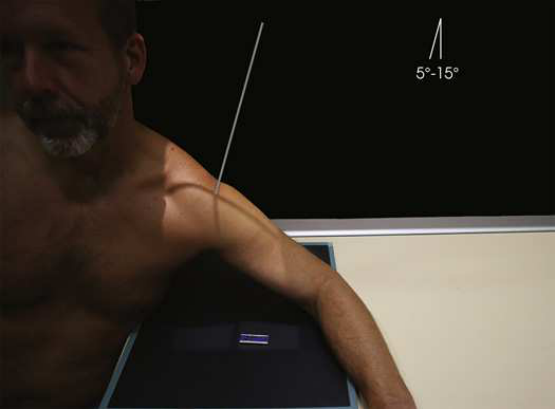
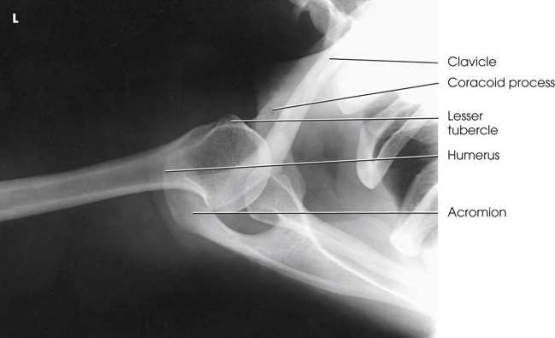

# Rx Umăr Joint — Superoinferior Axial Incidență (Merrill)

  📷 Radiografie Convențională (Rx)
  <strong>Actualizat:</strong> 2026-09-16
  <strong>Autor:</strong> Referință Merrill

---

-   __1. Rezumat Clinic & Indicații__

    ---

    === "Indicații Clinice"

        - Conform reperelor anatomice standard din tratat

    === "Ghid Național IRIS"

        !!! info "Referință Primară: Ghidul Național IRIS (Ordinul MS 1342/2012)"
            - **Capitol Ghid IRIS:** *Ghidul Național IRIS*
            - **Grad de Recomandare:** **De verificat pe indicație; fără grad atribuit automat**
            - **Nivel de Iradiere Estimată:** `De verificat pentru examinarea și populația selectate`

            [:octicons-search-16: Deschide Ghidul IRIS](../../iris.md){ .md-button .md-button--primary } [:material-open-in-new: Aplicația Oficială PWA](https://radiologie-pediatrica.ro/iris/){ .md-button target="_blank" rel="noopener" }
-   __2. Poziționare & Centrare Fascicul__

    ---

    - **Poziție Pacient:** se așază pacientul pe scaun la end de masa de examinare pe stool sau chair high enough la enable extension de Umăr under examination well over receptorul de imagine.; Place receptorul de imagine near end de masa de examinare și paralel cu its axa longitudinală. Se instruiește pacientul să lean laterally over receptorul de imagine until Umăr articulație este over midpoint de receptorul de imagine. Bring Cot la rest pe masa de examinare. se flectează pacient’s Cot 90 grade și place Mână în Decubit ventral poziție (Fig. 6.34). Se instruiește pacientul să tilt capul spre unafected Umăr. la obtain direct lateral positioning de capul de Humerus, adjust orice anterior sau posterior leaning de corp la place humeral epicondyles în vertical poziție. se efectuează ecranarea gonadelor cu șorț plumbat.
    - **Punct de Centrare Fascicul:** înclinat 5 la 15 grade through Umăr articulație și spre Cot; greater angle este required when pacientul cannot se extinde Umăr over receptorul de imagine.
    - **Distanță Focar-Film (DFF / SID):** Nespecificat în fragmentul extras; de verificat în sursă
    - **Comandă Respiratorie:** apnee (oprirea respirației).

-   __3. Parametri Tehnici Expunere__

    ---

    | Parametru Tehnic | Valoare Configurare Generator / Tub |
    |:-----------------|:-------------------------------------|
    | **Tensiune Tub (kV)** | DE CONFIGURAT PE APARAT |
    | **Sarcină / Produs Curent-Timp (mAs)** | DE CONFIGURAT PE APARAT |
    | **Distanță Focar-Film (DFF / SID)** | Nespecificat în fragmentul extras; de verificat în sursă |
    | **Grilă Antidifuzoare (Bucky)** | DE CONFIGURAT PE APARAT |
    | **Dimensiune Focar** | DE CONFIGURAT PE APARAT |
    | **Camere de Ionizare AEC** | DE CONFIGURAT PE APARAT |
    | **Colimare Fascicul** | Adjust câmp de iradiere la 10 inches (24 cm) în width pe collimator și la 1 inch (2.5 cm) beyond anterior și posterior shadows de Umăr. Se plasează markerul de lateralitate în câmpul colimat. |
    | **Filtrare Tub** | DE CONFIGURAT PE APARAT |

-   __4. Criterii de Calitate & Reușită Imagine__

    ---

    - Criterii radiologice de calitate imaginii:
    - Colimare adecvată vizibilă și prezența markerului de lateralitate (D/S) plasat clear de anatomy de interest
    - Scapulohumeral articulație (nu open pe pacienți cu limited flexibility)
    - proces coracoid projected above Claviculă
    - mică tuberozitate humerală (trohin) în profile
    - articulații acromioclaviculare through cap humeral
    - Bony detalii trabeculare osoase și surrounding soft tissues Scapular Y

-   __5. Protecție Radiologică (ALARA)__

    ---

    - Nespecificat în fragmentul extras; de verificat în sursă

!!! note "Observații Clinice & Tehnice"
    Conform reperelor anatomice standard din tratat

### 🖼️ Imagini

<figure class="protocol-image-card" markdown>

<figcaption><strong>Merrill — pagina PDF 398, imaginea 1</strong> — Imagine din fragmentul sursă; asocierea necesită revizie.</figcaption>

</figure>

<figure class="protocol-image-card" markdown>

<figcaption><strong>Merrill — pagina PDF 399, imaginea 2</strong> — Imagine din fragmentul sursă; asocierea necesită revizie.</figcaption>

</figure>

=== "Ghid Rapid de Execuție"

    1. **Identificarea și verificarea pacientului:** verificare identitate, zonă de examinat, consimțământ conform procedurii și evaluarea posibilității unei sarcini, când este relevantă.
    2. **Pregătire:** îndepărtarea oricăror obiecte radiopace (bijuterii, agrafe, fermoare, proteze, pansamente dense).
    3. **Poziționare precisă:** alinierea receptorului de imagine și a tubului la distanța prescrisă (Nespecificat în fragmentul extras; de verificat în sursă).
    4. **Colimare strictă:** adaptarea fasciculului strict la regiunea de diagnostic pentru scăderea iradierii și reducerea radiației difuze.
    5. **Radioprotecție:** verificarea [politicii RX](../radioprotectie.md), cu măsuri distincte pentru pacient, personal și însoțitor.

## Surse de documentare

- [Merrill’s Atlas, 6. Shoulder Girdle, pagini PDF 397–399](../../assets/protocols/sources/a56d45c16829_Merrills_Atlas_of_Radiographic_Positioning__Procedures_3Vol_Set.pdf#page=397)

## Fragmente sursă traduse (referință tehnică)

### anatomy

superoinferior axial imagine shows articulație relationship de extremitatea proximală humerus și cavitate glenoidă (Fig. 6.35). AC
articulation, outer portion de proces coracoid, și points de insertion de subscapularis muscle (la corp de scapula) și teres
minor muscle (la inferior axillary margine) sunt vizualizat.

### collimation

• Adjust câmp de iradiere la 10 inches (24 cm) în width pe collimator și la 1 inch (2.5 cm) beyond anterior și posterior shadows
de umăr. Se plasează markerul de lateralitate în câmpul colimat.

### cr

• înclinat 5 la 15 grade through umăr articulație și spre cot; greater angle este required when pacientul cannot se extinde
umăr over receptorul de imagine.

### criteria

Criterii radiologice de calitate imaginii:
• Colimare adecvată vizibilă și prezența markerului de lateralitate (D/S) plasat clear de anatomy de interest
• Scapulohumeral articulație (nu open pe pacienți cu limited flexibility)
• proces coracoid projected above clavicle
• mică tuberozitate humerală (trohin) în profile
• articulații acromioclaviculare through cap humeral
• Bony detalii trabeculare osoase și surrounding soft tissues
Scapular Y

### part_pos

• Place receptorul de imagine near end de masa de examinare și paralel cu its axa longitudinală.
• Se instruiește pacientul să lean laterally over receptorul de imagine until umăr articulație este over midpoint de receptorul de imagine.
• Bring cot la rest pe masa de examinare.
• se flectează pacient’s cot 90 grade și place mână în decubit ventral (Fig. 6.34).
• Se instruiește pacientul să tilt capul spre unafected umăr.
• la obtain direct lateral positioning de capul de humerus, adjust orice anterior sau posterior leaning de corp la place humeral epicondyles în vertical poziție.
• se efectuează ecranarea gonadelor cu șorț plumbat.

### patient_pos

• se așază pacientul pe scaun la end de masa de examinare pe stool sau chair high enough la enable extension de umăr under examination well over
receptorul de imagine.

### respiration

apnee (oprirea respirației).

### tech

poziționat prin manufacturer sau department protocol pentru corect anatomy display orientation; raza centrală plate: 10 × 12 inches (24 ×
30 cm), plasat longitudinal pentru precis centering la umăr articulație.

