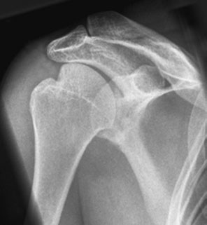
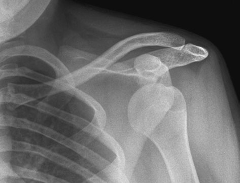

# Rx umăr — luxație recurentă a umărului, anteroposterioară (AP), humerus în profil

  📷 Radiografie Convențională (Rx)
  <strong>Actualizat:</strong> 2026-09-16
  <strong>Autor:</strong> Departamentul de Radiologie / Referință Clark (Ed. 12)

---

-   __1. Rezumat Clinic & Indicații__

    ---

    === "Indicații Clinice"

        - Examinarea radiografică pentru luxația recurentă a umărului necesită o incidență a cavității glenoide pentru semne de suspiciune de fractură care afectează marginea inferioară (leziunea Bankart), precum și diferite incidențe ale capului humerusului pentru evidențierea defectului. Este important să se rețină că unghiul format între epicondilii humerusului și casetă indică gradul de rotație a humerusului. Aprecierea rotației humerusului prin poziția mâinii poate fi foarte înșelătoare. Incidențele pot fi selectate dintre următoarele:
        - Anteroposterioară (AP) cu humerusul în profil;
        - Anteroposterioară (AP) cu humerusul oblic;
        - Anteroposterioară (AP) modificată — metoda Stryker;
        - Inferosuperioară (axială). Anteroposterioară (AP), humerus în profil. Dacă pacientul poate coopera complet, aceste incidențe pot fi efectuate în ortostatism. Dacă nu, pacientul este poziționat în decubit dorsal pentru a reduce riscul de mișcare. Se selectează o casetă de 18 × 24-cm.

    === "Ghid Național IRIS"

        !!! info "Referință Primară: Ghidul Național IRIS (Ordinul MS 1342/2012)"
            - **Capitol Ghid IRIS:** *Aparat locomotor & Membru superior*
            - **Grad de Recomandare:** **Grad A**
            - **Nivel de Iradiere Estimată:** `Clasa 1 (Minimă < 0.05 mSv)`

            [:octicons-search-16: Deschide Ghidul IRIS](../../iris.md){ .md-button .md-button--primary } [:material-open-in-new: Aplicația Oficială PWA](https://radiologie-pediatrica.ro/iris/){ .md-button target="_blank" rel="noopener" }

-   __2. Poziționare & Centrare Fascicul__

    ---

    - **Poziție Pacient:**
        - pacientul este poziționat în ortostatism, cu umărul neafectat ridicat aproximativ 30 grade pentru a aduce cavitatea glenoidă în unghi drept față de centrul casetei.
        - brațul este parțial în abducție, cotul flectat, iar brațul rotit medial. Palma mâinii se sprijină pe talia pacientului.
        - caseta este plasată cu marginea superioară la 5 cm deasupra umărului și centrată pe articulație.
    - **Punct de Centrare Fascicul:**
        - raza centrală orizontală este orientată spre capul humerusului și centrul casetei.
        - expunerea se efectuează în apnee.
    - **Distanță Focar-Film (DFF / SID):** 100 cm
    - **Comandă Respiratorie:** Expunerea se efectuează în apnee.

-   __3. Parametri Tehnici Expunere__

    ---

    | Parametru Tehnic | Valoare Configurare Generator / Tub |
    |:-----------------|:-------------------------------------|
    | **Tensiune Tub (kV)** | DE CONFIGURAT PE APARAT |
    | **Sarcină / Produs Curent-Timp (mAs)** | Conform AEC / grosimii anatomice |
    | **Distanță Focar-Film (DFF / SID)** | 100 cm |
    | **Grilă Antidifuzoare (Bucky)** | Conform grosimii anatomice (> 10-12 cm cu grilă) |
    | **Dimensiune Focar** | Focar Mic (0.6 mm) |
    | **Camere de Ionizare AEC** | DE CONFIGURAT PE APARAT |
    | **Colimare Fascicul** | Colimare strictă adaptată pe receptor 18 x 24 cm |
    | **Filtrare Tub** | Totală ≥ 2.5 mm Al echivalent (conform Clark: 3.0 mm Al echivalent) |

-   __4. Criterii de Calitate & Reușită Imagine__

    ---

    - Imaginea trebuie să evidențieze capul și colul humerusului și cavitatea glenoidă, cu articulația glenohumerală vizualizată corespunzător.

-   __5. Protecție Radiologică (ALARA)__

    ---

    - Ecranare gonadică cu șorț plumbat dacă gonadele sunt în apropierea fasciculului util (regula ALARA).
    - Colimare precisă la dimensiunea anatomică strict necesară pentru reducerea dozei și a radiației difuze.
    - Verificarea posibilității unei sarcini la pacientele de vârstă fertilă înainte de expunere.

!!! note "Observații Clinice & Tehnice"
    pentru a îmbunătăți calitatea imaginii și a reduce doza de radiații, se utilizează colimarea atentă a fasciculului. 88 Umăr anteroposterior (AP) — incidență de profil a humerusului — evidențiind deformarea Hill-Sachs datorată luxației recurente a umărului. Umăr anteroposterior (AP) evidențiind luxația articulară anterioară

### 🖼️ Imagini

<figure class="protocol-image-card" markdown>

![examinare radiografică pentru luxația recurentă a umărului — [fragment deteriorat în sursă]](../../assets/images/protocols/clark/rx-umar-luxatie-recurenta-umar-antero-posterior-profil-lateral-humerus-p103-clark/fig_1.jpeg)

<figcaption><strong>examinare radiografică pentru luxația recurentă a umărului — [fragment deteriorat în sursă]</strong> — Poziționarea pacientului și centrarea fasciculului conform Clark (Ed. 12)</figcaption>

</figure>

<figure class="protocol-image-card" markdown>

<figcaption><strong>suspiciune de fractură care afectează marginea inferioară (leziunea Bankart), precum și diferi-</strong> — Aspect radiografic / ghid de poziționare conform tratatului Clark (Ed. 12)</figcaption>

</figure>

<figure class="protocol-image-card" markdown>

<figcaption><strong>Umăr anteroposterior (AP) — incidență de profil a humerusului — evidențiind Hill-Sachs</strong> — Aspect radiografic / ghid de poziționare conform tratatului Clark (Ed. 12)</figcaption>

</figure>

=== "Ghid Rapid de Execuție"

    1. **Identificarea și verificarea pacientului:** verificare identitate, zonă de examinat, consimțământ conform procedurii și evaluarea posibilității unei sarcini, când este relevantă.
    2. **Pregătire:** îndepărtarea oricăror obiecte radiopace (bijuterii, agrafe, fermoare, proteze, pansamente dense).
    3. **Poziționare precisă:** alinierea receptorului de imagine și a tubului la distanța prescrisă (100 cm).
    4. **Colimare strictă:** adaptarea fasciculului strict la regiunea de diagnostic pentru scăderea iradierii și reducerea radiației difuze.
    5. **Radioprotecție:** verificarea [politicii RX](../radioprotectie.md), cu măsuri distincte pentru pacient, personal și însoțitor.

## Surse de documentare

- [Clark's Positioning in Radiography (Ed. 12), Pagina 103](https://books.google.com/books/about/Clark_s_Positioning_in_Radiography.html?id=Xxu6MwEACAAJ)
