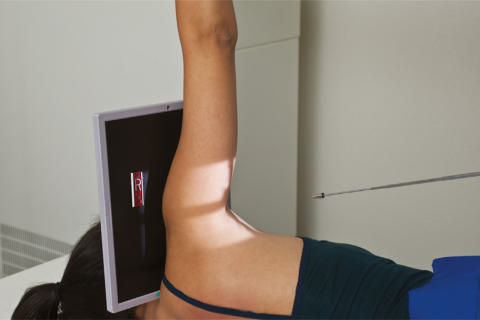
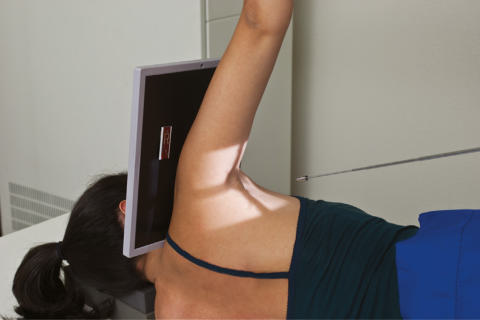
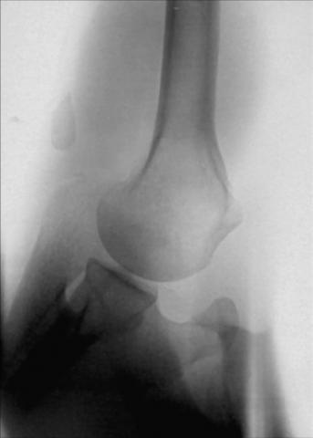

# Rx Umăr (NONtraumatism acut) INFEROSUPERIOR AXIAL PROJECTION (CLEMENTS MODIFICATION5)

  📷 Radiografie Convențională (Rx)
  <strong>Actualizat:</strong> 2026-09-15
  <strong>Autor:</strong> Departamentul de Radiologie / Referință Bontrager

---

-   __1. Rezumat Clinic & Indicații__

    ---

    === "Indicații Clinice"

        - Degenerative conditions, including osteoporosis and artroză / modificări degenerative articulare
        - HillSachs defect with exaggerated rotation of affected limb

    === "Ghid Național IRIS"

        !!! info "Referință Primară: Ghidul Național IRIS (Ordinul MS 1342/2012)"
            - **Capitol Ghid IRIS:** *Ghidul Național IRIS*
            - **Grad de Recomandare:** **De verificat pe indicație; fără grad atribuit automat**
            - **Nivel de Iradiere Estimată:** `De verificat pentru examinarea și populația selectate`

            [:octicons-search-16: Deschide Ghidul IRIS](../../iris.md){ .md-button .md-button--primary } [:material-open-in-new: Aplicația Oficială PWA](https://radiologie-pediatrica.ro/iris/){ .md-button target="_blank" rel="noopener" }
-   __2. Poziționare & Centrare Fascicul__

    ---

    - **Poziție Pacient:** Pacient: Place patient in the lateral Decubit position with the affected arm up.; Regiune anatomică: Abduct arm 90° from body if possible (Fig. 5.50A).
    - **Punct de Centrare Fascicul:** Direct horizontal Raza centrală (RC) perpendiculară pe receptorul de imagine. If patient cannot abduct the arm 90°, angle the tube 5° to 15° toward the axilla (Fig. 5.50B).
    - **Distanță Focar-Film (DFF / SID):** 100 cm
    - **Comandă Respiratorie:** Suspend respiration during exposure. A B Fig. 5.50 (A) Inferosuperior axial projection. (B) Alternative projection, 5° to 15° medial angle.

-   __3. Parametri Tehnici Expunere__

    ---

    | Parametru Tehnic | Valoare Configurare Generator / Tub |
    |:-----------------|:-------------------------------------|
    | **Tensiune Tub (kV)** | 70-85 kV |
    | **Sarcină / Produs Curent-Timp (mAs)** | DE CONFIGURAT PE APARAT |
    | **Distanță Focar-Film (DFF / SID)** | 100 cm |
    | **Grilă Antidifuzoare (Bucky)** | Fără grilă (expunere directă) |
    | **Dimensiune Focar** | Focar Mic (0.6 mm) |
    | **Camere de Ionizare AEC** | DE CONFIGURAT PE APARAT |
    | **Colimare Fascicul** | Field Size Collimate closely to area of interest. |
    | **Filtrare Tub** | Totală ≥ 2.5 mm Al echivalent |

-   __4. Criterii de Calitate & Reușită Imagine__

    ---

    - Lateral view of proximal Humerus in relationship to scapulohumeral cavity is shown. Position:
    - Arm is abducted approximately 90° from the body.
    - Relationship of the humeral head and glenoid cavity should be evident (Fig. 5.51).
    - Collimation field size to area of interest. Exposure:
    - Optimal image receptor exposure and contrast with no motion demonstrate clear, Contururi osoase și travee trabeculare nete, fără artefacte de mișcare and pertinent soft tissue anatomy.
    - Bony margins of the acromion and distal Claviculă are visible through the humeral head. Umăr (Nontraumatism acut) SPECIAL
    - Inferosuperior axial (Modificarea Clements) R Fig. 5.51 Inferosuperior axial projection (Modificarea Clements). (From Frank ED, Long BW, Smith BJ: Merrill’s atlas of radiographic positioning and procedures, ed 11, St Louis, 2007, Mosby.)

-   __5. Protecție Radiologică (ALARA)__

    ---

    - Ecranare gonadică și a organelor radiosensibile conform procedurilor locale de radioprotecție ALARA.
    - Colimare strictă la aria de interes pentru limitarea radiației difuze.
    - Verificarea posibilității unei sarcini la pacientele de vârstă fertilă înainte de expunere.

### 🖼️ Imagini

<figure class="protocol-image-card" markdown>

<figcaption><strong>Fig. 5.50 (A) Inferosuperior axial projection. (B) Alternative projection,</strong> — Poziționare pacient conform Ghidului Bontrager (Fig. 5.50 (A) Inferosuperior axial projection. (B) Alternative projection,)</figcaption>

</figure>

<figure class="protocol-image-card" markdown>

<figcaption><strong>Fig. 5.51 Inferosuperior axial projection (Clements modification).</strong> — Aspect radiografic de referință conform Ghidului Bontrager (Fig. 5.51 Inferosuperior axial projection (Clements modification).)</figcaption>

</figure>

<figure class="protocol-image-card" markdown>

<figcaption><strong>Figura 3</strong> — Aspect radiografic de referință conform Ghidului Bontrager (Figura 3)</figcaption>

</figure>

=== "Ghid Rapid de Execuție"

    1. **Identificarea și verificarea pacientului:** verificare identitate, zonă de examinat, consimțământ conform procedurii și evaluarea posibilității unei sarcini, când este relevantă.
    2. **Pregătire:** îndepărtarea oricăror obiecte radiopace (bijuterii, agrafe, fermoare, proteze, pansamente dense).
    3. **Poziționare precisă:** alinierea receptorului de imagine și a tubului la distanța prescrisă (100 cm).
    4. **Colimare strictă:** adaptarea fasciculului strict la regiunea de diagnostic pentru scăderea iradierii și reducerea radiației difuze.
    5. **Radioprotecție:** verificarea [politicii RX](../radioprotectie.md), cu măsuri distincte pentru pacient, personal și însoțitor.

## Surse de documentare

- [Bontrager's Textbook of Radiographic Positioning (Ed. 9/10), Pagina 206](https://www.elsevier.com/books/textbook-of-radiographic-positioning-and-related-anatomy/lampignano/978-0-323-65367-1)
