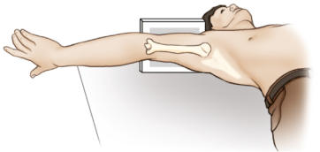
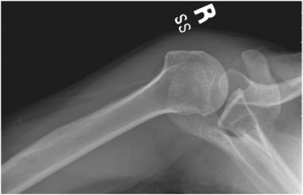
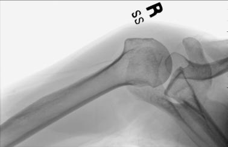
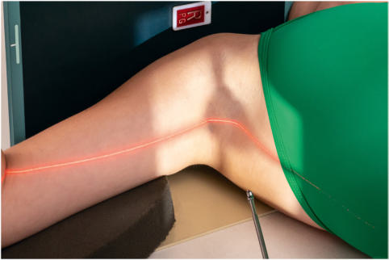

# Rx Umăr (NONtraumatism acut) INFEROSUPERIOR AXIAL PROJECTION (LAWRENCE METHOD5)

  📷 Radiografie Convențională (Rx)
  <strong>Actualizat:</strong> 2026-09-15
  <strong>Autor:</strong> Departamentul de Radiologie / Referință Bontrager

---

-   __1. Rezumat Clinic & Indicații__

    ---

    === "Indicații Clinice"

        - Degenerative conditions, including osteoporosis and artroză / modificări degenerative articulare
        - HillSachs defect with exaggerated rotation of affected limb

    === "Ghid Național IRIS"

        !!! info "Referință Primară: Ghidul Național IRIS (Ordinul MS 1342/2012)"
            - **Capitol Ghid IRIS:** *Ghidul Național IRIS*
            - **Grad de Recomandare:** **De verificat pe indicație; fără grad atribuit automat**
            - **Nivel de Iradiere Estimată:** `De verificat pentru examinarea și populația selectate`

            [:octicons-search-16: Deschide Ghidul IRIS](../../iris.md){ .md-button .md-button--primary } [:material-open-in-new: Aplicația Oficială PWA](https://radiologie-pediatrica.ro/iris/){ .md-button target="_blank" rel="noopener" }
-   __2. Poziționare & Centrare Fascicul__

    ---

    - **Poziție Pacient:** Pacient: Position patient Decubit Dorsal with Umăr raised approximately 2 inches (5 cm) from tabletop by placing support under arm and Umăr to place body part near center of IR (Fig. 5.46).; Regiune anatomică: Move patient toward the front edge of tabletop and place a cart or other arm support against front edge of table to support abducted arm. Rotate head toward opposite side, place vertical cassette on table as close to neck as possible, and support with sandbags. Abduct arm 90° from body if possible; keep in external rotation, palm up, with support under arm and Mână.
    - **Punct de Centrare Fascicul:** medial angle also should be decreased to 15° to 20°. The greater the arm abduction, the greater the CR angle.
    - **Distanță Focar-Film (DFF / SID):** 100 cm
    - **Comandă Respiratorie:** Suspend respiration during exposure. An alternative position is exaggerated external rotation4 (Fig. 5.47). Anterior luxație / subluxație articulară of the humeral head may result in a compression suspiciune de fractură of the articular surface of the humeral head, called the HillsSachs defect. This pathology is best demonstrated by exaggerated external rotation, wherein the Police is pointed down and posteriorly approximately 45°.

-   __3. Parametri Tehnici Expunere__

    ---

    | Parametru Tehnic | Valoare Configurare Generator / Tub |
    |:-----------------|:-------------------------------------|
    | **Tensiune Tub (kV)** | 70-85 kV |
    | **Sarcină / Produs Curent-Timp (mAs)** | DE CONFIGURAT PE APARAT |
    | **Distanță Focar-Film (DFF / SID)** | 100 cm |
    | **Grilă Antidifuzoare (Bucky)** | Fără grilă (expunere directă) |
    | **Dimensiune Focar** | Focar Mic (0.6 mm) |
    | **Camere de Ionizare AEC** | DE CONFIGURAT PE APARAT |
    | **Colimare Fascicul** | Field Size Collimate closely to area of interest. |
    | **Filtrare Tub** | Totală ≥ 2.5 mm Al echivalent |

-   __4. Criterii de Calitate & Reușită Imagine__

    ---

    - Lateral view of proximal Humerus in relationship to scapulohumeral cavity
    - Coracoid process of Omoplat (Scapulă) and lesser tubercle of Humerus are seen in profile.
    - The spine of the Omoplat (Scapulă) is seen on edge below the scapulohumeral joint (Figs. 5.48 and 5.49). Position:
    - Arm is seen to be abducted approximately 90° from the body.
    - Superior and inferior borders of the glenoid cavity should be directly superimposed, indicating correct CR angle.
    - Collimation field size to area of interest. Exposure:
    - Optimal image receptor exposure and contrast with no motion demonstrate clear, Contururi osoase și travee trabeculare nete, fără artefacte de mișcare.
    - Bony margins of the acromion and distal Claviculă are visible through the humeral head. Fig. 5.46 Inferosuperior axial (Metoda Lawrence) projection. Fig. 5.47 Alternative position—exaggerated rotation. Fig. 5.48 Inferosuperior axial projection. Lesser tubercle Surgical neck of Humerus Acromion Coracoid process Head of Humerus Glenoid fossa Spine of Omoplat (Scapulă) Fig. 5.49 Inferosuperior axial projection. Umăr (Nontraumatism acut) SPECIAL
    - Inferosuperior axial (Metoda Lawrence)

-   __5. Protecție Radiologică (ALARA)__

    ---

    - Ecranare gonadică și a organelor radiosensibile conform procedurilor locale de radioprotecție ALARA.
    - Colimare strictă la aria de interes pentru limitarea radiației difuze.
    - Verificarea posibilității unei sarcini la pacientele de vârstă fertilă înainte de expunere.

### 🖼️ Imagini

<figure class="protocol-image-card" markdown>

<figcaption><strong>Fig. 5.46 Inferosuperior axial (Metoda Lawrence) projection.</strong> — Poziționare pacient conform Ghidului Bontrager (Fig. 5.46 Inferosuperior axial (Lawrence method) projection.)</figcaption>

</figure>

<figure class="protocol-image-card" markdown>

<figcaption><strong>Fig. 5.47 Alternative position—exaggerated rotation.</strong> — Aspect radiografic de referință conform Ghidului Bontrager (Fig. 5.47 Alternative position—exaggerated rotation.)</figcaption>

</figure>

<figure class="protocol-image-card" markdown>

<figcaption><strong>Fig. 5.48 Inferosuperior axial projection.</strong> — Aspect radiografic de referință conform Ghidului Bontrager (Fig. 5.48 Inferosuperior axial projection.)</figcaption>

</figure>

<figure class="protocol-image-card" markdown>

<figcaption><strong>Fig. 5.49 Inferosuperior axial projection.</strong> — Aspect radiografic de referință conform Ghidului Bontrager (Fig. 5.49 Inferosuperior axial projection.)</figcaption>

</figure>

=== "Ghid Rapid de Execuție"

    1. **Identificarea și verificarea pacientului:** verificare identitate, zonă de examinat, consimțământ conform procedurii și evaluarea posibilității unei sarcini, când este relevantă.
    2. **Pregătire:** îndepărtarea oricăror obiecte radiopace (bijuterii, agrafe, fermoare, proteze, pansamente dense).
    3. **Poziționare precisă:** alinierea receptorului de imagine și a tubului la distanța prescrisă (100 cm).
    4. **Colimare strictă:** adaptarea fasciculului strict la regiunea de diagnostic pentru scăderea iradierii și reducerea radiației difuze.
    5. **Radioprotecție:** verificarea [politicii RX](../radioprotectie.md), cu măsuri distincte pentru pacient, personal și însoțitor.

## Surse de documentare

- [Bontrager's Textbook of Radiographic Positioning (Ed. 9/10), Pagina 205](https://www.elsevier.com/books/textbook-of-radiographic-positioning-and-related-anatomy/lampignano/978-0-323-65367-1)
